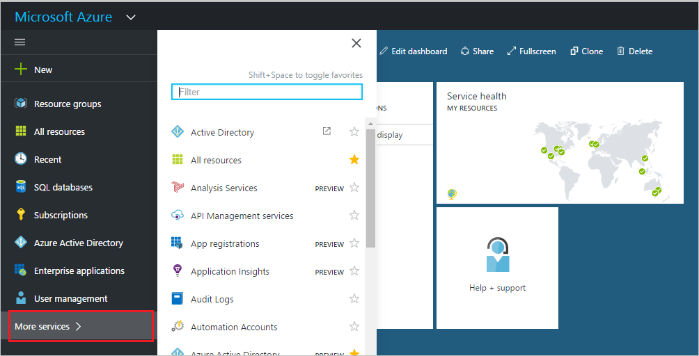
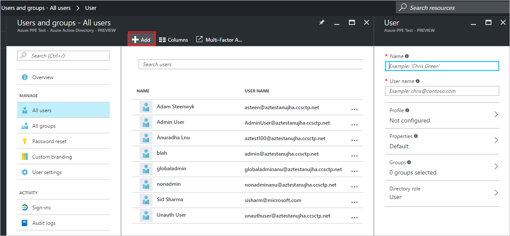
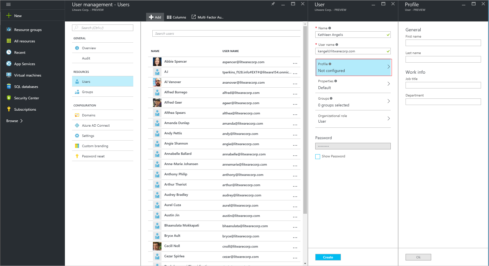

<properties
    pageTitle="Hinzufügen von Benutzern aus anderen Verzeichnissen oder partner Unternehmen in Azure Active Directory-Vorschau | Microsoft Azure"
    description="Es wird erläutert, wie Benutzer hinzufügen oder Ändern von Benutzerinformationen in Azure Active Directory, einschließlich Benutzern externe und Gästen."
    services="active-directory"
    documentationCenter=""
    authors="curtand"
    manager="femila"
    editor=""/>

<tags
    ms.service="active-directory"
    ms.workload="identity"
    ms.tgt_pltfrm="na"
    ms.devlang="na"
    ms.topic="article"
    ms.date="09/12/2016"
    ms.author="curtand"/>

# Hinzufügen von Benutzern aus anderen Verzeichnissen oder Partnerunternehmen in Azure Active Directory-Vorschau

> [AZURE.SELECTOR]
- [Azure-portal](active-directory-users-create-external-azure-portal.md)
- [Azure klassischen-portal](active-directory-create-users-external.md)

In diesem Artikel wird erläutert, wie Benutzer aus anderen Verzeichnissen in der Vorschau Azure Active Directory (Azure AD) oder von Partnerunternehmen hinzufügen. [Was ist in der Vorschau?](active-directory-preview-explainer.md) Informationen zum Hinzufügen neuer Benutzer in Ihrer Organisation und Benutzer, die Microsoft-Konten besitzen, finden Sie unter [Hinzufügen von neuen Benutzern zur Azure Active Directory](active-directory-users-create-azure-portal.md). Hinzugefügte Benutzer nicht standardmäßig über Administratorberechtigungen verfügen, jedoch können Sie Rollen zu einem beliebigen Zeitpunkt zu zuweisen.

## Hinzufügen eines Benutzers

1.  Melden Sie sich zum [Azure-Portal](https://portal.azure.com) mit einem Konto, eines globalen Administrators für das Verzeichnis ist.

2.  Wählen Sie **Weitere Dienste**aus, geben Sie **Benutzer und Gruppen** in das Textfeld ein, und wählen Sie dann die **EINGABETASTE**.

    

3.  Klicken Sie auf das Blade **Benutzer und Gruppen** wählen Sie **Benutzer**aus, und wählen Sie dann auf **Hinzufügen**.

    

4. Stellen Sie auf das Blade **Benutzer** im Feld **Name** einen Anzeigenamen und den Namen des Benutzers Anmeldung im Feld **Benutzername**ein.

5. Kopieren Sie oder andernfalls Beachten Sie das generierten Benutzerkennwort, dass Sie es für den Benutzer bereitstellen können, nachdem dieser Vorgang abgeschlossen ist.

6. Aktivieren Sie gegebenenfalls- **Profil** , um die Benutzer zuerst hinzufügen und Nachname, eine Position und einen Abteilungsnamen ein.
    
    

    - Wählen Sie die **Gruppen** , um den Benutzer in einer oder mehreren Gruppen hinzuzufügen.

        

    - Wählen Sie **organisationsinterne Rolle** den Benutzer zu einer Rolle aus der Liste **Rollen** zuweisen. Weitere Informationen zu Rollen für Benutzer und Administrator finden Sie unter [Zuweisen von Administratorrollen in Azure Active Directory](active-directory-assign-admin-roles.md).

        

7. Wählen Sie auf **Erstellen**.

8. Sichere Verteilung generierte Kennwort an den neuen Benutzer an, damit der Benutzer sich anmelden kann.

> [AZURE.IMPORTANT] Wenn Ihre Organisation mehrere Domänen verwendet, sollten Sie über die folgenden Probleme wissen, wenn Sie ein Benutzerkonto hinzufügen:
>
> - **Zum Hinzufügen von Benutzerkonten mit der denselben Benutzerprinzipalnamen (UPN) über Domänen erster Schritt** hinzufügen, z. B. geoffgrisso@contoso.onmicrosoft.com, **gefolgt von** geoffgrisso@contoso.com.
> - Hinzufügen von **nicht** geoffgrisso@contoso.com vor dem Hinzufügen von geoffgrisso@contoso.onmicrosoft.com. Diese Reihenfolge ist wichtig, und schwerfällig rückgängig gemacht werden kann.

Wenn Sie die Informationen für einen Benutzer ändern, dessen Identität mit Ihrem lokalen Active Directory-Dienst synchronisiert wird, können Sie die Benutzerinformationen in der klassischen Azure-Portal nicht ändern. Um die Benutzerinformationen zu ändern, verwenden Sie Ihrem lokalen Active Directory-Verwaltungstools.

## Was kommt als nächstes

- [Hinzufügen eines Benutzers](active-directory-users-create-azure-portal.md)
- [Zurücksetzen eines Benutzerkennworts im neuen Azure-Portal](active-directory-users-reset-password-azure-portal.md)
- [Zuweisen eines Benutzers zu einer Rolle in Ihrer Azure Active Directory](active-directory-users-assign-role-azure-portal.md)
- [Informationen zur Arbeit eines Benutzers ändern](active-directory-users-work-info-azure-portal.md)
- [Verwalten von Benutzerprofilen](active-directory-users-profile-azure-portal.md)
- [Löschen eines Benutzers in Ihrer Azure Active Directory](active-directory-users-delete-user-azure-portal.md)
