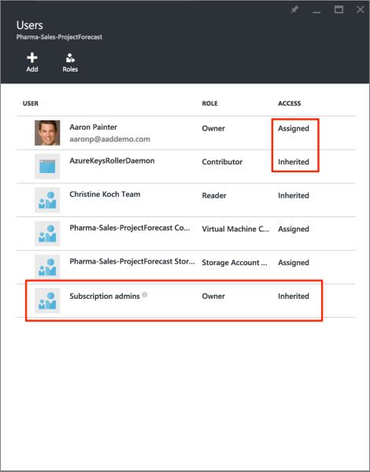
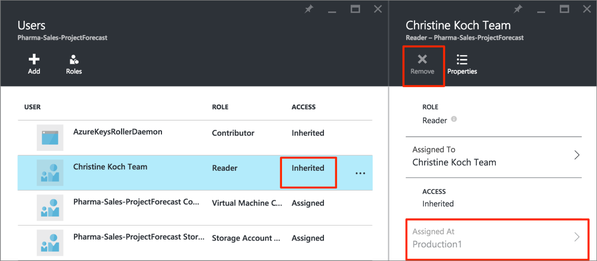

<properties
    pageTitle="Verwenden von Access rollenbasierte Control Azure-Portal | Microsoft Azure"
    description="Erste Schritte mit Access-Steuerelement im Portal Azure rollenbasierte in Access-Verwaltung. Verwenden Sie zum Zuweisen von Berechtigungen zu Ressourcen rollenzuweisungen."
    services="active-directory"
    documentationCenter=""
    authors="kgremban"
    manager="femila"
    editor=""/>

<tags
    ms.service="active-directory"
    ms.devlang="na"
    ms.topic="get-started-article"
    ms.tgt_pltfrm="na"
    ms.workload="identity"
    ms.date="10/10/2016"
    ms.author="kgremban"/>

# Verwenden von rollenzuweisungen zum Verwalten des Zugriffs auf Ihre Abonnementressourcen Azure

> [AZURE.SELECTOR]
- [Verwalten des Zugriffs nach Benutzer oder Gruppe](role-based-access-control-manage-assignments.md)
- [Verwalten des Zugriffs von Ressourcen](role-based-access-control-configure.md)

Azure rollenbasierte Access Steuerelement (RBAC) ermöglicht die Verwaltung von abgestimmte Zugriff für Azure. Verwenden RBAC, können Sie nur der Menge von Access erteilen, dass Benutzer für ihre Aufgaben benötigen. In diesem Artikel soll Ihnen den Einstieg und die Verwendung mit RBAC Azure-Portal zu erzielen. Wenn Sie möchten weitere Details wie RBAC Zugriff verwalten kann, finden Sie unter [Was ist rollenbasierte Access-Steuerelement](role-based-access-control-what-is.md).

## Anzeigen von access
Sie sehen, wer Zugriff auf eine Ressource, Ressourcengruppe oder Abonnement aus seiner Hauptfenster Blade im [Portal Azure](https://portal.azure.com)hat. Angenommen, möchten wir anzeigen, wer auf eine unsere Ressourcengruppen zugreifen kann:

1. Wählen Sie in der Navigationsleiste auf der linken Seite **Ressourcengruppen** aus.  
    
2. Wählen Sie den Namen der Ressourcengruppe aus dem Blade **Ressourcengruppen** ein.
3. Wählen Sie aus dem linken Menü **Steuerung des Benutzerzugriffs (IAM)** aus.  
4. Mit dem Bibliothekssteuerungsblade Access Listet alle Benutzer, Gruppen und Anwendungen, die der Ressourcengruppe der Zugriff gewährt wurde.  

    

Beachten Sie, dass einige Benutzer **zugewiesen** wurden während andere **vererbt** darauf zugreifen. Access ist insbesondere, die der Ressourcengruppe zugewiesen ist oder aus eine Zuordnung in das Abonnement übergeordneten geerbt.

> [AZURE.NOTE] Klassische Abonnement Administratoren und co-Administratoren werden Besitzer des Abonnements in das neue RBAC Modell berücksichtigt.

## Hinzufügen des Zugriffs
Sie erteilen Zugriff von innerhalb der Ressource, Ressourcengruppe oder Abonnement, die den Bereich der Rolle Zuordnung ist.

1. Wählen Sie auf der Access-Bibliothekssteuerungsblade **Hinzufügen** aus.  
2. Wählen Sie die Rolle aus, die Sie aus dem Blade **Wählen Sie eine Rolle** zuweisen möchten.
3. Wählen Sie die Benutzer, die Gruppe oder die Anwendung in Ihrem Verzeichnis, dem Sie Zugriff gewähren möchten. Sie können mit Anzeigenamen, e-Mail-Adressen und Objektbezeichnern Verzeichnis suchen.  

    

4. Wählen Sie **OK** , um die Aufgabe zu erstellen. Das **Hinzufügen von Benutzer** Popup zeigt den Verlauf an.  
    

Nachdem eine rollenzuweisung erfolgreich hinzugefügt haben, wird es auf dem **Benutzer** Blade angezeigt.

## Zugriff muss entfernt werden

1. Wählen Sie die rollenzuweisung auf die Access-Bibliothekssteuerungsblade aus.
2. Wählen Sie in der Zuordnung Details Blade **Entfernen** .  
3. Wählen Sie **Ja** , entfernen zu bestätigen.  
    

Vererbte Zuordnungen können nicht entfernt werden. Beachten Sie, dass die Schaltfläche Entfernen abgeblendet ist in der nachstehenden Abbildung. Prüfen Sie stattdessen die Details **Zugewiesen an** ein. Wechseln Sie zu der Ressource, die es aufgeführt, um die rollenzuweisung zu entfernen.

## Andere Tools zum Verwalten des Zugriffs
Sie können die Rollen zuweisen und Verwalten des Zugriffs mit Azure RBAC Befehle in andere Tools als Azure-Portal.  Führen Sie die Links, um weitere Informationen zu den erforderlichen Komponenten und erste Schritte mit der Azure RBAC Befehle aus.

- [Azure PowerShell](role-based-access-control-manage-access-powershell.md)
- [Azure Line-Benutzeroberfläche](role-based-access-control-manage-access-azure-cli.md)
- [REST-API](role-based-access-control-manage-access-rest.md)

## Nächste Schritte
- [Erstellen eines Access-Änderungsverlauf Berichts](role-based-access-control-access-change-history-report.md)
- Die [integrierten RBAC-Rollen](role-based-access-built-in-roles.md) finden Sie unter
- Definieren Sie eigene [benutzerdefinierte Rollen in Azure RBAC](role-based-access-control-custom-roles.md)
