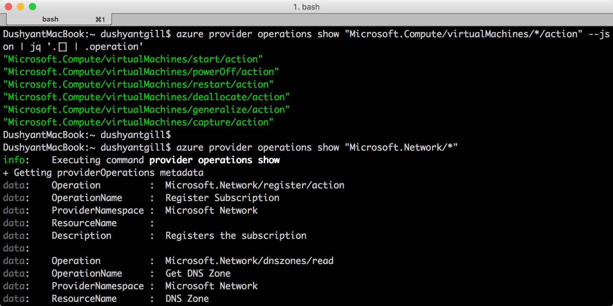

<properties
    pageTitle="Benutzerdefinierte Rollen in Azure RBAC | Microsoft Azure"
    description="Informationen Sie zum Definieren von benutzerdefinierter Rollen mit Azure Role-Based Access Control für eine bessere Identitätsmanagement in Ihr Abonnement Azure."
    services="active-directory"
    documentationCenter=""
    authors="kgremban"
    manager="kgremban"
    editor=""/>

<tags
    ms.service="active-directory"
    ms.devlang="na"
    ms.topic="article"
    ms.tgt_pltfrm="na"
    ms.workload="identity"
    ms.date="07/25/2016"
    ms.author="kgremban"/>


# <a name="custom-roles-in-azure-rbac"></a>Benutzerdefinierte Rollen in Azure RBAC


Erstellen Sie eine benutzerdefinierte Rolle in Azure Role-Based Access Steuerelement (RBAC), wenn keine der integrierten Rollen Ihren spezifischen Zugriff Anforderungen. Benutzerdefinierte Rollen können mithilfe von [Azure PowerShell](role-based-access-control-manage-access-powershell.md), [Azure Line Interface](role-based-access-control-manage-access-azure-cli.md) (CLI) und der [REST-API](role-based-access-control-manage-access-rest.md)erstellt werden. Wie integrierte Rollen können benutzerdefinierte Rollen für Benutzer, Gruppen und Applications Abonnement, Ressourcengruppe und Ressourcenbereiche zugeordnet werden. Benutzerdefinierte Rollen werden in einem Azure AD-Mandanten gespeichert und können über alle Abonnements, die die Mandanten als Azure AD-Verzeichnis für die Abonnements verwenden freigegeben werden.

Im folgenden finden ein Beispiel für eine benutzerdefinierte Rolle für die Überwachung und einen Neustart von virtuellen Computern:

```
{
  "Name": "Virtual Machine Operator",
  "Id": "cadb4a5a-4e7a-47be-84db-05cad13b6769",
  "IsCustom": true,
  "Description": "Can monitor and restart virtual machines.",
  "Actions": [
    "Microsoft.Storage/*/read",
    "Microsoft.Network/*/read",
    "Microsoft.Compute/*/read",
    "Microsoft.Compute/virtualMachines/start/action",
    "Microsoft.Compute/virtualMachines/restart/action",
    "Microsoft.Authorization/*/read",
    "Microsoft.Resources/subscriptions/resourceGroups/read",
    "Microsoft.Insights/alertRules/*",
    "Microsoft.Insights/diagnosticSettings/*",
    "Microsoft.Support/*"
  ],
  "NotActions": [

  ],
  "AssignableScopes": [
    "/subscriptions/c276fc76-9cd4-44c9-99a7-4fd71546436e",
    "/subscriptions/e91d47c4-76f3-4271-a796-21b4ecfe3624",
    "/subscriptions/34370e90-ac4a-4bf9-821f-85eeedeae1a2"
  ]
}
```
## <a name="actions"></a>Aktionen
Die Eigenschaft **Aktionen** eine benutzerdefinierte Rolle gibt die Azure Vorgänge, die die Rolle Zugriff gewährt. Es ist eine Zusammenstellung von Vorgang Zeichenfolgen, die sicherungsfähige Vorgänge der Azure-Ressourcenanbieter zu identifizieren. Vorgang Zeichenfolgen, die Platzhalterzeichen enthalten (\*) gewähren des Zugriffs auf alle Vorgänge, die die Vorgangszeichenfolge entsprechen. Zum Beispiel:

-   `*/read`gewährt Zugriff auf die um Vorgänge für alle Ressourcentypen für alle Azure-Ressourcenanbieter zu lesen.
-   `Microsoft.Network/*/read`gewährt Zugriff auf die Vorgänge für alle Ressourcentypen in der Microsoft.Network-Anbieter für Ressourcen Azure lesen.
-   `Microsoft.Compute/virtualMachines/*`gewährt den Zugriff auf alle Vorgänge von virtuellen Computern und deren untergeordnete Ressourcentypen zur Verfügung.
-   `Microsoft.Web/sites/restart/Action`erteilt Zugriff auf Websites neu starten.

Verwenden Sie `Get-AzureRmProviderOperation` (in PowerShell) oder `azure provider operations show` (in Azure CLI) auf Liste Vorgänge der Azure-Ressourcenanbieter. Sie können auch diese Befehle verwenden, stellen Sie sicher, dass eine Zeichenfolge Vorgang gültig ist und Platzhalterzeichen Vorgang Zeichenfolgen zu erweitern.

```
Get-AzureRMProviderOperation Microsoft.Compute/virtualMachines/*/action | FT Operation, OperationName

Get-AzureRMProviderOperation Microsoft.Network/*
```


```
azure provider operations show "Microsoft.Compute/virtualMachines/*/action" --js on | jq '.[] | .operation'

azure provider operations show "Microsoft.Network/*"
```



## <a name="notactions"></a>NotActions
Verwenden Sie die Eigenschaft **NotActions** aus, wenn die Gruppe der Vorgänge, die Sie zulassen möchten einfacher definiert ist, indem ausschließen eingeschränkte Vorgänge. Der Zugriff mit einer benutzerdefinierten Rolle wird durch die **NotActions** Vorgänge aus den Vorgängen **Aktionen** Abzug berechnet.

> [AZURE.NOTE] Wenn ein Benutzer eine Rolle zugewiesen ist, die einen Vorgang in **NotActions**ausschließt und eine zweite Rolle aus, die den Zugriff auf den gleichen Vorgang erteilt zugeordnet ist, wird der Benutzer zum Ausführen der Operation gewährt werden. **NotActions** ist keine Verweigerungsregel – es ist einfach eine geeignete erstellt eine Reihe von zulässigen Operationen bestimmte Vorgänge ausgeschlossen werden müssen.

## <a name="assignablescopes"></a>AssignableScopes
Die Eigenschaft **AssignableScopes** die benutzerdefinierte Rolle gibt die Bereiche an (Abonnements, Ressourcengruppen oder Ressourcen) in denen die benutzerdefinierte Rolle für Zuordnung verfügbar ist. Sie können die benutzerdefinierte Rolle im nur-Abonnements oder Ressourcengruppen, die sie benötigen für die Zuordnung zur Verfügung stellen und nicht Datenmüll Benutzerfunktionalität für den Rest der Abonnements oder Ressourcengruppen.

Beispiele für Bereiche mit gültigen zugewiesen werden:

-   "/ Abonnements/c276fc76-9cd4-44c9-99a7-4fd71546436e", "/ Abonnements/e91d47c4-76f3-4271-a796-21b4ecfe3624" - bereitgestellt, die Rolle für die Zuordnung in zwei Abonnements.
-   "/ Abonnements/c276fc76-9cd4-44c9-99a7-4fd71546436e" - bereitgestellt, die Rolle für die Zuordnung in ein einzelnes Abonnement.
-  "/ Abonnements/c276fc76-9cd4-44c9-99a7-4fd71546436e/ResourceGroups/Netzwerk" - bereitgestellt, die Rolle für die Zuordnung nur in der Ressourcengruppe Netzwerk.

> [AZURE.NOTE] Sie verwenden müssen Sie mindestens eines Abonnements, Ressourcengruppe oder Ressource-ID.

## <a name="custom-roles-access-control"></a>Zugriff auf die benutzerdefinierte Rollen Steuerelement
Die Eigenschaft **AssignableScopes** der benutzerdefinierten Rolle steuert auch, wer anzeigen, ändern und löschen die Rolle aus.

- Wer kann eine benutzerdefinierte Rolle erstellen?
    Besitzer (und Benutzer Access Administratoren) von Abonnements, erstellen Ressourcengruppen und Ressourcen können benutzerdefinierte Rollen für die Verwendung in diese Bereiche.
    Muss der Benutzer erstellen der Rolle ausführen können `Microsoft.Authorization/roleDefinition/write` Vorgang für alle **AssignableScopes** der Rolle.

- Wer kann eine benutzerdefinierte Rolle ändern?
    Besitzer (und Benutzer Access Administratoren) von Abonnements, einer Ressourcengruppen und Ressourcen können benutzerdefinierte Rollen in diese Bereiche ändern. Ausführen können, müssen Benutzer die `Microsoft.Authorization/roleDefinition/write` Vorgang für alle **AssignableScopes** einer benutzerdefinierten Rolle.

- Wer kann benutzerdefinierte Rollen anzeigen?
    Alle integrierte Rollen in Azure RBAC zulassen Anzeige von Rollen aus, die für die Zuordnung zur Verfügung stehen. Benutzer, die ausgeführt werden können die `Microsoft.Authorization/roleDefinition/read` Vorgang in einen Bereich RBAC-Rollen, die für die Zuordnung in diesem Bereich werden anzeigen kann.

## <a name="see-also"></a>Siehe auch
- [Access-basierten-Steuerelement Rolle](role-based-access-control-configure.md): Erste Schritte mit RBAC Azure-Portal.
- Informationen Sie zum Verwalten des Zugriffs mit:
    - [PowerShell](role-based-access-control-manage-access-powershell.md)
    - [Azure CLI](role-based-access-control-manage-access-azure-cli.md)
    - [REST-API](role-based-access-control-manage-access-rest.md)
- [Integrierte Rollen](role-based-access-built-in-roles.md): Anzeigen von Details zu der Rollen, die in RBAC standard gehören.
