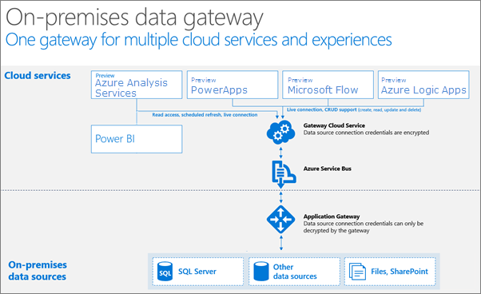

<properties
   pageTitle="Lokaler datenverwaltungsgateway | Microsoft Azure"
   description="Ein Gateway auf lokale ist erforderlich, wenn der Analysis Services-Server unter Azure lokalen den Datenquellen hergestellt werden."
   services="analysis-services"
   documentationCenter=""
   authors="minewiskan"
   manager="erikre"
   editor=""
   tags=""/>
<tags
   ms.service="analysis-services"
   ms.devlang="NA"
   ms.topic="article"
   ms.tgt_pltfrm="NA"
   ms.workload="na"
   ms.date="10/24/2016"
   ms.author="owend"/>

# <a name="on-premises-data-gateway"></a>Lokaler datenverwaltungsgateway

Das lokale datenverwaltungsgateway fungiert eine Verbindung, sichere Datenübertragung zwischen lokalen Datenquellen und Ihre Azure Analysis Services-Server in der Cloud bereitstellen.

Ein Gateway ist auf einem Computer in Ihrem Netzwerk installiert. Ein Gateway muss für jede Azure Analysis Services-Server installiert sein, die Sie in Ihrem Azure-Abonnement haben. Wenn Sie zwei Server in Ihrem Azure-Abonnement, die mit lokalen Datenquellen herstellen verfügen, muss ein Gateway z. B. auf zwei verschiedenen Computern in Ihrem Netzwerk installiert sein.

## <a name="requirements"></a>Anforderungen

**Mindestanforderungen:**

- 4.5-.NET Framework
- 64-Bit-Version von Windows 7 / Windows Server 2008 R2 (oder höher)

**Empfohlen:**

- 8 Core CPU
- 8 GB Arbeitsspeicher
- 64-Bit-Version von Windows 2012 R2 (oder höher)

**Wichtige Aspekte:**

- Das Gateway kann auf einem Domain Controller installiert werden.

- Nur von einem Gateway kann auf einem einzelnen Computer installiert werden.

- Installieren des Gateways auf einem Computer, der auf bleibt und geht nicht deaktiviert. Wenn der Computer nicht befindet, herstellen nicht Ihren lokalen Datenquellen so aktualisieren Sie Daten Ihrer Azure Analysis Services-Server.

- Installieren Sie das Gateway nicht auf einem Computer eine drahtlose mit Ihrem Netzwerk verbunden. Leistung kann verringert werden.

- Wenn Sie den Servernamen für ein Gateway ändern, der bereits konfiguriert wurde, müssen Sie erneut zu installieren und konfigurieren ein neues Gateway.

- In einigen Fällen möglicherweise tabellarische Modellen Herstellen einer Verbindung mit Datenquellen mithilfe der systemeigenen Anbieter wie etwa SQL Server Native Client (SQLNCLI11), einen Fehler zurück. Weitere Informationen finden Sie unter [Datenquelle Verbindungen](analysis-services-datasource.md).

## <a name="supported-on-premises-data-sources"></a>Lokale unterstützten Datenquellen
Für die Vorschau unterstützt das Gateway Verbindungen zwischen dem Azure Analysis Services-Server und den folgenden lokalen Datenquellen:

- SqlServer
- SQL Datawarehouse
- APPS
- Oracle
- Teradata


## <a name="download"></a>Herunterladen
 [Herunterladen des Gateways](https://aka.ms/azureasgateway)


## <a name="install-and-configure"></a>Installieren und konfigurieren

1. Führen Sie Setup.

2. Wählen Sie einen Installationsspeicherort und anzunehmen Sie dem Lizenzvertrag.

3. Melden Sie sich bei Azure.

4. Geben Sie Ihre Azure Analysis-Servernamen ein. Sie können nur einen Server pro Gateway angeben. Klicken Sie auf **Konfigurieren** , und Sie sind mit der glänzen.

    


## <a name="how-it-works"></a>So funktioniert es
Das Gateway wird ausgeführt, als Windows-Dienst, **Lokaler datenverwaltungsgateway**, auf einem Computer im Netzwerk Ihrer Organisation. Das Gateway, die, das Sie für die Verwendung mit Azure Analysis Services installieren, basiert auf demselben Gateway für andere Dienste wie Power BI verwendet, aber mit einige Unterschiede wie konfiguriert ist.



Abfragen und Daten Fluss funktionieren wie folgt:

1.  Eine Abfrage wird durch die Cloud-Dienst mit der verschlüsselten Anmeldeinformationen für die lokale Datenquelle erstellt. Es wird dann an eine Warteschlange für das Gateway Verarbeitungszeit gesendet.

2.  Der Gateway-Cloud-Dienst analysiert die Abfrage und legt die Anforderung an den [Azure-Dienstbus](https://azure.microsoft.com/documentation/services/service-bus/).

3.  Lokaler Daten Gateways abfragt Azure Service Bus für ausstehende Anfragen.

4.  Das Gateway Ruft die Abfrage ab, die Anmeldeinformationen entschlüsselt und stellt eine Verbindung mit Datenquellen mit diesen Anmeldeinformationen.

5.  Das Gateway sendet die Abfrage an die Datenquelle für die Ausführung.

6.  Die Ergebnisse werden aus der Datenquelle wieder mit dem Gateway, und klicken Sie dann auf die Cloud-Dienst gesendet.

## <a name="windows-service-account"></a>Windows-Dienstkonto

Lokaler Daten Gateways konfiguriert ist *NT SERVICE\PBIEgwService* für die Windows-Anmeldeinformationen-Dienst verwenden. Standardmäßig weist sie rechts neben der Anmeldung als Dienst; im Kontext des Computers, die Sie auf das Gateway installieren. Diese Anmeldeinformationen ist nicht die gleiche Konto zum Verbinden mit lokalen Datenquellen oder dem Azure an.  

Wenn Sie mit dem Proxyserver aufgrund Authentifizierung Probleme auftreten, möglicherweise des Windows-Dienstkontos für einen Domänenbenutzer ändern möchten oder Dienstkontos verwaltet.

## <a name="ports"></a>Ports

Das Gateway wird eine ausgehende Verbindung mit Azure Service erstellt. Er kommuniziert auf ausgehende Ports: TCP 443 (Standard), 5671, 5672, 9350 bis 9354.  Das Gateway ist keine eingehenden Ports erforderlich.

Sie weist weißen empfohlen für Ihre Daten Region in Ihre Firewall die IP-Adressen. Sie können die [Liste Microsoft Azure Datacenter IP-Adressen](https://www.microsoft.com/download/details.aspx?id=41653)herunterladen. Diese Liste wird wöchentlich aktualisiert.

> [AZURE.NOTE]  Die IP-Adressen in der Liste Azure Datacenter IP sind in CIDR-Notation. Beispielsweise bedeutet 10.0.0.0/24 nicht 10.0.0.0 bis 10.0.0.24. Erfahren Sie mehr über die [CIDR-Notation](http://whatismyipaddress.com/cidr).

Nachfolgend werden die vollqualifizierten Domänennamen vom Gateway verwendet.

|Domänennamen|Ausgehende ports|Beschreibung|
|---|---|---|
|*. powerbi.com|80|HTTP verwendet, um das Installationsprogramm herunterzuladen.|
|*. powerbi.com|443|HTTPS|
|*. analysis.windows.net|443|HTTPS|
|*. login.windows.net|443|HTTPS|
|*. servicebus.windows.net|5671-5672|Erweiterte Nachrichtenwarteschlangen-Protokoll (AMQP)|
|*. servicebus.windows.net|443, 9350-9354|Listener auf Service Bus Relay über TCP (erfordert 443 für Access Control token Acquisition)|
|*. frontend.clouddatahub.net|443|HTTPS|
|*. von Core.Windows.NET befinden.|443|HTTPS|
|Login.microsoftonline.com|443|HTTPS|
|*. msftncsi.com|443|Verwendet, um eine Verbindung mit dem Internet zu testen, ob das Gateway vom Power BI-Dienst nicht erreichbar ist.|
|*.microsoftonline-p.com|443|Für die Authentifizierung, je nach Konfiguration verwendet.|


### <a name="forcing-https-communication-with-azure-service-bus"></a>Erzwingen der HTTPS-Kommunikation mit Azure-Dienstbus

Sie können das Gateway zur Kommunikation mit Azure Service Bus mit HTTPS anstelle von direkten TCP erzwingen; Dies kann jedoch deutlich Leistung reduzieren. Sie müssen die Datei *Microsoft.PowerBI.DataMovement.Pipeline.GatewayCore.dll.config* zu ändern. Ändern Sie den Wert von `AutoDetect` zu `Https`. Diese Datei, standardmäßig am *c:\Programme Files\On lokale datenverwaltungsgateway*befindet.

```
<setting name="ServiceBusSystemConnectivityModeString" serializeAs="String">
    <value>Https</value>
</setting>
```


## <a name="troubleshooting"></a>Behandlung von Problemen
Erweiterte Einstellungen ist das lokale datenverwaltungsgateway zum Herstellen einer Verbindung Azure Analysis Services mit Ihrem lokalen Datenquellen verwendet demselben Gateway mit Power BI verwendet.

Wenn Sie Probleme beim Installieren und Konfigurieren eines Gateways Probleme auftreten, müssen Sie [das Power BI-Gateway Problembehandlung](https://powerbi.microsoft.com/documentation/powerbi-gateway-onprem-tshoot/)finden Sie unter. Wenn Sie, dass Sie ein Problem mit Ihrer Firewall haben denken, finden Sie in den Abschnitten Firewall oder des Proxyservers.

Wenn Sie denken, dass Sie Proxy Probleme auftreten mit dem Gateway, finden Sie unter [Konfigurieren von Proxyeinstellungen für die Power BI-Gateways](https://powerbi.microsoft.com/documentation/powerbi-gateway-proxy.md).

## <a name="next-steps"></a>Nächste Schritte
- [Verwalten von Analysis Services](analysis-services-manage.md)
- [Abrufen von Daten aus Azure Analysis Services](analysis-services-connect.md)
