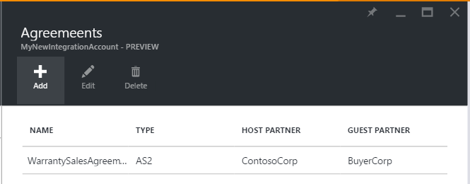

<properties 
    pageTitle="Lernen, wie eine AS2-Lizenzvertrag für das Enterprise-Integration Pack erstellt." 
    description="Lernen, wie eine AS2-Lizenzvertrag für das Enterprise-Integration Pack erstellt | Microsoft Azure-App-Verwaltungsdienst" 
    services="logic-apps" 
    documentationCenter=".net,nodejs,java"
    authors="msftman" 
    manager="erikre" 
    editor="cgronlun"/>

<tags 
    ms.service="logic-apps" 
    ms.workload="integration" 
    ms.tgt_pltfrm="na" 
    ms.devlang="na" 
    ms.topic="article" 
    ms.date="06/29/2016" 
    ms.author="deonhe"/>

# Enterprise-Integration in AS2

## Erstellen eines AS2-Vertrags
Um die Enterprise-Features in Logik apps verwenden zu können, müssen Sie zuerst Vereinbarungen erstellen. 

### Was müssen erfüllt sein, bevor Sie loslegen
- Ein [Konto Integration](./app-service-logic-enterprise-integration-accounts.md) in Ihr Abonnement Azure definiert  
- Mindestens zwei [Partner](./app-service-logic-enterprise-integration-partners.md) bereits in Ihrem Konto Integration definiert.  

>[AZURE.NOTE]Wenn Sie einen Vertrag erstellen, muss der Inhalt der Datei Lizenzvertrag den Vertragstyp übereinstimmen.    

Nachdem Sie [ein Konto Integration erstellt](./app-service-logic-enterprise-integration-accounts.md) und [Partner hinzugefügt](./app-service-logic-enterprise-integration-partners.md)haben, können Sie einen Vertrag erstellen, mit folgenden Schritten:  

### Aus Azure Homepage des Portals

Nachdem Sie melden Sie sich bei der [Azure-Portal](http://portal.azure.com "Azure-Portal"):  
1. Wählen Sie im Menü auf der linken Seite **Durchsuchen** .  

>[AZURE.TIP]Wenn Sie den Link **Durchsuchen** angezeigt werden, müssen Sie zuerst das Menü zu erweitern. Wählen Sie zunächst den **Anzeigen des Menüs** Link, der bei befindet oben links im Menü reduzierte.  

    
2. Geben Sie in das Suchfeld der Filters *Integration* ein, und wählen Sie **Integration Konten** aus der Liste der Ergebnisse.       
   
3. Wählen Sie in der **Integration Konten** Blade, das angezeigt wird das Integration-Konto, in dem Sie den Vertrag erstellt werden. Wenn Sie nicht angezeigt werden, eine Integration Konten Listen, [Erstellen Sie eine erste](./app-service-logic-enterprise-integration-accounts.md "All about integration accounts").  
  
4.  Wählen Sie die Kachel **Vereinbarungen** aus. Wenn Sie die Kachel Vereinbarungen angezeigt werden, fügen Sie es zuerst.   
   
5. Wählen Sie die Schaltfläche **Hinzufügen** in den Vereinbarungen Blade, das geöffnet wird.  
  
6. Geben Sie einen **Namen** für Ihr Vertrag und wählen Sie dann die **Host Partner**, **Host Identität**, **Gast Partner**, **Gast Identität**, in das Vereinbarungen Blade, das geöffnet wird.  
  

Hier sind einige Details, die nützlich sein können beim Konfigurieren der Einstellungen für Ihr Vertrag aus: 
  
|Eigenschaft|Beschreibung|
|----|----|
|Host Partner|Eine Vereinbarung benötigt einen Host und den Gast Partner. Des Partners Host stellt die Organisation, die den Vertrag konfigurieren ist.|
|Host Identität|Ein Bezeichner für den Host-Partner. |
|Gast Partner|Eine Vereinbarung benötigt einen Host und die Gast-Partner. Des Partners Gast stellt die Organisation, die den Host Partner Geschäftstätigkeit ist.|
|Gast Identität|Ein Bezeichner für den Gast-Partner.|
|Empfangseinstellungen|Diese Eigenschaften gelten für alle Wege der Vereinbarung empfangenen Nachrichten|
|Senden von Einstellungen|Diese Eigenschaften gelten für alle Nachrichten von einem Vertrag|  
Lassen Sie uns fortsetzen:  
7. Wählen Sie **Einstellungen erhalten** so konfigurieren, wie Nachrichten, die über dieses Vertrags empfangen werden, behandelt werden sollen.  
 
 - Optional können Sie die Eigenschaften in der eingehenden Nachricht außer Kraft setzen. Aktivieren Sie dazu das Kontrollkästchen **außer Kraft setzen Eigenschaften der Nachricht** ein.
  - Aktivieren Sie das Kontrollkästchen **Nachricht signiert werden soll** , wenn Sie, damit alle eingehende Nachrichten signiert werden müssen möchten. Wenn Sie diese Option auswählen, müssen Sie auch das **Zertifikat** auszuwählen, das zum Überprüfen der Signatur auf die Nachrichten verwendet wird.
  - Optional können Sie Nachrichten auch verschlüsselt werden muss. Wählen Sie dazu das Kontrollkästchen **Nachricht sollte verschlüsselt werden** . Sie müssten dann das **Zertifikat** auszuwählen, das verwendet wird, um das eingehenden Nachrichten entschlüsseln.
  - Sie können auch Nachrichten komprimiert werden erforderlich. Wählen Sie dazu das Kontrollkästchen **Nachricht komprimiert werden sollen** .  
  

Wenn Sie weitere Informationen zu den welche empfangen Einstellungen aktivieren möchten, finden Sie unter in der nachfolgenden Tabelle.  

|Eigenschaft|Beschreibung|
|----|----|
|Überschreiben Sie die Eigenschaften der Nachricht|Wählen Sie diese Option, um anzugeben, dass die Eigenschaften in empfangenen Nachrichten außer Kraft gesetzt werden können |
|Nachricht, sollten signiert werden|Aktivieren Sie diese Option, um Nachrichten digital signiert werden müssen.|
|Nachricht sollte verschlüsselt werden|Aktivieren Sie diese Option, um Nachrichten verschlüsselt werden müssen. Nicht-verschlüsselte Nachrichten werden zurückgewiesen.|
|Nachricht sollte komprimiert werden|Aktivieren Sie diese Option, um Nachrichten zu komprimiert werden müssen. Nachrichten nicht komprimiert werden abgelehnt.|
|MDN Text|Dies ist standardmäßig MDN der Absender der Nachricht gesendet werden|
|MDN senden|Aktivieren Sie diese Option, um zulassen MDNs gesendet werden.|
|Signierte MDN senden|Aktivieren Sie diese Option, um das MDNs signiert werden müssen.|
|Mikrofon Algorithmus||
|Asynchrone MDN senden|Aktivieren Sie diese Option, um Nachrichten asynchrone gesendet werden müssen.|
|URL|Dies ist die URL, an die Nachrichten gesendet werden sollen.|
Jetzt, fahren Sie:  
8. Wählen Sie **Senden Einstellungen** so konfigurieren, wie Nachrichten, die über dieses Vertrags gesendet werden, behandelt werden sollen.  
  

Wenn Sie weitere Informationen zum Senden welche Einstellungen aktivieren möchten, finden Sie unter in der nachfolgenden Tabelle.  

|Eigenschaft|Beschreibung|
|----|----|
|Aktivieren Sie die Nachricht signieren.|Wählen Sie dieses Kontrollkästchen, um alle Nachrichten aus den Vertrag signiert werden aktivieren.|
|Mikrofon Algorithmus|Wählen Sie den Algorithmus zur Verwendung in Signieren von Nachrichten|
|Zertifikat|Wählen Sie das Zertifikat zur Verwendung in Signieren von Nachrichten|
|Aktivieren Sie die Verschlüsselung der Nachricht|Aktivieren Sie dieses Kontrollkästchen, um alle Nachrichten aus diesem Vertrag verschlüsseln.|
|Verschlüsselungsalgorithmus|Wählen Sie den Verschlüsselungsalgorithmus zur Verwendung in Verschlüsselung von Nachrichten|
|Öffnen Sie die HTTP-Header|Wählen Sie dieses Kontrollkästchen, um die Inhaltstyp-HTTP-Header in einer einzelnen Zeile zu öffnen.|
|MDN anfordern|Aktivieren Sie dieses Kontrollkästchen, um eine MDN für alle Nachrichten aus diesem Vertrag anfordern|
|Signierte MDN anfordern|So fordern Sie an, dass alle MDNs gesendet, um dieses Vertrags angemeldet sind aktivieren|
|Asynchrone MDN anfordern|Aktivieren Sie zum Anfordern asynchrone MDN dieses Vertrags gesendet werden|
|URL|Die URL der MDNs gesendet wird|
|NRR aktivieren|Wählen Sie dieses Kontrollkästchen, um die Nachweisbarkeit Eingang aktivieren aus.|
Wir sind fast fertig!  
9. Wählen Sie die Kachel **Vereinbarungen** auf das Konto Integration Blade und den neu hinzugefügten Vertrag aufgeführt werden angezeigt.  

