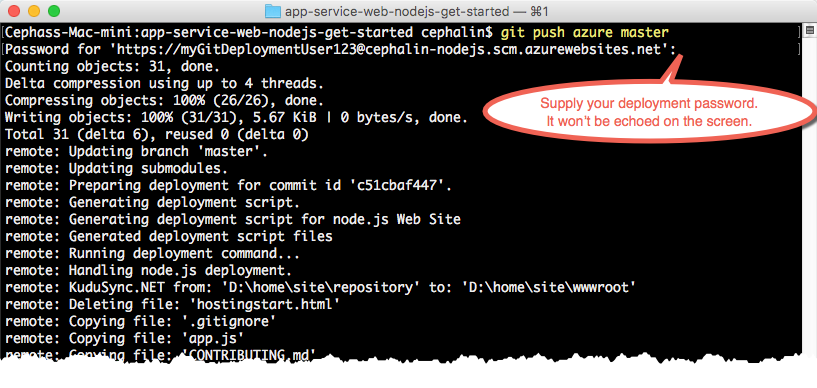

<properties 
    pageTitle="Bereitstellen von Node.js Web app für Azure in fünf Minuten | Microsoft Azure" 
    description="Erfahren Sie, wie einfach es ist, Web apps in App-Dienst ausführen, indem Sie eine Beispiel-app. Starten Sie real Entwicklung schnell ausführen und sehen Sie Ergebnisse sofort." 
    services="app-service\web"
    documentationCenter=""
    authors="cephalin"
    manager="wpickett"
    editor=""
/>

<tags
    ms.service="app-service-web"
    ms.workload="web"
    ms.tgt_pltfrm="na"
    ms.devlang="na"
    ms.topic="hero-article"
    ms.date="10/13/2016" 
    ms.author="cephalin"
/>
    
# Bereitstellen von der ersten Node.js Web app für Azure in fünf Minuten

In diesem Lernprogramm hilft Ihnen, Ihre erste Node.js Web app für [App-Verwaltungsdienst Azure](../app-service/app-service-value-prop-what-is.md)bereitstellen.
App-Dienst können Sie um Web-apps, [mobile-app sichern enden](/documentation/learning-paths/appservice-mobileapps/)und [API-apps](../app-service-api/app-service-api-apps-why-best-platform.md)zu erstellen.

Sie werden: 

- Erstellen einer Web-app in Azure-App-Dienst an.
- Bereitstellen Sie Beispiel für Node.js-Code.
- Finden Sie unter Code in Herstellung live ausgeführt.
- Aktualisieren Sie die gleiche Weise [Pushbenachrichtigungen, Git übergibt,](https://git-scm.com/docs/git-push)Web app.

## Erforderliche Komponenten

- [Git](http://www.git-scm.com/downloads).
- [Azure CLI](../xplat-cli-install.md).
- Ein Microsoft Azure-Konto. Wenn Sie kein Konto haben, können Sie [Sie sich für eine kostenlose Testversion](/pricing/free-trial/?WT.mc_id=A261C142F) oder [die Vorteile Ihres Visual Studio Abonnenten aktivieren](/pricing/member-offers/msdn-benefits-details/?WT.mc_id=A261C142F).

>[AZURE.NOTE] Sie können die [App-Verwaltungsdienst versuchen](http://go.microsoft.com/fwlink/?LinkId=523751) , ohne ein Azure-Konto. Erstellen Sie eine app Starter und wiedergeben Sie keine Kreditkarte erforderlich, keine Zusagen mit für bis zu einer Stunde –.

## Bereitstellen einer Node.js Web app

1. Öffnen Sie eine neue Windows-Befehlszeile, PowerShell-Fenster, Linux Shell oder Terminal OS X. Führen Sie `git --version` und `azure --version` zur Überprüfung, dass Git und Azure CLI auf Ihrem Computer installiert sind.

    

    Wenn Sie die Tools installiert haben, finden Sie unter [Voraussetzungen für](#Prerequisites) Downloadlinks.

3. Melden Sie sich bei Azure wie folgt:

        azure login

    Führen Sie die Meldung Hilfe den Anmeldevorgang fortsetzen aus.

    

4. Azure CLI in ASM Modus ändern, und klicken Sie dann legen Sie die Bereitstellung für App-Dienst fest. Stellen Sie mit den Anmeldeinformationen später Code bereit.

        azure config mode asm
        azure site deployment user set --username <username> --pass <password>

1. Wechseln Sie in ein Arbeitsverzeichnis (`CD`) und Klonen die Stichprobe app wie folgt:

        git clone https://github.com/Azure-Samples/app-service-web-nodejs-get-started.git

2. Ändern Sie in der Stichprobe app Repository.

        cd app-service-web-nodejs-get-started

4. Erstellen Sie die App-Dienst app Ressource in Azure mit einem eindeutigen app-Namen und den Bereitstellung-Benutzer, den die zuvor konfiguriert wurde. Wenn Sie aufgefordert werden, geben Sie die Anzahl der gewünschten Region.

        azure site create <app_name> --git --gitusername <username>

    

    Die app wird nun in Azure erstellt. Darüber hinaus ist des aktuellen Verzeichnisses Git Initialisierung und eine Verbindung mit der neuen App-Service-app als ein Git remote.
    Sie können navigieren Sie zu der app-URL (http://&lt;App_name >. azurewebsites.net) finden Sie unter ansprechender HTML-Standardseite, aber wir tatsächlich Code es jetzt anfordern.

4. Bereitstellen Sie Beispielcode zu Ihrer Azure-Anwendung, wie Sie keinen Code mit Git Pushbenachrichtigungen würden. Wenn Sie dazu aufgefordert werden, verwenden Sie das Kennwort ein, das die zuvor konfiguriert wurde.

        git push azure master

    

    `git push`nicht nur Code in Azure verschoben, sondern auch auslöst Bereitstellung Vorgänge in der Bereitstellung-Engine. 
    Wenn Sie eine package.json im Projektstammverzeichnis (Repository) haben, stellt das Bereitstellungsskript die erforderlichen Pakete für Sie ein. 

Herzlichen Glückwunsch, Sie haben Ihre app Azure-App-Dienst bereitgestellt.

## Finden Sie unter Ihre app live ausgeführt

Um die app in Azure live ausgeführt angezeigt wird, führen Sie diesen Befehl aus dem Verzeichnis in Ihrem Repository aus:

    azure site browse

## Stellen Sie Aktualisierungen zu Ihrer Anwendung

Git können jetzt Ihr Projekt (Repository) Stammwebsitesammlung jederzeit Pushbenachrichtigungen ein Update an einer aktiven Site vornehmen. Sie führen sie die gleiche Weise wie bei der erstmaligen Bereitstellung von Code. Beispielsweise jedes Mal, wenn Sie eine neue Änderung, die Sie getestet haben lokal Pushbenachrichtigungen möchten, führen Sie einfach die folgenden Befehle der Stammwebsitesammlung Project (Repository):

    git add .
    git commit -m "<your_message>"
    git push azure master

## Nächste Schritte

[Erstellen, konfigurieren und Bereitstellen einer Node.js Express-Web-app in Azure](app-service-web-nodejs-get-started.md). Anhand dieses Lernprogramms erfahren Sie, die grundlegende Kenntnisse, die Sie eine beliebige Node.js Web app in Azure, wie ausführen müssen:

- Erstellen und Konfigurieren von apps in Azure von PowerShell/Bash.
- Festlegen von Node.js-Version.
- Verwenden einer Startdatei, die nicht im Stammverzeichnis der Anwendung befindet.
- Automatisieren Sie mit NPM.
- Rufen Sie Fehler und Ausgabe Protokolle.

Oder möchten Sie Ihre erste Web app. Zum Beispiel:

- Testen Sie [andere Methoden zum Bereitstellen von Codes in Azure](../app-service-web/web-sites-deploy.md)aus. Beispielsweise um über eine der Ihre GitHub Repositorys bereitzustellen, wählen Sie einfach **GitHub** anstelle von **Lokalen Git Repository** in den **Bereitstellungsoptionen**.
- Nehmen Sie Ihre Azure-app auf die nächste Ebene an. Ihre Benutzer authentifiziert. Anzahl der Dezimalstellen bei Bedarf zugrunde liegenden. Richten Sie einige Leistung Benachrichtigungen aus. Alle mit wenigen Mausklicks. Finden Sie unter [Hinzufügen von Funktionen zum ersten Web app](app-service-web-get-started-2.md).

