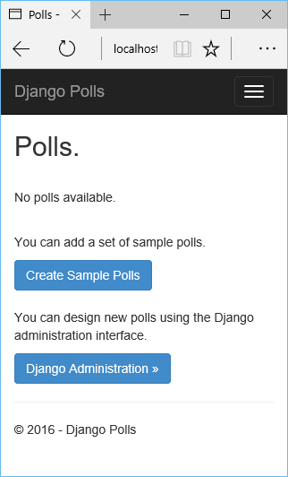

<properties 
    pageTitle="Django und SQL-Datenbank auf Azure mit Python Tools 2.2 für Visual Studio" 
    description="Informationen Sie zum Verwenden der Python-Tools für Visual Studio eine Django Web app zu erstellen, die Daten in eine Instanz der SQL-Datenbank gespeichert sind, und bei Azure App Dienst Web Apps bereitstellen." 
    services="app-service\web" 
    tags="python"
    documentationCenter="python" 
    authors="huguesv" 
    manager="wpickett" 
    editor=""/>

<tags 
    ms.service="app-service-web" 
    ms.workload="web" 
    ms.tgt_pltfrm="na" 
    ms.devlang="python" 
    ms.topic="article" 
    ms.date="07/07/2016"
    ms.author="huguesv"/>

# Django und SQL-Datenbank auf Azure mit Python Tools 2.2 für Visual Studio 

In diesem Lernprogramm werden wir [Python-Tools für Visual Studio] zum Erstellen einer einfachen Umfragen Web app verwenden eine der Vorlagen Stichprobe PTVS verwenden. In diesem Lernprogramm steht auch als [video](https://www.youtube.com/watch?v=ZwcoGcIeHF4).

Wir lernen, wie mithilfe eine SQL-Datenbank auf Azure gehostet, so konfigurieren Sie das Web-app, um einer SQL-Datenbank verwenden und wie Sie die Web app auf [Azure App Dienst Web Apps](http://go.microsoft.com/fwlink/?LinkId=529714)veröffentlichen.

Finden Sie weitere Artikel, die Entwicklung von Azure App Dienst Web Apps mit PTVS Flaschen, geben und Django Web-Framework, mit den Diensten von Azure Table Storage, MySQL und SQL-Datenbank mit Deckblatt der [Python Developer Center] . Während der App-Dienst in diesem Artikel liegt der Schwerpunkt, sind die Schritten ähnlich wie bei der Entwicklung von [Azure Cloud Services].

## Erforderliche Komponenten

 - Visual Studio 2015
 - [Python 2.7 32-bit]
 - [Python 2.2-Tools für Visual Studio]
 - [Python 2.2-Tools für Visual Studio-Beispiele VSIX]
 - [Azure SDK-Tools für im Vergleich mit einer 2015]
 - Django 1,9 oder höher

[AZURE.INCLUDE [create-account-and-websites-note](../../includes/create-account-and-websites-note.md)]

>[AZURE.NOTE] Wenn Sie mit Azure-App-Verwaltungsdienst Schritte vor dem für ein Azure-Konto anmelden möchten, wechseln Sie zu [App-Verwaltungsdienst versuchen](http://go.microsoft.com/fwlink/?LinkId=523751), in dem Sie eine kurzlebige Starter Web app sofort im App-Dienst erstellen können. Keine Kreditkarten erforderlich; keine Zusagen.

## Erstellen Sie das Projekt

In diesem Abschnitt erstellen wir eine Visual Studio-Projekt mit einer Beispielvorlage. Wir erstellen eine virtuelle Umgebung und erforderliche Pakete installieren. Wir erstellen eine lokale Datenbank Sqlite verwenden. Dann wird wir die Web app lokal ausgeführt wird.

1.  Wählen Sie in Visual Studio **Datei**, **Neues Projekt**aus.

1.  Die Project-Vorlagen aus der [Python Tools 2.2 für Visual Studio-Beispiele VSIX] stehen unter **Python**, **Beispiele**zur Verfügung. Wählen Sie **Umfragen Django Web-Projekt** aus, und klicken Sie auf OK, um das Projekt zu erstellen.

    

1.  Sie werden aufgefordert, externe Pakete zu installieren. Wählen Sie **in einer virtuellen Umgebung installieren**.

    

1.  Wählen Sie als Basis-Interpreter **Python 2.7** aus.

    

1.  Klicken Sie im **Explorer Lösung**mit der rechten Maustaste auf den Projektknoten, wählen Sie **Python**, und klicken Sie dann aus **Django migrieren**.  Wählen Sie dann **Django erstellen Hauptbenutzer**aus.

1.  Eine Django-Verwaltungskonsole und klicken dann eine Sqlite Datenbank in den Ordner des Projekts erstellen. Folgen Sie den Anweisungen zum Erstellen eines Benutzers.

1.  Bestätigen Sie, dass die Anwendung funktioniert mit <kbd>F5</kbd>.

1.  Klicken Sie auf **Melden Sie sich** über die Navigationsleiste am oberen.

    

1.  Geben Sie die Anmeldeinformationen für den Benutzer, die, den Sie erstellt haben, wenn Sie die Datenbank synchronisiert.

    

1.  Klicken Sie auf die **Stichprobe Umfragen erstellen**.

    

1.  Klicken Sie auf einer Umfrage und abzustimmen.

    

## Erstellen einer SQL-Datenbank

Für die Datenbank erstellen wir eine SQL Azure-Datenbank.

Sie können eine Datenbank erstellen, indem Sie wie folgt vor.

1.  Melden Sie sich bei der [Azure-Portal].

1.  Klicken Sie am unteren Rand des Navigationsbereichs auf **neu**. , klicken Sie auf **Daten + Speicher** > **SQL-Datenbank**.

1.  Konfigurieren Sie die neue SQL-Datenbank durch Erstellen einer neuen Ressourcengruppe, und wählen Sie den entsprechenden Speicherort dafür aus.

1.  Nachdem der SQL-Datenbank erstellt wurde, klicken Sie auf in der Datenbank Blade **in Visual Studio geöffnet** .
2.  Klicken Sie auf **Konfigurieren der Firewall**.
3.  Fügen Sie das Blade **Firewall-Einstellungen** hinzu, dass eine Firewall-Regel mit **START-IP-** und **END-IP-** der öffentlichen IP-Adresse des Computers Entwicklung festgelegt. Klicken Sie auf **Speichern**.

    Dadurch können Verbindungen mit dem Datenbankserver von Ihrem Entwicklungscomputer.

4.  Wieder in der Datenbank Blade klicken Sie auf **Eigenschaften**, und klicken Sie auf **Datenbank Verbindungszeichenfolgen anzeigen**. 

2.  Verwenden Sie die Schaltfläche Kopieren, um setzen den Wert von **ADO.NET** in die Zwischenablage.

## Konfigurieren Sie das Projekt

In diesem Abschnitt werden wir unsere Web-app, um die SQL-Datenbank verwenden wir gerade erstellten konfigurieren. Wir werden auch zusätzliche Python Pakete zur Verwendung von SQL-Datenbanken mit Django erforderlich installieren. Dann wird wir die Web app lokal ausgeführt wird.

1.  Öffnen Sie in Visual Studio **settings.py**, aus dem Ordner *Projektname* ein. Fügen Sie die Verbindungszeichenfolge vorübergehend im Editor. Die Verbindungszeichenfolge ist in diesem Format:

        Server=<ServerName>,<ServerPort>;Database=<DatabaseName>;User ID=<UserName>;Password={your_password_here};Encrypt=True;TrustServerCertificate=False;Connection Timeout=30;

Bearbeiten die Definition `DATABASES` verwenden Sie die oben angegebenen Werte.

        DATABASES = {
            'default': {
                'ENGINE': 'sql_server.pyodbc',
                'NAME': '<DatabaseName>',
                'USER': '<UserName>',
                'PASSWORD': '{your_password_here}',
                'HOST': '<ServerName>',
                'PORT': '<ServerPort>',
                'OPTIONS': {
                    'driver': 'SQL Server Native Client 11.0',
                    'MARS_Connection': 'True',
                }
            }
        }

1.  Klicken Sie im Explorer-Lösung unter **Python-Umgebungen**mit der rechten Maustaste auf die virtuelle Umgebung, und wählen Sie **Python-Paket installieren**.

1.  Installieren Sie das Paket `pyodbc` **Pip**verwenden.

    

1.  Installieren Sie das Paket `django-pyodbc-azure` **Pip**verwenden.

    

1.  Klicken Sie im **Explorer Lösung**mit der rechten Maustaste auf den Projektknoten, wählen Sie **Python**, und klicken Sie dann aus **Django migrieren**.  Wählen Sie dann **Django erstellen Hauptbenutzer**aus.

    Dadurch wird die Tabellen für die SQL-Datenbank erstellt, den wir im vorherigen Abschnitt erstellt haben. Folgen Sie den Anweisungen zum Erstellen eines Benutzers, dem entsprechen des Benutzers in der Sqlite Datenbank im ersten Abschnitt erstellt hat.

1.  Führen Sie die Anwendung mit `F5`. Umfragen, die mit der **Stichprobe Umfragen erstellen** und die Daten, die von der Abstimmung übermittelt erstellt wurden, werden in der SQL-Datenbank serialisiert.

## Veröffentlichen Sie die Web app auf Azure-App-Verwaltungsdienst

.NET SDK Azure bietet eine einfache Möglichkeit, Ihre Web Web app Azure App Dienst Web Apps bereitstellen.

1.  Klicken Sie im **Explorer Lösung**mit der rechten Maustaste auf den Projektknoten, und wählen Sie **Veröffentlichen**.

    

1.  Klicken Sie auf **Microsoft Azure Web Apps**.

1.  Klicken Sie auf **neu** , um eine neue Web-app zu erstellen.

1.  Füllen Sie die folgenden Felder aus, und klicken Sie auf **Erstellen**.
    -   **Web App-name**
    -   **App-Serviceplan**
    -   **Ressourcengruppe**
    -   **Region**
    -   Lassen Sie **Datenbankserver** legen Sie auf **keine Datenbank**

1.  Übernehmen Sie alle anderen Standardwerte, und klicken Sie auf **Veröffentlichen**.

1.  Webbrowser werden automatisch zu veröffentlichten Web app geöffnet. Die Web app arbeiten wie erwartet, sollte mit der **SQL** -Datenbank auf Azure gehostet angezeigt werden.

    Herzlichen Glückwunsch!

    

## Nächste Schritte

Führen Sie die folgenden Links, um weitere Informationen zur Python Tools für Visual Studio, Django und SQL-Datenbank.

- [Python-Tools für Visual Studio-Dokumentation]
  - [Webprojekte]
  - [Cloud Service-Projekte]
  - [Remote-Debuggen auf Microsoft Azure]
- [Django Dokumentation]
- [SQL-Datenbank]

## Was hat sich geändert
* Ein Leitfaden zum Ändern von Websites-App-Dienst finden Sie unter: [Azure-App-Dienst und seinen Einfluss auf die vorhandenen Azure Services](http://go.microsoft.com/fwlink/?LinkId=529714)

<!--Link references-->
[Python-Entwicklercenter]: /develop/python/
[Azure Cloud Services]: ../cloud-services-python-ptvs.md

<!--External Link references-->
[Azure-Portal]: https://portal.azure.com
[Python-Tools für Visual Studio]: http://aka.ms/ptvs
[Python 2.2-Tools für Visual Studio]: http://go.microsoft.com/fwlink/?LinkID=624025
[Python 2.2-Tools für Visual Studio-Beispiele VSIX]: http://go.microsoft.com/fwlink/?LinkID=624025
[Azure SDK-Tools für im Vergleich mit einer 2015]: http://go.microsoft.com/fwlink/?LinkId=518003
[Python 2.7 32-bit]: http://go.microsoft.com/fwlink/?LinkId=517190 
[Python-Tools für Visual Studio-Dokumentation]: http://aka.ms/ptvsdocs
[Remote-Debuggen auf Microsoft Azure]: http://go.microsoft.com/fwlink/?LinkId=624026
[Webprojekte]: http://go.microsoft.com/fwlink/?LinkId=624027
[Cloud Service-Projekte]: http://go.microsoft.com/fwlink/?LinkId=624028
[Django Dokumentation]: https://www.djangoproject.com/
[SQL-Datenbank]: /documentation/services/sql-database/
