<properties
   pageTitle="Anwendung Einsichten für Azure-Cloud-Dienste"
   description="Überwachen Sie Ihrer Web- und Worker Rollen effektiv mit Anwendung Einsichten"
   services="application-insights"
   documentationCenter=""
   authors="soubhagyadash"
   manager="douge"
   editor="alancameronwills"/>

<tags
   ms.service="application-insights"
   ms.devlang="na"
   ms.tgt_pltfrm="ibiza"
   ms.topic="article"
   ms.workload="tbd"
   ms.date="03/02/2016"
   ms.author="sdash"/>

# <a name="application-insights-for-azure-cloud-services"></a>Anwendung Einsichten für Azure-Cloud-Dienste


*Anwendung Einsichten befindet sich in der Vorschau*

[Microsoft Azure-Cloud-Dienst apps](https://azure.microsoft.com/services/cloud-services/) Überwachen von [Visual Studio-Anwendung Einsichten] [ start] für Verfügbarkeit und Leistung, Fehlern Verwendung. Mit dem Feedback, denen, das Sie über die Leistung und die Effizienz Ihrer App in der Natur kommunizieren, können Sie überlegen, die Richtung des Entwurfs in jeder Entwicklungszyklus vornehmen.

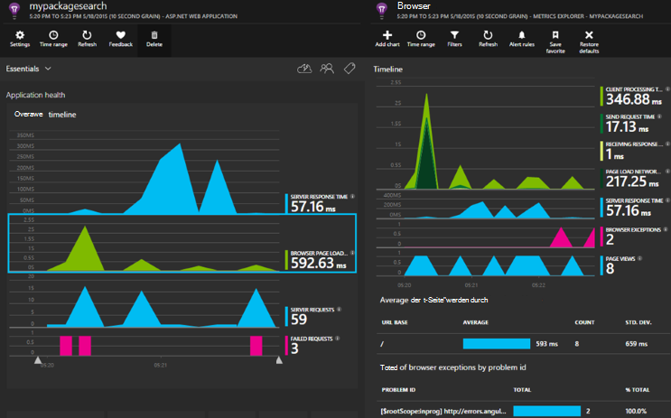

Benötigen Sie ein Abonnement mit [Microsoft Azure](http://azure.com)ein. Melden Sie sich mit einem Microsoft-Konto für Windows, XBox Live oder anderen Microsoft-Cloud-Diensten gegebenenfalls haben. 


#### <a name="sample-application-instrumented-with-application-insights"></a>Beispiel-Anwendung, die mit der Anwendung Einsichten instrumentiert

Sehen Sie sich dieses [Beispiel-Anwendung](https://github.com/Microsoft/ApplicationInsights-Home/tree/master/Samples/AzureEmailService) in der Anwendung Einsichten, auf einen Clouddienst mit zwei Worker-Rollen in einem Azure gehostet wird hinzugefügt wird. 

Im folgenden erfahren Sie, wie eigene Projekt Cloud-Dienst auf die gleiche Weise anpassen.

## <a name="create-an-application-insights-resource-for-each-role"></a>Erstellen Sie eine Anwendung Einsichten Ressource für jede Rolle

Eine Anwendung Einsichten Ressource ist, wo Ihre Daten werden analysiert und angezeigt werden.  

1.  Im [Portal Azure][portal], erstellen Sie eine neue Anwendung Einsichten Ressource. Wählen Sie für Anwendungstyp ASP.NET app aus. 

    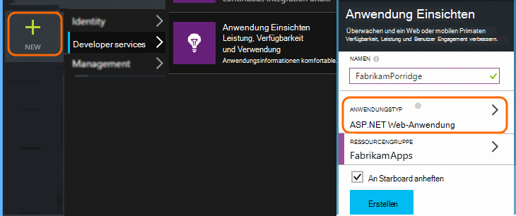

2.  Nehmen Sie eine Kopie der Schlüssel Instrumentation in Anspruch. Sie benötigen diese in Kürze zum Konfigurieren des SDKS.

    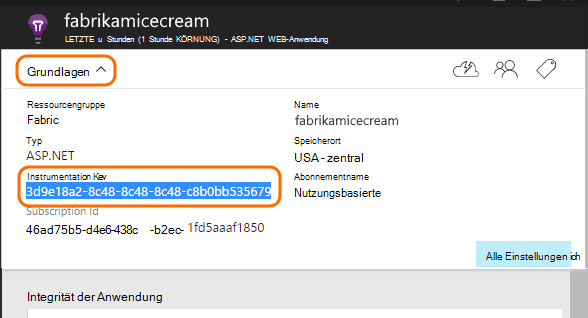


Es empfiehlt sich in der Regel [zum Erstellen einer separaten Ressource für die Daten aus jeder Rolle Web- und Arbeitskollegen](app-insights-separate-resources.md). 

Als Alternative könnten Sie Daten aus allen die Rollen, die nur eine Ressource zu senden, während eine [Standardeigenschaft] festlegen[ apidefaults] , damit Sie die Ergebnisse aus jeder Rolle gruppieren oder filtern können.

## <a name="sdk"></a>Installieren Sie das SDK in jedem Projekt


1. Bearbeiten Sie in Visual Studio NuGet Pakete des Cloud-app-Projekt aus.

    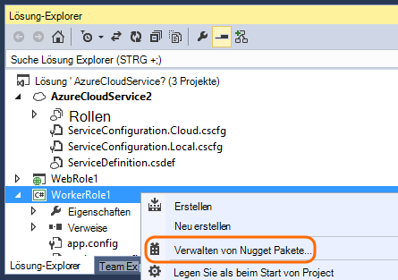


2. Fügen Sie die [Anwendung Einsichten für Web](http://www.nuget.org/packages/Microsoft.ApplicationInsights.Web) NuGet-Paket für Webrollen hinzu. Diese Version des SDK enthält Module, die Serverkontext wie die Rolleninformationen hinzufügen. Verwenden Sie für Worker-Rollen [Anwendung Einsichten für Windows-Server](https://www.nuget.org/packages/Microsoft.ApplicationInsights.WindowsServer/)aus.

    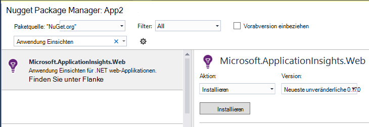


3. Konfigurieren des SDK zum Senden von Daten an die Anwendung Einsichten Ressource an.

    Legen Sie die Taste Instrumentation als Einstellung Konfiguration in der Datei `ServiceConfiguration.Cloud.cscfg`. ([Stichprobe Code](https://github.com/Microsoft/ApplicationInsights-Home/blob/master/Samples/AzureEmailService/AzureEmailService/ServiceConfiguration.Cloud.cscfg)).
 
    ```XML
     <Role name="WorkerRoleA"> 
      <Setting name="APPINSIGHTS_INSTRUMENTATIONKEY" value="YOUR IKEY" /> 
     </Role>
    ```
 
    Legen Sie eine geeignete Startfunktion die Taste Instrumentation von der Einstellung für die Konfiguration:

    ```C#
     TelemetryConfiguration.Active.InstrumentationKey = RoleEnvironment.GetConfigurationSettingValue("APPINSIGHTS_INSTRUMENTATIONKEY");
    ```

    Notizen, die denselben Namen `APPINSIGHTS_INSTRUMENTATIONKEY` der Konfiguration Einstellung von Azure-Diagnose reporting verwendet wird. 


    Diesen Schritt für jede Rolle in Ihrer Anwendung ausführen. In den Beispielen finden Sie unter:
 
 * [Web-Rolle](https://github.com/Microsoft/ApplicationInsights-Home/blob/master/Samples/AzureEmailService/MvcWebRole/Global.asax.cs#L27)
 * [Worker-Rolle](https://github.com/Microsoft/ApplicationInsights-Home/blob/master/Samples/AzureEmailService/WorkerRoleA/WorkerRoleA.cs#L232)
 * [Für Webseiten](https://github.com/Microsoft/ApplicationInsights-Home/blob/master/Samples/AzureEmailService/MvcWebRole/Views/Shared/_Layout.cshtml#L13)   

4. Legen Sie die Datei ApplicationInsights.config immer in der Ausgabeverzeichnis kopiert werden. 

    (In der config-Datei wird mit der Frage, Nachrichten, die Instrumentation Taste es platziert angezeigt. Jedoch empfiehlt sich für Applikationen Cloud aus der .cscfg Datei festlegen. Dadurch wird sichergestellt, dass die Rolle im Portal ordnungsgemäß identifiziert wird.)


#### <a name="run-and-publish-the-app"></a>Ausführen und Veröffentlichen der app

Führen Sie die app, und melden Sie sich bei Azure. Öffnen Sie die Anwendung Einsichten Ressourcen, die Sie erstellt haben, und Sie sehen die einzelnen Datenpunkten angezeigte [Suchen](app-insights-diagnostic-search.md), und aggregierte Daten in [Metrisch Explorer](app-insights-metrics-explorer.md). 

Fügen Sie weitere werden – finden Sie unter den folgenden - Abschnitten und veröffentlichen Sie Ihre app, um live Diagnostic und die Verwendung Feedback zu erhalten. 


#### <a name="no-data"></a>Keine Daten?

* Öffnen Sie die [Suche] [ diagnostic] Kachel, um einzelne Ereignisse anzuzeigen.
* Verwenden Sie die Anwendung, die andere Seiten öffnen, damit es einige werden generiert.
* Warten Sie einige Sekunden, und klicken Sie auf aktualisieren.
* [Problembehandlung]finden Sie unter[qna].


## <a name="more-telemetry"></a>Weitere werden

In den folgenden Abschnitten zeigen, wie Sie zusätzliche werden in andere Aspekte der Anwendung abrufen.


## <a name="track-requests-from-worker-roles"></a>Nachverfolgen Anfragen Worker-Rollen

Im Webrollen sammelt das Modul Besprechungsanfragen automatisch Daten über HTTP-Anfragen. Finden Sie in der [Stichprobe MVCWebRole](https://github.com/Microsoft/ApplicationInsights-Home/tree/master/Samples/AzureEmailService/MvcWebRole) Beispiele, wie Sie das Standardverhalten der Websitesammlung überschreiben können. 

Sie können die Leistung von Anrufe an Worker-Rollen erfassen, indem sie auf die gleiche Weise wie HTTP-Anfragen nachverfolgen. In der Anwendung Einblicken misst der Typ der Anforderung werden eine Arbeitseinheit benannten Server Seite, die zeitlich werden können, und können unabhängig voneinander Erfolg haben oder Fehlschlagen an. Während HTTP-Anfragen vom SDK automatisch erfasst werden, können Sie Ihren eigenen Code zum Nachverfolgen von Besprechungsanfragen, die Workerrollen einfügen.

Finden Sie unter der zwei Stichproben Worker-Rollen zu Bericht Besprechungsanfragen instrumentiert: [WorkerRoleA](https://github.com/Microsoft/ApplicationInsights-Home/tree/master/Samples/AzureEmailService/WorkerRoleA) und [WorkerRoleB](https://github.com/Microsoft/ApplicationInsights-Home/tree/master/Samples/AzureEmailService/WorkerRoleB)

## <a name="azure-diagnostics"></a>Azure-Diagnose

[Azure-Diagnose](../vs-azure-tools-diagnostics-for-cloud-services-and-virtual-machines.md) Daten beinhaltet Rolle Management Ereignisse, -Datenquellen und Anwendungsprotokolle. Sie können diese Anwendung Einsichten gesendeten verfügen, sodass Sie diese entlang der restlichen Ihrer werden, finden Sie unter können erleichtern es Probleme diagnostizieren.

Azure-Diagnose sind besonders hilfreich, wenn eine Rolle unerwartet fehlschlägt oder kann nicht gestartet werden.

1. Mit der rechten Maustaste in der Rolle (nicht das Projekt!), um dessen Eigenschaften zu öffnen, und wählen Sie die **Diagnose aktivieren**, **Diagnose aus, um die Anwendung Einsichten zu senden**.

    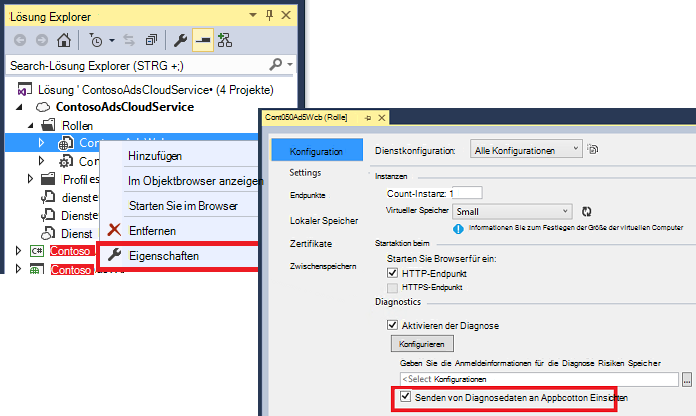

    **Oder wenn Ihre app bereits veröffentlichte und ausgeführt wird**, Öffnen von Server-Explorer oder Cloud-Explorer mit der rechten Maustaste in der app, und wählen die gleiche Option.

3.  Aktivieren Sie dieselbe Anwendung Einsichten Ressource als Ihrer anderen werden.

    Wenn Sie möchten, können Sie eine andere Ressource in anderen Dienstkonfigurationen (Cloud, lokal) können Sie die Entwicklungsdaten von Livedaten getrennten organisieren festlegen.

3. Optional können Sie [einige der Azure-Diagnose ausschließen](app-insights-azure-diagnostics.md) , die Anwendung Einsichten weitergeleitet werden soll. Die Standardeinstellung ist alles.

### <a name="view-azure-diagnostic-events"></a>Anzeigen von Azure diagnostic Ereignisse

Wo finden Sie die Diagnose:

* Leistungsindikatoren werden als benutzerdefinierte Metrik angezeigt. 
* Windows-Ereignisprotokollen werden als Spuren und benutzerdefinierte Ereignisse angezeigt.
* Anwendung Protokolle, sowie zusätzliche Diagnose-Infrastruktur-Protokolle ETW sich angezeigt als auf.

Zum Anzeigen von Datenquellen und der Anzahl von Ereignissen öffnen Sie [Kennzahlen Explorer](app-insights-metrics-explorer.md) , und fügen Sie ein neues Diagramm hinzu:


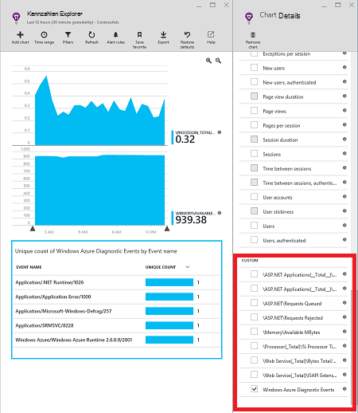

Verwenden Sie die [Suche](app-insights-diagnostic-search.md) So suchen Sie über die verschiedenen Spur Protokolle von Azure-Diagnose gesendet. Beispielsweise, wenn Sie eine Ausnahme unhanded in einer Rolle hatten die Rolle des abstürzen und Papierkorb verursacht, dass die Informationen in der Anwendung Kanal des Windows-Ereignisprotokolls angezeigt würden. Die Suchfunktion können Sie sehen Sie sich die Windows-Ereignisprotokolls zurück, und erhalten die vollständige Stapel Spur für die Ausnahme, aktivieren Sie die Ursache des Problems zu finden.


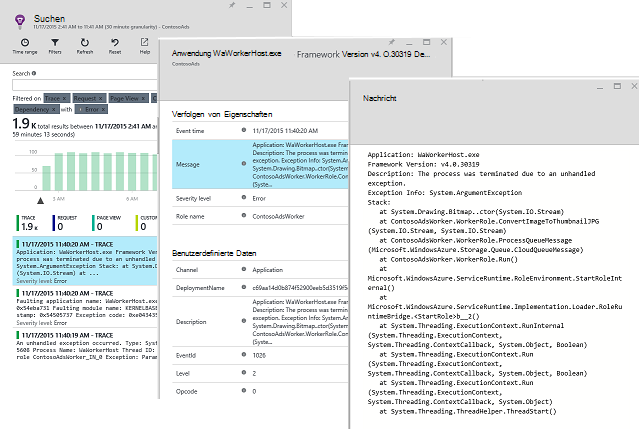

## <a name="app-diagnostics"></a>App-Diagnose

Azure Diagnose umfasst automatisch Protokolleinträge angezeigt, die Ihre app generiert System.Diagnostics.Trace verwenden. 

Aber wenn Sie bereits über die Log4N oder NLog Framework verwenden, können Sie auch [erfassen Sie ihre Log auf][netlogs].

[Benutzerdefinierte Ereignisse und Kennzahlen nachverfolgen] [ api] im Client Server oder beides, erfahren Sie mehr über die Leistung und die Verwendung Ihrer Anwendungs.

## <a name="dependencies"></a>Abhängigkeiten

Anwendung Einsichten SDK können Anrufe melden, die Ihre app zu externe Abhängigkeiten z. B. REST-apis und SQL-Servern ermöglicht. Auf diese Weise können Sie feststellen, ob eine bestimmte Abhängigkeit langsam Antworten oder Fehlern verursacht.

Wenn die Anwendung .NET Framework 4.6 oder höher verwendet, müssen Sie nicht Sonstiges führen. 

Richten Sie andernfalls die Web/Worker-Rolle mit der [Anwendung Einsichten Agent](app-insights-monitor-performance-live-website-now.md) , auch bekannt als "Status Monitor" ein.

So verwenden die Anwendung Einsichten Agent mit Ihrer Web/Worker-Rollen:

* Die Ordner [AppInsightsAgent](https://github.com/Microsoft/ApplicationInsights-Home/tree/master/Samples/AzureEmailService/WorkerRoleA/AppInsightsAgent) und die beiden Dateien darin Web-/ Worker Rolle Projekten auf Hinzufügen. Achten Sie darauf, dass Sie ihre eigene Eigenschaften festlegen, sodass sie immer in der Ausgabeverzeichnis kopiert werden. Diese Dateien installieren des Agents.
* Starten von Aufgabe der CSDEF Datei als angezeigte [hier](https://github.com/Microsoft/ApplicationInsights-Home/tree/master/Samples/AzureEmailService/AzureEmailService/ServiceDefinition.csdef#L18)hinzufügen.
* Hinweis: *Worker-Rollen* erfordern drei Umgebungsvariablen als angezeigte [hier](https://github.com/Microsoft/ApplicationInsights-Home/tree/master/Samples/AzureEmailService/AzureEmailService/ServiceDefinition.csdef#L44). Dies ist nicht erforderlich, für das Webrollen.

### <a name="dependency-reports"></a>Abhängigkeit von Berichten

Hier ist ein Beispiel für was Sie bei der Anwendung Einsichten Portal finden Sie unter:

* Rich-Diagnose mit automatisch korrelierte Besprechungsanfragen und Abhängigkeiten:

    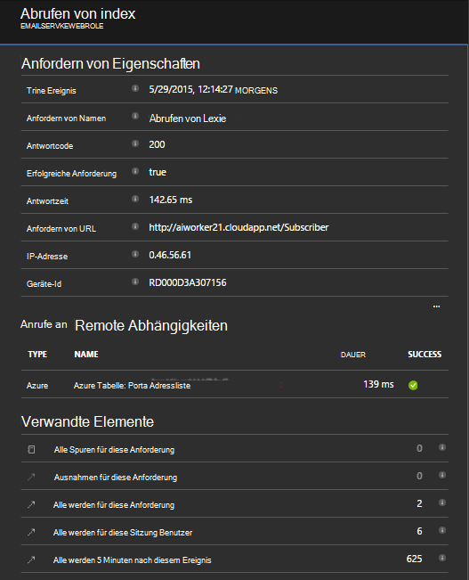

* Die Leistung von der Webrolle mit Abhängigkeitsinformationen:

    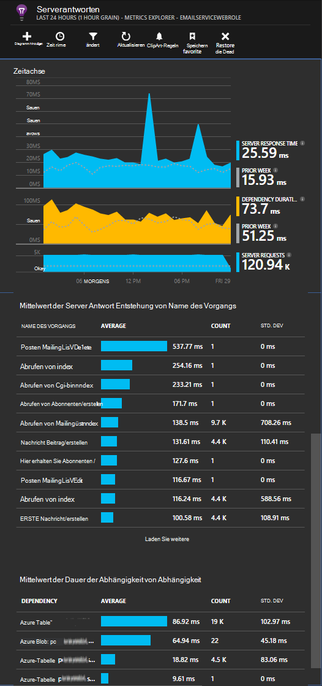

* Hier finden Sie eine Bildschirmaufnahme auf das Besprechungsanfragen und von Abhängigkeitsinformationen für eine Worker-Rolle:

    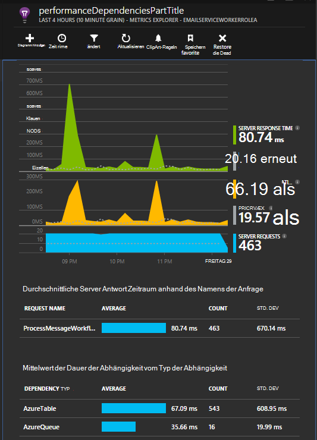

## <a name="exceptions"></a>Ausnahmen

Finden Sie unter [Ausnahmen für die Überwachung, in der Anwendung Einsichten](app-insights-asp-net-exceptions.md) Informationen wie Sie Ausnahmefehler von anderen Web-Anwendung Arten erfassen können.

Der Stichprobe Web die Funktion ist MVC5 und Web-API 2 Controller. Mit den folgenden sind die Ausnahmefehler vom 2 erfasst:

* [AiHandleErrorAttribute](https://github.com/Microsoft/ApplicationInsights-Home/blob/master/Samples/AzureEmailService/MvcWebRole/Telemetry/AiHandleErrorAttribute.cs) einrichten [hier](https://github.com/Microsoft/ApplicationInsights-Home/blob/master/Samples/AzureEmailService/MvcWebRole/App_Start/FilterConfig.cs#L12) für MVC5 Controller
* [AiWebApiExceptionLogger](https://github.com/Microsoft/ApplicationInsights-Home/blob/master/Samples/AzureEmailService/MvcWebRole/Telemetry/AiWebApiExceptionLogger.cs) einrichten [hier](https://github.com/Microsoft/ApplicationInsights-Home/blob/master/Samples/AzureEmailService/MvcWebRole/App_Start/WebApiConfig.cs#L25) für Web-API 2 Controller

Für Worker-Rollen gibt es zwei Methoden zum Nachverfolgen von Ausnahmen.

* TrackException(ex)
* Wenn Sie das Anwendung Einsichten Spur Zuhörer NuGet-Paket hinzugefügt haben, können Sie zum Protokollieren von Ausnahmen System.Diagnostics.Trace verwenden. [Codebeispiel für den.](https://github.com/Microsoft/ApplicationInsights-Home/blob/master/Samples/AzureEmailService/WorkerRoleA/WorkerRoleA.cs#L107)

## <a name="performance-counters"></a>-Datenquellen

Standardmäßig werden die folgenden Indikatoren erfasst:

    * \Process(??APP_WIN32_PROC??)\% CPU-Zeit
    * \Memory\Available bytes
    * \.Netz CLR Exceptions(??APP_CLR_PROC??)\# der ausgelösten Ausnahmen ausgelösten / Sec
    * \Process (??. APP_WIN32_PROC??) \Private bytes
    * \Process (??. APP_WIN32_PROC??) \IO Daten Bytes/s
    * \Processor(_Total)\% CPU-Zeit

Darüber hinaus werden die folgenden auch für Webrollen erfasst:

    * \ASP.NET Applikationen (??. APP_W3SVC_PROC??) \Requests/SEC    
    * \ASP.NET Applikationen (??. APP_W3SVC_PROC??) \Request Ausführung dauert
    * \ASP.NET Applikationen (??. APP_W3SVC_PROC??) \Requests in Anwendungswarteschlange

Sie können zusätzliche benutzerdefinierte oder andere Windows-Leistungsindikatoren als angezeigte [hier](https://github.com/Microsoft/ApplicationInsights-Home/blob/master/Samples/AzureEmailService/WorkerRoleA/ApplicationInsights.config#L14) angeben.

  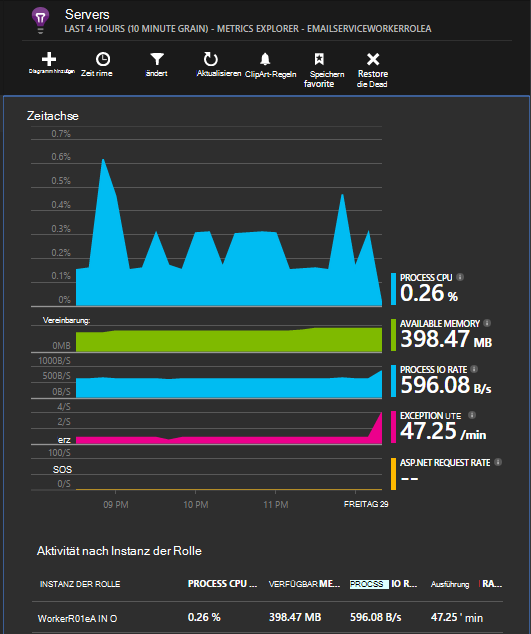

## <a name="correlated-telemetry-for-worker-roles"></a>Korrelierte werden für Worker-Rollen

Es ist einer leistungsfähigen diagnostic zur Verfügung, wenn Sie sehen können, was zur Anforderung einer ausgefallenen oder hohe Wartezeit geführt hat. Mit Webrollen richtet das SDK automatisch Korrelationskoeffizienten zwischen verknüpften werden. Für Worker-Rollen können Sie eine benutzerdefinierte telemetrieprotokoll Initialisierung festzulegenden ein gemeinsames Operation.Id Kontextattribut für alle werden, dies zu erreichen. So können Sie feststellen, ob das Problem Wartezeit/Fehler aufgrund einer Abhängigkeit oder Code auf einen Blick verursacht wurde! 

So sieht wie:

* Festlegen der Korrelations-Id in einem CallContext als angezeigte [hier](https://github.com/Microsoft/ApplicationInsights-Home/blob/master/Samples/AzureEmailService/WorkerRoleA/WorkerRoleA.cs#L36). In diesem Fall sind wir die ID anfordern als die Korrelations-Id verwenden.
* Hinzufügen einer benutzerdefinierten Implementierung von TelemetryInitializer, die Operation.Id, für die der vorstehenden CorrelationId festgelegt werden. Hier gezeigten: [ItemCorrelationTelemetryInitializer](https://github.com/Microsoft/ApplicationInsights-Home/blob/master/Samples/AzureEmailService/WorkerRoleA/Telemetry/ItemCorrelationTelemetryInitializer.cs#L13)
* Fügen Sie die benutzerdefinierten werden Initialisierung hinzu. In der Datei ApplicationInsights.config oder im Code konnte als angezeigte [hier](https://github.com/Microsoft/ApplicationInsights-Home/blob/master/Samples/AzureEmailService/WorkerRoleA/WorkerRoleA.cs#L233) folgt

Das wars! Mit der Portalseite wird bereits von mit Sie alle zugehörigen werden auf einen Blick erkennen können Kabel:

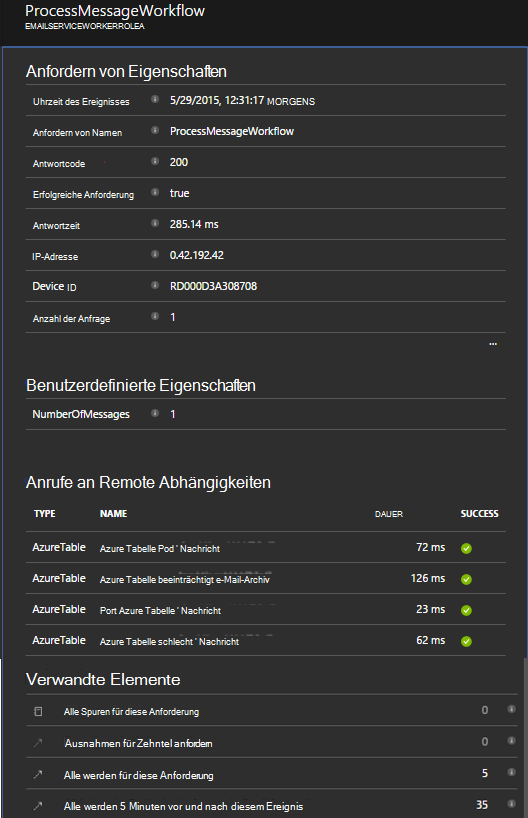


## <a name="client-telemetry"></a>Client werden

[Hinzufügen des JavaScript SDK Ihren Webseiten] [ client] browserbasierte werden beispielsweise Seite Ansicht zählt, Seitenladezeiten Skript Ausnahmen und zum Schreiben von benutzerdefinierten werden in Ihrer Seite Skripts lassen.

## <a name="availability-tests"></a>Verfügbarkeit von tests

[Einrichten von Webtests] [ availability] um sicherzustellen, dass die Anwendung bleibt der live und reagiert.


## <a name="example"></a>Beispiel

[Im Beispiel](https://github.com/Microsoft/ApplicationInsights-Home/tree/master/Samples/AzureEmailService) überwacht einen Dienst, der eine Webrolle und zwei Worker-Rollen hat.

## <a name="exception-method-not-found-on-running-in-azure-cloud-services"></a>Ausnahme-"Methode nicht gefunden" auf in Azure Cloud Services ausgeführt wird

Erstellen Sie für .NET 4.6? 4.6 wird nicht automatisch in Azure Cloud Services-Rollen unterstützt. [4.6 installieren, klicken Sie auf jede Rolle](../cloud-services/cloud-services-dotnet-install-dotnet.md) , bevor Sie Ihre app ausführen.

## <a name="related-topics"></a>Verwandte Themen

* [Konfigurieren von Azure-Diagnose an eine andere Anwendung Einsichten senden](app-insights-azure-diagnostics.md)
* [Mithilfe der PowerShell Azure Diagnose an Anwendung Einsichten zu senden](app-insights-powershell-azure-diagnostics.md)


[api]: app-insights-api-custom-events-metrics.md
[apidefaults]: app-insights-api-custom-events-metrics.md#default-properties
[apidynamicikey]: app-insights-separate-resources.md#dynamic-ikey
[availability]: app-insights-monitor-web-app-availability.md
[azure]: app-insights-azure.md
[client]: app-insights-javascript.md
[diagnostic]: app-insights-diagnostic-search.md
[netlogs]: app-insights-asp-net-trace-logs.md
[portal]: http://portal.azure.com/
[qna]: app-insights-troubleshoot-faq.md
[redfield]: app-insights-monitor-performance-live-website-now.md
[start]: app-insights-overview.md 
