<properties 
    pageTitle="Beispiel: Analysieren von Daten aus der Anwendung Einsichten exportiert" 
    description="Fehlercode eigene Analysen werden in der Anwendung Einsichten mit dem Feature fortlaufender exportieren. Speichern Sie Daten in SQL." 
    services="application-insights" 
    documentationCenter=""
    authors="mazharmicrosoft" 
    manager="douge"/>

<tags 
    ms.service="application-insights" 
    ms.workload="tbd" 
    ms.tgt_pltfrm="ibiza" 
    ms.devlang="na" 
    ms.topic="article" 
    ms.date="01/05/2016" 
    ms.author="awills"/>
 
# Beispiel: Analysieren von Daten aus der Anwendung Einsichten exportiert

In diesem Artikel wird gezeigt, wie von Anwendung Einsichten exportierte JSON-Daten zu verarbeiten. Beispielsweise werden wir Schreiben von Code zum Verschieben von Daten werden von [Visual Studio-Anwendung Einsichten] [ start] in eine SQL Azure-Datenbank mit [Fortlaufender exportieren][export]. (Auch erzielen Sie diese [mithilfe des Streams Analytics](app-insights-code-sample-export-sql-stream-analytics.md), aber hier unser Ziel besteht darin, Sie Teil des Codes anzeigen.) 

Fortlaufender exportieren verlagert Ihrer werden in Azure-Speicher im JSON-Format, damit wir Teil des Codes zum Analysieren der JSON-Objekte und zum Erstellen von Zeilen in einer Datenbanktabelle schreiben wird.

Im Allgemeinen Weise fortlaufender Exportieren Ihrer eigenen Analysen der werden Ausführen Ihrer apps zu Anwendung Einsichten zu senden. Sie können in diesem Codebeispiel andere Dinge mit der exportierten werden anpassen.

Wir beginnen mit der Annahme, dass Sie die app bereits besitzen, die Sie überwachen möchten.

## Hinzufügen der Anwendung Einsichten SDK

Überwachen Ihrer Anwendung, die Sie [Hinzufügen einer Anwendung Einsichten SDK] [ start] an Ihrer Anwendung. Es gibt verschiedene SDKs und Helper-Tools für unterschiedliche Plattformen, IDEs und Sprachen. Sie können verschiedene Arten von mobilen Geräten, Java oder ASP.NET Webservern und Webseiten überwachen. Alle SDKs senden werden mit dem [Portal Anwendung Einsichten][portal], wobei Sie können unsere leistungsstarke Datenanalyse und Diagnosetools verwenden, und exportieren Sie die Daten in den Speicher.

Erste Schritte:

1. Erhalten Sie ein [Konto in Microsoft Azure](https://azure.microsoft.com/pricing/).
2. Im [Portal Azure][portal], fügen Sie eine neue Anwendung Einsichten Ressource für Ihre app hinzu:

    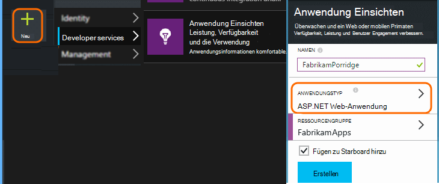

    (Die app-Typ und Abonnement möglicherweise abweichen.)
3. Öffnen Sie die Schnellstart finden Sie Informationen zum Einrichten der SDK für Ihre app ein.

    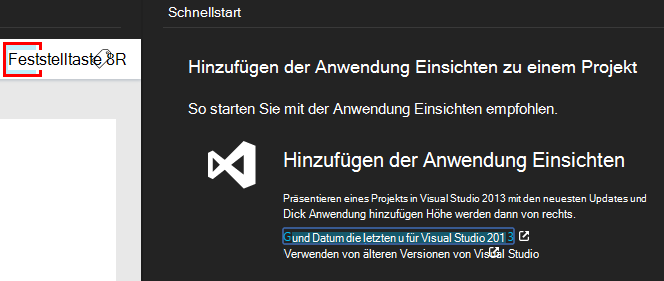

    Wenn Ihre app nicht aufgeführt, schauen Sie sich das [Erste Schritte] [ start] Seite.

4. In diesem Beispiel haben wir eine Web-app, Überwachung, damit wir die Azure-Tools in Visual Studio verwenden können, das SDK installieren. Wir informieren sie den Namen des unsere Anwendung Einsichten Ressource:

    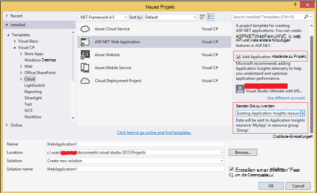

## Erstellen von Speicher in Azure

Daten aus der Anwendung Einsichten werden immer mit einer Firma Azure-Speicher im JSON-Format exportiert. Es ist, dass der Code die Daten liest aus diesem Speicher.

1. Erstellen Sie ein "klassische" Speicherkonto in Ihr Abonnement im [Portal Azure][portal].

    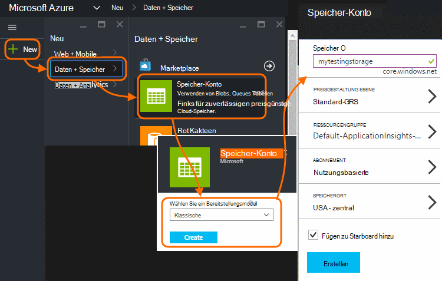

2. Erstellen eines Containers

    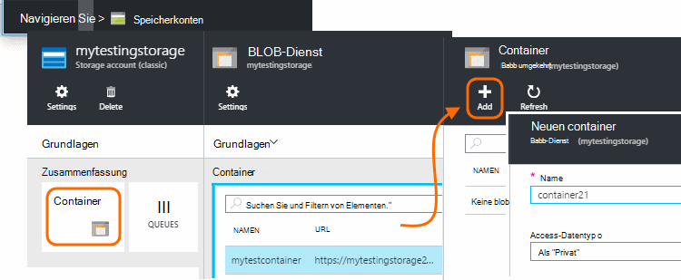

## Fortlaufender in Azure-Speicher exportieren starten

1. Navigieren Sie zu der Anwendung Einsichten Ressource, die Sie für eine Anwendung erstellt haben, im Azure-Portal.

    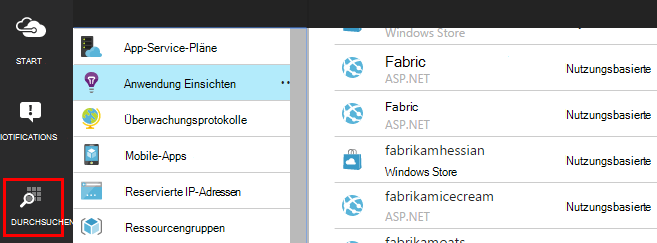

2. Erstellen Sie eine fortlaufende exportieren.

    

    Wählen Sie das Speicherkonto, die, das Sie zuvor erstellt haben:

    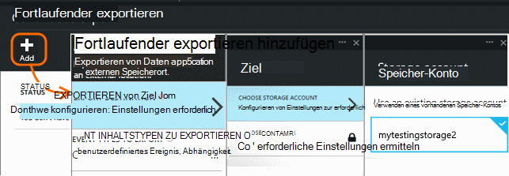
    
    Legen Sie die Ereignis Dateitypen, die angezeigt werden sollen:

    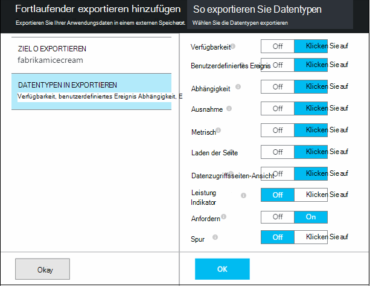

3. Zulassen, dass einige Daten zu sammeln. Befinden sich wieder aus, und lassen Sie Personen, die Anwendung für eine Weile verwendet werden. Nützlich sein werden sollen, und sehen Sie statistische Diagramme in [metrischen Explorer](app-insights-metrics-explorer.md) und einzelne Ereignisse in [diagnostic suchen](app-insights-diagnostic-search.md). 

    Und außerdem die Daten zu Ihrem Storage exportiert. 

4. Prüfen Sie die exportierten Daten ein. Wählen Sie in Visual Studio **Anzeigen / Cloud Explorer**, und öffnen Sie Azure / Speicher. (Wenn Sie diese Menüoption besitzen, müssen Sie das Azure SDK installieren: Öffnen Sie im Dialogfeld Neues Projekt und C#- / Cloud / Microsoft Azure SDK für .NET erhalten.)

    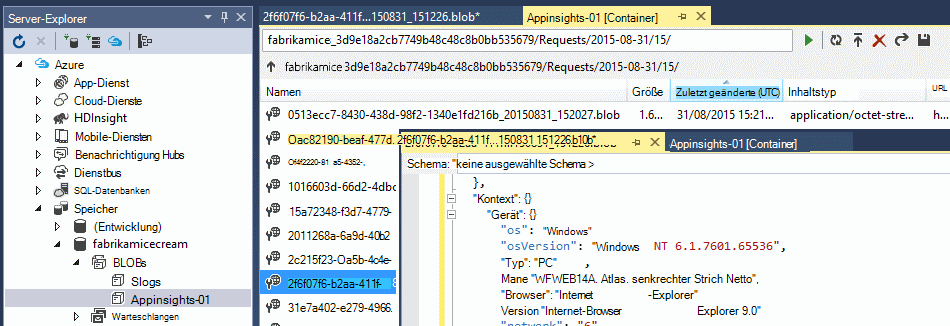

    Notieren Sie den allgemeinen Teil der Pfadnamen, die von Namen und Instrumentation Anwendungstaste abgeleitet wird. 

Der Ereignisse in Dateien im JSON-Format BLOB-geschrieben. Jede Datei kann ein oder mehrere Ereignisse enthalten. Daher möchten wir die Ereignisdaten lesen und die Felder, die später herausfiltern. Stehen alle Arten von Maßnahmen, die wir mit den Daten ergreifen können, aber unsere Plan heute besteht darin, Schreiben von entsprechendem Code, um die Daten in einer SQL-Datenbank verschieben. Die werden zahlreiche interessante Abfragen ausführen erleichtern.

## Erstellen einer SQL Azure-Datenbank

In diesem Beispiel werden wir Schreiben von Code ein, um die Daten in einer Datenbank schieben.

Aus Ihrem Abonnement [Azure]-Portal erneut starten[portal], erstellen Sie die Datenbank (und einen neuen Server, es sei denn, Sie bereits eingerichtet habe) die die Daten geschrieben werden.

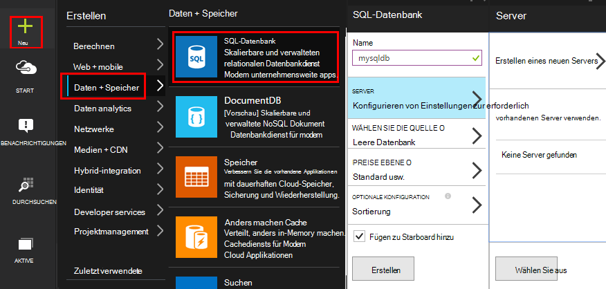

Stellen Sie sicher, dass der Datenbankserver Zugriff auf Dienste Azure zulässt:

## Erstellen Sie eine Worker-Rolle 

Jetzt können endlich wir Schreiben von [entsprechendem Code,](https://sesitai.codeplex.com/) um das JSON in die exportierte Blobs analysieren und Datensätze in der Datenbank erstellen. Da der Export speichern und die Datenbank in Azure sind, wird wir den Code in einer Azure Worker-Rolle ausgeführt wird.

In diesem Code extrahiert automatisch jeden Eigenschaften in den JSON vorhanden sind. Eine Beschreibung der Eigenschaften finden Sie unter [Exportieren Datenmodell](app-insights-export-data-model.md).

#### Worker Rolle Projekt erstellen

Erstellen Sie in Visual Studio ein neues Projekt für das Worker-Rolle aus:

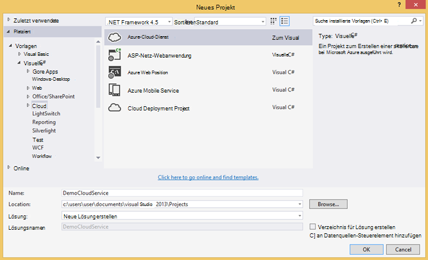

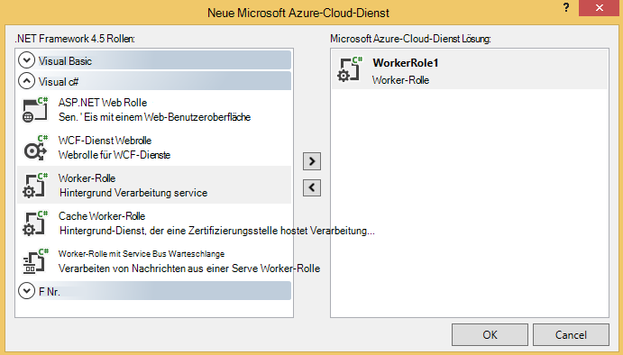

#### Verbinden mit dem Speicherkonto

Azure erhalten Sie die Verbindungszeichenfolge aus Ihrem Konto Speicher:

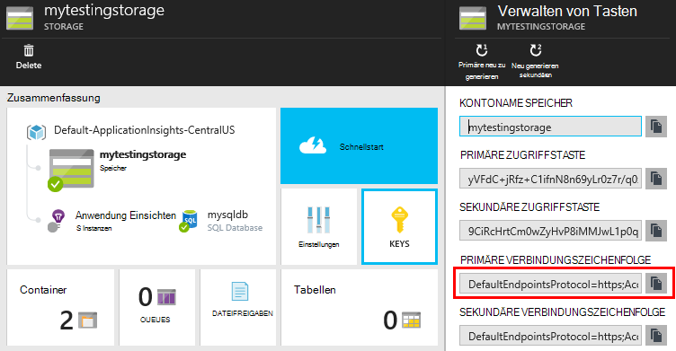

Konfigurieren Sie die Worker Rolle Einstellungen in Visual Studio mit der Verbindungszeichenfolge für Speicher-Konto:

#### Pakete

Klicken Sie im Explorer-Lösung mit der rechten Maustaste Worker-Rolle Projekt, und wählen Sie NuGet-Pakete verwalten.
Suchen und diese Pakete installieren: 

 * EntityFramework 6.1.2 oder höher – wir verwenden diese zum Generieren des DB Tabellenschemas im laufenden Betrieb, basierend auf den Inhalt von der JSON im Blob.
 * JsonFx – dies verwenden wir für das Reduzieren des JSON C#-Klasse Eigenschaften.

Verwenden Sie dieses Tool zum Generieren von C#-Klasse außerhalb unserer einzelnes JSON-Dokument ein. Dies erforderlich macht einige kleinere Änderungen wie reduzieren JSON-Arrays in einzelne C#-Eigenschaft aktivieren Spalte in DB Tabelle (Ex. UrlData_port) 

 * [JSON C#-Klasse-generator](http://jsonclassgenerator.codeplex.com/)

## Code 

Legen Sie diesen Code in `WorkerRole.cs`.

#### Importe

    using Microsoft.WindowsAzure.Storage;

    using Microsoft.WindowsAzure.Storage.Blob;

#### Abrufen der Verbindungszeichenfolge Speicher

    private static string GetConnectionString()
    {
      return Microsoft.WindowsAzure.CloudConfigurationManager.GetSetting("StorageConnectionString");
    }

#### Ausführen der Worker in regelmäßigen Abständen

Ersetzen Sie die vorhandene ausführen Methode, und wählen Sie das Intervall, in das Sie arbeiten. Da die Exportfunktion ein JSON-Objekt in eine Stunde abgeschlossen ist, sollten sie mindestens eine Stunde.

    public override void Run()
    {
      Trace.TraceInformation("WorkerRole1 is running");

      while (true)
      {
        Trace.WriteLine("Sleeping", "Information");

        Thread.Sleep(86400000); //86400000=24 hours //1 hour=3600000
                
        Trace.WriteLine("Awake", "Information");

        ImportBlobtoDB();
      }
    }

#### Jede JSON-Objekt als eine Tabellenzeile einfügen

    public void ImportBlobtoDB()
    {
      try
      {
        CloudStorageAccount account = CloudStorageAccount.Parse(GetConnectionString());

        var blobClient = account.CreateCloudBlobClient();
        var container = blobClient.GetContainerReference(FilterContainer);

        foreach (CloudBlobDirectory directory in container.ListBlobs())//Parent directory
        {
          foreach (CloudBlobDirectory subDirectory in directory.ListBlobs())//PageViewPerformance
          {
            foreach (CloudBlobDirectory dir in subDirectory.ListBlobs())//2015-01-31
            {
              foreach (CloudBlobDirectory subdir in dir.ListBlobs())//22
              {
                foreach (IListBlobItem item in subdir.ListBlobs())//3IAwm6u3-0.blob
                {
                  itemname = item.Uri.ToString();
                  ParseEachBlob(container, item);
                  AuditBlob(container, directory, subDirectory, dir, subdir, item);
                } //item loop
              } //subdir loop
            } //dir loop
          } //subDirectory loop
        } //directory loop
      }
      catch (Exception ex)
      {
        //handle exception
      }
    }

#### Analysieren Sie jede blob

    private void ParseEachBlob(CloudBlobContainer container, IListBlobItem item)
    {
      try
      {
        var blob = container.GetBlockBlobReference(item.Parent.Prefix + item.Uri.Segments.Last());
    
        string json;
    
        using (var memoryStream = new MemoryStream())
        {
          blob.DownloadToStream(memoryStream);
          json = System.Text.Encoding.UTF8.GetString(memoryStream.ToArray());
    
          IEnumerable<string> entities = json.Split('\n').Where(s => !string.IsNullOrWhiteSpace(s));
    
          recCount = entities.Count();
          failureCount = 0; //resetting failure count
    
          foreach (var entity in entities)
          {
            var reader = new JsonFx.Json.JsonReader();
            dynamic output = reader.Read(entity);
    
            Dictionary<string, object> dict = new Dictionary<string, object>();
    
            GenerateDictionary((System.Dynamic.ExpandoObject)output, dict, "");
    
            switch (FilterType)
            {
              case "PageViewPerformance":
    
              if (dict.ContainsKey("clientPerformance"))
                {
                  GenerateDictionary(((System.Dynamic.ExpandoObject[])dict["clientPerformance"])[0], dict, "");
                }
    
              if (dict.ContainsKey("context_custom_dimensions"))
              {
                if (dict["context_custom_dimensions"].GetType() == typeof(System.Dynamic.ExpandoObject[]))
                {
                  GenerateDictionary(((System.Dynamic.ExpandoObject[])dict["context_custom_dimensions"])[0], dict, "");
                }
              }
    
            PageViewPerformance objPageViewPerformance = (PageViewPerformance)GetObject(dict);
    
            try
            {
              using (var db = new TelemetryContext())
              {
                db.PageViewPerformanceContext.Add(objPageViewPerformance);
                db.SaveChanges();
              }
            }
            catch (Exception ex)
            {
              failureCount++;
            }
            break;
    
            default:
            break;
          }
        }
      }
    }
    catch (Exception ex)
    {
      //handle exception 
    }
    }

#### Vorbereiten einer Wörterbuch für jedes JSON-Dokument

    private void GenerateDictionary(System.Dynamic.ExpandoObject output, Dictionary<string, object> dict, string parent)
        {
            try
            {
                foreach (var v in output)
                {
                    string key = parent + v.Key;
                    object o = v.Value;

                    if (o.GetType() == typeof(System.Dynamic.ExpandoObject))
                    {
                        GenerateDictionary((System.Dynamic.ExpandoObject)o, dict, key + "_");
                    }
                    else
                    {
                        if (!dict.ContainsKey(key))
                        {
                            dict.Add(key, o);
                        }
                    }
                }
            }
            catch (Exception ex)
            {
            //handle exception 
            }
        }

#### Das JSON-Dokument in C#-Klasse werden Objekteigenschaften umgewandelt

     public object GetObject(IDictionary<string, object> d)
        {
            PropertyInfo[] props = null;
            object res = null;

            try
            {
                switch (FilterType)
                {
                    case "PageViewPerformance":

                        props = typeof(PageViewPerformance).GetProperties();
                        res = Activator.CreateInstance<PageViewPerformance>();
                        break;

                    default:
                        break;
                }

                for (int i = 0; i < props.Length; i++)
                {
                    if (props[i].CanWrite && d.ContainsKey(props[i].Name))
                    {
                        props[i].SetValue(res, d[props[i].Name], null);
                    }
                }
            }
            catch (Exception ex)
            {
            //handle exception 
            }

            return res;
        }

#### PageViewPerformance-Klassendatei generiert aus JSON-Dokument

    public class PageViewPerformance
    {
        [DatabaseGenerated(DatabaseGeneratedOption.Identity)]
        public Guid Id { get; set; }

        public string url { get; set; }

        public int urlData_port { get; set; }

        public string urlData_protocol { get; set; }

        public string urlData_host { get; set; }

        public string urlData_base { get; set; }

        public string urlData_hashTag { get; set; }

        public double total_value { get; set; }

        public double networkConnection_value { get; set; }

        public double sendRequest_value { get; set; }

        public double receiveRequest_value { get; set; }

        public double clientProcess_value { get; set; }

        public string name { get; set; }

        public string internal_data_id { get; set; }

        public string internal_data_documentVersion { get; set; }

        public DateTime? context_data_eventTime { get; set; }

        public string context_device_id { get; set; }

        public string context_device_type { get; set; }

        public string context_device_os { get; set; }

        public string context_device_osVersion { get; set; }

        public string context_device_locale { get; set; }

        public string context_device_userAgent { get; set; }

        public string context_device_browser { get; set; }

        public string context_device_browserVersion { get; set; }

        public string context_device_screenResolution_value { get; set; }

        public string context_user_anonId { get; set; }

        public string context_user_anonAcquisitionDate { get; set; }

        public string context_user_authAcquisitionDate { get; set; }

        public string context_user_accountAcquisitionDate { get; set; }

        public string context_session_id { get; set; }

        public bool context_session_isFirst { get; set; }

        public string context_operation_id { get; set; }

        public double context_location_point_lat { get; set; }

        public double context_location_point_lon { get; set; }

        public string context_location_clientip { get; set; }

        public string context_location_continent { get; set; }

        public string context_location_country { get; set; }

        public string context_location_province { get; set; }

        public string context_location_city { get; set; }
    }

#### DBcontext für SQL-Interaktion von Entität Framework

    public class TelemetryContext : DbContext
    {
        public DbSet<PageViewPerformance> PageViewPerformanceContext { get; set; }
        public TelemetryContext()
            : base("name=TelemetryContext")
        {
        }
    }

Hinzufügen die Verbindungszeichenfolge DB mit Namen `TelemetryContext` in `app.config`.

## Schema (nur Informationen)

Dies ist das Schema für die Tabelle, die für die Seite generiert wird.

> [AZURE.NOTE] Sie müssen nicht dieses Skript ausführen möchten. Die Attribute in den JSON ermitteln die Spalten in der Tabelle.

    CREATE TABLE [dbo].[PageViewPerformances](
    [Id] [uniqueidentifier] NOT NULL,
    [url] [nvarchar](max) NULL,
    [urlData_port] [int] NOT NULL,
    [urlData_protocol] [nvarchar](max) NULL,
    [urlData_host] [nvarchar](max) NULL,
    [urlData_base] [nvarchar](max) NULL,
    [urlData_hashTag] [nvarchar](max) NULL,
    [total_value] [float] NOT NULL,
    [networkConnection_value] [float] NOT NULL,
    [sendRequest_value] [float] NOT NULL,
    [receiveRequest_value] [float] NOT NULL,
    [clientProcess_value] [float] NOT NULL,
    [name] [nvarchar](max) NULL,
    [User] [nvarchar](max) NULL,
    [internal_data_id] [nvarchar](max) NULL,
    [internal_data_documentVersion] [nvarchar](max) NULL,
    [context_data_eventTime] [datetime] NULL,
    [context_device_id] [nvarchar](max) NULL,
    [context_device_type] [nvarchar](max) NULL,
    [context_device_os] [nvarchar](max) NULL,
    [context_device_osVersion] [nvarchar](max) NULL,
    [context_device_locale] [nvarchar](max) NULL,
    [context_device_userAgent] [nvarchar](max) NULL,
    [context_device_browser] [nvarchar](max) NULL,
    [context_device_browserVersion] [nvarchar](max) NULL,
    [context_device_screenResolution_value] [nvarchar](max) NULL,
    [context_user_anonId] [nvarchar](max) NULL,
    [context_user_anonAcquisitionDate] [nvarchar](max) NULL,
    [context_user_authAcquisitionDate] [nvarchar](max) NULL,
    [context_user_accountAcquisitionDate] [nvarchar](max) NULL,
    [context_session_id] [nvarchar](max) NULL,
    [context_session_isFirst] [bit] NOT NULL,
    [context_operation_id] [nvarchar](max) NULL,
    [context_location_point_lat] [float] NOT NULL,
    [context_location_point_lon] [float] NOT NULL,
    [context_location_clientip] [nvarchar](max) NULL,
    [context_location_continent] [nvarchar](max) NULL,
    [context_location_country] [nvarchar](max) NULL,
    [context_location_province] [nvarchar](max) NULL,
    [context_location_city] [nvarchar](max) NULL,
    CONSTRAINT [PK_dbo.PageViewPerformances] PRIMARY KEY CLUSTERED 
    (
     [Id] ASC
    )WITH (PAD_INDEX = OFF, STATISTICS_NORECOMPUTE = OFF, IGNORE_DUP_KEY = OFF, ALLOW_ROW_LOCKS = ON, ALLOW_PAGE_LOCKS = ON) ON [PRIMARY]
    ) ON [PRIMARY] TEXTIMAGE_ON [PRIMARY]

    GO

    ALTER TABLE [dbo].[PageViewPerformances] ADD  DEFAULT (newsequentialid()) FOR [Id]
    GO

In diesem Beispiel wird in der Aktion [herunterladen](https://sesitai.codeplex.com/) der vollständige Arbeitscode, finden Sie unter Ändern der `app.config` Einstellungen und Worker-Rolle in Azure veröffentlichen.

## Verwandte Artikel

* [Exportieren Sie in eine Worker-Rolle mit SQL](app-insights-code-sample-export-telemetry-sql-database.md)
* [Fortlaufender exportieren in Anwendung Einsichten](app-insights-export-telemetry.md)
* [Anwendung Einsichten](https://azure.microsoft.com/services/application-insights/)
* [Exportieren des Datenmodells](app-insights-export-data-model.md)
* [Weitere Beispiele und exemplarische Vorgehensweisen](app-insights-code-samples.md)

<!--Link references-->

[diagnostic]: app-insights-diagnostic-search.md
[export]: app-insights-export-telemetry.md
[metrics]: app-insights-metrics-explorer.md
[portal]: http://portal.azure.com/
[start]: app-insights-overview.md

 
