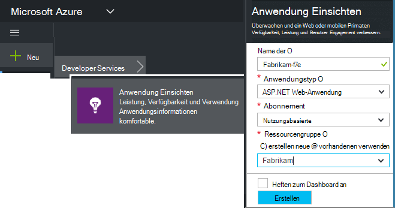
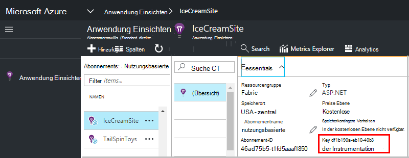

<properties 
    pageTitle="Erstellen eine neue Ressource der Anwendung Einsichten | Microsoft Azure" 
    description="Einrichten der Anwendung Einsichten Überwachung für eine neue live-Anwendung. Webbasierte Ansatz." 
    services="application-insights" 
    documentationCenter=""
    authors="alancameronwills" 
    manager="douge"/>

<tags 
    ms.service="application-insights" 
    ms.workload="tbd" 
    ms.tgt_pltfrm="ibiza" 
    ms.devlang="na" 
    ms.topic="article" 
    ms.date="08/26/2016" 
    ms.author="awills"/>

# Erstellen Sie eine Anwendung Einsichten Ressource

Visual Studio-Anwendung Einsichten zeigt Daten zu Ihrer Anwendung in einer Microsoft Azure- *Ressource*an. Erstellen einer neuen Ressource ist daher Teil des [Einrichtung Anwendung Einsichten zu eine neue Anwendung überwachen][start]. In vielen Fällen Dies kann automatisch von der IDE, und das ist die empfohlene Methode, wo es verfügbar ist. Aber in einigen Fällen eine Ressource manuell erstellt.

Nachdem Sie die Ressource erstellt haben, Sie dessen Instrumentation Schlüssel erhalten und verwenden, die das SDK in der Anwendung konfigurieren. Sendet die werden an der Ressource.

## Melden Sie sich bei Microsoft Azure

Wenn Sie ein [Microsoft-Konto, melden Sie sich jetzt](http://live.com)haben Sie noch nicht. (Wenn Sie Dienste wie Outlook.com, OneDrive, Windows Phone oder XBox Live verwenden, verfügen Sie bereits über ein Microsoft-Konto.)

Sie benötigen außerdem ein [Microsoft Azure](http://azure.com)-Abonnement. Wenn Ihr Team oder der Organisation ein Azure-Abonnement verfügt, kann der Besitzer Sie hinzufügen, mit Ihrer Windows Live ID an.

Oder erstellen Sie ein neues Abonnement. Kostenlose Konto können Sie alles in Azure versuchen. Nach Ablauf des Testzeitraums möglicherweise finden Sie das Abonnement je nach Bedarf berechnet entsprechende, wie Sie kostenlos Services in Rechnung gestellt wird nicht. 

Wenn Sie besitzen Zugriff auf ein Abonnement, melden Sie sich Anwendung Einsichten am [http://portal.azure.com](https://portal.azure.com), und verwenden Ihrer Live-ID anmelden.

## Erstellen Sie eine Anwendung Einsichten Ressource
  

Fügen Sie in der [portal.azure.com](https://portal.azure.com)eine Anwendung Einsichten Ressource hinzu:

* **Anwendungstyp** wirkt sich auf was Sie sehen, klicken Sie auf die Übersicht Blade- und die verfügbaren Eigenschaften im [metrischen Explorer][metrics]. Wenn Sie Ihre Typ der app nicht sehen, wählen Sie ASP.NET.
* **Ressourcengruppe** ist eine Vereinfachung für die Verwaltung von Eigenschaften wie Access-Steuerelement. Wenn Sie weitere Ressourcen Azure bereits erstellt haben, können Sie diese neue Ressource in derselben Gruppe gesetzt auswählen.
* **Abonnement** ist Ihr Zahlungskonto in Azure.
* **Speicherort** ist, in dem wir die Daten beibehalten. Zurzeit kann es nicht geändert werden.
* **Hinzufügen zu Startboard** verschoben Schnellzugriff Kacheln für die Ressource auf der Startseite von Azure. Empfohlen.

Wenn Ihre app erstellt wurde, wird ein neuer Blade geöffnet. Dies ist die Stelle, an der Sie Leistung und von Verwendungsdaten über Ihre app sehen. 

Abzurufenden zurück, um es beim nächsten Mal Login in Azure, suchen für Ihre app Schnellstart-Kachel auf dem Start Brett (Startseite). Oder klicken Sie auf Durchsuchen, um danach zu suchen.

## Kopieren Sie die Instrumentation-Taste

Die Taste Instrumentation identifiziert die Ressource, die Sie erstellt haben. Sie benötigen sie auf das SDK gewähren.

## Installieren Sie das SDK in Ihrer app

Installieren der Anwendung Einblicken SDK in Ihrer app. Dieser Schritt hängt stark von den Typ der Anwendung. 

Verwenden Sie die Instrumentation Taste so konfigurieren Sie [das SDK, die Sie in Ihrer Anwendung installieren][start].

Das SDK enthält standard-Module, die telemetrieprotokoll zu, ohne dass senden Sie keinen Code schreiben. Nachverfolgen von Aktionen des Benutzers oder diagnostizieren Probleme im Detail, [Verwenden Sie die API] [ api] , senden Ihre eigenen werden.

## Finden Sie unter werden Daten

Schließen Sie das Schnellstart Blade, um zu Ihrer Anwendung-vorher in Azure-Portal zurückzukehren.

Klicken Sie auf die Kachel Suche, um [Diagnostic Suche]finden Sie unter[diagnostic], die Stelle, an der die erste Ereignisse angezeigt wird. 

Wenn Sie weitere Daten erwartet haben, klicken Sie auf Aktualisieren nach ein paar Sekunden.

## Eine Ressource wird automatisch erstellt.

Sie können ein [PowerShell-Skript](app-insights-powershell-script-create-resource.md) , um eine Ressource automatisch erstellen schreiben.

## Nächste Schritte

* [Erstellen Sie ein dashboard](app-insights-dashboards.md)
* [Diagnose suchen](app-insights-diagnostic-search.md)
* [Kennzahlen durchsuchen](app-insights-metrics-explorer.md)
* [Schreiben Sie Analytics Abfragen](app-insights-analytics.md)

<!--Link references-->

[api]: app-insights-api-custom-events-metrics.md
[diagnostic]: app-insights-diagnostic-search.md
[metrics]: app-insights-metrics-explorer.md
[start]: app-insights-overview.md

 