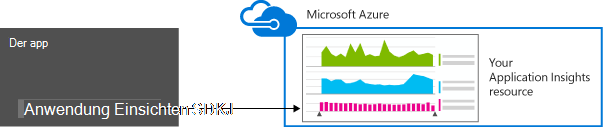
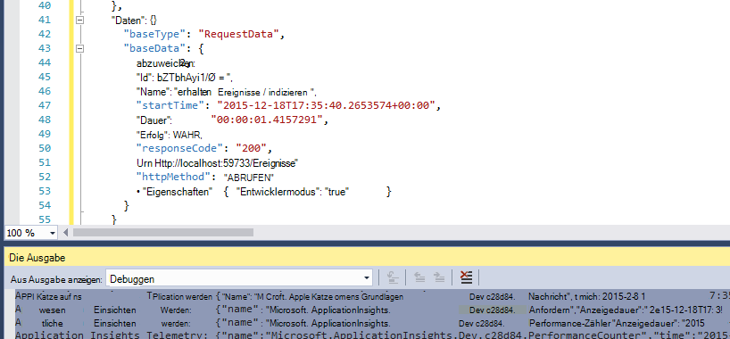
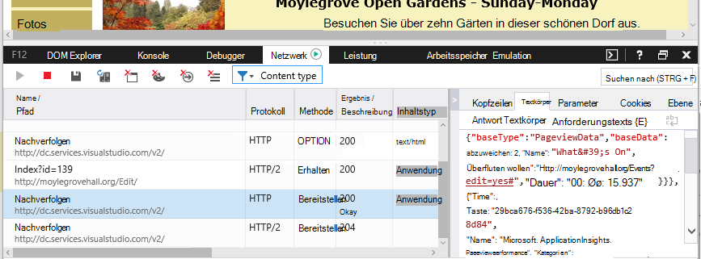

<properties 
    pageTitle="Daten Aufbewahrung und Speicher in der Anwendung Einsichten" 
    description="Aufbewahrung und Ihre Privatsphäre Informationsverwaltungsrichtlinien-Anweisung" 
    services="application-insights" 
    documentationCenter=""
    authors="alancameronwills" 
    manager="douge"/>

<tags 
    ms.service="application-insights" 
    ms.workload="tbd" 
    ms.tgt_pltfrm="ibiza" 
    ms.devlang="na" 
    ms.topic="article" 
    ms.date="05/17/2016" 
    ms.author="awills"/>

# Datensammlung, Aufbewahrung und Speicher in der Anwendung Einsichten 

*Anwendung Einsichten ist in der Vorschau.*

Bei der Installation von [Visual Studio-Anwendung Einsichten] [ start] SDK in Ihrer app, sendet es werden Informationen über Ihre app in der Cloud. Möchten natürlich verantwortlichen Entwickler wissen, welche Daten gesendet werden, was geschieht mit den Daten, und wie diese Steuerung es, dass genau. Insbesondere vertrauliche Daten gesendet werden konnten, dabei ist es gespeicherten und wie sicher ist es? 

Zunächst die kurze Antwort:

* Der standard werden Module, die "keine im Feld" mehr sind wahrscheinlich nicht sensible Daten mit dem Dienst zu senden. Die telemetrieprotokoll hat mit laden, Leistung und die Verwendung von Kriterien, Ausnahme Berichte und andere diagnostic Daten tun. Die Hauptfenster Benutzerdaten in den Diagnoseprotokollen Berichten sichtbar sind URLs; aber Ihre app dürfen nicht in jedem Fall vertrauliche Daten im nur-Text in einer URL setzen.
* Sie können Code schreiben, die zusätzliche benutzerdefinierte werden zur Unterstützung bei der Diagnose und Überwachung Verwendung sendet. (Diese Erweiterbarkeit ist ein großartiges Feature der Anwendung Einsichten.) Es wäre möglich, versehentlich, dieser Code schreiben, damit sie persönliche und andere vertrauliche Daten enthält. Wenn solche Daten Ihrer Anwendung zusammenarbeitet, sollten Sie signifikante überprüfen Prozesse an alle den Code anwenden, die Sie schreiben.
* Während der Entwicklung und Testen Ihre app, ist es einfach zu prüfen, welche vom SDK gesendet wird. Die Daten, die im Ausgabefenster Debuggen IDE und Browser wird angezeigt. 
* Die Daten werden in [Microsoft Azure](http://azure.com) -Servern in den USA gehalten. (Aber Ihre app überall ausführen kann.) Azure weist [hohe Sicherheit verarbeitet und eine Vielzahl von Compliance-Standards entspricht](https://azure.microsoft.com/support/trust-center/). Nur Ihnen und Ihrem Team vorgesehenen haben Zugriff auf Ihre Daten. Microsoft-Mitarbeiter können eingeschränkten Zugriff auf diese nur unter bestimmten eingeschränkten Umstände mit Ihrem Wissen verfügen. Es wird bei der Übertragung, aber nicht in den Servern verschlüsselt werden.

Im weiteren Verlauf dieses Artikels eingeführten ausführlicher auf diese Antworten näher ausgeführt. Dieses Konzept unabhängig sein, damit Sie es Kollegen anzeigen können, die Teil Ihres Teams nicht zur Verfügung.

## Was ist eine Anwendung Einsichten?

[Visual Studio-Anwendung Einsichten] [ start] Dienste von Microsoft, die Ihnen dabei hilft verbessern die Leistung und Nutzbarkeit von Ihrer Anwendung live ist. Darüber hinaus werden Ihrer Anwendung die Zeit, die sie während des Testens sowohl nach dem veröffentlicht haben oder es bereitgestellt ausgeführt wird, die überwacht. Anwendung Einsichten erstellt, Diagramme und Tabellen, die Ihnen, beispielsweise zeigen, welche Uhrzeiten Sie die meisten Benutzer erhalten, wie reagiert die app ist, und wie gut es von einem beliebigen externen Diensten bereitgestellt wird, die sie abhängig. Wenn abstürzen, Fehlern oder Leistungsprobleme vorhanden sind, können Sie durch die Daten werden im Detail, um die Ursache diagnostizieren suchen. Und der Dienst wird Sie e-Mails senden, wenn es alle Änderungen in der Verfügbarkeit und Leistung der app werden.

Um dieses Feature zu erhalten, installieren Sie eine Anwendung Einsichten SDK in Ihrer Anwendung, die Teil des Codes an. Wenn Ihre app ausgeführt wird, wird das SDK überwacht den Vorgang und werden in der Anwendung Einsichten Service sendet. Dies ist eine Cloud-Dienst von [Microsoft Azure](http://azure.com)gehostet wird. (Aber Anwendung Einsichten funktioniert für alle Applikationen, nicht nur diejenigen, die in Azure gehostet werden.)

Der Anwendung Einsichten Dienst speichert und analysiert die werden. Wenn Sie die Analyse oder Suchvorgang durch die gespeicherten werden angezeigt, melden Sie sich bei Ihrem Konto Azure und öffnen Sie die Anwendung Einsichten Ressource für eine Anwendung. Sie können auch Zugriff auf die Daten mit anderen Mitgliedern Ihres Teams oder mit angegebene Azure Abonnenten freigeben.

Sie können Daten aus dem Dienst Anwendung Einsichten exportiert werden, beispielsweise in eine Datenbank oder an externe Tools verwenden. Sie können die einzelnen Tools mit einem speziellen Schlüssel, den Sie vom Dienst erhalten ein. Die Taste kann bei Bedarf gesperrt werden. 

Anwendung Einsichten SDKs für einen Zellbereich Anwendungstypen verfügbar sind:-Webdienste gehostet werden, in Ihren eigenen J2EE oder ASP.NET-Servern oder in Azure; Web-Clients - d. h., den Code in eine Webseite ausgeführt; Desktop-apps und Dienste; wie Windows Phone, iOS und Android-Gerät-apps. Diese werden auf denselben Dienst zu senden.

## Welche Daten sammelt es?

### Was sind die Daten werden gesammelt?

Es gibt drei Datenquellen an:

* Im SDK, das Sie in der app integrieren [in der Entwicklung](app-insights-asp-net.md) oder [zur Laufzeit](app-insights-monitor-performance-live-website-now.md). Es gibt verschiedene SDKs für andere Anwendungstypen aus. Es gibt auch ein [SDK für Webseiten](app-insights-javascript.md), der in der Endbenutzer-Browser zusammen mit der Seite lädt.

 * Jede SDK verfügt über eine Anzahl von [Module](app-insights-configuration-with-applicationinsights-config.md), die verschiedene Verfahren zum Sammeln von verschiedenen Arten von telemetrieprotokoll verwenden.
 * Wenn Sie bei der Entwicklung des SDK installiert haben, können Sie seine API zum Senden Ihrer eigenen werden, zusätzlich zu den standardmäßigen Modulen verwenden. Diese benutzerdefinierten werden kann Daten enthalten, die Sie senden möchten.
* In einigen Webservern gibt es auch Agents, die entlang der app starten, und senden werden über CPU, Arbeitsspeicher und Netzwerk Belegung. Beispielsweise können Azure-virtuellen Computern, Docker Hosts und [J2EE-Servern](app-insights-java-agent.md) solche Agents sein.
* [Verfügbarkeit überprüft](app-insights-monitor-web-app-availability.md) werden Prozesse von Microsoft ausführen, die in regelmäßigen Abständen Anfragen an Ihre Web app. Die Ergebnisse werden an die Anwendung Einsichten-Dienst gesendet.

### Welche Arten von Daten gesammelt werden?

Die wichtigsten Kategorien sind:

* [Server-telemetrieprotokoll Web](app-insights-asp-net.md) - HTTP-Anfragen.  URI, Zeit zum Verarbeiten der Anforderung, Antwortcode, IP-Adresse. Id für eine Sitzung.
* [Webseiten](app-insights-javascript.md) - Seite, die Benutzer und Sitzung ermittelt. Seitenladezeiten. Ausnahmen. AJAX-Anrufe.
* Leistungsindikatoren - Speicher, CPU, EA, Netzwerk Belegung.
* Client- und Server Kontext - OS, Gebietsschema, Gerätetyp, Browser, Bildschirmauflösung.
* [Ausnahmen](app-insights-asp-net-exceptions.md) und Abstürzen - **Stapel bildet ab**, erstellen CPU-Typ-Id an. 
* [Abhängigkeiten](app-insights-asp-net-dependencies.md) - Aufrufe von externen Diensten wie REST, SQL, AJAX. URI oder die Verbindungszeichenfolge, Dauer, Erfolg, Befehl '.
* [Verfügbarkeit Tests](app-insights-monitor-web-app-availability.md) - Dauer testen und Schritte, Antworten.
* [Verfolgen von Protokollen](app-insights-search-diagnostic-logs.md) und [benutzerdefinierte werden](app-insights-api-custom-events-metrics.md) - **nichts, das Sie in Ihrem Protokolle oder werden Fehlercode**.

[Weitere Details](#data-sent-by-application-insights).

## Wie kann ich überprüfen, welche gesammelt werden?

Wenn Sie die app mit Visual Studio entwickeln sind, führen Sie die app im Debuggen-Modus (F5). Die telemetrieprotokoll wird im Ausgabefenster angezeigt. Hier können Sie es zu kopieren und formatieren Sie ihn als JSON für einfache Prüfung. 

Es gibt auch eine besser lesbare Ansicht im Fenster Diagnose.

Öffnen Sie für Webseiten den Druckbefehl des Browsers Debuggen Fenster.

### Kann ich Schreiben von Code, um die werden zu filtern, bevor sie gesendet werden?

Dies wäre möglich handschriftlich ein [werden Prozessor-Plug-in](app-insights-api-filtering-sampling.md).

## Wie lange bleibt die Daten? 

Unformatierte Datenpunkte (d. h., Elemente, die Sie in den Diagnoseprotokollen Suche prüfen können) werden sieben Tage lang aufbewahrt. Wenn Sie länger als die Daten beibehalten müssen, können Sie [fortlaufender exportieren](app-insights-export-telemetry.md) , um ihn zu einem Speicherkonto zu kopieren.

Aggregierte Daten (d. h., zählt, Mittelwerte und andere statistischen Daten, die Sie im Explorer Metrisch angezeigt) werden am Korns von 1 Minute 30 Tage und 1 Stunde oder 1 Tag (je nach Typ) für mindestens 90 Tage lang aufbewahrt.

## Wer kann die Daten zugreifen?

Die Daten für Sie sichtbar ist, und wenn Sie ein Konto Organisation, Ihre Teammitglieder haben. 

Sie können exportiert werden, indem Sie und Ihre Teammitglieder konnte werden an anderen Speicherorten kopiert und an andere Personen weitergegeben werden.

#### Welche Funktion hat Microsoft mit den Informationen?, meine app zu Anwendung Einsichten sendet

Microsoft verwendet die Daten nur akzeptieren, um den Dienst zur Verfügung stellen.

## Wo ist die Daten gespeichert? 

* In den USA. 

#### Können sie einem anderen Ort, beispielsweise in Europa werden gespeichert? 

* Nicht bei präsentieren. 

#### Bedeutet dies, dass meine app in den USA gehostet werden muss?

* Nein. Ihrer Anwendung kann, die überall in Ihrem eigenen lokalen Hosts oder in der Cloud ausgeführt werden.

## Wie sicher ist meine Daten?  

Anwendung Einsichten ist eine Azure-Dienst in der Vorschau an. Während in der Vorschau wir arbeiten in Richtung Schutz Ihrer Daten pro die Richtlinien des [Azure-Sicherheit, Datenschutz, und Compliance-Whitepaper](http://go.microsoft.com/fwlink/?linkid=392408)beschrieben.

Die Daten werden in Microsoft Azure-Server gespeichert. Für Konten im Portal Azure werden Konto Einschränkungen im [Azure-Sicherheit, Datenschutz, und Compliance-Dokument](http://go.microsoft.com/fwlink/?linkid=392408)beschrieben. Gilt für das Dokument [Visual Studio Team Services Datenschutz](http://download.microsoft.com/download/8/E/E/8EE6A61C-44C2-4F81-B870-A267F1DF978C/MicrosoftVisualStudioOnlineDataProtection.pdf) für Konten im Visual Studio Team-Portal. 

Zugriff auf Ihre Daten von Microsoft Personal ist eingeschränkt. Wir Zugriff auf Ihre Daten nur in Verbindung mit der Berechtigung und wenn es zur Unterstützung der Anwendung Einsichten erforderlich ist. 

Daten in Aggregat für unsere Kunden Webanwendungen (z. B. Daten Sätzen und die durchschnittliche Größe von Spuren) werden verwendet, um die Anwendung Einsichten zu verbessern.

#### Meine Daten Anwendung Einsichten konnte Person werden beeinträchtigen?

Diese konnte zusätzliche werden bei Ihrem Konto senden, mit der Instrumentation-Taste, die in den Code Ihrer Webseiten gefunden werden kann. Mit genügend zusätzlichen Daten enthält würde metrischen nicht korrekt Leistung und die Verwendung Ihrer app dar.

Wenn Sie Code für andere Projekte freigeben, müssen Sie den Key Instrumentation entfernen.

## Werden die Daten werden verschlüsselt? 

Innerhalb der Server zurzeit nicht.

Alle Daten werden verschlüsselt, wie es zwischen Data Center ausgeführt werden.

#### Werden die Daten im Übergang von meiner Anwendung zu Anwendung Einsichten Servern werden verschlüsselt?

Verwenden Sie Ja, Https zum Senden von Daten aus nahezu alle SDK, einschließlich Webservern, Geräte und Webseiten HTTPS-Portal. Die einzige Ausnahme ist von einfarbigen HTTP-Webseiten gesendeten Daten. 

## Personally Identifiable Information

#### Personenbezogene Informationen (PII) konnte Anwendung Einsichten gesendet werden? 

Ja, ist es möglich. 

Als allgemeinen Leitfaden:

* Die meisten standardmäßigen werden (d. h., ohne dass Sie das Schreiben von Code gesendet werden) nicht explizit PII enthält. Jedoch möglicherweise es möglich, um Einzelpersonen durch Rückschluss aus einer Sammlung von Ereignissen zu identifizieren.
* Ausnahme und Spur Nachrichten konnte PII enthalten.
* Benutzerdefinierte werden – d. h., Anrufe wie TrackEvent, den Sie mit der API oder Log auf Code schreiben - kann Daten enthalten, die Sie auswählen.

Die Tabelle am Ende dieses Dokuments enthält ausführliche Beschreibungen der gesammelten Daten.

#### Bin ich zur Einhaltung von Gesetzen und Vorschriften hinsichtlich der PII verantwortlich?

Ja. Es ist sicherstellen, dass Sie sicherstellen, dass die Sammlung und Verwendung von Daten – Konformität von Gesetzen und Vorschriften und zu den Microsoft Online Services Konditionen.

Sie sollten Ihre Kunden entsprechend informieren Sie über die Daten, die Ihrer Anwendung gesammelt und wie die Daten verwendet werden.

#### Werden meine Benutzer können Anwendung Einsichten deaktiviert?

Nicht direkt. Wir angeben keinen Schalter, den Ihre Benutzer arbeiten können, deaktivieren Sie die Anwendung Einsichten.

Sie können jedoch diese Funktion in der Anwendung implementieren. Alle SDKs enthalten eine API-Einstellung, die Websitesammlung werden deaktiviert. 

#### Meine Anwendung wird unbeabsichtigt vertraulichen Informationen sammeln. Können Anwendung Einblicke in Daten zu bereinigen, damit es nicht übernommen wird?

Anwendung Einsichten nicht filtern oder Löschen von Daten. Verwalten die Daten entsprechend, und vermeiden Sie solche Daten zu Anwendung Einsichten senden.

## Durch die Anwendung Einsichten gesendeten Daten

Die SDKs zwischen Plattformen variieren, und es gibt mehrere Komponenten sind, die Sie installieren können. ( [Anwendung Einsichten - erste Schritte]finden Sie unter[start].) Jede Komponente sendet unterschiedliche Daten.

#### Klassen von Daten in anderen Szenarien gesendet werden

Die Aktion  | Datenklassen gesammelt (siehe nächsten Tabelle)
---|---
[Hinzufügen von Anwendung Einsichten SDK zu einem .NET Web-Projekt][greenbrown] | ServerContext Abgeleitet Leitungsindikatoren Besprechungsanfragen **Ausnahmen** Sitzung Benutzer
[Installieren von Statusmonitor auf IIS][redfield]|Abhängigkeiten ServerContext Abgeleitet Leitungsindikatoren
[Hinzufügen von Anwendung Einsichten SDK zu einer Java Web app][java]|ServerContext Abgeleitet Anfordern Sitzung Benutzer
[Hinzufügen von JavaScript SDK zu Webseite][client]|ClientContext  Abgeleitet Seite ClientPerf AJAX
[Definieren von Standardeigenschaften][apiproperties]|**Eigenschaften** für alle Standard- und benutzerdefinierte Ereignisse
[Anruf TrackMetric][api]|Numerische Werte **Eigenschaften**
[Rufen Sie nachverfolgen *][api]|Name des Ereignisses **Eigenschaften**
[Anruf TrackException][api]|**Ausnahmen** Stapelabbild **Eigenschaften**
SDK kann keine Daten sammeln. Zum Beispiel:   -Leitungsindikatoren kann nicht zugegriffen werden.  -Ausnahme in telemetrieprotokoll Initialisierung | SDK-Diagnose
 

Für [SDKs für andere Plattformen][platforms], finden Sie in ihren Dokumenten.

#### Die Klassen der gesammelten Daten

Verzicht gesammelten Daten | Enthält (keine vollständige Liste) 
---|---
**Eigenschaften**|**Daten - durch den Code bestimmt**
DeviceContext |-ID, IP, Gebietsschema, Gerätemodell, Netzwerk, Typ des Netzwerks, OEM-Name, Bildschirmauflösung, Instanz der Rolle, Rollenname, Typ Gerät
ClientContext |OS, Gebietsschema, Sprache, Netzwerk und Fenster Auflösung
Sitzung | Id für eine Sitzung
ServerContext |Name des Computers, Gebietsschema, OS, Gerät, Sitzung Benutzers, Kontext des Benutzers, Vorgang 
Abgeleitet |Geo Speicherort von IP-Adresse, Zeitstempel, OS, browser
Kennzahlen | Metrische Namen und den Wert
Ereignisse | Name des Ereignisses und Wert
PageViews | Seite und URL-Namen oder die Namen des Bildschirms
Client perf | URL-Seite Name, Browser Laden Zeit
AJAX | HTTP-Aufrufe von einer Webseite auf dem server
Besprechungsanfragen |URL, Dauer, Antwortcode
Abhängigkeiten|Typ (SQL, HTTP,...), Verbindungszeichenfolge oder URI, synchronisieren/asynchrone, Dauer, Erfolg, SQL-Anweisung (mit dem Status Monitor)
**Ausnahmen** | Typ, **Nachrichten**, Anruf Stapel, Quelle Dateiname und die Zeilennummer Zahl und Thread-id
Stürzt ab | Prozess-Id, die Id des übergeordneten Prozess, Absturz Thread-Id; Anwendung Patch-Id, erstellen;  Typ der Ausnahme, Adresse, Grund; verborgene Symbole und Schieber, binäre Start- und Adressen, binäre Name und Pfad, CPU-Typ
Spur | **Nachricht** und schwere Ebene
Leitungsindikatoren | CPU-Zeit, verfügbaren Arbeitsspeicher, Rate Anfragen, Ausnahme Zins, privaten Bytes, EA Zins, Dauer der Anfrage, Länge der Warteschlange anfordern
Verfügbarkeit | Web Test Antwortcode, Dauer jedes Testschritt, Testnamen, Zeitstempel, Erfolg, Reaktionszeiten, Test-Speicherort
SDK-Diagnose | Spur Nachricht oder eine Ausnahme 

Sie können [schalten Sie einige der Daten durch Bearbeiten ApplicationInsights.config][config]

## Gutschriften

Dieses Produkt enthält GeoLite2 Daten MaxMind, stellt [http://www.maxmind.com](http://www.maxmind.com)erstellt.

## Videos

#### Einführung

> [AZURE.VIDEO application-insights-introduction]

#### Erste Schritte

> [AZURE.VIDEO getting-started-with-application-insights]

<!--Link references-->

[api]: app-insights-api-custom-events-metrics.md
[apiproperties]: app-insights-api-custom-events-metrics.md#properties
[client]: app-insights-javascript.md
[config]: app-insights-configuration-with-applicationinsights-config.md
[greenbrown]: app-insights-asp-net.md
[java]: app-insights-java-get-started.md
[platforms]: app-insights-platforms.md
[pricing]: http://azure.microsoft.com/pricing/details/application-insights/
[redfield]: app-insights-monitor-performance-live-website-now.md
[start]: app-insights-overview.md

 