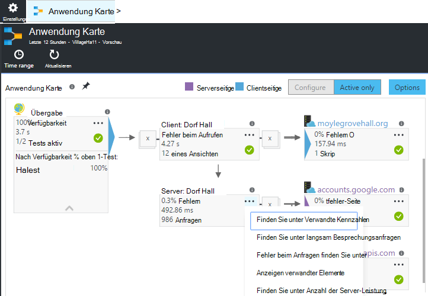
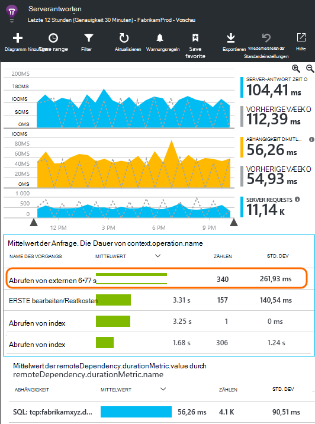
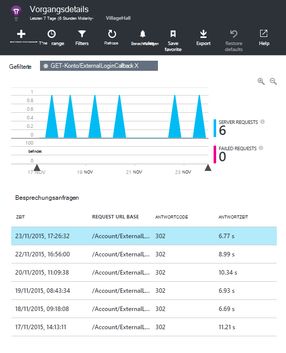
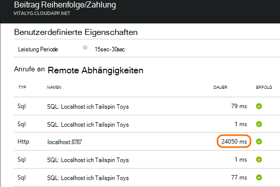
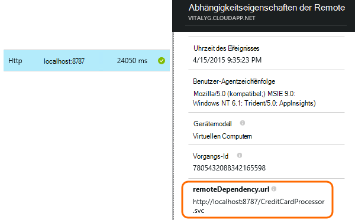
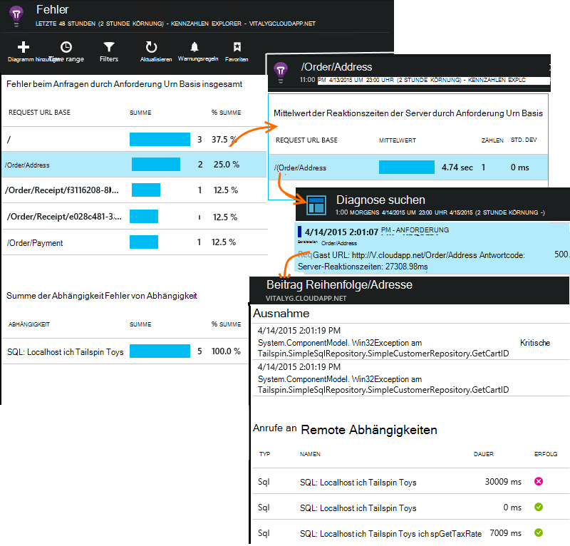

<properties 
    pageTitle="Diagnose von Problemen mit Abhängigkeiten in Anwendung Einsichten" 
    description="Suchen nach Fehlern und so die Leistung von Abhängigkeiten verursacht" 
    services="application-insights" 
    documentationCenter=""
    authors="alancameronwills" 
    manager="douge"/>

<tags 
    ms.service="application-insights" 
    ms.workload="tbd" 
    ms.tgt_pltfrm="ibiza" 
    ms.devlang="na" 
    ms.topic="article" 
    ms.date="05/12/2016" 
    ms.author="awills"/>
 
# <a name="diagnosing-issues-with-dependencies-in-application-insights"></a>Diagnose von Problemen mit Abhängigkeiten in Anwendung Einsichten


Eine *Abhängigkeit* ist eine externe Komponente, die von der app aufgerufen wird. Es ist in der Regel ein Dienst namens mithilfe des HTTP, einer Datenbank oder einem Dateisystem. Oder in Ihrem Skript Webseite kann es sich um eine AJAX-Anruf auf dem Server zurück. In Visual Studio-Anwendung Einblicken können Sie leicht erkennen, wie lange eine Anwendung auf Abhängigkeiten wartet und wie oft ein Anruf Abhängigkeit schlägt fehl.

## <a name="where-you-can-use-it"></a>Wo Sie es verwenden können

Abhängigkeit Überwachung ist im Paket derzeit verfügbar:

* ASP.NET Web apps und Dienste, die auf einem IIS-Server oder auf Azure ausgeführt
* [Java Web apps](app-insights-java-agent.md)
* [Webseiten](https://azure.microsoft.com/blog/ajax-collection-in-application-insights/)

Für andere Typen, wie z. B. Gerät apps können Sie Ihre eigenen Monitor mithilfe der [TrackDependency-API](app-insights-api-custom-events-metrics.md#track-dependency)schreiben.

Der Monitor Abhängigkeit von Out-of-Box-Berichte aktuell Anrufe an folgenden Typen von Abhängigkeiten:

* ASP.NET
 * SQL-Datenbanken
 * ASP.NET-Web und WCF-Dienste, die HTTP-basierte Bindungen verwenden
 * Lokale oder remote HTTP-Aufrufe
 * Azure DocumentDb, Tabelle, Blob-Speicher und Warteschlange
* Java
 * Anrufe in einer Datenbank über [-](http://docs.oracle.com/javase/7/docs/technotes/guides/jdbc/) Treiber, z. B. MySQL, SQL Server, PostgreSQL oder SQLite.
* Webseiten
 * [AJAX-Aufrufe](app-insights-javascript.md)

Erneut, Sie können eigene SDK-Anrufe an andere Abhängigkeiten überwachen schreiben.

## <a name="to-set-up-dependency-monitoring"></a>Einrichten der Überwachung Abhängigkeit

Installieren Sie den entsprechenden Agent für Hostserver.

Plattform | Installieren
---|---
IIS-Server | Entweder [Status Monitor auf dem Server installieren](app-insights-monitor-performance-live-website-now.md) oder [Aktualisieren Ihrer Anwendung in .NET Framework 4.6 oder höher](http://go.microsoft.com/fwlink/?LinkId=528259) und Installieren der [Anwendung Einsichten SDK](app-insights-asp-net.md) in Ihrer app.
Azure Web App | [Anwendung Einsichten Erweiterung](app-insights-azure-web-apps.md)
Java-Webserver | [Java Web apps](app-insights-java-agent.md)
Webseiten | [Überwachen von JavaScript](app-insights-javascript.md) (Keine zusätzliche Setup über Webseite Überwachung hinaus)
Azure-Cloud-Dienst |  [Verwenden Sie beim Start Vorgang](app-insights-cloudservices.md#dependencies) oder eine [installieren .NET Framework 4.6 +](../cloud-services/cloud-services-dotnet-install-dotnet.md)  

Überwachen des IIS-Servern benötigten nicht zu Ihrem Quellprojekt mit der Anwendung Einsichten SDK Quelltabelle. 

## <a name="application-map"></a>Anwendung Karte

Zuordnen der Anwendung fungiert als eine visuelle Hilfe zum Ermitteln von Abhängigkeiten zwischen den Komponenten der Anwendung. 



Aus den Feldern können Sie relevante Abhängigkeit und anderen Diagrammen navigieren.

Klicken Sie auf den kleinen [X], um eine Teilstruktur zu reduzieren.

PIN der Karte, um dem [Dashboard](app-insights-dashboards.md), wo er voll funktionsfähige angezeigt wird.

[Erfahren Sie mehr](app-insights-app-map.md).

## <a name="diagnosis"></a>Analyse von Leistungsproblemen im Webserver Abhängigkeit

Um die Leistung der auf dem Server Anfragen zu bewerten:


Ausführen eines Bildlaufs nach unten bis zum wollen das Raster der Anfragen:



Der oberste Eintrag ist sehr lange dauert. Sehen Sie, ob wir die Stelle, an der das investierte Zeit ist herausfinden können.

Klicken Sie auf die Zeile, um einzelne Anforderung Ereignisse finden Sie unter:




Klicken Sie auf eine beliebige langer-Instanz, um weitere zu prüfen.

> [AZURE.NOTE] Blättern Sie ein bisschen eine Instanz aus. Wartezeit der Verkaufspipeline bedeutet möglicherweise, dass die Daten für die obersten Instanzen unvollständig ist.

Ausführen eines Bildlaufs nach unten bis zum remote Abhängigkeit Anrufe im Zusammenhang mit dieser Anforderung:



Es sieht so aus, wie die meisten der Zeit zu bedienen, die diese Anforderung einen Anruf bei einem lokalen Dienst aufgewendet wurde. 

Wählen Sie die Zeile, um weitere Informationen zu erhalten:




Die Details enthält genügend Informationen, um das Problem zu diagnostizieren.


## <a name="failures"></a>Fehler

Treten Fehler beim Besprechungsanfragen, klicken Sie auf das Diagramm.


Klicken Sie auf, bis eine Anforderungstyp und Anforderungsinstanz, einen Fehler beim Anruf an eine remote Abhängigkeit finden.





## <a name="custom-dependency-tracking"></a>Benutzerdefinierte Abhängigkeit nachverfolgen

Das Nachverfolgen von Abhängigkeit Standardmodul erkennt automatisch externe Abhängigkeiten z. B. Datenbanken und REST-APIs. Jedoch sollten Sie einige zusätzlichen Komponenten auf die gleiche Weise behandelt werden sollen. 

Sie können Code schreiben, die Informationen zur Abhängigkeit, sendet mithilfe derselben [TrackDependency-API](app-insights-api-custom-events-metrics.md#track-dependency) , die von der standard-Module verwendet wird.

Beispielsweise, wenn Sie den Code mit Baugruppen, die Sie sich geschrieben haben erstellen selbst, können Sie Zeit alle Anrufe an, um herauszufinden, welche Beitrag, den sie Ihre Reaktionszeiten ist. Um diese Daten in Diagrammen Abhängigkeit der Anwendung Einsichten angezeigt haben, senden sie unter Verwendung `TrackDependency`.

```C#

            var success = false;
            var startTime = DateTime.UtcNow;
            var timer = System.Diagnostics.Stopwatch.StartNew();
            try
            {
                success = dependency.Call();
            }
            finally
            {
                timer.Stop();
                telemetry.TrackDependency("myDependency", "myCall", startTime, timer.Elapsed, success);
            }
```

Wenn Sie das standardmäßige Abhängigkeit Verlauf Modul zu wechseln möchten, entfernen Sie den Bezug auf DependencyTrackingTelemetryModule in [ApplicationInsights.config](app-insights-configuration-with-applicationinsights-config.md).


## <a name="ajax"></a>AJAX

Siehe [Webseiten](app-insights-javascript.md).


 