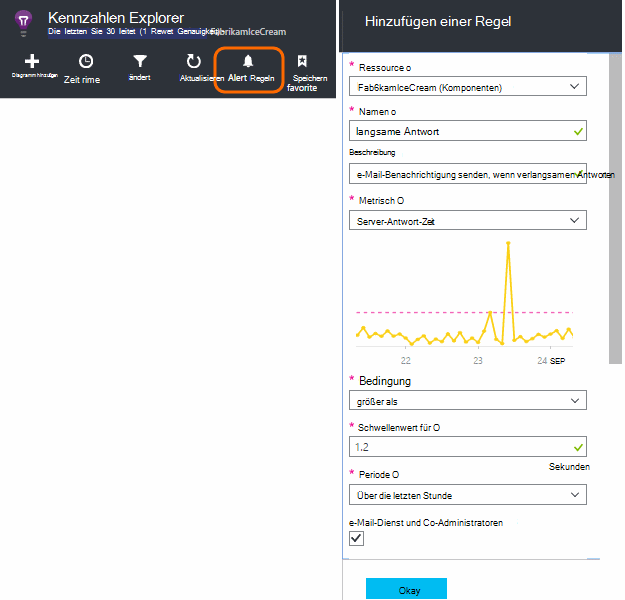
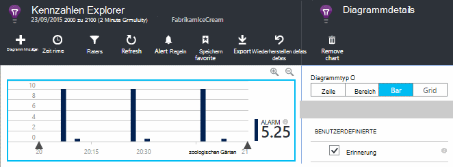
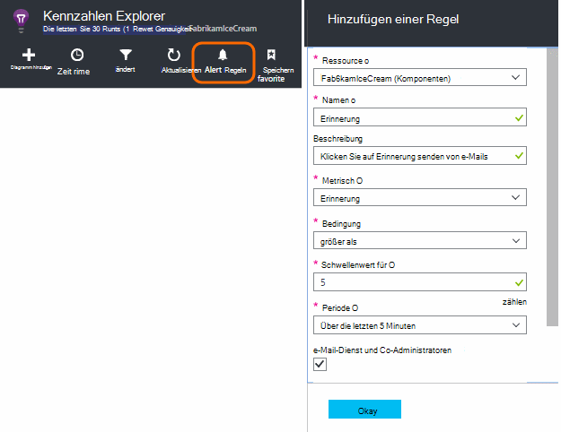
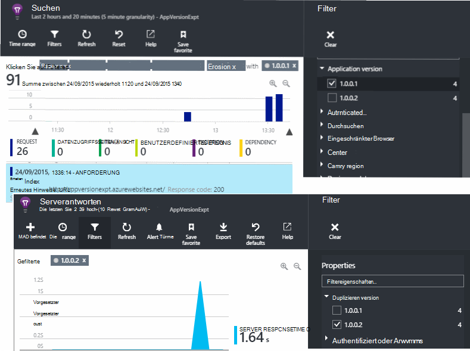
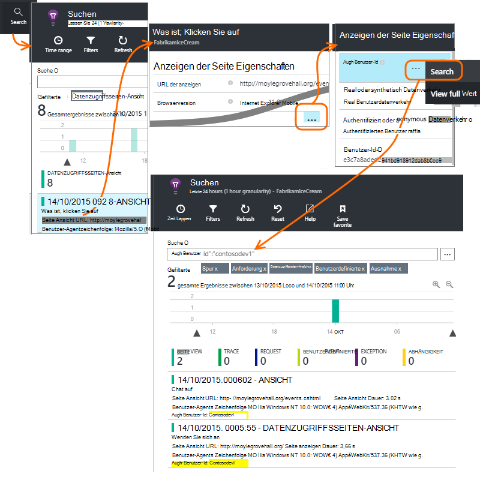
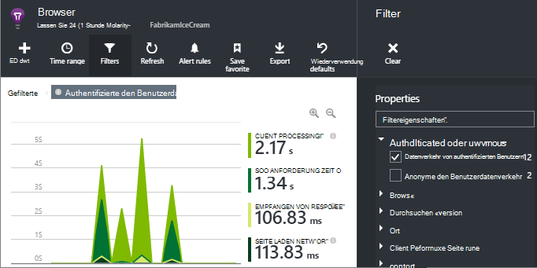
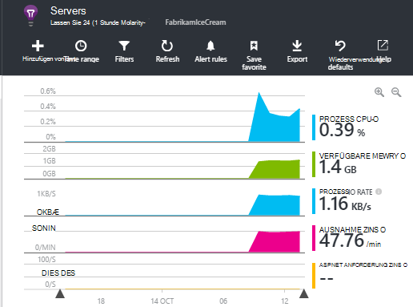

<properties 
    pageTitle="Wie kann ich... in Anwendung Einsichten | Microsoft Azure" 
    description="Häufig gestellte Fragen in Anwendung Einsichten." 
    services="application-insights" 
    documentationCenter=""
    authors="alancameronwills" 
    manager="douge"/>

<tags 
    ms.service="application-insights" 
    ms.workload="tbd" 
    ms.tgt_pltfrm="ibiza" 
    ms.devlang="na" 
    ms.topic="article" 
    ms.date="02/05/2016" 
    ms.author="awills"/>

# <a name="how-do-i--in-application-insights"></a>Wie kann ich... in Anwendung Einsichten?

## <a name="get-an-email-when-"></a>E-Mail senden Wenn...

### <a name="email-if-my-site-goes-down"></a>Per e-Mail senden Sie, wenn meine Website nach unten wechselt

Festlegen einer [Web Verfügbarkeit zu testen](app-insights-monitor-web-app-availability.md).

### <a name="email-if-my-site-is-overloaded"></a>Per e-Mail senden Sie, wenn meine Website überlastet ist

Festlegen einer [Benachrichtigung](app-insights-alerts.md) termingerecht **Antwort Server**an. Ein Schwellenwert zwischen 1 und 2 Sekunden sollte funktionieren.



Ihre app möglicherweise auch Vorzeichen der Belastung anzeigen, indem Fehlercodes zurückgegeben. Festlegen einer Benachrichtigung bei **fehlgeschlagen Anfragen**an.

Wenn Sie eine Warnung für **Serverausnahmen**festlegen möchten, müssen Sie [einige zusätzliche Einrichtungsschritte](app-insights-asp-net-exceptions.md) ausführen, um die Daten anzuzeigen.

### <a name="email-on-exceptions"></a>Klicken Sie auf Ausnahmen per e-Mail

1. [Einrichten von Ausnahme für die Überwachung](app-insights-asp-net-exceptions.md)
2. Klicken Sie auf die Ausnahme zählen Metrik [eine Benachrichtigung festlegen](app-insights-alerts.md)


### <a name="email-on-an-event-in-my-app"></a>Klicken Sie auf ein Ereignis in Meine app per e-Mail

Nehmen wir an, dass Sie verwenden möchten, können Sie eine e-Mail zu gelangen, wenn ein bestimmtes Ereignis eintritt. Anwendung nicht Einblicke diese Funktion direkt, aber sie können [eine Benachrichtigung, wenn eine Metrik einen Schwellenwert überschreitet](app-insights-alerts.md). 

Benachrichtigungen können auf [benutzerdefinierte Metrik](app-insights-api-custom-events-metrics.md#track-metric), jedoch keine benutzerdefinierten Ereignisse festgelegt werden. Schreiben von entsprechendem Code, um eine Metrik zu erhöhen, wenn das Ereignis eintritt:

    telemetry.TrackMetric("Alarm", 10);

oder:

    var measurements = new Dictionary<string,double>();
    measurements ["Alarm"] = 10;
    telemetry.TrackEvent("status", null, measurements);

Da Benachrichtigungen zwei Zustände haben, müssen Sie einen niedrigen Wert zu senden, wenn Sie die Benachrichtigung beendet haben berücksichtigen:

    telemetry.TrackMetric("Alarm", 0.5);

Erstellen eines Diagramms in [metrischen Explorer](app-insights-metrics-explorer.md) , um Ihre Erinnerung anzuzeigen:



Festlegen Sie eine Warnung ausgelöst, wenn die Metrik über einen Teil Wert für kurze Zeit wechselt jetzt:




Festlegen von dieser Periode auf ein Minimum. 

Wenn die Metrik oberhalb wechselt und unterhalb des Grenzwerts, erhalten Sie e-Mails.

Einige Punkte zu beachten:

* Eine Warnung weist zwei Zustände ("Benachrichtigung" und "fehlerfrei"). Nur bei eine Metrik eingeht, wird der Status ausgewertet.
* Eine e-Mail-Nachricht wird nur gesendet, wenn der Status ändert. Warum müssen Sie beide hoher senden und geringem Wert Kennzahlen hier. 
* Wenn Sie die Benachrichtigung ausgewertet werden soll, wird der Mittelwert der empfangenen Werte im vorherigen Zeitraum übernommen. In diesem Fall jedes Mal, wenn eine Metrik eingeht, sodass e-Mails häufiger als Periode gesendet werden können, die Sie festlegen.
* Da e-Mails sowohl auf "Benachrichtigung" und "fehlerfrei" gesendet werden, sollten Sie erwägen, denken erneut das einmalige Ereignis als zwei Status Bedingung. Angenommen, statt eines Ereignisses "Job abgeschlossen", verfügen über eine Bedingung "Job in Bearbeitung", erhalten Sie e-Mails am Anfang und Ende eines Projekts.

### <a name="set-up-alerts-automatically"></a>Einrichten von Benachrichtigungen automatisch

[Verwenden Sie zum Erstellen neuer Benachrichtigungen PowerShell](app-insights-alerts.md#set-alerts-by-using-powershell)

## <a name="use-powershell-to-manage-application-insights"></a>Verwenden Sie zum Verwalten der Anwendung Einsichten PowerShell

* [Erstellen Sie neue Ressourcen](app-insights-powershell-script-create-resource.md)
* [Neue Benachrichtigungen erstellen](app-insights-alerts.md#set-alerts-by-using-powershell)

## <a name="application-versions-and-stamps"></a>Anwendungsversionen und Stempel

### <a name="separate-the-results-from-dev-test-and-prod"></a>Trennen Sie die Ergebnisse von Entwickler, testen und prod

* Richten Sie für verschiedene Environmnents unterschiedliche ikeys
* Für verschiedene Stempel (Entwickler, testen, prod) die werden mit verschiedenen Immobilienwerte kategorisieren

[Weitere Informationen](app-insights-separate-resources.md)
 

### <a name="filter-on-build-number"></a>Filter in einem Build-Nummer

Wenn Sie eine neue Version der app veröffentlichen, sollten Sie die werden vom unterschiedliche Versionen trennen können.

Sie können die Version der Anwendung Eigenschaft [Suchen](app-insights-diagnostic-search.md) und [metrischen Explorer](app-insights-metrics-explorer.md) Ergebnisse Filtern von festlegen. 




Es gibt verschiedene Methoden der Version der Anwendung Eigenschaft aus.

* Legen Sie direkt:

    `telemetryClient.Context.Component.Version = typeof(MyProject.MyClass).Assembly.GetName().Version;`

* Umbrechen von dieser Zeile in einer [Initialisierung werden](app-insights-api-custom-events-metrics.md#telemetry-initializers) , um sicherzustellen, dass alle Instanzen von TelemetryClient konsistent festgelegt sind.

* [ASP.NET] Legen Sie die Version in `BuildInfo.config`. Die Version aus dem BuildLabel Knoten übernehmen das Webmodul. Fügen Sie diese Datei in einem Projekt, und denken Sie daran, die Eigenschaft immer kopieren in die Lösung Explorer festlegen.

    ```XML

    <?xml version="1.0" encoding="utf-8"?>
    <DeploymentEvent xmlns:xsi="http://www.w3.org/2001/XMLSchema-instance" xmlns:xsd="http://www.w3.org/2001/XMLSchema" xmlns="http://schemas.microsoft.com/VisualStudio/DeploymentEvent/2013/06">
      <ProjectName>AppVersionExpt</ProjectName>
      <Build type="MSBuild">
        <MSBuild>
          <BuildLabel kind="label">1.0.0.2</BuildLabel>
        </MSBuild>
      </Build>
    </DeploymentEvent>

    ```
* [ASP.NET] Generieren Sie BuildInfo.config automatisch in MSBuild. Fügen Sie dazu ein paar Zeilen zu einer CSPROJ-Datei ein:

    ```XML

    <PropertyGroup>
      <GenerateBuildInfoConfigFile>true</GenerateBuildInfoConfigFile>    <IncludeServerNameInBuildInfo>true</IncludeServerNameInBuildInfo>
    </PropertyGroup> 
    ```

    Dadurch wird eine Datei namens *Ihr Projektname*generiert. BuildInfo.config. Veröffentlichungsprozesses umbenannt in BuildInfo.config.

    Die Bezeichnung voranbringen enthält einen Platzhalter (AutoGen_...) aus, wenn Sie mit Visual Studio erstellen. Aber wenn mit MSBuild erstellt, mit der richtigen Versionsnummer ausgefüllt.

    Damit um MSBuild Versionsnummern generieren zu können, legen Sie die Version wie `1.0.*` in AssemblyReference.cs

## <a name="monitor-backend-servers-and-desktop-apps"></a>Überwachen der Back-End-Server und desktop-apps

[Verwenden der Windows Server SDK Modul](app-insights-windows-desktop.md).


## <a name="visualize-data"></a>Visualisieren von Daten

#### <a name="dashboard-with-metrics-from-multiple-apps"></a>Dashboard mit Kennzahlen aus mehreren apps

* Passen Sie im [Explorer Metrisch](app-insights-metrics-explorer.md)Ihres Diagramms an, und speichern Sie sie als Favoriten. Auf dem Dashboard Azure angeheftet.


#### <a name="dashboard-with-data-from-other-sources-and-application-insights"></a>Dashboard mit Daten aus anderen Quellen und Einblicken Anwendung

* [Exportieren von werden auf Power BI](app-insights-export-power-bi.md). 

Oder

* Verwenden von SharePoint als Ihr Dashboard, Anzeigen von Daten in SharePoint-Webparts. [Fortlaufender exportieren und Stream Analytics zum Exportieren in SQL verwenden](app-insights-code-sample-export-sql-stream-analytics.md).  Verwenden von Power View Vorbereiten zum Untersuchen der Datenbank, und erstellen Sie ein SharePoint-Webpart für Power View vorbereiten.


<a name="search-specific-users"></a>
### <a name="filter-out-anonymous-or-authenticated-users"></a>Ausfiltern Sie anonymen oder einem authentifizierten Benutzer her

Wenn die Benutzer sich anmelden, können Sie die [Authentifizierte Benutzer-Id](app-insights-api-custom-events-metrics.md#authenticated-users)festlegen. (Es wird nicht automatisch erfolgen.) 

Anschließend können Sie:

* Suchen Sie auf bestimmte Benutzer-ids



* Kennzahlen für anonyme oder authentifizierte Benutzer filtern



## <a name="modify-property-names-or-values"></a>Ändern der Eigenschaftennamen oder Werte

Erstellen Sie einen [Filter](app-insights-api-filtering-sampling.md#filtering)ein. Auf diese Weise können Sie beim Ändern oder Filtern werden, bevor sie aus der app zu Anwendung Einsichten gesendet wird.

## <a name="list-specific-users-and-their-usage"></a>Liste für bestimmte Benutzer und deren Verwendung

Wenn Sie nur [für bestimmte Benutzer suchen](#search-specific-users)möchten, können Sie die [Authentifizierte Benutzer-Id](app-insights-api-custom-events-metrics.md#authenticated-users)festlegen.

Wenn Sie eine Liste der Benutzer mit Daten wie z. B. welche Seiten möchten betrachten Sie diese oder wie oft sie melden Sie sich, stehen Ihnen zwei Optionen zur Verfügung:

* Geeignete Tools zum Analysieren Ihrer Benutzerdaten dort [festlegen und die Benutzer-Id authentifiziert wurden](app-insights-api-custom-events-metrics.md#authenticated-users), [in eine Datenbank exportieren](app-insights-code-sample-export-sql-stream-analytics.md) und verwenden.
* Wenn Sie nur wenige Benutzer haben, senden Sie benutzerdefinierte Ereignisse oder Kennzahlen, die relevante Daten als den metrischen Wert oder ein Ereignis Namen, und Festlegen der Benutzer-Id als eine Eigenschaft aus. Ersetzen Sie den standardmäßigen JavaScript TrackPageView Anruf zum Analysieren von Seitenansichten. Verwenden Sie zum Analysieren von serverseitigen werden, eine Initialisierung werden alle Server werden die Benutzer-Id hinzu. Anschließend können Sie Kriterien filtern und Segment und Suchbegriffe auf die Benutzer-Id.


## <a name="reduce-traffic-from-my-app-to-application-insights"></a>Netzwerkverkehr aus meiner app zu Anwendung Einsichten reduzieren

* Deaktivieren Sie in [ApplicationInsights.config](app-insights-configuration-with-applicationinsights-config.md)alle Module, die Sie nicht benötigen, die solche der Leistung Zähler Collection aus.
* Verwenden Sie unter der SDK [werden und Filtern](app-insights-api-filtering-sampling.md) aus.
* Beschränken Sie die Anzahl der für jede Seitenansicht gemeldet Ajax-Aufrufe in Ihren Webseiten. In der Codeausschnitt nach `instrumentationKey:...` , einfügen: `,maxAjaxCallsPerView:3` (oder eine geeignete Zahl).
* Wenn Sie [TrackMetric](app-insights-api-custom-events-metrics.md#track-metric)verwenden, das Aggregat von Stapeln von metrischen Werte vor dem Senden des Ergebnis zu berechnen. Es gibt eine Überladung der TrackMetric(), die für die enthält.


Weitere Informationen zu [Preisgestaltung und Kontingente](app-insights-pricing.md).

## <a name="disable-telemetry"></a>Deaktivieren Sie werden

**Dynamisch beenden, und starten Sie** die Sammlung und Übertragung werden vom Server:

```

    using  Microsoft.ApplicationInsights.Extensibility;

    TelemetryConfiguration.Active.DisableTelemetry = true;
```


**Deaktivieren des ausgewählte standard Kollektoren** – beispielsweise Leistungsindikatoren, HTTP-Anfragen oder Abhängigkeiten - löschen oder kommentieren der entsprechenden Zeilen in [ApplicationInsights.config](app-insights-api-custom-events-metrics.md). Sie können beispielsweise so vorgehen, wenn Sie Ihre eigenen Daten TrackRequest senden möchten.


## <a name="view-system-performance-counters"></a>Systemleistungsindikatoren anzeigen

Zwischen der Metrik, die Sie im Explorer Kennzahlen anzeigen können, die sind einer Reihe von System-Datenquellen. Es gibt eine vordefinierte Blade mit dem Titel **Servern** , die mehrere Empfänger angezeigt werden.



### <a name="if-you-see-no-performance-counter-data"></a>Wenn Sie keine Leistung Zähler Daten nicht angezeigt

* **IIS-Server** auf Ihrem eigenen Computer oder auf einen virtuellen Computer. [Statusmonitor installieren](app-insights-monitor-performance-live-website-now.md). 
* **Azure Website** - Datenquellen nicht noch nicht unterstützt. Es gibt mehrere Kriterien, die Sie als standard Teil der Systemsteuerung Azure Website zugreifen können.
* **UNIX-Server** - [Collectd installieren](app-insights-java-collectd.md)

### <a name="to-display-more-performance-counters"></a>Leistungsindikatoren für mehr angezeigt werden.

* Zuerst [Fügen Sie ein neues Diagramm hinzu](app-insights-metrics-explorer.md) , und prüfen Sie, ob der Zähler in der Basic, festgelegt ist wir bieten.
* Wenn dies nicht der Fall ist, [Fügen Sie den Indikator aus, die vom Modul Zähler Leistung gesammelte Gruppe hinzu](app-insights-performance-counters.md).


