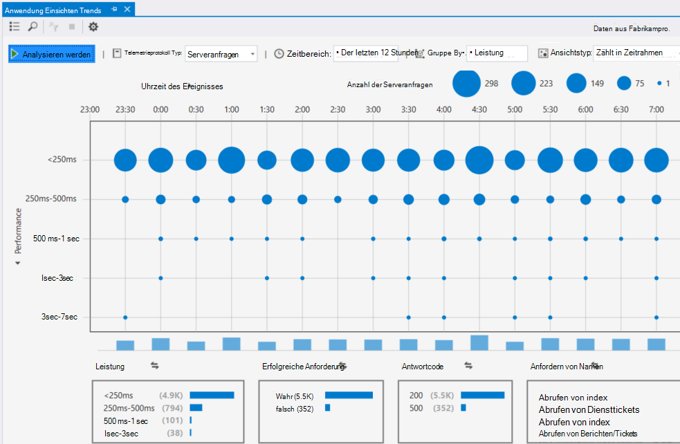

<properties 
    pageTitle="Anwendung Einsichten Lernprogramm | Microsoft Azure" 
    description="Nachverfolgen von Verwendung und Leistung der Webanwendung live.  Erkennen, zu Sichten und Diagnostizieren von Problemen. Kontinuierlich überwachen Sie und verbessern Sie Erfolg für Ihre Benutzer." 
    services="application-insights" 
    documentationCenter=""
    authors="alancameronwills" 
    manager="douge"/>

<tags 
    ms.service="application-insights" 
    ms.workload="tbd" 
    ms.tgt_pltfrm="ibiza" 
    ms.devlang="na" 
    ms.topic="article" 
    ms.date="10/15/2016" 
    ms.author="awills"/>
 
# Anwendung Einsichten - Einführung

Visual Studio-Anwendung Einsichten ist ein extensible Analytics-Dienst, der Ihre live Web-Anwendung überwacht. Mit können Sie erkennen und Leistungsprobleme zu diagnostizieren und verstehen, wie Benutzer mit der app tatsächlich Verfahren. Es ist für Entwickler, helfen Sie kontinuierlich Verbessern der Leistung und Nutzbarkeit konzipiert. Funktionsweise von apps auf einer Vielzahl von Plattformen einschließlich .NET, Node.js und J2EE, gehostet lokal oder in der Cloud. 

[Schauen Sie sich die Animation Einführung](https://www.youtube.com/watch?v=fX2NtGrh-Y0).

## Wie funktioniert dies?

Sie ein Paket kleine Instrumentation in Ihrer Anwendung installieren und Einrichten einer Anwendung Einsichten Ressource im Microsoft Azure-Portal. Die Ausstattung überwacht Ihre app und sendet Daten werden mit dem Portal. Das Portal statistischen Diagramme werden und bietet leistungsstarke Suchtools, um Ihnen helfen Probleme zu ermitteln.

Anwendung Einsichten verfügt über mehrere [standard Instrumentation Module](app-insights-configuration-with-applicationinsights-config.md) , die verschiedene Arten von werden wie Anforderung Reaktionszeiten, Ausnahmen und Abhängigkeit Anrufe zu sammeln. Sie können auch auf das Portal [Schreiben von Code, um benutzerdefinierte telemetrieprotokoll zu senden](app-insights-api-custom-events-metrics.md) .

### Was ist der Aufwand?

Die Auswirkung auf die Leistung Ihrer Anwendung ist sehr klein. Verlauf Anrufe werden werden nicht blockierenden, und zusammengefasst und in einem separaten Thread gesendet. 

## Was es?

Anwendung Einsichten richtet sich an das Entwicklungsteam, um Ihnen helfen zu verstehen, wie Ihre app ausführt, und wie sie verwendet wird. Es bietet:

Typen von werden:

* HTTP-Anforderung Sätzen Reaktionszeiten, Erfolg Sätzen.
* Abhängigkeit (HTTP & SQL) anrufen Sätzen, Reaktionszeiten, Erfolg Sätzen.
* Ausnahme Spuren von Server- und.
* Diagnoseprotokoll auf.
* Datenzugriffsseiten-Ansicht ermittelt Benutzer- und Sitzung zählt, wie schnell Browser geladen wird, werden Ausnahmen.
* AJAX-Anruf Sätzen, Reaktionszeiten und Erfolg Sätzen.
* Server-Datenquellen.
* Benutzerdefinierte Client und Server werden.
* Segmentierung von Client-Speicherort, Browserversion, Version des Betriebssystems, Server-Instanz, benutzerdefinierte Dimensionen und mehr.
* Verfügbarkeit von tests

Tools für Diagnose und analytischen:

* Intelligente und manuelle-Benachrichtigungen auf Fehler Sätze und anderer Größen, und klicken Sie auf Verfügbarkeit.
* Diagramme über einen Zeitraum von zusammengefasster Kennzahlen.
* Suchen Sie auf Instanzen von Besprechungsanfragen, Ausnahmen, benutzerdefinierte Ereignisse, Log Spuren, Seitenansichten, Abhängigkeit und AJAX-Aufrufe Diagnose. 
* Analytics - einer leistungsfähigen Abfragesprache über Ihre werden
* Dashboards - Verfassen Sie die Diagramme, müssen Sie alle Ihre app-Komponenten überwachen.

## Wie verwende ich sie?

### Monitor

Anwendung Einsichten in Ihrer Verfügbarkeit Webtests, richten Sie Web app installieren und:

* Richten Sie ein Dashboard für Ihr Team Raum Auge zu laden, Reaktionszeiten und die Leistung von Abhängigkeiten, Seite geladen und AJAX-Aufrufe beibehalten aus. 
* Erfahren Sie, welche die langsamste sind und die meisten fehlerhaften Anfragen.
* Sehen Sie Live-Streams, wenn Sie eine neue Version, eine Verschlechterung sofort kennen bereitstellen.

### Diagnostizieren

Beim erhalten einer Benachrichtigung oder ein Problem ermitteln:

* Zu koordinieren Sie Fehlern mit Ausnahmen, Abhängigkeit Anrufe und Spuren.
* Erkunden Sie Stapeldumps und Überwachungsprotokolle.

### Bewerten

Messen Sie die Effektivität jedes neue Features, die Sie bereitstellen.

* Planen von messen, wie Kunden neue UX oder Business-Funktionen verwenden.
* Schreiben Sie benutzerdefinierte werden in den Code die Anmeldung bei Verwendung.
* Als Grundlage für jeden Entwicklungszyklus auf Festplatte Beweisen aus werden.

## Erste Schritte

Anwendung Einsichten ist einer der vielen Dienste innerhalb von Microsoft Azure gehostet und werden es für die Analyse und die Präsentation gesendet. Daher müssen, bevor Sie irgendetwas anderes tun, benötigen ein Abonnement von [Microsoft Azure](http://azure.com). Zum Anmelden ist kostenlos, und wählen Sie die kostenlose [Preise Ebene](https://azure.microsoft.com/pricing/details/application-insights/) der Anwendung Einsichten. Wenn Ihre Organisation bereits über ein Abonnement verfügt, können sie Ihr Microsoft-Konto hinzufügen. 

Es gibt mehrere Methoden für den Einstieg. Beginnen Sie mit je nachdem, was für Sie am besten geeignet. Sie können die anderen später hinzufügen.

* **Zur Laufzeit: Instrumentieren Web app auf dem Server.** Vermieden werden alle aktualisieren, damit der Code ein. Sie benötigen Administratorzugriff auf dem Server.
 * [**IIS lokalen oder einer virtuellen Computers**](app-insights-monitor-performance-live-website-now.md)
 * [**Azure Web app oder virtueller Computer**](app-insights-monitor-performance-live-website-now.md#if-your-app-runs-as-an-azure-web-app)
 * [**J2EE**](app-insights-java-live.md)
* **Zum Zeitpunkt der Entwicklung: Anwendung Einsichten Code hinzugefügt.** Ermöglicht es Ihnen, Schreiben von benutzerdefinierten werden und Urkunde Back-End- und -desktop-apps.
 * [Visual Studio](app-insights-asp-net.md) 2013 Update 2 oder höher.
 * Java in ["Ellipse"](app-insights-java-eclipse.md) oder [andere tools](app-insights-java-get-started.md)
 * [Node.js](app-insights-nodejs.md)
 * [Andere Plattformen](app-insights-platforms.md)
* **[Ihren Webseiten Instrumentieren](app-insights-javascript.md)** für Seitenansicht, AJAX und andere clientseitige werden.
* **[Verfügbarkeit Tests](app-insights-monitor-web-app-availability.md)** - Pingen Ihrer Website regelmäßig von unseren Servern.

> [AZURE.NOTE]  Zu diesem Zeitpunkt vielleicht möchten Sie einfach auf erhalten und experimentieren. Lesen Sie weiter, wenn Sie möchten, finden Sie unter Anwendung Einsichten Möglichkeiten, jedoch...

## Kennzahlen durchsuchen

Führen Sie die app - entweder im Debuggen-Modus auf Ihrem Entwicklungscomputer oder durch die Bereitstellung an einem Server -, und verwenden sie für eine Weile. Klicken Sie dann auf das [Portal Azure](https://portal.azure.com)anmelden.

Navigieren Sie zu der app Anwendung Einsichten Übersicht Blade:

Übersicht über die können Sie sofort sehen, wie Ihre app ausführt. Sie können laden (im Hinblick auf Satz Anfragen) mit der Zeit Ihre app zu, um auf die Anfragen zu Antworten vergleichen. Ist eine einem zunehmenden Antwort Uhrzeit, wann die Laden nach oben wechselt, sollten Sie Ihre app Weitere Ressourcen zuordnen. Wenn sie weitere Fehlgeschlagene Antworten rechts angezeigt wird, nachdem Sie einen neuen Build bereitgestellt, sollten Sie zurückzusetzen.

#### Weitere Details

Klicken Sie auf, bis alle Diagramm, um eine noch detailliertere Diagramme zu erhalten. Beispielsweise führt das Zeit für die Antwort-Diagramm auf Diagramme, die Anforderung Sätze, Reaktionszeiten und Reaktionszeiten von Abhängigkeiten (d. h., Dienste, die Ihre app ruft) anzeigen.  

Das Diagramm Abhängigkeiten ist sinnvoll, da Sie ersehen, ob die Datenbanken und der REST-APIs, die Ihre app verwendet auch reagiert werden oder verspätungen verursachen kann.

#### Anpassen eines Diagramms

Versuchen Sie eine der folgenden Diagramme bearbeiten. Wenn Ihre Web app für eine Auflistung von Serverinstanzen ausgeführt wird, können Sie beispielsweise Reaktionszeiten auf die anderen Serverinstanzen vergleichen:

1. Zeigen Sie auf das Diagramm, und klicken Sie auf Bearbeiten.
2. Wählen Sie eine Metrik aus. Mehrere Kriterien in einem Diagramm, aber nur in bestimmten Kombinationen angezeigt werden können: Möglicherweise müssen Sie eine Metrik deaktivieren vor der Auswahl der gewünschten.
3. Formular mit Group By-segmentieren eine Metrik anhand einer Eigenschaft. In diesem Beispiel wird die separate Zeilen für verschiedene Reaktionszeiten angezeigt. 

    Beachten Sie, dass Sie eine gültige Eigenschaft für die Metrik auswählen müssen oder das Diagramm werden keine Daten angezeigt.
4. Wählen Sie einen Diagrammtyp aus. Fläche und Balkendiagrammen anzeigen eine gestapelte Anzeige geeignet, wenn der Aggregation 'Summe' ist.

[Weitere Informationen zum Kennenlernen Kennzahlen](app-insights-metrics-explorer.md).

## Instanz Suchen von Daten

Um ein Problem untersuchen möchten, empfiehlt sich die Ereignisinstanzen von bestimmter zu prüfen.

Klicken Sie auf, bis ein metrischen Diagramm Instanzdaten mit relevanten Filter und Zeitbereich durchsuchen. Klicken Sie zum Beispiel durch Server Anforderung zählt, um einzelne Anforderung Berichte anzuzeigen. 

Oder können Sie direkt an Daten einer Instanz von Suchen auf der Übersichtsseite:

Verwenden Sie Filter, um den Fokus auf bestimmte Typen von Ereignis und klicken Sie auf der ausgewählten Eigenschaftswerte:

Klicken Sie auf "...", um eine vollständige Liste der Eigenschaften finden Sie unter Aktivieren oder öffnen Sie andere Ereignisse im Zusammenhang mit der gleichen Anforderung. In diesem Beispiel weist die fehlgeschlagene Anforderung einen zugeordneten Ausnahmebericht:

Öffnen eines Ereignisses – in diesem Beispiel die verwandte Ausnahme - und Sie können dient (Wenn Sie Visual Studio Team Services verwenden, um Aufgaben zu verfolgen) erstellen. 
 

## Analytics

[Analytics](app-insights-analytics.md) ist ein sogar leistungsfähigeren suchen und Analyse Feature, in dem Sie SQL-ähnliche Abfragen über Ihre Daten werden entweder für bestimmte Probleme Aussehen oder statistische Informationen zusammenstellen geschrieben werden können.

Öffnen Sie das Lernprogramm Fenster, um anzuzeigen, und führen Sie die Beispiele für Abfragen über Ihre Daten oder Lesen Sie die länger [zusammengehörenden Exemplarische Vorgehensweise](app-insights-analytics-tour.md)zu. IntelliSense fordert Sie den Abfragen, die Sie verwenden können, und ein [Vollständiges Language Verweis](app-insights-analytics-reference.md)vorhanden ist. 

Abfragen werden in der Regel mit dem Namen eines Streams werden, wie Besprechungsanfragen, Ausnahmen oder Abhängigkeiten beginnen. POP öffnen die Schema-Leiste auf der linken Seite, um eine Liste der verfügbaren werden Streams anzuzeigen. Die Abfrage ist eine Verkaufspipeline von [Join-Abfrageoperationen](app-insights-analytics-reference.md#queries-and-operators) wie `where` - booleschen Filter - oder `project` – die neue Eigenschaften berechnet. `summarize`[Aggregate Instanzen](app-insights-analytics-tour.md#aggregate-groups-of-rows), Gruppieren von Funktionen, die Sie definieren und dann Aggregationsfunktionen über die gruppierten Daten anwenden.

Ergebnisse können [in Tabellen oder verschiedene Arten von Diagramm gerendert](app-insights-analytics-tour.md#charting-the-results)werden.

## Benutzerdefinierte werden

Der integrierten werden, die Sie erhalten, indem Sie einfach Einsichten Anwendung installieren können Sie zählt, Erfolg Sätzen, zu analysieren und Reaktionszeiten beide für Web Anforderungen Ihrer app und Abhängigkeiten - d. h., Anrufe aus der app zu SQL, REST-APIs. Sie erhalten auch auf der Ausnahme, und (mit dem Status Monitor auf dem Server) Systemleistungsindikatoren. Wenn Sie den Client-Codeausschnitt zu Ihren Webseiten hinzuzufügen, erhalten Sie Seite Ansicht zählt, und Laden Zeiten, Client-Ausnahmen und AJAX aufrufen Erfolg und Antwort Sätzen. 

Analysieren alle diese werden erkennen sehr über die Leistung und die Verwendung Ihrer app Sie. Doch manchmal ist, die nicht ausreichend. Möglicherweise möchten Sie die Länge einer Warteschlange überwachen, sodass Sie die Leistung optimieren können; oder zählen Sie Sales und nach Standort zu segmentieren; oder auf dem Client, erfahren Sie, wie oft, dass Benutzer eine bestimmte Schaltfläche klicken, sodass Sie die Benutzerfunktionalität optimieren können.

Die [Anwendung Einsichten API](app-insights-api-custom-events-metrics.md) bietet Anrufe `TrackEvent(name)` und `TrackMetric(name, value)` , damit Sie Ihre eigene benutzerdefinierte Ereignisse und Kennzahlen senden können. Es gibt entspricht Anrufe für den Client aus.

Beispielsweise ist der Webseite, auf eine einzelne Seite Spiel app, möglicherweise Sie Einfügen einer Linien an den entsprechenden Stellen, wenn der Benutzer wins oder ein Spiel verliert die Anmeldung bei:

    
    appInsights.trackEvent("WinGame");
    ...
    appInsights.trackEvent("LoseGame");

Dann können wir benutzerdefiniertes Ereignis zählt, Diagramm segmentieren sie anhand des Namens des Ereignisses:

### Log-auf

Zu Diagnosezwecken, es ist ein benutzerdefiniertes Ereignis `TrackTrace(message)` , die Sie für die Ausführung auf verwenden können. In die Funktionen suchen und Analytics können Sie auf den Inhalt der Nachricht suchen, die mehr als ein Ereignisnamen werden können. 

Wenn Sie bereits eine Protokollierung Framework wie Log4Net, NLog, Log4J oder System.Diagnostic.Trace verwenden, klicken Sie dann diese Spur Anrufe von Einsichten Anwendung erfasst werden können, und werden zusammen mit den anderen werden angezeigt. Automatisches Hinzufügen von Visual Studio-Tools das entsprechende SDK Modul.

## Dashboards

Viele Clientanwendungen bestehen aus mehreren Komponenten, z. B. einem Webdienst und einen oder mehrere Prozessoren zu wieder beenden. Jede Komponente wird von einer separaten Anwendung Einsichten Ressource überwacht werden. Wenn auf Ihrem System auf Azure ausgeführt wird, möglicherweise Sie verwenden – und Überwachung - Diensten wie Ereignis Hubs und Computer sowie learning. 

Zum Überwachen der Ihr gesamten Systems, können Sie wählen Sie die interessantesten Diagramme aus anderen apps und diese an eine Azure [Dashboard](app-insights-dashboards.md)ermöglicht es Ihnen, die im gesamten System ständig im Blick anheften. 

Tatsächlich können Sie mehrere Dashboards – beispielsweise ein Team Raum Dashboard für die Überwachung von allgemeinen Systemzustand erstellen; ein Entwurf Dashboard, die sich auf die Verwendung der verschiedenen Features konzentriert; eine separate Dashboard für Komponenten testenden; Und so weiter.  

Zwischen Teammitglieder können Dashboards, wie Ressourcen, freigegeben werden.

## Entwicklung in Visual Studio

Wenn Sie Ihre app entwickeln möchte Visual Studio verwenden, finden Sie mehrere Anwendung Einsichten Tools in erstellt wurde. 

### Diagnose suchen

Das Suchfenster zeigt Ereignisse, die protokolliert wurden. (Wenn Sie bei Azure beim Einrichten von Anwendung Einblicken angemeldet, erhalten Sie dieselben Ereignisse im Portal suchen können.)

Kostenlose Textsuche funktioniert für alle Felder in den Ereignissen. Suchen Sie beispielsweise nach einem Teil der URL einer Seite; oder den Wert einer Eigenschaft z. B. Client Ort; oder bestimmte Wörter in einem Spur Protokoll.

Klicken Sie auf ein beliebiges Ereignis, um die detaillierten Eigenschaften anzuzeigen.

Sie können auch auf die Registerkarte verwandte Elemente, um fehlgeschlagene Anfragen oder Ausnahmen diagnostizieren öffnen.

### Diagnose-hub

Der Diagnose-Hub (in Visual Studio 2015 oder höher) zeigt die Anwendung Einsichten Server werden, während sie erstellt werden. Dies funktioniert auch, wenn Sie sich, nur das SDK entschieden, ohne eine Verbindung mit einer Ressource im Azure-Portal installieren.

### Ausnahmen

Wenn Sie die [Ausnahme für die Überwachung eingerichtet](app-insights-asp-net-exceptions.md)haben, werden im Suchfenster Ausnahme Berichte angezeigt. 

Klicken Sie auf eine Ausnahme, um einen Stapel Spur zu gelangen. Wenn der Code der app in Visual Studio geöffnet ist, können Sie zu der entsprechenden Zeile des Codes durch aus den Stapel Spur klicken.

Darüber hinaus werden in der Zeile Code Lens über jede Methode Anzahl der Ausnahmen erfasst, Anwendung Einblicke in den letzten 24 Stunden angezeigt.

### Lokale Überwachung

(In Visual Studio 2015 Update 2) Wenn Sie über das SDK um werden mit dem Portal Anwendung Einsichten zu senden, (damit in ApplicationInsights.config kein Schlüssel Instrumentation ist) konfiguriert haben, wird das Diagnosefenster werden aus Ihrer spätesten Debuggen Sitzung angezeigt. 

Dies ist wünschenswert, wenn Sie bereits eine frühere Version der app veröffentlicht haben. Möchten Sie nicht die werden von der Debuggen Sitzungen können mit der werden im Portal Anwendung Einsichten aus der veröffentlichten app von gemischt werden.

Es ist auch hilfreich, wenn Sie einige [benutzerdefinierte telemetrieprotokoll](app-insights-api-custom-events-metrics.md) haben, die Sie vor dem Senden werden mit dem Portal debuggen möchten.

* *Zuerst konfiguriert ich vollständig Anwendung Einsichten um werden mit dem Portal zu senden. Aber ich möchte nun die werden nur in Visual Studio.*

 * In den Einstellungen für das Suchfenster besteht die Möglichkeit zu lokalen Diagnose suchen, auch wenn Ihre app werden mit dem Portal sendet.
 * Zum Beenden der mit dem Portal gesendet werden, kommentieren Sie die Zeile `<instrumentationkey>...` aus ApplicationInsights.config. Wenn Sie bereit sind, werden mit dem Portal erneut zu senden, entfernen Sie die Kommentarzeichen Sie auf.

## Trends

Trends ist ein Tool in Visual Studio für Visualisierung Verhalten die app über einen Zeitraum. 

Wählen Sie aus der Anwendung Einsichten Symbolleisten-Schaltfläche oder einer Anwendung Einsichten Suchfenster **Werden Trends untersuchen** aus. Wählen Sie eine der fünf allgemeine Abfragen Schritte aus. Sie können unterschiedlichen Datasets basierend auf werden Typen, Zeiträume und andere Eigenschaften analysieren. 

Um Bildschirmdarstellung auftreten in Ihren Daten zu finden, wählen Sie eine der Optionen unter der Dropdownliste "Ansichtstyp" Anomalie aus. Die Filteroptionen am unteren Rand des Fensters erleichtern eine bestimmte Teilmenge der werden weiter.

## Freigeben eines neuen erstellen

### Kennzahlen Stream Live

Live Kennzahlen Stream zeigt Sie Anwendung metrischen rechts zu diesem Zeitpunkt sehr mit einer nahezu in Echtzeit Wartezeit von 1 Sekunde. Dies ist sehr hilfreich, wenn Sie einen neuen Build freigeben sind und möchten sicherstellen, dass alles funktioniert wie erwartet, oder Untersuchung läuft einen Vorfall in Echtzeit ist.

Im Gegensatz zu Kennzahlen Explorer zeigt Live Kennzahlen Stream eine feste Anzahl von Kennzahlen. Die Daten beibehalten werden nur solange es, klicken Sie auf das Diagramm ist, und klicken Sie dann verworfen. 

### Anmerkungen

[Release Anmerkungen](app-insights-annotations.md) in Diagrammen Kennzahlen anzeigen, in dem Sie einen neuen Build bereitgestellt. Verteilergruppen erleichtern das feststellen, ob Ihre Änderungen Einfluss auf die Leistung der Anwendung hatte. Automatisch erstellt werden, indem Sie die [Visual Studio Team Services System erstellen](https://www.visualstudio.com/en-us/get-started/build/build-your-app-vs), und Sie können auch [dort von PowerShell zu erstellen](#create-annotations-from-powershell).

Release Anmerkungen sind ein Feature in der Cloud-basierte erstellen, und lassen Sie wieder los Dienst von Visual Studio Team Services. 

## Benachrichtigungen

Wenn ein Fehler mit der app auftritt, sollten Sie sie sofort kennen. 

Anwendung Einsichten bietet drei Arten von Benachrichtigung, die per e-Mail übermittelt werden.

### Proaktive Diagnose 

[Proaktive Diagnose](app-insights-proactive-failure-diagnostics.md) wird automatisch eingerichtet: Sie müssen nicht konfigurieren. Vorausgesetzt, Ihr Standort ausreichend Verkehr hat, erhalten Sie eine e-Mail-Nachricht, es ist eine zunehmenden fehlgeschlagene Besprechungsanfragen, die für die Anzeigedauer Tag oder Anforderung Zins ungewöhnliche ist. Die Benachrichtigung enthält Diagnoseinformationen. 

Hier ist eine Beispiel für Benachrichtigung aus. 

Ein zweiter Filtertyp proaktive Erkennung erkennt Korrelationen zwischen Fehlern und Faktoren wie Standort, der Client-Betriebssystem oder Browsertyp.

### Metrische Benachrichtigungen

Sie können die [metrischen Benachrichtigungen](app-insights-alerts.md) , wenn Sie feststellen, wenn eine Metrik einen Schwellenwert für einen bestimmten Zeitraum – beispielsweise Fehler zählt, Arbeitsspeicher oder Seitenansichten überschreitet konfigurieren.

### Verfügbarkeit

[Verfügbarkeit Webtests](app-insights-monitor-web-app-availability.md) senden Anfragen zu Ihrer Website von unseren Servern an unterschiedlichen Standorten auf der ganzen Welt. Diese Ihnen mitteilen, wenn Ihre Website im Internet nicht verfügbar oder reagiert langsam ist. 

## Exportieren

Es gibt mehrere Methoden, die Sie Ihre Daten werden von der Anwendung Einsichten Portal zugreifen können:

* [Fortlaufender exportieren](app-insights-export-telemetry.md) eignet sich besonders große Teile der telemetrieprotokoll länger als die standardmäßige Aufbewahrungszeitraum beibehalten werden soll.
* [Kennzahlen](app-insights-metrics-explorer.md#export-to-excel) Tabellen, Suchergebnisse und [Analytics](app-insights-analytics.md) Ergebnisse können alle in einer Excel-Tabelle exportiert werden. 
* Die REST-API von Daten zugreifen können Suchen und Sie zum Extrahieren von Daten, einschließlich der Ausführung Analytics Abfragen verwendet werden. Die-API gibt es zurzeit in der Vorschau als "Privat". [Erfahren Sie mehr über die Teilnahme an der Vorschau](https://visualstudio.uservoice.com/forums/357324-application-insights/suggestions/4999529-make-data-accessible-via-apis-for-custom-processin).
* Exportieren von [Analytics Abfragen zu Power BI](app-insights-export-power-bi.md) -Dashboards und Anzeigen der Ergebnisse in Power BI-Visualisierungen, die automatisch aktualisiert werden können.

 
## Datenverwaltung

Bestehen Einschränkungen hinsichtlich der auf der Verwendung der Anwendung Einblicken, die zu einem gewissen Grad auf dem Schema Preisgestaltung abhängig sind, die Sie auswählen. Die wichtigsten Grenzwerte enthält:

* Werden Kostensätze pro minute
* Datenpunkt zählen pro Monat
* Aufbewahrungszeitraum für Daten

[Stichproben](app-insights-sampling.md) wird verwendet, Kosten senken und zur Vermeidung von begrenzungsebene. Es verwirft einen Anteil der werden, die eine Stichprobe Vertreter planmäßigen. Zugeordnete Artikel (z. B. Ausnahmen und -Anfragen, die sie verursacht) beibehalten oder verworfen werden. ASP.NET Applications werden automatisch und in der app angewendet wird; Andernfalls können Sie ihn auf Gliederung auf das Portal angewendet werden festlegen.

## Nächste Schritte

Erste Schritte zur Laufzeit in:

* [IIS-server](app-insights-monitor-performance-live-website-now.md)
* [J2EE-server](app-insights-java-live.md)

Erste Schritte zum Zeitpunkt der Entwicklung mit:

* [ASP.NET](app-insights-asp-net.md)
* [Java](app-insights-java-get-started.md)
* [Node.js](app-insights-nodejs.md)

## Support und feedback

* Fragen und Probleme:
 * [Behandlung von Problemen][qna]
 * [MSDN-Forum](https://social.msdn.microsoft.com/Forums/vstudio/home?forum=ApplicationInsights)
 * [StackOverflow](http://stackoverflow.com/questions/tagged/ms-application-insights)
 * [Anfordern von Unterstützung für Entwickler](app-insights-get-dev-support.md)
* Ihre Vorschläge:
 * [UserVoice](https://visualstudio.uservoice.com/forums/357324)
* Blog:
 * [Anwendung Einsichten blog](https://azure.microsoft.com/blog/tag/application-insights)

## Videos

> [AZURE.VIDEO 218]

> [AZURE.VIDEO usage-monitoring-application-insights]

> [AZURE.VIDEO performance-monitoring-application-insights]

> [Einführung animation](https://www.youtube.com/watch?v=fX2NtGrh-Y0)

<!--Link references-->

[android]: https://github.com/Microsoft/ApplicationInsights-Android
[azure]: ../insights-perf-analytics.md
[client]: app-insights-javascript.md
[desktop]: app-insights-windows-desktop.md
[detect]: app-insights-detect-triage-diagnose.md
[greenbrown]: app-insights-asp-net.md
[ios]: https://github.com/Microsoft/ApplicationInsights-iOS
[java]: app-insights-java-get-started.md
[knowUsers]: app-insights-overview-usage.md
[platforms]: app-insights-platforms.md
[portal]: http://portal.azure.com/
[qna]: app-insights-troubleshoot-faq.md
[redfield]: app-insights-monitor-performance-live-website-now.md

 