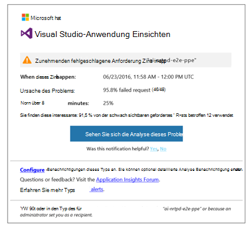
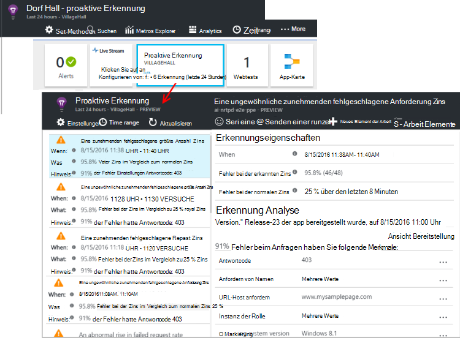

<properties 
    pageTitle="Proaktive Diagnose in Anwendung Einsichten | Microsoft Azure" 
    description="Anwendung Einsichten führt automatische Tiefe Analyse für Ihre app werden und gewarnt potenzieller Probleme." 
    services="application-insights" 
    documentationCenter="windows"
    authors="rakefetj" 
    manager="douge"/>

<tags 
    ms.service="application-insights" 
    ms.workload="tbd" 
    ms.tgt_pltfrm="ibiza" 
    ms.devlang="na" 
    ms.topic="article" 
    ms.date="08/15/2016" 
    ms.author="awills"/>

#  In der Anwendung Einsichten proaktive Diagnose

 Proaktive Diagnose gewarnt automatisch über potenzielle Leistungsprobleme in der Webanwendung. Intelligente Analysen der werden, die Ihre app zu [Visual Studio-Anwendung Einsichten](app-insights-overview.md)sendet durchgeführt. Wenn eine plötzlich zunehmenden Fehler Sätzen oder ungewöhnliche Muster Client- oder Leistungsabfall vorhanden ist, erhalten Sie eine Benachrichtigung an. Dieses Feature erfordern keine Konfiguration. Er arbeitet, wenn eine Anwendung genügend werden sendet.

Sie können proaktive Erkennung Benachrichtigungen aus der e-Mail-Nachrichten, die Sie erhalten und aus dem proaktive Erkennung Blade zugreifen.

## Überprüfen Sie Ihre proaktive Erkennung

Sie können die Erkennung auf zwei Arten ermitteln:

* **Sie erhalten eine e-Mail** von Anwendung Einsichten. Es folgt eine typische Beispiel:

    

    Klicken Sie auf die große Schaltfläche, um weitere Details im Portal zu öffnen.

* Auf der app Übersicht Blade **Kachel der proaktive Erkennung** zeigt die Anzahl der zuletzt verwendete Benachrichtigungen. Klicken Sie auf die Kachel, um eine Liste der zuletzt verwendete Benachrichtigungen anzuzeigen.

Wählen Sie eine Benachrichtigung, um die Details anzuzeigen.

## Welche Probleme erkannt werden?

Es gibt drei Arten von Erkennung aus:

* [Proaktive Fehler Zins Diagnose](app-insights-proactive-failure-diagnostics.md). Wir verwenden maschinelle lernen, wie Sie die erwartete Rate der fehlgeschlagene Anfragen für Ihre app, Festlegen mit laden und andere abgleichen. Wenn die Effektivverzinsung bei außerhalb der erwarteten Umschlag geht, wird eine Benachrichtigung gesendet.
* [Proaktive Performance Diagnose](app-insights-proactive-performance-diagnostics.md). Wir suchen nach abweichenden Mustern Reaktionszeiten und Fehler Sätzen jeden Tag. Wir analysieren diese Probleme mit Eigenschaften wie Speicherort, Browser, Client-Betriebssystem, Server-Instanz und Uhrzeit.
* [Azure Cloud Services](https://azure.microsoft.com/blog/proactive-notifications-on-cloud-service-issues-with-azure-diagnostics-and-application-insights/). Sie erhalten Benachrichtigungen, wenn Ihre app in Azure Cloud Services gehostet wird, und eine Instanz der Rolle weist Startproblemen, häufige Wiederverwendung oder Laufzeit abstürzen.

(Der Hilfelinks in jeder Benachrichtigung gelangen Sie zu den relevanten Artikeln.)

## Nächste Schritte

Folgenden Diagnosetools Ihnen helfen den werden aus der app zu prüfen:

* [Metrische explorer](app-insights-metrics-explorer.md)
* [Search-explorer](app-insights-diagnostic-search.md)
* [Analytics - Abfragesprache leistungsfähige](app-insights-analytics-tour.md)

Proaktive Diagnose sind vollständig automatische. Aber vielleicht möchten Sie einige weitere Benachrichtigungen einrichten?

* [Manuell konfigurierten metrischen Benachrichtigungen](app-insights-alerts.md)
* [Verfügbarkeit von Webtests](app-insights-monitor-web-app-availability.md) 

