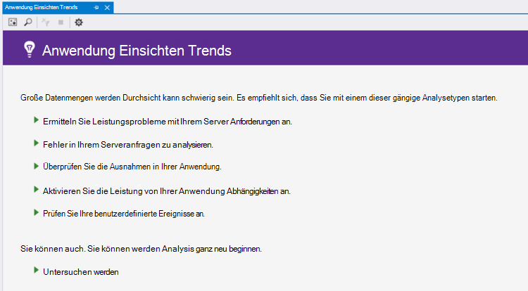
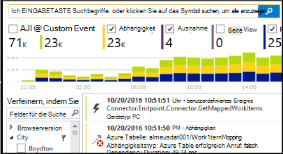
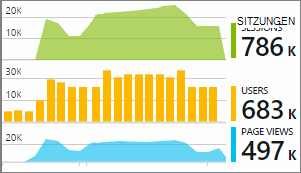

<properties 
    pageTitle="Analysieren von Trends in Visual Studio | Microsoft Azure" 
    description="Analysieren, visualisieren und Untersuchen von Trends in Ihrer Anwendung Einsichten werden in Visual Studio." 
    services="application-insights" 
    documentationCenter=".net"
    authors="numberbycolors" 
    manager="douge"/>

<tags 
    ms.service="application-insights" 
    ms.workload="tbd" 
    ms.tgt_pltfrm="ibiza" 
    ms.devlang="na" 
    ms.topic="get-started-article" 
    ms.date="10/25/2016" 
    ms.author="daviste"/>
    
# Analysieren von Trends in Visual Studio

Das Tool für die Anwendung Einsichten Trends Visualisierung wie Ihrer Anwendung werden wichtige Ereignisse im Laufe der Zeit ändern hilft Ihnen, Probleme und Bildschirmdarstellung auftreten schnell zu erkennen. Verknüpfen Sie ausführlichere Diagnoseinformationen, können Trends zur verbessern die Leistung Ihrer Anwendung, die Ursachen von Ausnahmen Ausfindigmachen und Einblicken aus Ihrer benutzerdefinierten Ereignisse für eine Steigerung.

> [AZURE.NOTE] Anwendung Einsichten Trends ist verfügbar in Visual Studio 2015 Update 3 und höher, oder mit der [Erweiterung Analytics Entwicklertools](https://visualstudiogallery.msdn.microsoft.com/82367b81-3f97-4de1-bbf1-eaf52ddc635a) Version 5.209 und höher.

## Öffnen der Anwendung Einsichten Trends

So öffnen Sie das Fenster Anwendung Einsichten Trends

* Wählen Sie die Anwendung Einsichten Symbolleisten-Schaltfläche **Werden Trends untersuchen**, oder
* Wählen Sie aus dem Kontextmenü des Projekts **Anwendung Einsichten > Durchsuchen werden Trends**, oder
* Wählen Sie aus der Visual Studio-Menüleiste **Ansicht > Weitere Fenster > Anwendung Einsichten Trends**.

Möglicherweise wird eine Aufforderung zum Auswählen einer Ressource angezeigt. Klicken Sie auf, **Wählen Sie eine Ressource**, melden Sie sich mit einem Azure-Abonnement, und wählen Sie dann eine Anwendung Einsichten Ressource aus der Liste, für die Sie Analysieren von Trends werden möchten.

## Wählen Sie eine Trendanalyse

Erste Schritte, indem Sie eine der fünf allgemeine Trend Analysen, jede Analysieren von Daten aus den letzten 24 Stunden auswählen:

* **Untersuchen Leistungsprobleme mit Ihrem Serveranfragen** - Anfragen zu Ihrem Dienst, gruppiert nach Reaktionszeiten
* **Analysieren von Fehlern in Ihre Anforderungen Server** - Anfragen zu Ihrem Dienst, gruppiert nach HTTP-Antwortcode
* **Überprüfen Sie die Ausnahmen in Ihrer Anwendung** - Ausnahmen aus dem Dienst, gruppiert nach Kategorie
* **Überprüfen Sie die Leistung von Ihrer Anwendung Abhängigkeiten** - Dienste von Ihrem Dienst aufgerufen, gruppiert nach Reaktionszeiten
* **Prüfen Sie Ihre benutzerdefinierte Ereignisse** - benutzerdefinierte Ereignisse, die Sie für Ihren Dienst eingerichtet haben, gruppiert nach Ereignistyp.

Diese vordefinierten Analysen sind später über die **Ansicht gängige Typen von werden Analysis** -Schaltfläche in der oberen linken Ecke des Fensters Trends verfügbar.

## Visualisieren von Trends in Ihrer Anwendung

Anwendung Einsichten Trends erstellt eine Reihe zeitvisualisierung aus Ihrer app werden. Jedes Mal Reihe Visualisierung zeigt einen Typ von werden, gruppiert nach dieser werden, eine Eigenschaft über einige Zeitbereich. Angenommen, Sie möchten möglicherweise Serveranfragen, gruppiert nach Land aus dem sie, über den letzten 24 Stunden stammen anzeigen. In diesem Beispiel würde jeder Blase auf die Visualisierung Anzahl der Serveranfragen für einige Land/Region während einer Stunde darstellen.

Verwenden Sie die Steuerelemente am oberen Rand des Fensters, um anzupassen, welche Arten von werden Sie anzeigen. Wählen Sie zuerst die werden Arten, in denen Sie interessiert sind:

* **Typ telemetrieprotokoll** - Serveranfragen, Ausnahmen, Depdendencies oder benutzerdefinierte Ereignisse
* **Zeitraums** - an einer beliebigen Stelle in der letzten 30 Minuten in der letzten 3 Tage
* **Group By** - Ausnahme Typ, Problem-ID, Land/Region und mehr.

Klicken Sie dann auf **Analysieren werden** , um die Abfrage auszuführen.

Navigieren Sie zwischen Blasen in der Visualisierung:

* Klicken Sie auf, um eine Blasen-auszuwählen, in dem die Filter am Fuß des Fensters Zusammenfassen von nur die Ereignisse, die während eines bestimmten Zeitraums aufgetreten sind, aktualisiert
* Doppelklicken Sie auf eine Blase zum Navigieren Sie zu der Suchfunktion und alle Ereignisse einzelner werden, die während dieses Zeitraums aufgetreten sind.
* STRG-Taste eine Blase heben in der Visualisierung auswählen.

> [AZURE.TIP] Die Trends und eine Suche tools arbeiten zusammen, um Ihnen die Ursachen von Problemen in Ihrem Dienst zwischen Tausende von werden Ereignisse pinpoint helfen. Beispielsweise, ob ein Tag, beachten Sie Ihre Kunden Ihre App, weniger reagiert wird, beginnen Sie mit Trends. Anfragen zu Ihrem Dienst während der letzten mehrere Stunden, gruppiert nach Antwortzeit zu analysieren. Angezeigt, wenn es ein ungewöhnlich großer Cluster von langsam Serviceanfragen ist. Klicken Sie dann Doppelklicken auf die Blase fahren Sie mit der Suchfunktion, gefiltert, dass diese Anforderung Ereignisse. Aus Suchvorgängen können Sie untersuchen den Inhalt der diese Anfragen und navigieren Sie zu der Code verbindet, um das Problem zu beheben.

## Filter

Weitere spezifische Trends mit am unteren Rand des Fensters die Filtersteuerelemente zu erkennen. Um einen Filter anzuwenden, klicken Sie auf seinen Namen. Sie können schnell wechseln zwischen verschiedenen Filtern zum Trends ermitteln, die in einer bestimmten Dimension von Ihrem werden ausblenden werden kann. Wenn Sie einen Filter in einer Richtung, wie Ausnahmetyp anwenden bleiben Filter in anderen Dimensionen geklickt werden kann, obwohl sie abgeblendet angezeigt werden. Zum Aufheben – Anwenden eines Filters, klicken sie erneut auf. Halten Sie die STRG-Taste gedrückt, um mehrere Filter in die gleiche Dimension auszuwählen.

Was geschieht, wenn Sie mehrere Filter anwenden möchten? 

1. Verwenden Sie den ersten Filter ein. 
2. Klicken Sie auf die Schaltfläche **Filter ausgewählten und Abfrage erneut anwenden** , durch den Namen der Dimension von den ersten Filter. Dies wird Ihre werden für nur Ereignisse erneut abfragen, die den ersten Filter entsprechen. 
3. Einen zweiten Filter anwenden. 
4. Wiederholen Sie den Vorgang zum Suchen von Trends in eine bestimmte Teilmenge der werden. Beispielsweise Namen Serveranfragen "GET-Start/Index" _und_ die Deutschland _und_ stammen, die einen Antwortcode 500 erhalten haben. 

Zum Aufheben-eine der folgenden Filter anzuwenden, klicken Sie auf die Schaltfläche **Entfernen der ausgewählten Filter und die Abfrage erneut aus** , für die Dimension.

## Suchen nach Bildschirmdarstellung auftreten

Das Tool Trends kann Blasen Ereignisse hervorheben, die im Vergleich zu anderen Blasen in der gleichen Zeit Besprechungsserie abweichenden sind. Wählen Sie in der Dropdownliste den Ansichtstyp **zählt in Anzeigedauer Zelle (hervorheben Bildschirmdarstellung auftreten)** oder **Prozentsätze in Anzeigedauer Zelle (hervorheben Bildschirmdarstellung auftreten)**aus. Rote Blasen sind abweichenden. Bildschirmdarstellung auftreten als Blasen zählt/Prozentsätze überschreiten 2.1 oft die Standardabweichung der Zähler/Prozentsätze in der Vergangenheit liegt definiert sind zwei Uhrzeitspanne (48 Stunden, wenn Sie die letzte 24 Stunden usw. anzeigen.).

> [AZURE.TIP] Auf ähnliche Weise wird besonders hilfreich zum Suchen von Ausreißern Zeit Reihe von kleinen Blasen, die andernfalls aussehen möglicherweise angepasst, Hervorhebung Bildschirmdarstellung auftreten.  

## Nächste Schritte

||
|---|---
|**[Arbeiten mit der Anwendung Einsichten in Visual Studio](app-insights-visual-studio.md)** Suchen Sie werden, finden Sie unter Daten in CodeLens und konfigurieren Sie Anwendung Einsichten. Alle in Visual Studio. |
|**[Fügen Sie weiterer Daten hinzu](app-insights-asp-net-more.md)** Überwachen der Verwendung, Verfügbarkeit, Abhängigkeiten, Ausnahmen. Spuren von Protokollierung Framework integriert werden soll. Schreiben Sie benutzerdefinierte werden. | 
|**[Arbeiten mit der Anwendung Einsichten-portal](app-insights-dashboards.md)** Exportieren von Dashboards, leistungsfähige Tools für Diagnose und analytischen, Benachrichtigungen, einer Karte live Abhängigkeit von Anwendung und werden. |
