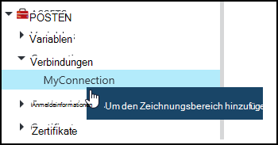
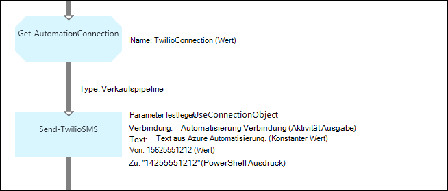
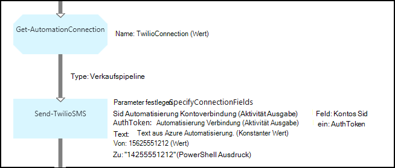

<properties 
   pageTitle="Verbindung Anlagen in Azure Automatisierung | Microsoft Azure"
   description="Verbindung Anlagen in Azure Automatisierung enthalten die Informationen, die Verbindung zu einem externen Dienst oder einer Anwendung aus einem Runbooks oder DSC Konfiguration erforderlich. In diesem Artikel wird erläutert, die Details der Verbindungen und Anweisungen zum Verfassen von Text und Grafiken mit ihnen zu arbeiten."
   services="automation"
   documentationCenter=""
   authors="bwren"
   manager="stevenka"
   editor="tysonn" />
<tags 
   ms.service="automation"
   ms.devlang="na"
   ms.topic="article"
   ms.tgt_pltfrm="na"
   ms.workload="infrastructure-services"
   ms.date="01/27/2016"
   ms.author="bwren" />

# Verbindung Anlagen in Azure Automatisierung

Eine Automatisierung Verbindung Anlage enthält, die Informationen aus einer Runbooks oder DSC Konfiguration eine Verbindung mit einer externen Dienst oder einer Anwendung erforderlich. Dies kann für die Authentifizierung wie Benutzername und Kennwort sowie Verbindungsinformationen wie eine URL oder einen Anschluss benötigten Informationen enthalten. Der Wert einer Verbindung ist aller Eigenschaften für das Herstellen einer Verbindung mit einer bestimmten Anwendung in einer Anlage im Gegensatz zum Erstellen von mehreren Variablen planmäßigen. Der Benutzer kann die Werte für eine Verbindung an einem Ort bearbeiten, und Sie können den Namen einer Verbindung zu einem Runbooks oder DSC Konfiguration in einem einzelnen Parameter übergeben. Die Eigenschaften für eine Verbindung können in der DSC-Konfiguration, mit der **Get-AutomationConnection** Aktivität oder Runbooks zugegriffen werden.

Wenn Sie eine Verbindung herstellen, müssen Sie einen *Verbindungstyp*angeben. Der Verbindungstyp ist eine Vorlage, die eine Reihe von Eigenschaften definiert. Die Verbindung definiert Werte für jede Eigenschaft in deren Verbindungstyp definiert. Verbindungstypen werden Azure Automatisierung in Integrationsmodule hinzugefügt oder mit [Azure Automation API](http://msdn.microsoft.com/library/azure/mt163818.aspx)erstellt. Die einzige Verbindungstypen, die verfügbar sind, wenn Sie eine Verbindung herstellen sind in Ihr Konto Automatisierung installiert.

>[AZURE.NOTE] Sichere Anlagen in Azure Automatisierung beziehen Sie Anmeldeinformationen, Zertifikate, Verbindungen und verschlüsselte Variablen. Diese Ressourcen werden verschlüsselt und bei der Azure-Automatisierung mit einem eindeutigen Schlüssel ist für jedes Konto Automatisierung gespeichert. Dieser Schlüssel ist von einem master Zertifikat verschlüsselt und im Azure Automatisierung gespeichert. Vor dem Speichern einer sicheren Anlage, die Taste für das Konto Automatisierung ist mit der master Zertifikat entschlüsselt und dann verwendet, um die Anlage verschlüsseln.

## Windows PowerShell-Cmdlets

Die Cmdlets in der folgenden Tabelle werden zum Erstellen und Verwalten von Automatisierung Verbindungen mit Windows PowerShell. Diese liefern als Teil des [Azure PowerShell-Modul](../powershell-install-configure.md) für die Verwendung in Automatisierung Runbooks und DSC Konfigurationen verfügbar ist.

|Cmdlet|Beschreibung|
|:---|:---|
|[Get-AzureAutomationConnection](http://msdn.microsoft.com/library/dn921828.aspx)|Ruft eine Verbindung. Enthält eine Hashtabelle mit den Werten für die Felder der Verbindung.|
|[Neue AzureAutomationConnection](http://msdn.microsoft.com/library/dn921825.aspx)|Erstellt eine neue Verbindung.|
|[Entfernen-AzureAutomationConnection](http://msdn.microsoft.com/library/dn921827.aspx)|Entfernen Sie eine vorhandene Verbindung.|
|[Set-AzureAutomationConnectionFieldValue](http://msdn.microsoft.com/library/dn921826.aspx)|Legt den Wert eines bestimmten Felds für eine vorhandene Verbindung.|

## Aktivitäten

Die Aktivitäten in der folgenden Tabelle werden verwendet, um die Verbindungen in einem Runbooks oder DSC Konfiguration zugreifen.

|Aktivitäten|Beschreibung|
|---|---|
|Get-AutomationConnection|Ruft eine Verbindung zu verwenden. Gibt eine Hashtabelle mit den Eigenschaften der Verbindung an.|

>[AZURE.NOTE] Vermeiden Sie die Verwendung von Variablen in den – Parameter Name der **Get-AutomationConnection** , da dies erkennen von Abhängigkeiten zwischen Runbooks oder DSC Konfigurationen und Anlagen Verbindung zur Entwurfszeit erschweren kann.

## Erstellen eine neue Verbindung

### So erstellen eine neue Verbindung mit dem Azure klassische portal

1. Klicken Sie auf **Posten** am oberen Rand des Fensters, über Ihr Konto Automatisierung.
1. Am unteren Rand des Fensters klicken Sie auf **Hinzufügen**.
1. Klicken Sie auf **Verbindung hinzufügen**.
2. Wählen Sie in der Dropdownliste den **Verbindungstyp** den Typ der Verbindung, die Sie erstellen möchten.  Der Assistent wird die Eigenschaften für den betreffenden zur Verfügung stellen.
1. Schließen Sie des Assistenten ab aus, und klicken Sie auf das Kontrollkästchen, um die neue Verbindung zu speichern.

### So erstellen eine neue Verbindung mit dem Azure-portal

1. Klicken Sie über Ihr Konto Automatisierung auf das Webpart **Posten** , um das Blade **Anlagen** zu öffnen.
1. Klicken Sie auf das Webpart **Verbindungen** , um das Blade **Verbindungen** zu öffnen.
1. Klicken Sie auf **Hinzufügen einer Verbindung** am oberen Rand der Blade.
2. Wählen Sie in der Dropdownliste **Typ** den Typ der Verbindung, die Sie erstellen möchten. Das Formular wird die Eigenschaften für den betreffenden zur Verfügung stellen.
1. Füllen Sie das Formular, und klicken Sie auf **Erstellen** , um die neue Verbindung zu speichern.

### So erstellen eine neue Verbindung mit Windows PowerShell

Erstellen Sie eine neue Verbindung mit Windows PowerShell mithilfe des Cmdlets [New-AzureAutomationConnection](http://msdn.microsoft.com/library/dn921825.aspx) . Dieses Cmdlet hat einen Parameter namens **ConnectionFieldValues** , die eine [Tabelle](http://technet.microsoft.com/library/hh847780.aspx) Definieren von Werten für jede der von den Verbindungstyp definierten Eigenschaften erwartet.

Die folgenden Befehle für die Stichprobe erstellen eine neue Verbindung für [Twilio](http://www.twilio.com) also Telefonie-Dienst, mit dem Sie zum Senden und Empfangen von Textnachrichten.  Ein Beispiel-Integration-Modul, das einen Verbindungstyp Twilio umfasst steht in [Script Center](http://gallery.technet.microsoft.com/scriptcenter/Twilio-PowerShell-Module-8a8bfef8).  Dieser Verbindungstyp definiert Eigenschaften für das Konto SID und Autorisierung Token, die erforderlich sind, zu Ihrem Konto bei einer Verbindung mit Twilio zu überprüfen.  Sie müssen [Dieses Modul herunterladen](http://gallery.technet.microsoft.com/scriptcenter/Twilio-PowerShell-Module-8a8bfef8) und installieren es in Ihr Konto Automatisierung, damit dieses Beispielcode funktioniert.

    $AccountSid = "DAf5fed830c6f8fac3235c5b9d58ed7ac5"
    $AuthToken  = "17d4dadfce74153d5853725143c52fd1"
    $FieldValues = @{"AccountSid" = $AccountSid;"AuthToken"=$AuthToken}

    New-AzureAutomationConnection -AutomationAccountName "MyAutomationAccount" -Name "TwilioConnection" -ConnectionTypeName "Twilio" -ConnectionFieldValues $FieldValues

## Verwenden eine Verbindung in einer Runbooks oder DSC-Konfiguration

Eine Verbindung in einer Runbooks oder DSC Konfiguration für das Cmdlet " **Get-AutomationConnection** " abgerufen werden.  Diese Aktivität Ruft die Werte von den verschiedenen Feldern in der Verbindung ab und gibt diese als eine [Tabelle](http://go.microsoft.com/fwlink/?LinkID=324844) , die dann mit der entsprechenden Befehle in der DSC-Konfiguration oder Runbooks verwendet werden können.

### Textbasierte Runbooks Stichprobe
Im folgenden Beispielbefehle zeigen, wie die Verbindung Twilio im vorherigen Beispiel zu verwenden, um eine Textnachricht über eine Runbooks senden.  Die senden-TwilioSMS Aktivität hier verwendeten verfügt über zwei Parameter, die jeweils eine andere Methode für die Authentifizierung an den Twilio-Dienst verwenden.  Ein Connection-Objekt und von einem anderen verwendet einzelne Parameter für das Konto SID und Autorisierung Token.  In diesem Beispiel werden beide Methoden gezeigt.

    $Con = Get-AutomationConnection -Name "TwilioConnection"
    $NumTo = "14255551212"
    $NumFrom = "15625551212"
    $Body = "Text from Azure Automation."

    #Send text with connection object.
    Send-TwilioSMS -Connection $Con -From $NumFrom -To $NumTo -Body $Body

    #Send text with connection properties.
    Send-TwilioSMS -AccountSid $Con.AccountSid -AuthToken $Con.AuthToken -From $NumFrom -To $NumTo -Body $Body

### Grafische Runbooks Beispiele

Sie hinzufügen **Get-AutomationConnection** Aktivitäten zu einem grafisch Runbooks an, indem Sie mit der rechten Maustaste auf die Verbindung in der Bibliothek Bereich des Editors grafisch und auswählen **zu Zeichnungsbereich hinzufügen**.

Die folgende Abbildung zeigt ein Beispiel für über eine Verbindung in einem grafischen Runbooks.  Dies ist dieselbe obigen Beispiel für eine Twilio aus einer Textform Runbooks mit Textnachricht senden.  In diesem Beispiel wird den **UseConnectionObject** Parameter einrichten für die **Senden-TwilioSMS** Aktivität, die ein Verbindungsobjekt für die Authentifizierung an den Dienst verwendet.  Einen [Link Verkaufspipeline](automation-graphical-authoring-intro.md#links-and-workflow) wird hier verwendet, da der Verbindung-Parameter ein einzelnes Objekt erwartet wird.

Der Grund, der eine PowerShell Ausdruck für den Wert in den Parameter **zu** statt ein konstanter Wert verwendet wird, die für diesen Parameter einen Zeichenfolge Array Werttyp erwartet, dass Sie zum Multiplizieren von Zahlen senden können.  Ein Ausdruck PowerShell können Sie einen einzelnen Wert oder ein Array bereitstellen.

Die nachstehende Abbildung zeigt derselben verwendet, die der Parameter **SpecifyConnectionFields** festgelegt werden, die aber über das Beispiel erwartet die Parameter AccountSid und AuthToken einzeln im Gegensatz zum Verwenden eines Verbindungsobjekts für die Authentifizierung angegeben werden muss.  In diesem Fall sind Felder der Verbindung anstelle des Objekts angegeben.  

## Verwandte Artikel

- [Grafische beim Verfassen von links](automation-graphical-authoring-intro.md#links-and-workflow)
 
