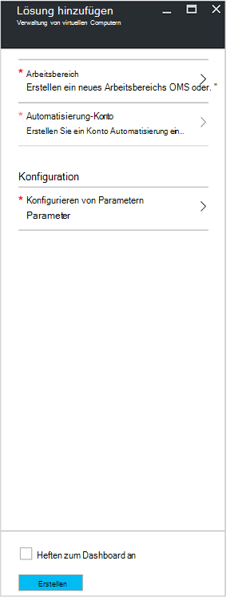
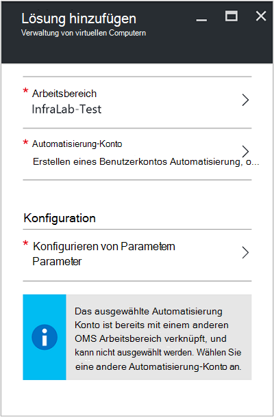
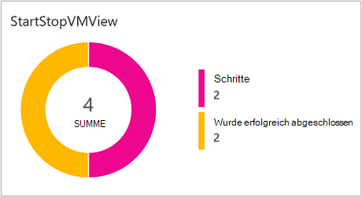
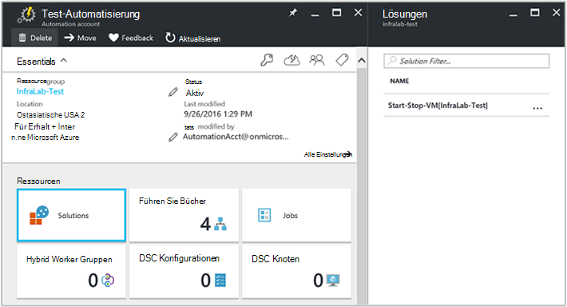
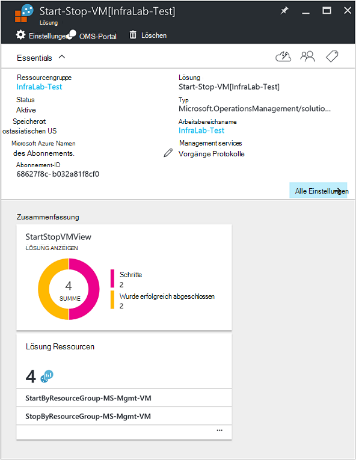

<properties
    pageTitle="Start/Stopp virtuellen Computern während der Arbeitszeiten [Vorschau] Lösung | Microsoft Azure"
    description="Die Verwaltung von virtuellen Computern Lösungen startet und hält Ihre Azure Ressourcenmanager virtuellen Computer nach einem Zeitplan und vorausschauende aus Log Analytics überwachen."
    services="automation"
    documentationCenter=""
    authors="MGoedtel"
    manager="jwhit"
    editor=""
    />
<tags
    ms.service="automation"
    ms.workload="tbd"
    ms.tgt_pltfrm="na"
    ms.devlang="na"
    ms.topic="get-started-article"
    ms.date="10/07/2016"
    ms.author="magoedte"/>

# Start/Stopp virtuellen Computern während der Arbeitszeiten [Vorschau]-Lösung in Automatisierung

Der Start/Stop virtuellen Computern während der Arbeitszeiten [Vorschau] Lösung startet und hält Ihre Ressourcenmanager Azure-virtuellen Computern nach einem benutzerdefinierten Zeitplan und bietet einen Einblick in den Erfolg der Einzelvorgänge Automatisierung, die starten und Beenden der virtuellen Computern mit OMS Log Analytics.  

## Erforderliche Komponenten

- Die Runbooks arbeiten mit einem [Konto Azure ausführen als](automation-sec-configure-azure-runas-account.md).  Das Konto ausführen als ist bevorzugte Authentifizierungsmethode, da es Zertifikatauthentifizierung anstelle eines Kennworts verwendet, die möglicherweise ablaufen oder häufig geändert.  

- Diese Lösung kann nur virtuellen Computern verwalten die sind in der gleichen Abonnement und Ressourcengruppe als, in dem das Automatisierung Konto befindet.  

- Diese Lösung wird nur in den folgenden Azure Regionen - Australien oder, ostasiatischen US, oder Asien und Europa Westen bereitgestellt.  Die Runbooks, die den Terminplan virtueller Computer verwalten können virtuellen Computern in einer beliebigen Region adressieren.  

- Ein Office 365-Abonnement Business-Klasse ist erforderlich, um e-Mail-Benachrichtigungen zu senden, wenn die Start- und virtueller Computer Runbooks abschließen.  

## Komponenten einer Lösung

Diese Lösung besteht aus den folgenden Ressourcen, die mit Ihrem Konto Automatisierung hinzugefügt und importiert werden.

### Runbooks

Runbooks | Beschreibung|
--------|------------|
CleanSolution MS-Management virtueller Computer | Diese Runbooks werden alle enthaltenen Ressourcen und Terminpläne entfernt, wenn Sie die Lösung aus Ihrem Abonnement löschen wechseln.|  
SendMailO365-MS-Management | Diese Runbooks sendet eine e-Mail über Office 365 Exchange.|
StartByResourceGroup MS-Management virtueller Computer | Diese Runbooks virtuellen Computern beginnen soll (beide klassischen und Cloud-basierte virtuellen Computern), die sich in einer bestimmten Liste mit Azure Ressourcen nach Gruppen befindet.
StopByResourceGroup MS-Management virtueller Computer | Diese Runbooks virtuellen Computern beenden soll (beide klassischen und Cloud-basierte virtuellen Computern), die sich in einer bestimmten Liste mit Azure Ressourcen nach Gruppen befindet.|
 

### Variablen

Variable | Beschreibung|
---------|------------|
**SendMailO365-MS-Management** Runbooks ||
SendMailO365 IsSendEmail MS-Management | Gibt an, ob StartByResourceGroup MS-Management virtueller Computer und StopByResourceGroup MS-Management virtueller Computer Runbooks e-Mail-Benachrichtigung zur Beendigung senden können.  Wählen Sie **True** zum Aktivieren und **falsch** , wenn e-Mail-Warnung zu deaktivieren. Standardwert ist " **False**".| 
**StartByResourceGroup MS Management virtueller Computer** Runbooks ||
StartByResourceGroup-ExcludeList-MS-Management-virtueller Computer | Geben Sie die Namen der virtuellen Computer Verwaltungsvorgang ausgeschlossen werden; Trennen Sie Namen mithilfe von semi-colon(;) aus. Werte sind Groß-/Kleinschreibung beachtet und Platzhalter (Sternchen) unterstützt wird.|
StartByResourceGroup-SendMailO365-EmailBodyPreFix-MS-Management | Text, der an den Anfang des Texts der e-Mail-Nachricht angehängt werden kann.|
StartByResourceGroup-SendMailO365-EmailRunBookAccount-MS-Management | Gibt den Namen des Kontos Automatisierung, der die e-Mail-Runbooks enthält.  **Ändern Sie diese Variable nicht.**|
StartByResourceGroup-SendMailO365-EmailRunbookName-MS-Management | Gibt den Namen des e-Mail-Runbooks an.  Die StartByResourceGroup MS-Management virtueller Computer und StopByResourceGroup MS-Management virtueller Computer Runbooks Hiermit wird um e-Mail zu senden.  **Ändern Sie diese Variable nicht.**|
StartByResourceGroup-SendMailO365-EmailRunbookResourceGroup-MS-Management | Gibt den Namen der Ressourcengruppe, die die e-Mail-Runbooks enthält.  **Ändern Sie diese Variable nicht.**|
StartByResourceGroup-SendMailO365-EmailSubject-MS-Management | Gibt den Text für die Betreffzeile der e-Mail.|  
StartByResourceGroup-SendMailO365-EmailToAddress-MS-Management | Gibt den Hauptteil der e-Mail an.  Geben Sie trennen Sie Namen mithilfe von semi-colon(;) ein.|
StartByResourceGroup-TargetResourceGroups-MS-Management-virtueller Computer | Geben Sie die Namen der virtuellen Computer Verwaltungsvorgang ausgeschlossen werden; Trennen Sie Namen mithilfe von semi-colon(;) ein. Werte sind Groß-/Kleinschreibung beachtet und Platzhalter (Sternchen) unterstützt wird.  Standardwert (Sternchen) einbezogen alle Ressourcengruppen in das Abonnement.|
StartByResourceGroup-TargetSubscriptionID-MS-Management-virtueller Computer | Gibt das Abonnement, das virtuelle Computer verwaltet werden, indem Sie diese Lösung enthält.  Dies muss im selben Abonnement, wo befindet sich das Konto Automatisierung dieser Lösung.|
**StopByResourceGroup MS Management virtueller Computer** Runbooks ||
StopByResourceGroup-ExcludeList-MS-Management-virtueller Computer | Geben Sie die Namen der virtuellen Computer Verwaltungsvorgang ausgeschlossen werden; Trennen Sie Namen mithilfe von semi-colon(;) ein. Werte sind Groß-/Kleinschreibung beachtet und Platzhalter (Sternchen) unterstützt wird.|
StopByResourceGroup-SendMailO365-EmailBodyPreFix-MS-Management | Text, der an den Anfang des Texts der e-Mail-Nachricht angehängt werden kann.|
StopByResourceGroup-SendMailO365-EmailRunBookAccount-MS-Management | Gibt den Namen des Kontos Automatisierung, der die e-Mail-Runbooks enthält.  **Ändern Sie diese Variable nicht.**|
StopByResourceGroup-SendMailO365-EmailRunbookResourceGroup-MS-Management | Gibt den Namen der Ressourcengruppe, die die e-Mail-Runbooks enthält.  **Ändern Sie diese Variable nicht.**|
StopByResourceGroup-SendMailO365-EmailSubject-MS-Management | Gibt den Text für die Betreffzeile der e-Mail.|  
StopByResourceGroup-SendMailO365-EmailToAddress-MS-Management | Gibt den Hauptteil der e-Mail an.  Geben Sie trennen Sie Namen mithilfe von semi-colon(;) ein.|
StopByResourceGroup-TargetResourceGroups-MS-Management-virtueller Computer | Geben Sie die Namen der virtuellen Computer Verwaltungsvorgang ausgeschlossen werden; Trennen Sie Namen mithilfe von semi-colon(;) ein. Werte sind Groß-/Kleinschreibung beachtet und Platzhalter (Sternchen) unterstützt wird.  Standardwert (Sternchen) einbezogen alle Ressourcengruppen in das Abonnement.|
StopByResourceGroup-TargetSubscriptionID-MS-Management-virtueller Computer | Gibt das Abonnement, das virtuelle Computer verwaltet werden, indem Sie diese Lösung enthält.  Dies muss im selben Abonnement, wo befindet sich das Konto Automatisierung dieser Lösung.|  
 

### Zeitpläne

Zeitplan | Beschreibung|
---------|------------|
StartByResourceGroup Terminplan MS-Management | Zeitplan für StartByResourceGroup Runbooks, die Start von virtuellen Computern, die von dieser Lösung verwaltet ausführt.|
StopByResourceGroup Terminplan MS-Management | Zeitplan für StopByResourceGroup Runbooks, die das Beenden der virtuellen Computern, die von dieser Lösung verwaltet ausführt.|

### Anmeldeinformationen

Anmeldeinformationen | Beschreibung|
-----------|------------|
O365Credential | Gibt an einem gültigen Office 365-Konto e-Mail zu senden.  Nur erforderlich, wenn die Variable SendMailO365-IsSendEmail-MS-Management auf **True**festgelegt ist.

## Konfiguration

Führen Sie die folgenden Schritte aus, um Ihr Konto Automatisierung der Start/Stop virtuellen Computern während der Arbeitszeiten [Vorschau] Lösung hinzu, und konfigurieren Sie die Variablen zum Anpassen der Lösung.

1. Wählen Sie aus dem Startbildschirm Azure-Portal der **Marketplace** -Kachel aus.  Wählen Sie **neu**, wenn die Kachel nicht mehr zu Ihrem Startbildschirm, klicken Sie im linken Navigationsbereich fixiert ist.  
2. In der Marketplace-Blade **Starten virtueller Computer** in das Suchfeld Geben Sie ein, und wählen Sie dann die Lösung **Start/Stopp virtuellen Computern tagsüber [Vorschau]** aus den Suchergebnissen aus.  
3. Überprüfen Sie in den **Start/Stopp virtuellen Computern tagsüber [Vorschau]** Blade für die ausgewählte Lösung die Zusammenfassungsinformationen, und klicken Sie dann auf **Erstellen**.  
4. Das **Hinzufügen der Lösung** Blade wird angezeigt, in dem Sie aufgefordert werden, die Lösung zu konfigurieren, bevor Sie es in Ihr Abonnement Automatisierung importieren können.     
5.  Klicken Sie auf das Blade **Lösung hinzufügen** **Arbeitsbereich** und hier auswählen einen, der mit dem gleichen Azure-Abonnement, dem das Konto Automatisierung ist verknüpft ist, oder erstellen ein neues Arbeitsbereichs von OMS OMS-Arbeitsbereich.  Wenn Sie nicht über ein Arbeitsbereich OMS verfügen, können Sie wählen Sie **Neuen Arbeitsbereich erstellen** und auf das Blade **OMS Arbeitsbereich** gehen Sie wie folgt: 
   - Geben Sie einen Namen für den neuen **OMS Arbeitsbereich**ein.
   - Wählen Sie ein **Abonnement** eine Verknüpfung herstellen, indem Sie in der Dropdown-Liste auswählen, wenn die ausgewählten Standardeinstellungen nicht geeignet ist.
   - Sie können für **Ressourcengruppe**erstellen eine neuen Ressourcengruppe oder wählen Sie eine vorhandene Ressourcengruppe aus.  
   - Wählen Sie einen **Speicherort**aus.  Aktuell sind der einzige Speicherorte vorgesehenen Auswahl **Oder Australien**, **Ostasiatischen US**, **oder Asien**und **Westen Europe**.
   - Wählen Sie eine **Ebene Preise**aus.  Die Lösung wird in zwei Stufen angeboten: freizugeben und OMS bezahlt Ebene.  Die kostenlose Ebene sind maximal auf die Menge der gesammelten Daten täglich, Aufbewahrungszeitraum und Runbooks Auftrag Laufzeit Minuten.  Die Ebene OMS bezahlt hat keine maximal auf die Menge der täglich gesammelten Daten.  

        > [AZURE.NOTE]
        > Während der eigenständigen bezahlt Ebene als Option angezeigt wird, ist es nicht verfügbar.  Wenn Sie wählen Sie ihn aus, und fahren Sie mit der Erstellung dieser Lösung in Ihrem Abonnement, tritt ein Fehler auf.  Dies wird behoben sein, wenn diese Lösung formal freigegeben ist. Wenn Sie diese Lösung verwenden, wird nur Automatisierung Auftrag Minuten verwenden und melden Sie sich Aufnahme.  Die Lösung werden keine zusätzliche OMS-Knoten in Ihrer Umgebung hinzugefügt.  

6. Nach dem Bereitstellen der erforderlichen Informationen auf das Blade **OMS Arbeitsbereich** , klicken Sie auf **Erstellen**.  Während die Informationen überprüft wird, und der Arbeitsbereich erstellt wurde, können Sie deren Status unter **Benachrichtigungen** über das Menü nachverfolgen.  Sie werden an die **Lösung hinzufügen** Blade zurückgegeben.  
7. Wählen Sie in der **Lösung hinzufügen** Blade **Automatisierung Konto**ein.  Wenn Sie einen neuen OMS-Arbeitsbereich erstellen, werden Sie erforderlich, um auch ein neues Automatisierung Konto erstellen, das mit dem neuen OMS Arbeitsbereich zuvor, angegeben haben, die wie Azure-Abonnement, Ressourcengruppe oder die Region zugeordnet werden soll.  Sie können wählen Sie **ein Konto Automatisierung erstellen** und auf das **Konto hinzufügen Automatisierung** Blade wird Folgendes bereitgestellt: 
  - Geben Sie im Feld **Name** den Namen des Kontos Automatisierung aus.

    Alle anderen Optionen werden automatisch ausgefüllt basierend auf den Arbeitsbereich OMS ausgewählt ist, und diese Optionen können nicht geändert werden.  Ein Azure ausführen als Konto ist die standardmäßige Authentifizierungsmethode für die in dieser Lösung enthaltenen Runbooks.  Nachdem Sie auf **OK**klicken, werden die Konfigurationsoptionen überprüft und das Konto Automatisierung erstellt.  Sie können den Fortschritt unter **Benachrichtigungen** über das Menü nachzuverfolgen. 

    Andernfalls können Sie ein vorhandenes Automatisierung ausführen als Konto auswählen.  Beachten Sie, dass das Konto ein, das Sie wählen, bereits in einem anderen Arbeitsbereich OMS, andernfalls eine Nachricht verknüpft werden werden in das Blade Sie darüber informiert angezeigt.  Wenn sie bereits verknüpft ist, müssen Sie ein anderes Konto Automatisierung ausführen als auswählen oder einen neuen erstellen.    

8. Klicken Sie abschließend auf das Blade **Lösung hinzufügen** , wählen Sie die **Konfiguration** , und das **Parameter** Blade angezeigt wird.  Klicken Sie auf das Blade **Parameter** erhalten Sie eine Aufforderung:  
   - Geben Sie an die **Zielwebsite ResourceGroup Namen**, also einen Gruppennamen für Ressourcen, der virtuelle Computer verwaltet werden, indem Sie diese Lösung enthält.  Sie können mehrere Namen eingeben, und trennen Sie die einzelnen mit einem Semikolon (Werte sind Groß-/Kleinschreibung beachtet).  Mithilfe eines Platzhalters wird unterstützt, wenn Sie Ziel virtuellen Computern in allen Ressourcengruppen in das Abonnement möchten.
   - Wählen Sie einen **Zeitplan** also periodischen Datum und Uhrzeit für starten und Beenden des virtuellen Computers in der Zielliste Ressourcen nach Gruppen aus.  

10. Nachdem Sie die anfänglichen Einstellungen für die Lösung erforderlichen konfigurieren abgeschlossen haben, wählen Sie **Erstellen**.  Alle Einstellungen werden überprüft werden, und klicken Sie dann versucht, die Lösung im Rahmen Ihres Abonnements bereitstellen.  Dieser Vorgang kann einige Sekunden dauern, und können Sie den Fortschritt unter **Benachrichtigungen** über das Menü verfolgen. 

## Häufigkeit Collection

Automatisierung Auftrag Log und Position Streamdaten ist in das Repository OMS fünf Minuten aufgenommen.  

## Verwenden die Lösung

Wenn Sie die Lösung für die Verwaltung von virtuellen Computern hinzugefügt haben, wird im Arbeitsbereich der **Ansicht StartStopVM** OMS Kachel des Dashboards OMS hinzugefügt werden.  Diese Kachel zeigt die Anzahl und grafisch Einzelvorgänge Runbooks für die Lösung, die gestartet haben und erfolgreich abgeschlossen haben.     

In Ihrem Konto Automatisierung können Sie zugreifen und verwalten die Lösung, indem Sie die Kachel **Lösungen** auswählen und dann aus dem Blade **Lösungen** , die Lösung **Start-beenden-virtueller Computer [Workspace]** aus der Liste auswählen.     

Markieren die Lösung wird das **Anfangs-beenden-virtueller Computer [Workspace]** Lösung Blade, angezeigt, wo Sie wichtige Details wie die Kachel **StartStopVM** wie in dem Arbeitsbereich OMS überprüfen können die Anzahl und einer grafisch Einzelvorgänge Runbooks für die Lösung, die gestartet haben und wurde erfolgreich abgeschlossen angezeigt.     

Von hier aus können auch den OMS-Arbeitsbereich zu öffnen und Ausführen einer weiteren Analyse der Position Datensätze.  Nur klicken Sie auf **Alle Einstellungen**, und wählen Sie in den **Einstellungen** Blade **Schnellstart** und wählen Sie dann in das Blade **Schnellstart** **OMS-Portal**.   Dies wird Öffnen einer neuen Registerkarte oder neue Browsersitzung und zu präsentieren OMS Arbeitsbereich mit Ihrem Konto Automatisierung und Abonnement verknüpft ist.  

### Konfigurieren von e-Mail-Benachrichtigungen

E-Mail-Benachrichtigungen aktivieren, wenn die Start- und virtueller Computer-Runbooks auf, die fertig sind, müssen Sie die **O365Credential** Ändern von Anmeldeinformationen und mindestens die folgenden Variablen:

 - SendMailO365 IsSendEmail MS-Management
 - StartByResourceGroup-SendMailO365-EmailToAddress-MS-Management
 - StopByResourceGroup-SendMailO365-EmailToAddress-MS-Management

Zum Konfigurieren der Anmeldeinformations **O365Credential** führen Sie die folgenden Schritte aus:

1. Klicken Sie auf **Alle Einstellungen** am oberen Rand des Fensters, über Ihr Konto Automatisierung. 
2. Wählen Sie in den **Einstellungen** Blade unter dem Abschnitt **Automatisierung Ressourcen** **Posten**. 
3. Wählen Sie in der **Posten** Blade die Kachel **Anmeldeinformationen** , und wählen Sie aus dem Blade **Anmeldeinformationen** der **O365Credential**aus.  
4. Geben Sie einen gültigen Office 365-Benutzernamen und Ihr Kennwort ein, und klicken Sie dann auf **Speichern** , um die Änderungen zu speichern.  

Zum Konfigurieren der Variablen zuvor hervorgehoben, führen Sie die folgenden Schritte aus:

1. Klicken Sie auf **Alle Einstellungen** am oberen Rand des Fensters, über Ihr Konto Automatisierung. 
2. Wählen Sie in den **Einstellungen** Blade unter dem Abschnitt **Automatisierung Ressourcen** **Posten**. 
3. Wählen Sie die Kachel **Variablen** auf das Blade **Anlagen** aus dem Blade **Variablen** , wählen Sie die oben aufgeführte Variable und ändern Sie deren Wert vor die Beschreibung für die sie zuvor im Abschnitt [Variable](##variables) angegeben.  
4. Klicken Sie auf **Speichern** , um die Änderungen der Variablen zu speichern.   

### Ändern des Zeitplans beim Starten und beenden

Verwalten von den beim Starten und beenden Terminplan in dieser Lösung folgt dieselben Schritte wie bei der [Planung einer Runbooks in Azure Automatisierung](automation-scheduling-a-runbook.md)beschrieben.  Beachten Sie, dass Sie die Konfiguration der Terminplan nicht ändern können.  Sie müssen den vorhandenen Zeitplan deaktivieren und dann einen neuen erstellen aus, und klicken Sie dann verknüpfen **StartByResourceGroup MS Management virtueller Computer** oder **StopByResourceGroup MS Management virtueller Computer** Runbooks, die den Zeitplan für gelten sollen.   

## Analytics Protokolldatensätze

Automatisierung erstellt zwei Arten von Datensätzen in der OMS Repository an.

### Position von Protokollen

Eigenschaft | Beschreibung|
----------|----------|
Anrufer |  Wer initiiert den Vorgang.  Mögliche Werte sind entweder eine e-Mail-Adresse oder System für geplante Aufgaben.|
Kategorie | Klassifizierung von den Typ der Daten.  Für die Automatisierung ist der Wert JobLogs.|
CorrelationId | GUID, die die Korrelations-Id des Runbooks Auftrags ist.|
Auftrags-IDs | GUID, die die Id des Projekts Runbooks ist.|
operationName | Gibt den Typ des Vorgangs in Azure ausgeführt.  Für die Automatisierung wird der Wert Auftrag sein.|
resourceId | Gibt an, welche Ressource in Azure.  Für die Automatisierung ist der Wert des Runbooks zugeordnete Automatisierung Konto an.|
ResourceGroup | Gibt den Namen der Ressource Gruppe des Runbooks Auftrags an.|
ResourceProvider | Gibt den Azure-Dienst, der die Ressourcen bereitstellt, bereitstellen und verwalten können.  Für die Automatisierung ist der Wert Azure Automatisierung.|
ResourceType | Gibt an, welche Ressource in Azure.  Für die Automatisierung ist der Wert des Runbooks zugeordnete Automatisierung Konto an.|
ResultType-Wert | Der Status des Runbooks Auftrags.  Mögliche Werte sind: -Schritte -Beendet -Unterbrochen -Fehler -Wurde erfolgreich abgeschlossen|
resultDescription | Beschreibt den Runbooks Auftrag Ergebniszustand.  Mögliche Werte sind: -Auftrag wird gestartet. -Auftrag fehlgeschlagen ist -Projekt abgeschlossen|
RunbookName | Gibt den Namen des Runbooks an.|
SourceSystem | Gibt das Quellsystem für die Daten übermittelt.  Für die Automatisierung, wird der Wert sein: OpsManager|
StreamType | Gibt den Typ des Ereignisses. Mögliche Werte sind: -Ausführliche -Ausgabe -Fehler -Warnung|
SubscriptionId | Gibt die Abonnement-ID des Auftrags an.
Zeit | Datum und Uhrzeit, wann die Position des Runbooks ausgeführt.|

### Position streams

Eigenschaft | Beschreibung|
----------|----------|
Anrufer |  Wer initiiert den Vorgang.  Mögliche Werte sind entweder eine e-Mail-Adresse oder System für geplante Aufgaben.|
Kategorie | Klassifizierung von den Typ der Daten.  Für die Automatisierung ist der Wert JobStreams.|
Auftrags-IDs | GUID, die die Id des Projekts Runbooks ist.|
operationName | Gibt den Typ des Vorgangs in Azure ausgeführt.  Für die Automatisierung wird der Wert Auftrag sein.|
ResourceGroup | Gibt den Namen der Ressource Gruppe des Runbooks Auftrags an.|
resourceId | Gibt die Ressource-Id in Azure an.  Für die Automatisierung ist der Wert des Runbooks zugeordnete Automatisierung Konto an.|
ResourceProvider | Gibt den Azure-Dienst, der die Ressourcen bereitstellt, bereitstellen und verwalten können.  Für die Automatisierung ist der Wert Azure Automatisierung.|
ResourceType | Gibt an, welche Ressource in Azure.  Für die Automatisierung ist der Wert des Runbooks zugeordnete Automatisierung Konto an.|
ResultType-Wert | Das Ergebnis des Runbooks Auftrags zu dem Zeitpunkt, der das Ereignis generiert wurde.  Mögliche Werte sind: -In Bearbeitung|
resultDescription | Enthält den Ausgabestream aus des Runbooks an.|
RunbookName | Der Name des Runbooks.|
SourceSystem | Gibt das Quellsystem für die Daten übermittelt.  Für die Automatisierung wird der Wert OpsManager sein.|
StreamType | Die Art des Streams Position. Mögliche Werte sind: -Status -Ausgabe -Warnung -Fehler -Debuggen -Ausführliche|
Zeit | Datum und Uhrzeit, wann die Position des Runbooks ausgeführt.|

Wenn Sie alle Log-Suche, die Datensätze der Kategorie **JobLogs** oder **JobStreams**zurückgibt ausführen, können Sie die Ansicht **JobLogs** oder **JobStreams** auswählen, die eine Zusammenfassung der Updates, die von der Suche zurückgegebenen Kacheln angezeigt.

## Beispiel für Log Suchbegriffe

Die folgende Tabelle enthält die Stichprobe Log sucht nach Position Datensätze, die von dieser Lösung erfasst. 

Abfrage | Beschreibung|
----------|----------|
Suchen von Aufträgen für Runbooks StartVM, die erfolgreich abgeschlossen haben | Kategorie = JobLogs RunbookName_s = "StartByResourceGroup-MS-Management-virtuellen Computer" ResultType-Wert = erfolgreich verlaufen ist & #124; Messen count() durch JobId_g|
Suchen von Aufträgen für Runbooks StopVM, die erfolgreich abgeschlossen haben | Kategorie = JobLogs RunbookName_s = "StartByResourceGroup-MS-Management-virtuellen Computer" ResultType-Wert = Fehler beim & #124; Messen count() durch JobId_g
Anzeigen des Status des über einen Zeitraum für StartVM und StopVM runbooks | Kategorie = JobLogs RunbookName_s = "StartByResourceGroup-MS-Management-virtuellen Computers" oder "StopByResourceGroup-MS-Management-virtuellen Computer" NOT(ResultType="started") | Messen Sie Count() Intervall ResultType-Wert 1 Tag|

## Nächste Schritte

- Weitere Informationen zu anderen Suchabfragen erstellen, und überprüfen die Protokolle der Automatisierung Auftrag mit Log Analytics finden Sie unter [Log durchsucht Log Analytics](../log-analytics/log-analytics-log-searches.md)
- Erfahren Sie mehr über Runbooks Ausführung, wie Aufträge Runbooks überwachen und andere technische Details finden Sie unter [Nachverfolgen eines Auftrags Runbooks](automation-runbook-execution.md)
- Weitere Informationen zum OMS Log Analytics und Datenquellen für die Websitesammlung finden Sie unter [Sammeln Azure-Speicherdaten in Log Analytics (Übersicht)](../log-analytics/log-analytics-azure-storage.md)

   

