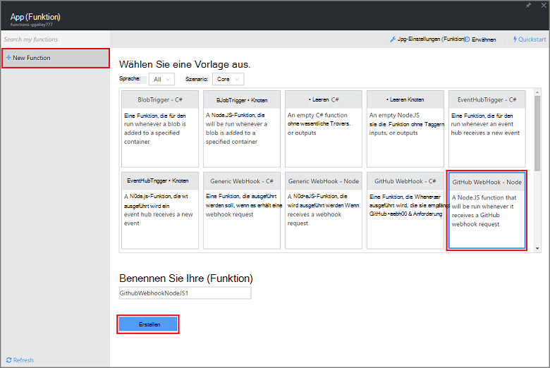
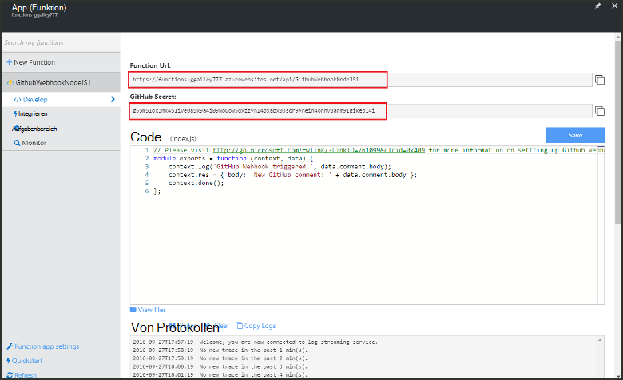
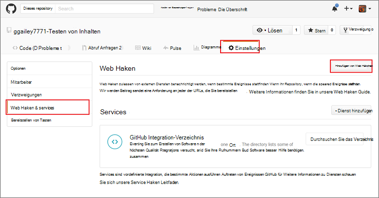
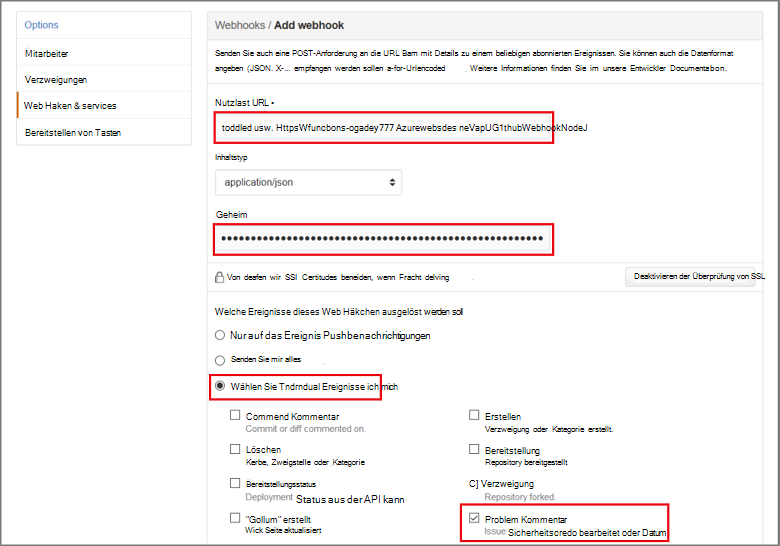

<properties
   pageTitle="Erstellen eines Web Häkchen oder API Azure-Funktion | Microsoft Azure"
   description="Rufen Sie Azure-Funktionen verwenden eine Funktion zu erstellen, die von einer WebHook oder -API aufgerufen wird."
   services="azure-functions"
   documentationCenter="na"
   authors="ggailey777"
   manager="erikre"
   editor=""
   tags=""
   />

<tags
   ms.service="functions"
   ms.devlang="multiple"
   ms.topic="get-started-article"
   ms.tgt_pltfrm="multiple"
   ms.workload="na"
   ms.date="08/30/2016"
   ms.author="glenga"/>
   
# Erstellen eines Webhook oder API Azure (Funktion)

Azure Funktionen ist eine ereignisgesteuerten, berechnen bei Bedarf, die ermöglicht, die Sie erstellen geplant oder ausgelöst Einheiten von Code in einer Vielzahl von Sprachen implementiert. Um weitere Informationen zur Azure-Funktionen finden Sie unter [Übersicht über Azure-Funktionen](functions-overview.md).

In diesem Thema wird gezeigt, wie eine neue Node.js-Funktion zu erstellen, die von einer GitHub Webhook aufgerufen wird. Die neue Funktion wird basierend auf einer vordefinierten Vorlage im Portal Azure Funktionen erstellt. Sie können auch in einem kurzen Video wird um anzuzeigen, wie diese Schritte im Portal ausgeführt werden.

## Video ansehen

Das folgende Video zeigen, wie Sie die grundlegenden Schritte in diesem Lernprogramm ausführen 

[AZURE.VIDEO create-a-web-hook-or-api-azure-function]

##Erstellen Sie eine Funktion Webhook ausgelöst, aus der Vorlage

Eine Funktion app hostet die Ausführung der Funktionen in Azure. Bevor Sie eine Funktion erstellen können, müssen Sie ein aktives Azure-Konto haben. Wenn Sie bereits über ein Azure-Konto, [stehen kostenlose Konten](https://azure.microsoft.com/free/)besitzen. 

1. Wechseln Sie zu dem [Portal Azure-Funktionen](https://functions.azure.com/signin) und mit Ihrem Azure-Konto anmelden.

2. Wenn Sie eine vorhandenen Funktion app zu verwenden, wählen Sie es in **Ihre apps Funktion** haben klicken Sie dann auf **Öffnen**. Zum Erstellen einer neuen Funktion app, geben Sie einen eindeutigen **Namen** für Ihre neue Funktion app oder übernehmen Sie die generierten, wählen Ihr bevorzugtes **Region**und dann auf **Erstellen + erste Schritte**. 

3. Klicken Sie in Ihrer app (Funktion) auf **+ neue Funktion** > **GitHub Webhook - Knoten** > **Erstellen**. Dies erstellt eine Funktion mit einem Standardnamen, der auf die angegebene Vorlage basiert. 

     

4. **Entwicklung**Beachten Sie die Stichprobe express.js-Funktion im **Codefenster** . Diese Funktion erhält eine GitHub Anforderung über ein Problem Kommentar Webhook, den Text Problem protokolliert und sendet eine Antwort auf die Webhook als `New GitHub comment: <Your issue comment text>`.

     

5. Kopieren Sie die **URL (Funktion)** und **GitHub geheim** Werte ein. Sie benötigen diese, wenn Sie die Webhook in GitHub erstellen. 

6. Führen Sie einen Bildlauf nach unten bis zum **Ausführen**, beachten Sie vordefinierte JSON Textkörper eines Kommentars Problem im Hauptteil Anforderung, und klicken Sie auf **Ausführen**. 
 
    Sie können eine neue Vorlage basierende Funktion immer testen rechts auf der Registerkarte **Entwicklung** durch eine bereitstellen erwartet Textkörper JSON-Daten und dann auf die Schaltfläche **Ausführen** . In diesem Fall enthält die Vorlage eines vordefinierten Textkörper für ein Problem Kommentar. 
 
Erstellen Sie als Nächstes den tatsächlichen Webhook in Ihrem Repository GitHub.

##Konfigurieren der webhook

1. Navigieren Sie in GitHub zu einem Repository, das Sie besitzen; Dies umfasst alle Repositorys, die Sie gespalten haben.
 
2. Klicken Sie auf **Einstellungen** > **Webhooks und Services** > **Webhook hinzufügen**.

       

3. Fügen Sie der Funktion URL und geheim als **Nutzlast URL** und **geheim**, und klicken Sie dann **mich auswählen einzelner Ereignisse**klicken Sie auf, aktivieren Sie **Problem** , und klicken Sie auf **Webhook hinzufügen**.

     

An diesem Punkt ist die GitHub Webhook so konfiguriert, dass die Funktion ausgelöst wird, wenn Sie ein neuen Problem Kommentar hinzugefügt wird.  
Nun ist es an der Zeit, testen Sie es aus.

##Testen Sie die Funktion

1. Öffnen Sie in Ihrem Repo GitHub die Registerkarte **Probleme** in einem neuen Browserfenster zu, klicken Sie auf **Neues Problem**, geben Sie einen Titel, dann klicken Sie auf **Neues Problem übermitteln**. Sie können auch ein vorhandenes Problem öffnen.

2. Geben Sie in der Ausgabe einen Kommentar ein, und klicken Sie auf **Kommentar**. An diesem Punkt, Sie können kehren Sie zu Ihrer neuen Webhook in GitHub und unter **Zuletzt verwendete Lieferungen** finden Sie unter, die Anforderung einer Webhook gesendet wurde und der Text der Antwort lautet `New GitHub comment: <Your issue comment text>`.

3. Wieder im Portal Funktionen Bildlauf nach unten zu den Protokollen und beachten, dass die Funktion ausgelöst wurde und der Wert `New GitHub comment: <Your issue comment text>` bezieht sich auf das streaming Protokolle.

##Nächste Schritte

Finden Sie unter folgenden Themen für Weitere Informationen zu Azure-Funktionen.

+ [Azure Funktionen Entwicklerreferenz](functions-reference.md)  
Programmierer Verweis zum Codieren von Funktionen.
+ [Testen der Azure-Funktionen](functions-test-a-function.md)  
Beschreibt verschiedene Tools und Verfahren zum Testen der Funktionen.
+ [Zum Skalieren Azure-Funktionen](functions-scale.md)  
Werden Servicepläne erhältlich Azure-Funktionen, einschließlich der dynamischen Serviceplan und wie Sie den richtigen Plan auswählen.  

[AZURE.INCLUDE [Getting Started Note](../../includes/functions-get-help.md)]
