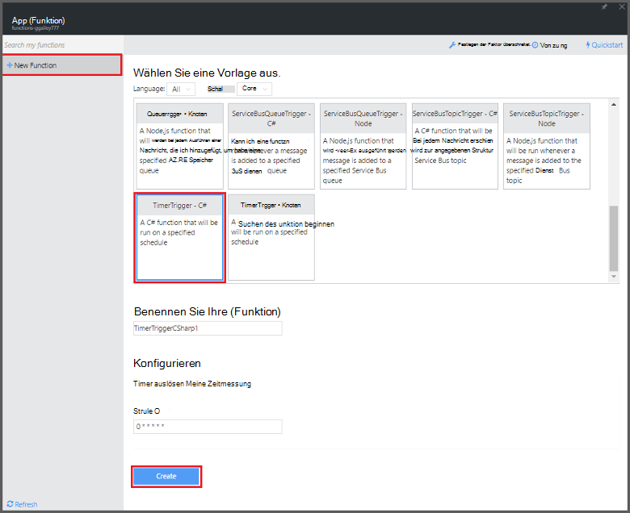
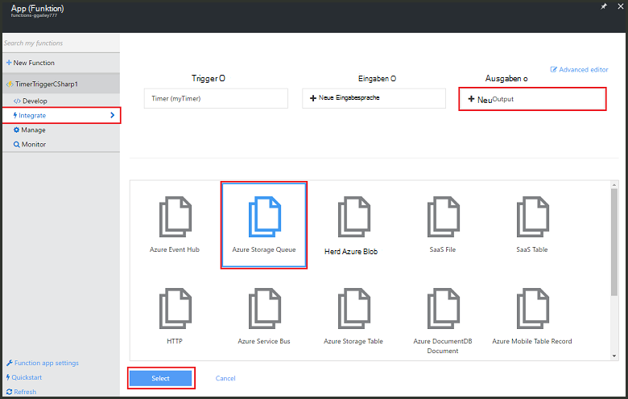
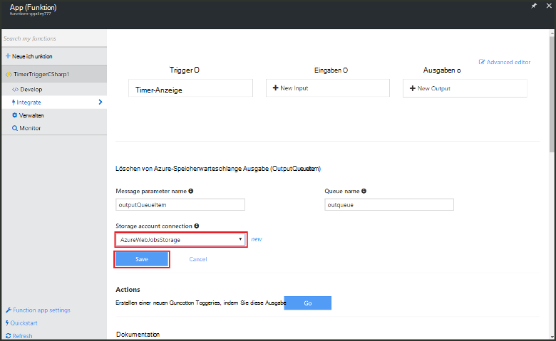

<properties
   pageTitle="Erstellen eines Ereignisses Verarbeitung Funktion | Microsoft Azure"
   description="Azure-Funktionen verwenden erstellen Sie eine C#-Funktion, die basierend auf ein Ereignis Timer ausgeführt wird."
   services="functions"
   documentationCenter="na"
   authors="ggailey777"
   manager="erikre"
   editor=""
   tags=""
   />

<tags
   ms.service="functions"
   ms.devlang="multiple"
   ms.topic="get-started-article"
   ms.tgt_pltfrm="multiple"
   ms.workload="na"
   ms.date="09/25/2016"
   ms.author="glenga"/>
   
# Erstellen eines Ereignisses Verarbeitung Azure (Funktion)

Azure Funktionen ist eine ereignisgesteuerten, berechnen bei Bedarf, die ermöglicht, die Sie erstellen geplant oder ausgelöst Einheiten von Code in einer Vielzahl von Sprachen implementiert. Um weitere Informationen zur Azure-Funktionen finden Sie unter [Übersicht über Azure-Funktionen](functions-overview.md).

In diesem Thema wird gezeigt, wie eine neue Funktion in c# erstellen, die ausgeführt wird basierend auf ein Ereignis Timer Nachrichten an eine Speicherwarteschlange hinzufügen. 

## Erforderliche Komponenten 

Bevor Sie eine Funktion erstellen können, müssen Sie ein aktives Azure-Konto haben. Wenn Sie bereits über ein Azure-Konto, [stehen kostenlose Konten](https://azure.microsoft.com/free/)besitzen.

## Erstellen Sie eine Funktion Timer-ausgelöst wurde aus der Vorlage

Eine Funktion app hostet die Ausführung der Funktionen in Azure. Bevor Sie eine Funktion erstellen können, müssen Sie ein aktives Azure-Konto haben. Wenn Sie bereits über ein Azure-Konto, [stehen kostenlose Konten](https://azure.microsoft.com/free/)besitzen. 

1. Wechseln Sie zu dem [Portal Azure-Funktionen](https://functions.azure.com/signin) und mit Ihrem Azure-Konto anmelden.

2. Wenn Sie eine vorhandenen Funktion app zu verwenden, wählen Sie es in **Ihre apps Funktion** haben klicken Sie dann auf **Öffnen**. Zum Erstellen einer neuen Funktion app, geben Sie einen eindeutigen **Namen** für Ihre neue Funktion app oder übernehmen Sie die generierten, wählen Ihr bevorzugtes **Region**und dann auf **Erstellen + erste Schritte**. 

3. Klicken Sie in Ihrer app (Funktion) auf **+ neue Funktion** > **TimerTrigger - C#-** > **Erstellen**. Dies erstellt eine Funktion mit einem Standardnamen, der für den standardmäßigen Zeitplan der einmal pro Minute ausgeführt wird. 

    

4. Klicken Sie in der neuen Funktion auf der Registerkarte **integrieren** > **Neue Ausgabe** > **Azure Speicherwarteschlange** > **auswählen**.

    

5. Wählen Sie in **Azure Speicherwarteschlange Ausgabe**eine vorhandene **Verbindung für Speicher-Konto**oder erstellen Sie einen neuen, und klicken Sie auf **Speichern**. 

    

6. Wieder in der **Entwicklung** Registerkarte Ersetzen Sie das vorhandene C#-Skript im **Codefenster** mit den folgenden Code ein:

        using System;
        
        public static void Run(TimerInfo myTimer, out string outputQueueItem, TraceWriter log)
        {
            // Add a new scheduled message to the queue.
            outputQueueItem = $"Ping message added to the queue at: {DateTime.Now}.";
            
            // Also write the message to the logs.
            log.Info(outputQueueItem);
        }

    Dieser Code Fügt eine neue Nachricht an die Warteschlange mit dem aktuellen Datum und Uhrzeit, wann die Funktion ausgeführt wird.

7. Klicken Sie auf **Speichern** , und schauen Sie sich die **Protokolle** Fenster für die Ausführung der nächsten (Funktion).

8. (Optional) Navigieren Sie zu dem Speicherkonto, und stellen Sie sicher, dass Nachrichten in der Warteschlange hinzugefügt werden.

9. Kehren Sie zur Registerkarte **integrieren** und ändern Sie das Feld Terminplan `0 0 * * * *`. Die Funktion wird nun einmal stündlich ausgeführt. 

Dies ist eine sehr vereinfachte Beispiel sowohl ein Timer Trigger und eine Speicherwarteschlange ausgeben Bindung. Weitere Informationen finden Sie unter sowohl in der [Azure-Funktionen Timer Trigger](functions-bindings-timer.md) den Themen [Trigger Azure-Funktionen und Bindungen für Azure-Speicher](functions-bindings-storage.md) .

##Nächste Schritte

Finden Sie unter folgenden Themen für Weitere Informationen zu Azure-Funktionen.

+ [Azure Funktionen Entwicklerreferenz](functions-reference.md)  
Programmierer Verweis für Codieren von Funktionen und Trigger und Bindungen definieren.
+ [Testen der Azure-Funktionen](functions-test-a-function.md)  
Beschreibt verschiedene Tools und Verfahren zum Testen der Funktionen.
+ [Zum Skalieren Azure-Funktionen](functions-scale.md)  
Werden Servicepläne erhältlich Azure-Funktionen, einschließlich der dynamischen Serviceplan und wie Sie den richtigen Plan auswählen.  

[AZURE.INCLUDE [Getting Started Note](../../includes/functions-get-help.md)]
