<properties 
    pageTitle="Verwenden Sie zum Verwalten von Azure Ressourcen Azure-Portal | Microsoft Azure" 
    description="Verwenden Sie zum Verwalten von Ressourcen Azure-Portal und Azure Ressource verwalten. Zeigt, wie für die Arbeit mit Dashboards zu Ressourcen zu überwachen." 
    services="azure-resource-manager,azure-portal" 
    documentationCenter="" 
    authors="tfitzmac" 
    manager="timlt" 
    editor="tysonn"/>

<tags 
    ms.service="azure-resource-manager" 
    ms.workload="multiple" 
    ms.tgt_pltfrm="na" 
    ms.devlang="na" 
    ms.topic="article" 
    ms.date="09/12/2016" 
    ms.author="tomfitz"/>

# Verwalten von Azure Ressourcen über portal

> [AZURE.SELECTOR]
- [Azure PowerShell](../powershell-azure-resource-manager.md)
- [Azure CLI](../xplat-cli-azure-resource-manager.md)
- [Portal](resource-group-portal.md) 
- [REST-API](../resource-manager-rest-api.md)

In diesem Thema wird gezeigt, wie das [Azure-Portal](https://portal.azure.com) mit [Azure Ressourcenmanager](../azure-resource-manager/resource-group-overview.md) zum Verwalten Ihrer Azure Ressourcen verwenden. Weitere Informationen zum Bereitstellen von Ressourcen über das Portal, finden Sie unter [Bereitstellen von Ressourcen mit Ressourcenmanager Vorlagen und Azure-Portal](../resource-group-template-deploy-portal.md).

Zurzeit unterstützt nicht jeder Dienst im Portal oder Ressourcenmanager. Für diese Dienste verwenden müssen Sie das [klassische Portal](https://manage.windowsazure.com)verwenden. Der Status der einzelnen Dienste finden Sie unter [Azure Portals Verfügbarkeitsdiagramm](https://azure.microsoft.com/features/azure-portal/availability/).

## Verwalten von Ressourcengruppen

1. Wählen Sie zum Anzeigen aller Ressourcengruppen in Ihrem Abonnement **Ressourcengruppen**ein.

    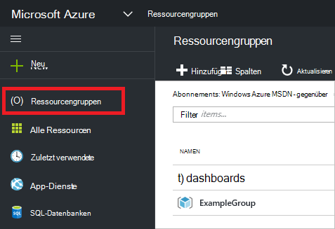

1. Wählen Sie zum Erstellen einer leeren Ressourcengruppe **Hinzufügen**aus.

    

1. Geben Sie einen Namen und einen Speicherort für die neue Ressourcengruppe ein. Wählen Sie auf **Erstellen**.

    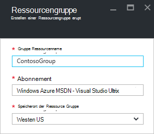

1. Sie müssen möglicherweise **Aktualisieren** , um die zuletzt erstellten Ressourcengruppe finden Sie unter auswählen.

    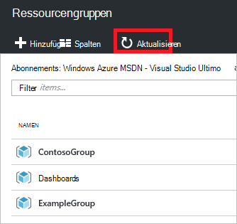

1. Wählen Sie **Spalten**aus, um die Informationen für die Ressourcengruppen angezeigt anzupassen.

    

1. Markieren Sie die Spalten hinzufügen, und wählen Sie dann auf **Aktualisieren**.

    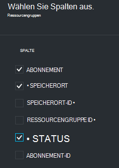

1. Weitere Informationen zum Bereitstellen von Ressourcen zu Ihrem neuen Ressourcengruppe, finden Sie unter [Bereitstellen von Ressourcen mit Ressourcenmanager Vorlagen und Azure-Portal](../resource-group-template-deploy-portal.md).

1. Für den Schnellzugriff zu einer Ressourcengruppe können Sie das Blade zum Dashboard anheften.

    

1. Das Dashboard zeigt die Ressourcengruppe und seine Ressourcen. Sie können entweder die Ressourcengruppen oder ihre Ressourcen zum Navigieren Sie zu dem Element auswählen.

    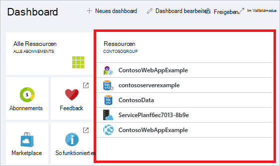

## Kategorisieren von Ressourcen

Sie können Ressourcengruppen und Ressourcen Ihre Bestände jederzeit logisch organisieren Kategorien anwenden. Informationen zum Arbeiten mit Kategorien finden Sie unter [Verwenden von Kategorien, um Ihre Azure Ressourcen zu organisieren](../resource-group-using-tags.md).

[AZURE.INCLUDE [resource-manager-tag-resource](../../includes/resource-manager-tag-resources.md)]

## Überwachen von Ressourcen

Wenn Sie eine Ressource auswählen, bietet das Ressource Blade Standard-Diagramme und Tabellen für diesen Ressourcentyp für die Überwachung.

1. Beachten Sie im Abschnitt **Überwachung** , und wählen Sie eine Ressource aus. Sie enthält Diagramme, die für die Ressourcenart relevant sind. Die folgende Abbildung zeigt die Standardeinstellung für die Überwachung Daten für ein Speicherkonto.

    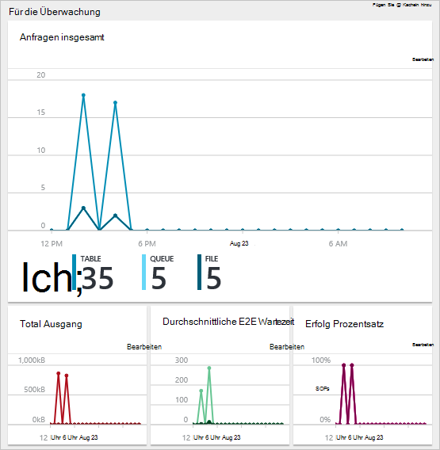

1. Sie können ein Abschnitts des Blades zum Dashboard anheften, indem Sie die Auslassungspunkte (...) über dem Bereich auswählen. Sie können auch anpassen die Größe im Abschnitt in das Blade oder vollständig entfernen. Die folgende Abbildung zeigt, wie Sie anheften, anpassen oder entfernen Sie den Abschnitt CPU- und.

    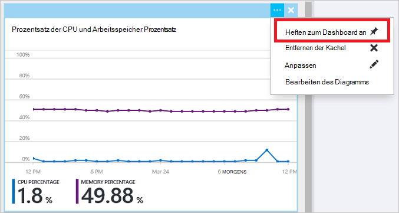

1. Nach dem Fixieren im Abschnitts mit dem Dashboard, sehen Sie auf dem Dashboard Zusammenfassung. Und markieren Sie das sofort gelangen Sie zum Weitere Details zu den Daten.

    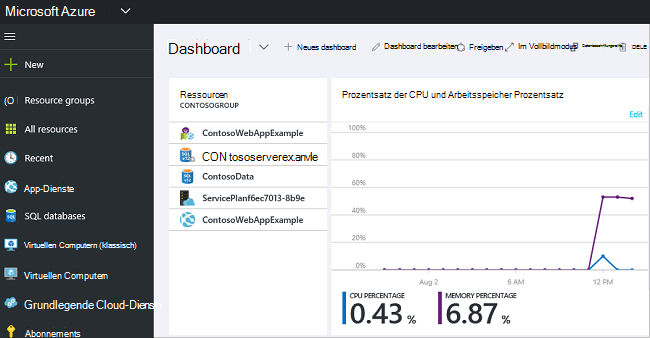

1. Um die Daten vollständig anpassen möchten, die Sie über das Portal überwachen, navigieren Sie zu Ihrer Standard-Dashboard, und wählen Sie **Neues Dashboard**aus.

    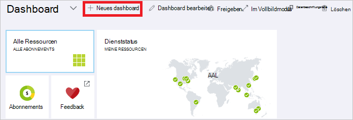

1. Geben Sie einen Namen des neuen Dashboards, und ziehen Sie Kacheln auf dem Dashboard. Die Kacheln werden nach anderen Optionen gefiltert.

    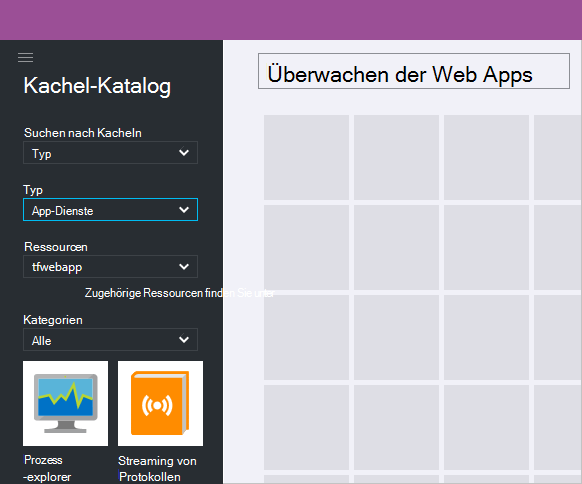

     Weitere Informationen zum Arbeiten mit Dashboards, finden Sie unter [Erstellen und Freigeben von Dashboards Azure-Portal](azure-portal-dashboards.md).

## Verwalten von Ressourcen

In das Blade für eine Ressource sehen Sie die Optionen für die Ressource verwalten. Im Portal bietet Verwaltungsoptionen für diesen bestimmten Ressourcentyp. Die Befehle zur Verwaltung des im oberen Bereich des Blades Ressource, und klicken Sie auf der linken Seite angezeigt.

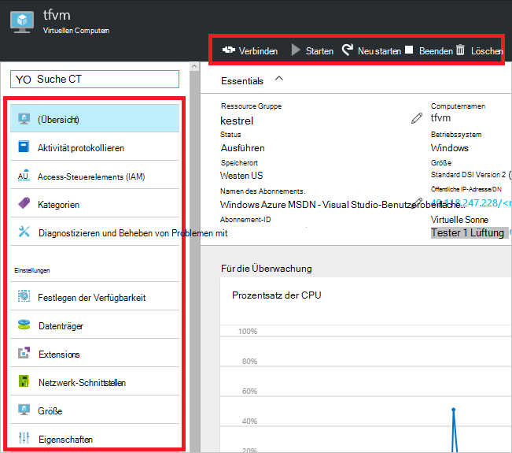

Führen Sie mit den folgenden Optionen JOIN-Operationen wie das Starten und Beenden eines virtuellen Computers oder die Eigenschaften des virtuellen Computers neu zu konfigurieren.

## Verschieben von Ressourcen

Wenn Sie Ressourcen zu einem anderen Ressourcengruppe oder ein anderes Abonnement wechseln müssen, finden Sie unter [Verschieben von Ressourcen zu neuen Ressourcengruppe oder das Abonnement](../resource-group-move-resources.md).

## Von Sperrenressourcen

Sie können ein Abonnement, Ressourcengruppe oder Ressource, um zu verhindern, dass andere Benutzer in Ihrer Organisation versehentlich löschen oder Ändern von kritischen Ressourcen sperren. Weitere Informationen finden Sie unter [Sperrenressourcen Azure Ressourcenmanager](../resource-group-lock-resources.md).

[AZURE.INCLUDE [resource-manager-lock-resources](../../includes/resource-manager-lock-resources.md)]

## Zeigen Sie Ihrer Abonnements und Kosten an

Sie können Informationen zu Ihrem Abonnement und die Kosten Rollup für alle Ressourcen anzeigen. Wählen Sie **Abonnements** und das Abonnement, das Sie anzeigen möchten. Sie müssen möglicherweise nur ein Abonnement auswählen.

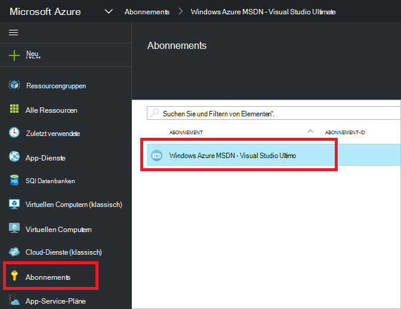

Innerhalb der Blade Abonnements finden Sie unter einen Satz brennen.

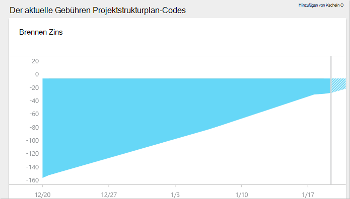

Und einen Überblick über die Kosten nach der Ressourcenart.

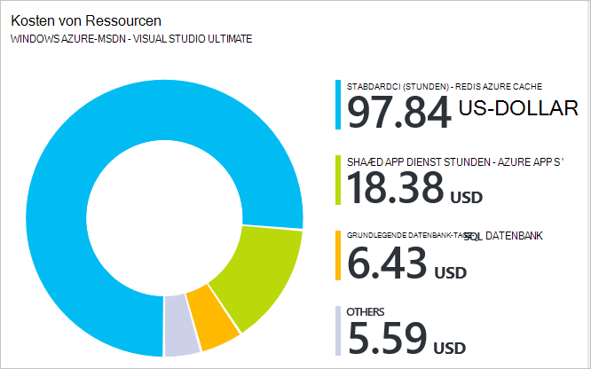

## Exportieren der Vorlage

Nach dem Einrichten Ihrer Ressourcengruppe, möchten Sie möglicherweise die Ressourcenmanager Vorlage für die Ressourcengruppe anzeigen. Exportieren der Vorlage bietet zwei Vorteile:

1. Sie können einfach zukünftige Bereitstellungen der Lösung automatisieren, da die Vorlage alle vollständige Infrastruktur enthält.

2. Sie können mit vertraut Vorlagensyntax anhand der bei der JSON JavaScript Object Notation (), die Ihre Lösung darstellt.

Eine schrittweise Anleitung dazu finden Sie unter [Exportieren Azure Ressourcenmanager Vorlage aus vorhandenen Ressourcen](../resource-manager-export-template.md).

## Löschen von Ressourcengruppe oder Ressourcen

Löschen einer Ressourcengruppe löscht alle darin enthaltenen Ressourcen. Sie können auch einzelne Ressourcen innerhalb einer Ressourcengruppe löschen. Vorsichtsmaßnahmen durchführen, wenn Sie eine Ressourcengruppe gelöscht werden, da es möglicherweise Ressourcen in anderen Ressourcengruppen, die mit dem Kontakt verknüpft werden soll. Ressourcenmanager verknüpfte Ressourcen nicht gelöscht, aber sie funktionieren möglicherweise nicht ordnungsgemäß ohne die erwarteten Ressourcen.

## Nächste Schritte

- Zum Anzeigen der Überwachungsprotokolle finden Sie unter [Überwachen von Vorgängen mit Ressourcen-Manager](../resource-group-audit.md).
- Bereitstellungsfehler zur Problembehandlung, finden Sie unter [Problembehandlung Ressource Gruppe Bereitstellungen mit Azure-Portal](../resource-manager-troubleshoot-deployments-portal.md).
- Um Ressourcen über das Portal bereitstellen zu können, finden Sie unter [Bereitstellen von Ressourcen mit Ressourcenmanager Vorlagen und Azure-Portal](../resource-group-template-deploy-portal.md).
- Zum Verwalten des Zugriffs auf Ressourcen, finden Sie unter [Verwenden von rollenzuweisungen zum Verwalten des Zugriffs auf Ihre Abonnementressourcen Azure](../active-directory/role-based-access-control-configure.md).

