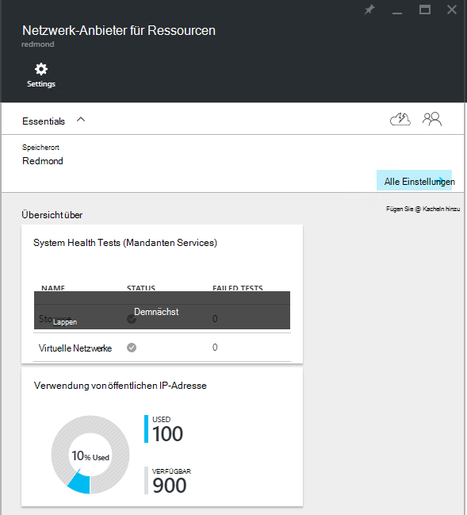
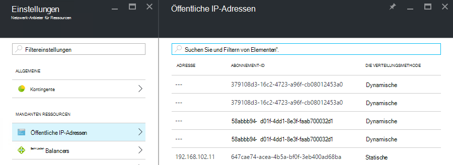

<properties
    pageTitle="Anzeigen von öffentliche IP-Adresse Nutzung in TP2 | Microsoft Azure"
    description="Administratoren können den Verbrauch von öffentlichen IP-Adressen in einem Bereich anzeigen."
    services="azure-stack"
    documentationCenter=""
    authors="ScottNapolitan"
    manager="darmour"
    editor=""/>

<tags
    ms.service="azure-stack"
    ms.workload="na"
    ms.tgt_pltfrm="na"
    ms.devlang="na"
    ms.topic="get-started-article"
    ms.date="09/26/2016"
    ms.author="scottnap"/>

# Öffentliche IP-Adresse Nutzung in Azure Stapel TP2 anzeigen

Als Service-Administrator können Sie die Anzahl der öffentlichen IP-Adressen anzeigen, die zugeordnet wurden, um den Mandanten, die Anzahl der öffentlichen IP-Adressen, die für die Zuordnung noch verfügbar sind, und den Prozentsatz der öffentlichen IP-Adressen, die in diesem Speicherort zugewiesen wurden.

Die Kachel **Öffentliche IP-Adresse Verwendung** zeigt die Gesamtzahl der öffentlichen IP-Adressen, die verfügen über alle öffentlichen IP-Adresspools auf der Textur verbraucht wurde, ob er für verwendet wurden Mandanten IaaS VM Instanzen, Fabric Infrastrukturdienste oder öffentliche IP-Adressressourcen, die explizit von Mandanten erstellt wurden.

Der Zweck der Kacheln ist Stapel Azure-Administratoren einen Eindruck davon, die Gesamtzahl der öffentlichen IP-Adressen erhalten, die an diesem Speicherort verbraucht wurden. Auf diese Weise können Administratoren feststellen, ob sie auf diese Ressource niedrig ausgeführt werden.

In den **Einstellungen** Blade enthält das Menüelement **Öffentliche IP-Adressen** unter **Mandanten Ressourcen** nur die öffentlichen IP-Adressen, die *explizit durch Mandanten erstellt*wurden. Daher immer die Anzahl der **zur Verwendung** der Kachel öffentliche IP-Adressen für die **Verwendung von öffentlichen IP-Adresse** abweicht (größer als) ist die Zahl auf die Kachel **Öffentliche IP-Adressen** unter **Mandanten Ressourcen**.

## Anzeigen von Verwendungsinformationen der öffentlichen IP-Adresse

Die Gesamtzahl der öffentlichen IP-Adressen anzeigen möchten, die in der Region verbraucht wurden:

1.  Klicken Sie im Portal Azure Stapel klicken Sie auf **Durchsuchen**, und wählen Sie dann auf **Ressourcenanbieter**.

2.  Wählen Sie aus der Liste der **Ressource** **Netzwerk Ressource Anbieter Administrator**ein.

3.  Sie können auch **Durchsuchen klicken | Speicherorte** und wählen Sie den Speicherort aus, die Sie aus der Liste anzeigen möchten. Wählen Sie dann auf die Kachel **Ressourcenanbieter** **Netzwerk Ressource Anbieter Administrator**aus.

4.  Das **Netzwerk-Anbieter für Ressourcen** Startseite für Blade zeigt die Kachel **Öffentliche IP-Adresse Verwendung** im Abschnitt **Übersicht** .

Orientieren Sie, die die **zur Verwendung** Zahl steht für die Anzahl der öffentliche IP-Adresse aus allen öffentlichen IP Adressen Pools in diesem Speicherort Adresse, die zugewiesen werden. Der **Verfügbare** Zahl steht für die Anzahl der öffentliche IP-Adresse aus allen öffentlichen IP Adressen Adresse-Pools bereitgestellt, die nicht zugewiesen wurden und noch verfügbar sind. Die **% zur Verwendung** Zahl steht für die Anzahl der verwendeten oder zugeordneten Adressen als Prozentsatz der Gesamtzahl der öffentliche IP-Adresse in alle öffentlichen IP-Adressen Adresse Pools an diesem Speicherort.

## Anzeigen der öffentlichen IP-Adressen, die von Abonnements Mandanten erstellt wurden

Um eine Liste öffentlicher IP-Adressen anzuzeigen, die explizit von Mandanten Abonnements in einer bestimmten Region erstellt wurden, wechseln Sie zu der **Netzwerk Ressource Anbieter Administrator**Falz **Einstellungen** , und wählen Sie dann auf **Öffentliche IP-Adressen**.

Sie können feststellen, dass einige öffentlichen IP-Adressen, die dynamisch zugeordnet wurden, aber verfügen nicht über eine Adresse, die ihnen zugeordneten noch nicht in der Liste angezeigt. Dies ist, da die Adressressource im Netzwerk Ressourcenanbieter, aber nicht im Netzwerkcontroller noch erstellt wurde.

Netzwerk-Controller weist keine Adresse auf diese Ressource, bis es tatsächlich an eine Schnittstelle, ein Netzwerk Benutzeroberfläche Netzwerkschnittstellenkarte, ein Lastenausgleich oder ein Gateway virtuelles Netzwerk gebunden ist. Wenn die öffentliche IP-Adresse an eine Schnittstelle gebunden ist, den Netzwerk-Controller weist eine IP-Adresse zu, und sie im Feld **Adresse** angezeigt wird.

## Anzeigen der öffentlichen IP-Adresse Informationen vergleichbare Zusammenfassungstabelle

Es gibt eine Reihe von anderen Fällen in der öffentliche IP-Adressen zugewiesen werden, die bestimmen, ob die Adresse in einer Liste oder einer anderen angezeigt wird.

| **Öffentliche IP-Adresse Zuordnung Groß-/Kleinschreibung** | **Zusammenfassung der Verwendung wird** | **Wird in der Liste der Mandanten öffentlichen IP-Adressen** |
| ------------------------------------- | ----------------------------| ---------------------------------------------- |
| Dynamische öffentlichen IP-Adresse zu einer Netzwerkkarte oder laden Lastenausgleich (temporäre) noch nicht zugewiesen | Nein | Ja |
| Dynamische öffentlichen zugewiesene IP-Adresse einer Lastenausgleich NETZWERKKARTEN- oder laden. | Ja | Ja |
| Statische öffentliche zugewiesene IP-Adresse eines Mandanten NETZWERKKARTEN- oder laden Lastenausgleich. | Ja | Ja |
| Statische öffentliche zugewiesene IP-Adresse einer Fabric Infrastruktur Service-Endpunkts an. | Ja | Nein |
| Öffentliche IP-Adresse implizit für IaaS VM Instanzen erstellt und für ausgehende NAT auf das virtuelle Netzwerk verwendet. Diese sind Hintergrundinformationen erstellt, wenn Sie ein Mandanten eine Instanz der virtueller Computer erstellt, sodass virtuellen Computern Informationen mit dem Internet versenden können. | Ja | Nein |
