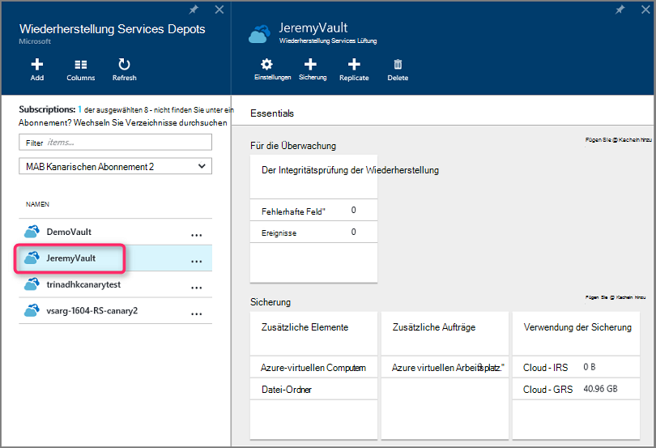
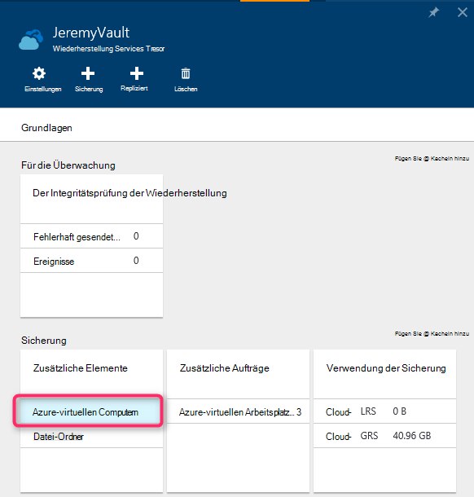
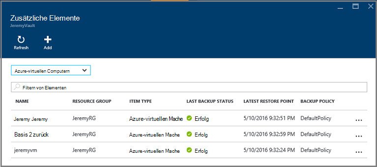
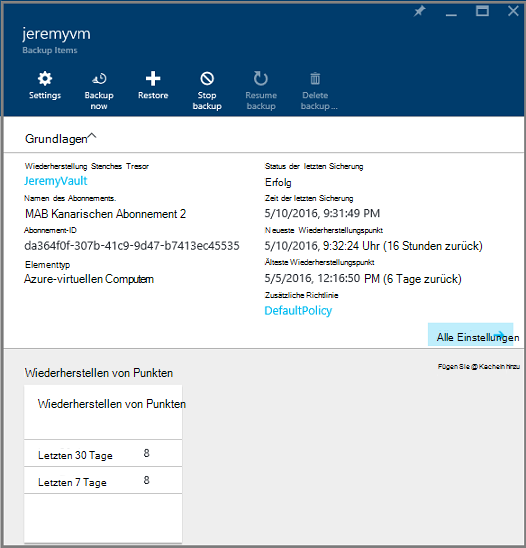
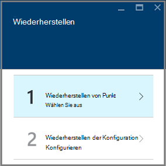
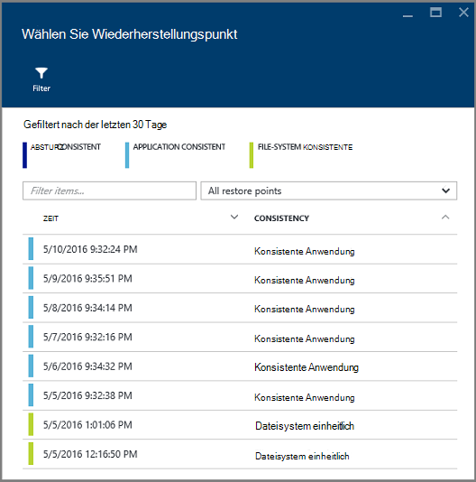
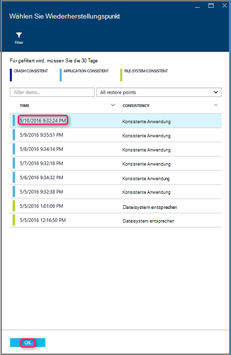
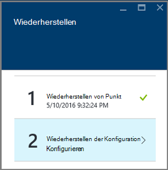
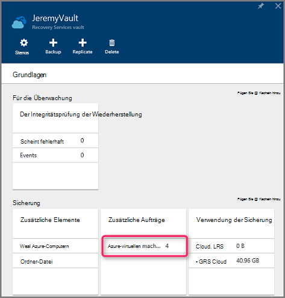

<properties
    pageTitle="Wiederherstellen von virtuellen Computern aus einer Sicherung mit Azure-Portal | Microsoft Azure"
    description="Wiederherstellen einer Azure-virtuellen Computern von einem Wiederherstellung mit Azure-portal"
    services="backup"
    documentationCenter=""
    authors="markgalioto"
    manager="cfreeman"
    editor=""
    keywords="Stellen Sie die Sicherung wieder her; zum Wiederherstellen; Wiederherstellungspunkt;"/>

<tags
    ms.service="backup"
    ms.workload="storage-backup-recovery"
    ms.tgt_pltfrm="na"
    ms.devlang="na"
    ms.topic="article"
    ms.date="08/10/2016"
    ms.author="trinadhk; jimpark;"/>

# Wiederherstellen von virtuellen Computern mithilfe von Azure-portal

> [AZURE.SELECTOR]
- [Wiederherstellen von virtuellen Computern Classic-Portal](backup-azure-restore-vms.md)
- [Wiederherstellen von virtuellen Computern Azure-Portal](backup-azure-arm-restore-vms.md)

Schützen von Daten durch annehmen von Momentaufnahmen der Daten in festgelegten Intervallen. Diese Momentaufnahmen als Wiederherstellungspunkte bekannt sind, und bei der Wiederherstellung Services Depots gespeichert sind. Wenn oder ist es erforderlich, reparieren oder Wiederherstellen eines virtuellen Computers, können Sie den virtuellen Computer in jedem der Wiederherstellungspunkte gespeicherten wiederherstellen. Wenn Sie einen Wiederherstellungspunkt wiederherstellen, zurückzukehren, oder Sie den virtuellen Computer in den Zustand wiederherstellen, wenn der Wiederherstellungspunkt geöffnet wurde. In diesem Artikel wird erläutert, wie ein virtuellen Computers wiederherstellen.

> [AZURE.NOTE] Azure weist zwei Bereitstellungsmodelle für das Erstellen von und Arbeiten mit Ressourcen: [Ressourcenmanager und Classic](../resource-manager-deployment-model.md). Dieser Artikel enthält Informationen und Verfahren für Wiederherstellen virtueller Computer mit dem Modell Ressourcenmanager bereitgestellt.

## Wiederherstellen eines Wiederherstellungspunkts

1. Melden Sie sich bei der [Azure-portal](http://portal.azure.com/)

2. Klicken Sie im Menü Azure klicken Sie auf **Durchsuchen** , und geben Sie in der Liste der Dienste, **Wiederherstellung Services**. Die Liste der Dienste passt auf Eingabe. Wenn Sie **Wiederherstellung Services Depots**angezeigt wird, wählen sie aus.

    

    Die Liste der +++ in das Abonnement wird angezeigt.

    

3. Wählen Sie aus der Liste des Tresors zugeordnet den virtuellen Computer, die Sie wiederherstellen möchten. Wenn Sie den Tresor klicken, wird deren Dashboard geöffnet.

    

4. Jetzt, da Sie im Dashboard Tresor sind. Auf die **Sicherung Elemente** Kachel und **Azure-virtuellen Computern** zum Anzeigen der virtuellen Computern der Tresor zugeordnet.

    

    Das **Sicherung Elemente** Blade wird geöffnet und zeigt eine Liste der Azure-virtuellen Computern.

    

5. Wählen Sie in der Liste eines virtuellen Computers auf das Dashboard zu öffnen. In den Bereich Überwachung, der die wiederherstellen-Punkt-Kachel enthält wird das Dashboard virtueller Computer geöffnet.

    

6. Klicken Sie im Menü Dashboard virtueller Computer auf **Wiederherstellen**

    

    Das Blade wiederherstellen wird geöffnet.

    

7. Klicken Sie auf das Blade **Wiederherstellen** auf **Punkt wiederherstellen** , um das Blade **Punkt wiederherstellen wählen** zu öffnen.

    

    Standardmäßig zeigt das Dialogfeld alle Wiederherstellungspunkte aus der letzten 30 Tage an. Verwenden Sie den **Filter** so ändern Sie den Zeitbereich des Wiederherstellungspunkte angezeigt wird. Standardmäßig werden alle Konsistenz wiederherstellen interessante angezeigt. Ändern Sie **Alle wiederherstellen Punkte** Filters zum Auswählen einer bestimmten Konsistenz von Wiederherstellungspunkten. Weitere Informationen zu jedem der Wiederherstellung zeigen Sie, finden Sie die Erläuterung der [Konsistenz der Daten](./backup-azure-vms-introduction.md#data-consistency).  
    - Wählen Sie **Wiederherstellen Punkt Konsistenz** aus dieser Liste aus:
        - Abstürzen Sie konsistent Wiederherstellungspunkte,
        - Anwendung konsistent wiederherstellen Punkt,
        - Datei System konsistent Wiederherstellungspunkte
        - Alle wiederherstellen Punkte.  

8. Wählen Sie einen Wiederherstellungspunkt aus, und klicken Sie auf **OK**.

    

    Das Blade **Wiederherstellen** zeigt der Punkt wiederherstellen festgelegt ist.

    

9. Klicken Sie auf das Blade **Wiederherstellen** **-Konfiguration wiederherstellen** wird automatisch geöffnet nach Wiederherstellungspunkt festgelegt ist.

    

## Auswählen einer virtuellen Computer-Konfigurations wiederherstellen

Jetzt, da Sie den Wiederherstellungspunkt ausgewählt haben, wählen Sie eine Konfiguration für Ihre Wiederherstellen virtueller Computer. Ihre Auswahlmöglichkeiten für das Konfigurieren von den wiederhergestellten virtuellen Computer werden verwendet: Azure-Portal oder PowerShell.

> [AZURE.NOTE] Portal bietet eine Option zum schnellen Erstellen für wiederhergestellten virtuellen Computer an. Wenn Sie die Konfiguration virtueller Computer den kommenden wiederhergestellten virtuellen Computer anpassen möchten, mithilfe von PowerShell wiederherstellen Datenträger gesichert und verbinden Sie sie mit der Auswahl der Konfiguration virtueller Computer. [Wiederherstellen eines virtuellen Computers mit speziellen Netzwerkkonfigurationen](#restoring-vms-with-special-network-configurations)finden Sie unter.

1. Wenn Sie nicht bereits vorhanden sind, wechseln Sie zu dem Blade **Wiederherstellen** . Vergewissern Sie sich einen **Punkt wiederherstellen** ausgewählt wurde, und klicken Sie auf **Konfiguration wiederherstellen** , um die **Konfiguration der Wiederherstellung** Blade zu öffnen.

    

2. Geben Sie ein, oder klicken Sie auf das Blade **-Konfiguration wiederherstellen** wählen Sie Werte für jede der folgenden Felder aus:
    - **Name des virtuellen Computers** - Geben Sie einen Namen für den virtuellen Computer. Der Name muss der Ressourcengruppe (für einen virtuellen Computer Ressourcenmanager bereitgestellt) oder Cloud-Dienst (für einen klassischen virtuellen Computer) eindeutig sein. Des virtuellen Computers nicht ersetzt werden, wenn sie in das Abonnement bereits vorhanden ist.
    - **Ressourcengruppe** - eine vorhandene Ressourcengruppe verwenden oder einen neuen erstellen. Wenn Sie einen klassischen virtuellen wiederherstellen möchten, verwenden Sie dieses Feld den Namen der neuen-Cloud-Dienst an. Wenn Sie sind einen neue Ressource Gruppe/Cloud-Dienst erstellen, muss der Name global eindeutig sein. In der Regel der Namen der Cloud-Dienst wird zugeordnet einer öffentlich zugänglichen URL - Beispiel: [Cloudservice]. cloudapp.net. Wenn Sie versuchen, einen Namen für die Ressource Gruppe/Cloud-Cloud-Dienst verwenden, die bereits verwendet wurde, weist Azure Ressource Gruppe/Cloud-Dienst denselben Namen wie dem virtuellen Computer. Azure zeigt Ressource Gruppen/Cloud-Diensten und virtuellen Computern keine Gruppen die zugeordnet. Weitere Informationen finden Sie unter [Migrieren von Gruppen die zu einem regionalen virtuellen Netzwerk (VNet)](../virtual-network/virtual-networks-migrate-to-regional-vnet.md).
    - **Virtuelle Netzwerk** - wählen Sie das virtuelle Netzwerk (VNET), wenn Sie den virtuellen Computer zu erstellen. Das Feld enthält alle VNETs mit dem Abonnement verknüpft ist. Ressourcengruppe für den virtuellen Computer wird in Klammern angezeigt.
    - **Subnetz** - die VNET Subnetze aufweist, wird das erste Subnetz standardmäßig aktiviert. Falls weitere Subnetze sind, wählen Sie das gewünschte Subnetz aus.
    - **Speicher-Konto** – in diesem Menü eine Liste der Speicherkonten in am selben Speicherort wie der Wiederherstellung Services Tresor. Wenn Sie ein Speicherkonto auswählen, wählen Sie ein Konto, das am selben Speicherort wie der Wiederherstellung Services Tresor teilt. Speicherkonten, die Zone redundant sind, werden nicht unterstützt. Wenn es keine Speicherkonten mit am selben Speicherort wie der Wiederherstellung Services Tresor sind, müssen Sie eine vor dem Starten des Wiederherstellungsvorgangs erstellen. Der Speicher Kontotyp Replikation ist in Klammern angegeben ist.

    > [AZURE.NOTE] Wenn Sie einen virtuellen Ressourcenmanager bereitgestellt wiederherstellen möchten, müssen Sie ein virtuelles Netzwerk (VNET) identifizieren. Ein virtuelles Netzwerk (VNET) ist optional für einen klassischen virtuellen.

3. Klicken Sie in der Blade **-Konfiguration wiederherzustellen** auf **OK** , um die Konfiguration wiederherstellen abzuschließen.

4. Klicken Sie auf das Blade **Wiederherstellen** klicken Sie auf **Wiederherstellen** , um bei der Wiederherstellung auslösen.

    

## Nachverfolgen der Wiederherstellung

Nachdem Sie bei der Wiederherstellung ausgelöst wird, erstellt der Dienst Sicherung ein Auftrags zum Nachverfolgen der Wiederherstellung aus. Der Dienst Sicherung auch erstellt und vorübergehend die Benachrichtigung im Benachrichtigungsbereich des Portals anzeigt. Wenn Sie die Benachrichtigung nicht angezeigt werden, können Sie immer das Symbol für Benachrichtigungen zum Anzeigen Ihrer Benachrichtigungen klicken.

Anzeigen des Vorgangs, während verarbeitet wird oder anzeigen, wenn er abgeschlossen, Öffnen der Liste der Projekte Sicherung.

1. Klicken Sie im Menü Azure klicken Sie auf **Durchsuchen** , und geben Sie in der Liste der Dienste, **Wiederherstellung Services**. Die Liste der Dienste passt auf Eingabe. Wenn Sie **Wiederherstellung Services Depots**angezeigt wird, wählen sie aus.

    

    Die Liste der +++ in das Abonnement wird angezeigt.

    

2. Wählen Sie aus der Liste des Tresors mit dem virtuellen Computer Sie wiederhergestellt verknüpft ist. Wenn Sie den Tresor klicken, wird deren Dashboard geöffnet.

3. Im Tresor Dashboard für die **Sicherung Aufträge** Kachel, klicken Sie auf **Azure-virtuellen Computern** zum Anzeigen der Einzelvorgänge mit dem Tresor verknüpft ist.

    

    Das **Sicherung Aufträge** Blade wird geöffnet und zeigt eine Liste der Aufträge.

    

## Wiederherstellen virtueller Computer mit speziellen Netzwerkkonfigurationen
Es ist zum Sichern und Wiederherstellen von virtuellen Computern mit den folgenden Inhalte Netzwerkkonfigurationen möglich. Diese Konfigurationen erfordern jedoch einige besondere Aspekte, während Sie die Schritte zum Wiederherstellen.

- Virtuellen Computern unter Lastenausgleich (internen und externen)
- Virtueller Computer mit mehreren reservierte IP-Adressen
- Virtueller Computer mit mehreren NICs

>[AZURE.IMPORTANT] Wenn Sie die Inhalte Netzwerkkonfiguration für virtuelle Computer zu erstellen, müssen Sie PowerShell verwenden, zum Erstellen von virtuellen Computern von Datenträger wiederhergestellt.

Um den virtuellen Computern nach der Wiederherstellung auf einem Datenträger vollständig zu erstellen, gehen Sie folgendermaßen vor:

1. Wiederherstellen der Datenträger aus einer Wiederherstellung Services Tresor mithilfe der [PowerShell](../backup-azure-vms-automation.md#restore-an-azure-vm)

2. Erstellen der virtuellen Computer Konfigurations für Lastenausgleich erforderlich / mehrere NIC/Vielfache reservierte IP mithilfe der PowerShell-Cmdlets und mithilfe von darauf, um die virtuellen Computer der erstellen gewünscht Konfiguration.
    - Erstellen von virtuellen Computer in der Cloud-Dienst mit [internen Lastenausgleich](https://azure.microsoft.com/documentation/articles/load-balancer-internal-getstarted/)
    - Erstellen von virtuellen Computer für die Verbindung mit [Internet gegenüberliegende Lastenausgleich] (https://azure.microsoft.com/en-us/documentation/articles/load-balancer-internet-getstarted/)
    - Erstellen von virtuellen Computer mit [mehreren NICs](https://azure.microsoft.com/documentation/articles/virtual-networks-multiple-nics/)
    - Erstellen von virtuellen Computer mit [mehreren reservierte IP-Adressen](https://azure.microsoft.com/documentation/articles/virtual-networks-reserved-public-ip/)

## Nächste Schritte
Jetzt, da Sie Ihre virtuellen Computern wiederherstellen können, finden Sie unter Problembehandlung Informationen auf häufigen mit virtuellen Computern. Darüber hinaus checken Sie im Artikel zur Verwaltung von Aufgaben mit Ihrer virtuellen Computer aus.

- [Problembehandlung bei Fehlern](backup-azure-vms-troubleshoot.md#restore)
- [Verwalten von virtuellen Computern](backup-azure-manage-vms.md)
