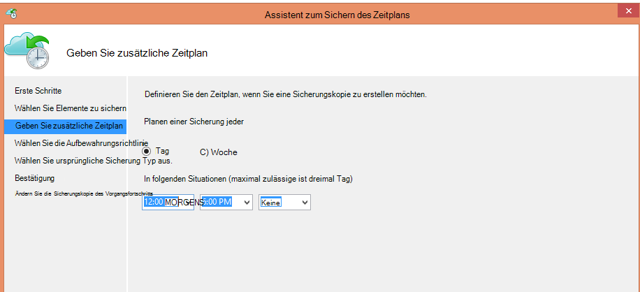
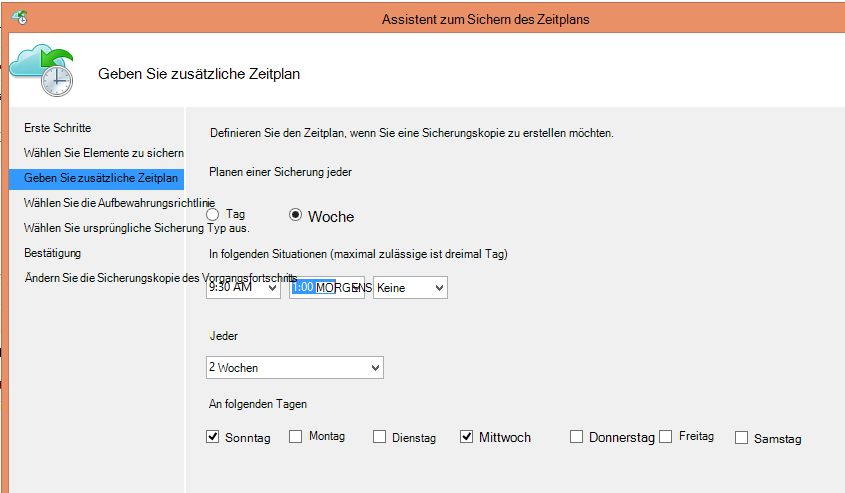
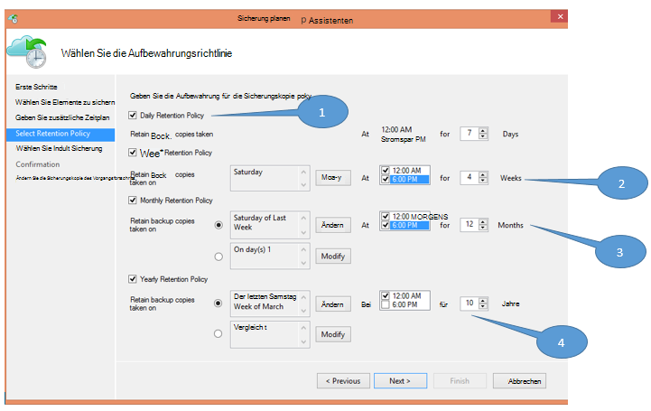
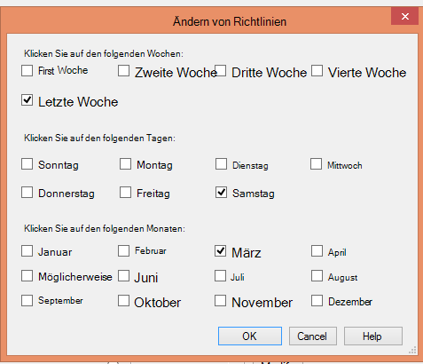

<properties
   pageTitle="Azure Sicherung Ihrer Band-Infrastruktur ersetzen verwenden | Microsoft Azure"
   description="Hier erfahren Sie, wie Azure Sicherung Band-ähnliche Semantik, die wodurch Sie zum Sichern und Wiederherstellen von Daten in Azure"
   services="backup"
   documentationCenter=""
   authors="trinadhk"
   manager="vijayts"
   editor=""/>
<tags
   ms.service="backup"
   ms.devlang="na"
   ms.topic="article"
   ms.tgt_pltfrm="na"
   ms.workload="storage-backup-recovery"
   ms.date="09/27/2016"
   ms.author="jimpark;trinadhk;markgal"/>

# Verwenden von Azure Sicherung Ihrer Band-Infrastruktur ersetzen

Azure sichern und System Center Data Protection Manager Kunden können:

- Sichern von Daten in Zeitpläne, die die Anforderungen der Organisation am besten geeignet.
- Die Sicherung Daten über längere Zeiträume beibehalten
- Stellen Sie ein Teil ihrer langfristig (statt auf Band) muss Azure.

In diesem Artikel wird erläutert, wie Kunden Sicherung und Aufbewahrungsrichtlinien aktivieren können. Kunden, die Bänder zu verwenden, um ihre nah--langfristige-Aufbewahrung Adresse müssen jetzt eine Alternative leistungsfähige und anwendbares durch die Verfügbarkeit von diesem Feature haben. Das Feature in der neuesten Version der Azure Sicherung aktiviert ist (die steht [hier](http://aka.ms/azurebackup_agent)). System Center DPM Kunden, aktualisieren müssen mindestens, DPM 2012 R2 UR5, bevor Sie DPM mit der Sicherung von Azure-Dienst verwenden.

## Was ist die Sicherung Terminplan aus?
Der Sicherung Terminplan zeigt die Häufigkeit des Vorgangs Sicherung an. Angenommen, laut die Einstellungen in der folgenden Abbildung Sicherungskopien täglich um 6 Uhr und Mitternacht geöffnet werden.

Kunden können auch eine wöchentliche Sicherung planen. Angenommen, laut die Einstellungen in der folgenden Abbildung Sicherungskopien jeder alternative Sonntag und Mittwoch am 9:30 Uhr und 1:00 Uhr geöffnet werden.

## Was ist die Aufbewahrungsrichtlinie?
Die Aufbewahrungsrichtlinie gibt die Dauer an, der die Sicherung gespeichert werden muss. Anstatt nur eine "flache"Richtlinie für alle zusätzliche Punkte, können Kunden unterschiedliche Aufbewahrungsrichtlinien basierend auf, wenn die Sicherungsdatei stammt angeben. Beispielsweise wird die Sicherung Punktes erfasste täglich, der dient als Wiederherstellung Point, 90 Tage lang beibehalten. Der Sicherung Punkt am Ende der einzelnen Quartale zu Audit-Zwecken geöffnet wird für eine längere Gültigkeitsdauer beibehalten.

Die Gesamtzahl der "Aufbewahrungsrichtlinien Punkte" in dieser Richtlinie angegeben ist, 90 (täglich Punkt) + 40 (jeweils zehn Jahren Quartal) = 130.

## Beispiel – beide zusammen mit

1. **Tägliche Aufbewahrungsrichtlinie**: Sicherungskopien täglich erfasste sieben Tage lang gespeichert sind.
2. **Wöchentliche Aufbewahrungsrichtlinie**: Sicherungskopien täglich um Mitternacht und 6 Uhr Samstag erfasste für vier Wochen beibehalten werden
3. **Monatliche Aufbewahrungsrichtlinie**: Sicherungskopien Mitternacht und 6 Uhr letzten Samstag für jeden Monat geöffnet bleiben für 12 Monate
4. **Der jahresbezogene Aufbewahrungsrichtlinie**: Sicherungskopien Mitternacht letzten Samstag jeder März geöffnet bleiben 10 Jahren

Die Gesamtzahl der "Aufbewahrungsrichtlinien Punkte" (Punkten von der ein Kunden Daten wiederherstellen kann) in der obigen Abbildung wird wie folgt berechnet:

- zwei Punkte pro Tag und sieben Tage = 14 Punkt Wiederherstellung
- zwei Punkte pro Woche für vier Wochen = 8 Punkt Wiederherstellung
- zwei Punkte pro Monat für 12 Monate = 24 Punkt Wiederherstellung
- Zeigt einen Punkt pro Jahr und pro 10 Jahre = 10 Wiederherstellung

Die Gesamtzahl der Wiederherstellungspunkte ist 56.

> [AZURE.NOTE] Azure Sicherung haben keine Einschränkung auf Anzahl von Wiederherstellungspunkten.

## Erweiterte Konfiguration
**Ändern** Sie im vorherigen Bildschirm auf, müssen Kunden weiteren Flexibilität Aufbewahrungszeitplänen angeben.

## Nächste Schritte
Weitere Informationen zur Azure Sicherung finden Sie unter:

- [Einführung in Azure Sicherung](backup-introduction-to-azure-backup.md)
- [Führen Sie Azure Sicherung](backup-try-azure-backup-in-10-mins.md)
