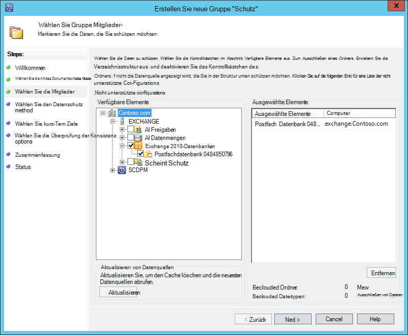
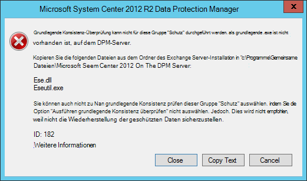
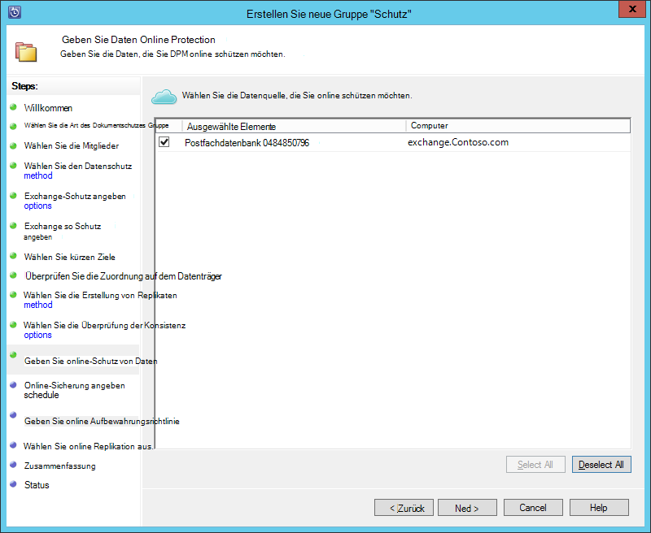
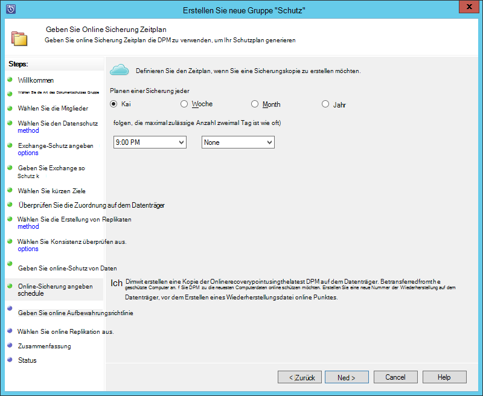
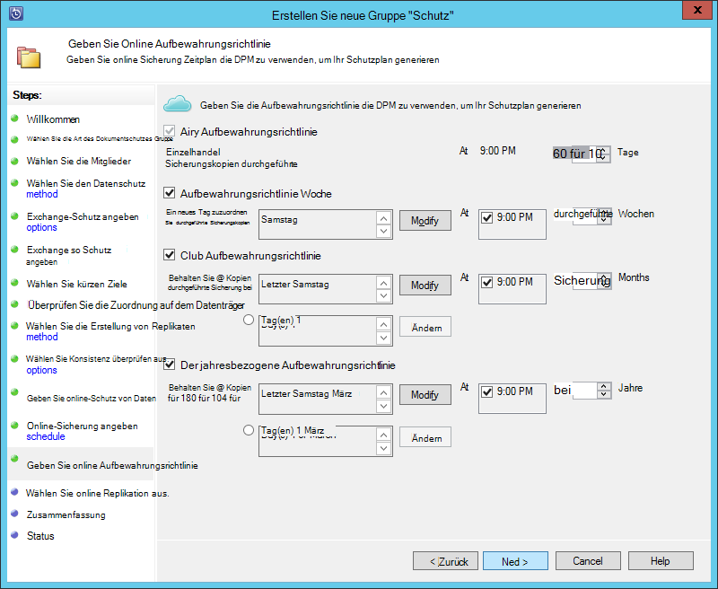
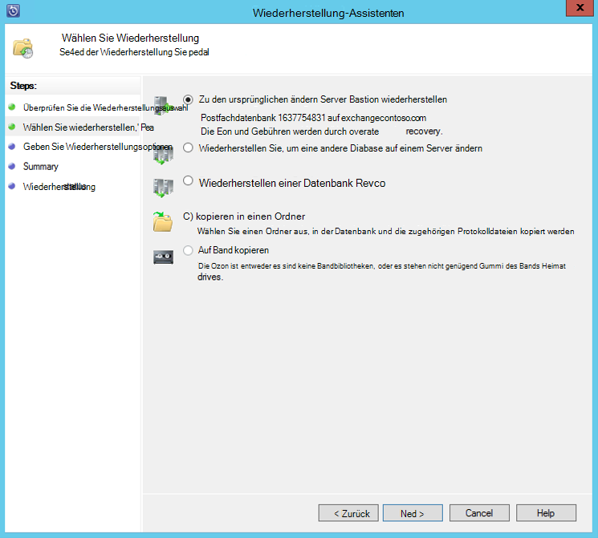

<properties
    pageTitle="Sichern Sie ein Exchange-Server zu Azure Sicherung mit System Center 2012 R2 DPM | Microsoft Azure"
    description="Erfahren Sie, wie ein Exchange-Server zu Azure Sicherung mit System Center 2012 R2 DPM sichern"
    services="backup"
    documentationCenter=""
    authors="MaanasSaran"
    manager="NKolli1"
    editor=""/>

<tags
    ms.service="backup"
    ms.workload="storage-backup-recovery"
    ms.tgt_pltfrm="na"
    ms.devlang="na"
    ms.topic="article"
    ms.date="08/15/2016"
    ms.author="anuragm;jimpark;delhan;trinadhk;markgal"/>

# Sichern eines Exchange-Servers zu Azure Sicherung mit System Center 2012 R2 DPM
Dieser Artikel beschreibt, wie Konfigurieren eines Servers System Center 2012 R2 Data Protection Manager (DPM), um zu einem Microsoft Exchange Server Azure Sicherung sichern.  

## Updates
Um Azure Sicherung erfolgreich DpmPathMerge registrieren, müssen Sie das neueste Updaterollup für System Center 2012 R2 DPM und die neueste Version des Agents Sicherung Azure installieren. Erhalten Sie das neueste Updaterollup aus dem [Microsoft-Katalog](http://catalog.update.microsoft.com/v7/site/Search.aspx?q=System%20Center%202012%20R2%20Data%20protection%20manager)aus.

>[AZURE.NOTE] Die Beispiele in diesem Artikel Version 2.0.8719.0 des Azure Sicherung-Agents installiert ist, und Update Rollup 6 auf System Center 2012 R2 DPM installiert ist.

## Erforderliche Komponenten
Bevor Sie fortfahren, stellen Sie sicher, dass alle [erforderlichen Komponenten](backup-azure-dpm-introduction.md#prerequisites) für die Verwendung von Microsoft Azure Sicherung Auslastung schützen erfüllt sind. Diese erforderlichen Komponenten gehören die folgenden:

- Eine Sicherung Tresor auf der Website Azure wurde erstellt.
- Agent und Tresor Anmeldeinformationen wurden zum DPM-Server heruntergeladen.
- Der Agent wird auf dem Server DPM installiert.
- Die Anmeldeinformationen Tresor wurden verwendet, um DpmPathMerge zu registrieren.
- Wenn Sie Exchange 2016 geschützt werden, aktualisieren Sie auf DPM 2012 R2 UR9 oder höher

## DPM-Schutz-agent  
Gehen Sie folgendermaßen vor, um den DPM-Schutz-Agent auf dem Exchange-Server zu installieren:

1. Stellen Sie sicher, dass die Firewalls ordnungsgemäß konfiguriert sind. Finden Sie unter [Konfigurieren Firewallausnahmen für den Agent](https://technet.microsoft.com/library/Hh758204.aspx).

2. Installieren Sie den Agent auf dem Exchange-Server durch Klicken auf **Management > Agents > Installieren** DPM-Verwaltungskonsole. Die detaillierten Schritte finden Sie unter [installieren den DPM-Schutz-Agent](https://technet.microsoft.com/library/hh758186.aspx?f=255&MSPPError=-2147217396) .

## Erstellen einer Gruppe "Schutz" für den Exchange-server

1. Klicken Sie in der DPM-Verwaltungskonsole klicken Sie auf **Schutz**, und klicken Sie dann im Menüband Tool zum Öffnen des Assistenten **Erstellen neue Gruppe "Schutz"** auf **neu** .

2. Klicken Sie auf dem Bildschirm **Willkommen** des Assistenten auf **Weiter**.

3. Wählen Sie auf dem Bildschirm **Wählen Sie die Art des Dokumentschutzes Gruppe** **Server aus** , und klicken Sie auf **Weiter**.

4. Wählen Sie die Exchange Server-Datenbank, die Sie verwenden möchten, schützen, und klicken Sie auf **Weiter**.

    >[AZURE.NOTE] Wenn Exchange 2013 geschützt werden, aktivieren Sie das [Exchange 2013 erforderliche Komponenten](https://technet.microsoft.com/library/dn751029.aspx).

    Im folgenden Beispiel wird die Datenbank Exchange 2010 ausgewählt.

    

5. Wählen Sie die Methode zum Schutz von Daten aus.

    Benennen Sie die Gruppe "Schutz", und wählen Sie dann beide der folgenden Optionen aus:

    - Ich möchte kurzfristig Schutz mit dem Datenträger aus.
    - Ich möchte online-Schutz aus.

6. Klicken Sie auf **Weiter**.

7. Wählen Sie die Option **Ausführen Eseutil Datenintegrität überprüfen** aus, wenn die Integrität des Exchange Server-Datenbanken überprüft werden soll.

    Nach der Auswahl dieser Option, die Sicherung Konsistenz-Überprüfung ausgeführt wird, klicken Sie auf dem DPM-Server, um den Datenverkehr zu vermeiden, der generiert wird, indem Sie den Befehl **Eseutil** für den Exchange-Server ausgeführt.

    >[AZURE.NOTE]Um diese Option verwenden zu können, müssen Sie die Dateien Ese.dll und Eseutil.exe zu c:\Programme c:\Programme\Microsoft System Center 2012 R2\DPM\DPM\bin Verzeichnis DpmPathMerge kopieren. Andernfalls wird der folgende Fehler ausgelöst:  
    

8. Klicken Sie auf **Weiter**.

9. Wählen Sie die Datenbank für die **Sicherung kopieren**, und klicken Sie dann auf **Weiter**.

    >[AZURE.NOTE] Wenn Sie nicht "Vollständige Sicherung" für mindestens eine Kopie einer Datenbank so zu aktivieren, werden die Protokolle nicht abgeschnitten.

10. Konfigurieren Sie die Ziele für **kurzfristig Sicherung**, und klicken Sie dann auf **Weiter**.

11. Überprüfen Sie den verfügbaren Speicherplatz, und klicken Sie dann auf **Weiter**.

12. Markieren der Uhrzeit, an der DpmPathMerge die erste Replikation erstellen, und klicken Sie dann auf **Weiter**.

13. Wählen Sie die Konsistenz Kontrollkästchen Optionen aus, und klicken Sie dann auf **Weiter**.

14. Wählen Sie die Datenbank, die Sie in Azure sichern möchten, und klicken Sie dann auf **Weiter**. Zum Beispiel:

    

15. Definieren Sie den Zeitplan für **Azure Sicherung**, und klicken Sie dann auf **Weiter**. Zum Beispiel:

    

    >[AZURE.NOTE] Beachten Sie Online Wiederherstellungspunkte basieren auf Express vollständige Wiederherstellungspunkte. Daher müssen Sie den Wiederherstellungspunkt online planen, nach der Wiederherstellung zeigen Sie die Zeit für die schnelle vollständige angegeben ist.

16. Konfigurieren Sie die Aufbewahrungsrichtlinie für **Azure Sicherung**, und klicken Sie dann auf **Weiter**.

17. Wählen Sie eine Replikationsoption online aus, und klicken Sie auf **Weiter**.

    Wenn Sie eine große Datenbank haben, könnte es dauern, viel Zeit für die ursprüngliche Sicherung über das Netzwerk erstellt werden. Um dieses Problem zu vermeiden, können Sie eine offline-Sicherung erstellen.  

    

18. Bestätigen Sie die Einstellungen, und klicken Sie dann auf **Gruppe erstellen**.

19. Klicken Sie auf **Schließen**.

## Wiederherstellen der Exchange-Datenbank

1. Wenn Sie eine Exchange-Datenbank wiederherzustellen, klicken Sie auf **Wiederherstellung** in der DPM-Verwaltungskonsole.

2. Suchen Sie die Exchange-Datenbank, die Sie wiederherstellen möchten.

3. Wählen Sie aus der Dropdownliste *Wiederherstellungszeit* ein online Wiederherstellung auf folgende Weise aus.

4. Klicken Sie auf **Wiederherstellen** , um den **Wiederherstellung-Assistenten**zu starten.

Online Wiederherstellung verweist gibt es fünf Arten von Wiederherstellung:

- **Ursprünglichen Exchange Server-Speicherort wiederherstellen:** Die Daten werden mit dem ursprünglichen Exchange-Server wiederhergestellt werden.
- **Zu einer anderen Datenbank auf einem Exchange-Server wiederherstellen:** Die Daten werden in eine andere Datenbank auf einem anderen Exchange-Server wiederhergestellt werden.
- **Zu einer Wiederherstellungsdatenbank wiederherstellen:** Die Daten werden in einer Exchange Wiederherstellung Datenbank (RDB) wiederhergestellt werden.
- **In einem Netzwerkordner kopieren:** Die Daten werden in einem Netzwerkordner wiederhergestellt werden.
- **Auf Band kopieren:** Wenn Sie eine Band-Library oder einem eigenständigen Bandlaufwerk angefügt, und klicken Sie auf dem DPM-Server konfiguriert haben, wird der Wiederherstellungspunkt auf einer kostenlosen Band kopiert werden.

    

## Nächste Schritte

- [Zusätzliche häufig gestellte Fragen zur Azure](backup-azure-backup-faq.md)
