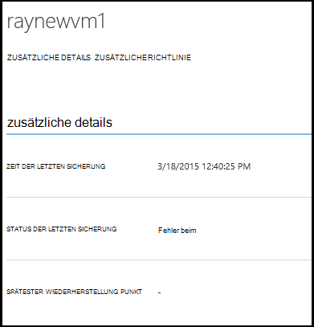
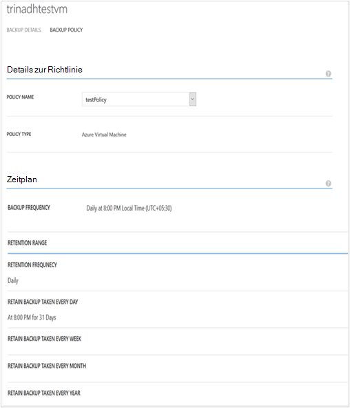
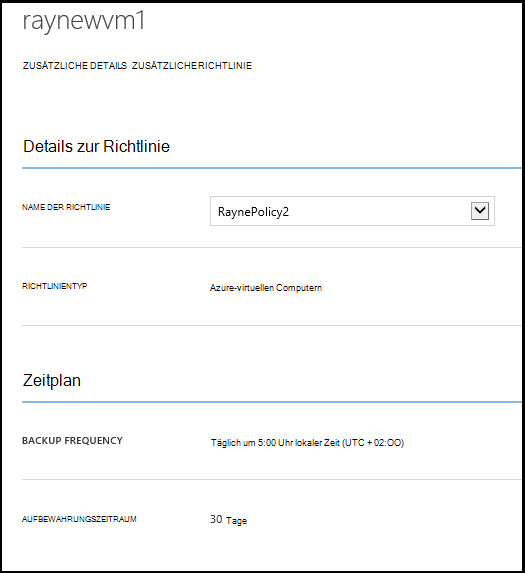
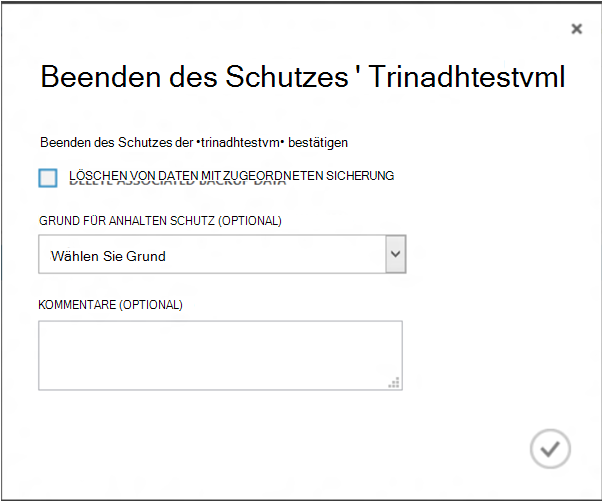
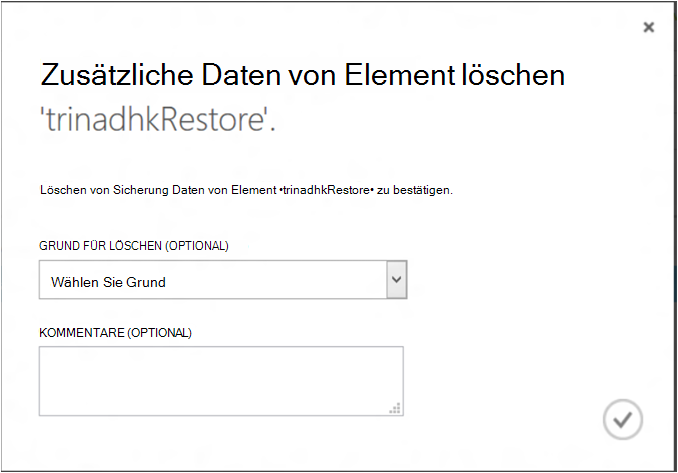
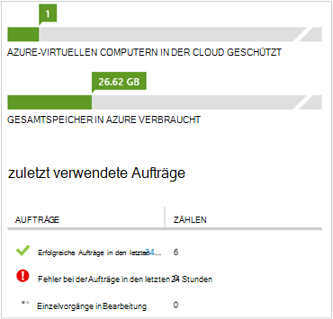
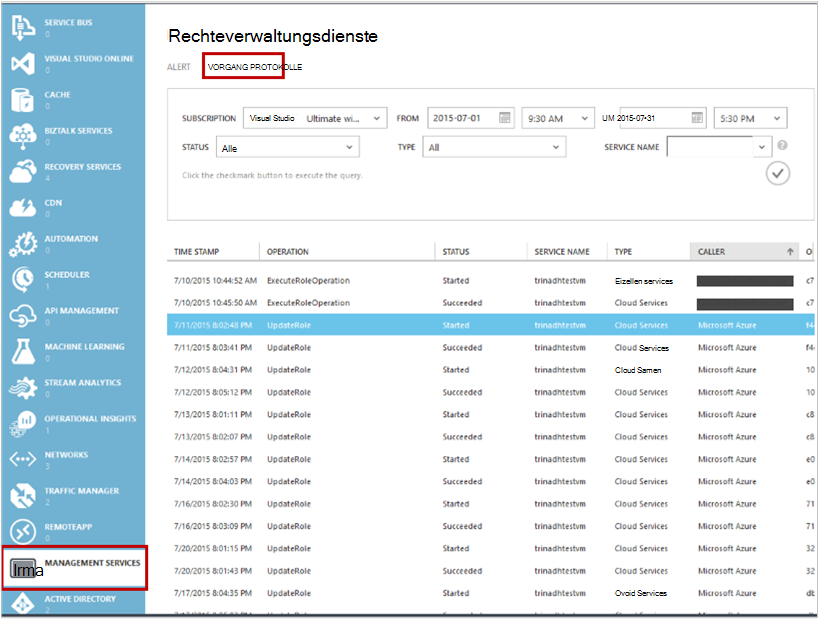
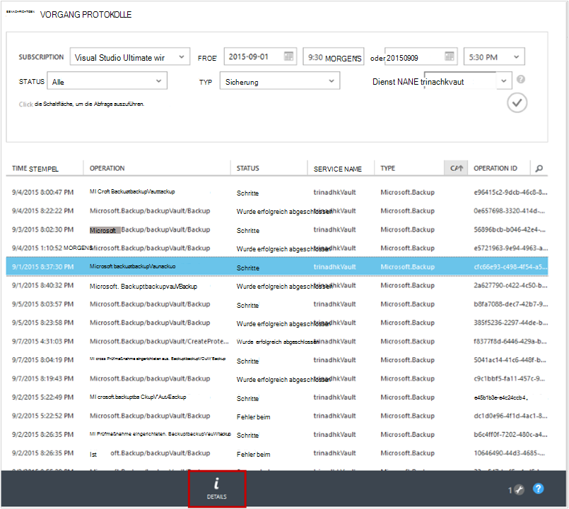
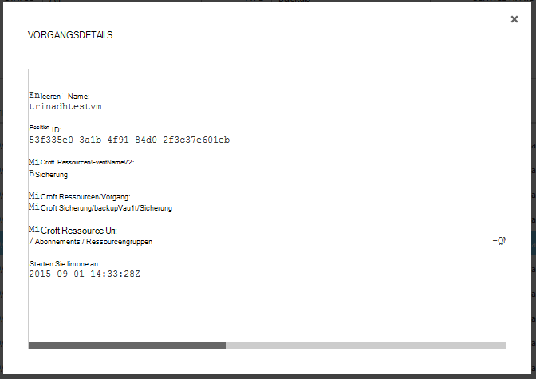

<properties
    pageTitle="Verwalten und Azure-virtuellen Computern Sicherungen überwachen | Microsoft Azure"
    description="Informationen Sie zum Verwalten und Überwachen einer Sicherungskopien Azure-virtuellen Computern"
    services="backup"
    documentationCenter=""
    authors="trinadhk"
    manager="shreeshd"
    editor=""/>

<tags
    ms.service="backup"
    ms.workload="storage-backup-recovery"
    ms.tgt_pltfrm="na"
    ms.devlang="na"
    ms.topic="article"
    ms.date="08/31/2016"
    ms.author="trinadhk; jimpark; markgal;"/>

# <a name="manage-and-monitor-azure-virtual-machine-backups"></a>Verwalten und Überwachen von Sicherungskopien Azure-virtuellen Computern

> [AZURE.SELECTOR]
- [Verwalten von Azure-virtuellen Computer Sicherungskopien](backup-azure-manage-vms.md)
- [Klassische virtueller Computer Sicherungskopien verwalten](backup-azure-manage-vms-classic.md)

Dieser Artikel enthält Informationen zur allgemeinen Verwaltung und Überwachung Aufgaben Klassisch geschützte in Azure-virtuellen Computern an.  

>[AZURE.NOTE] Azure weist zwei Bereitstellungsmodelle für das Erstellen von und Arbeiten mit Ressourcen: [Ressourcenmanager und Classic](../resource-manager-deployment-model.md). Informationen zum Arbeiten mit klassischen Modell zur Bereitstellung von virtuellen Computern finden Sie unter [Vorbereiten Ihrer Umgebung Azure-virtuellen Computern sichern](backup-azure-vms-prepare.md) .

## <a name="manage-protected-virtual-machines"></a>Verwalten von geschützten virtuellen Computern

So verwalten Sie geschützten virtuellen Computern

1. Zum Anzeigen und Verwalten von zusätzliche Einstellungen für einen virtuellen Computer klicken Sie auf die Registerkarte **Geschützte Elemente** .

2. Klicken Sie auf den Namen eines geschützten Elements auf der Registerkarte **Zusätzliche Details** finden Sie unter der Informationen über die letzten Sicherung angezeigt wird.

    

3. Zum Anzeigen und Verwalten von Sicherung Richtlinie Einstellungen für einen virtuellen Computer klicken Sie auf die Registerkarte **Richtlinien** .

    

    Die Registerkarte **Sicherung Richtlinien** werden die vorhandene Richtlinie. Sie können nach Bedarf ändern. Wenn Sie müssen zum Erstellen eine neue Richtlinie klicken Sie auf **Erstellen** klicken Sie auf der Seite **Richtlinien** . Beachten Sie, dass, wenn Sie eine Richtlinie entfernen möchten alle virtuellen Computern zugeordnet haben dürfen nicht.

    

4. Sie erhalten weitere Informationen zu Aktionen oder Status für einen virtuellen Computer auf der Seite **Projekte** . Klicken Sie auf eine Position in der Liste, um weitere Informationen zu erhalten, oder filtern Sie Aufträge für einen bestimmten virtuellen Computer.

    

## <a name="on-demand-backup-of-a-virtual-machine"></a>Bei Bedarf die Sicherung eines virtuellen Computers
Sie können auf Anforderung ausführen Sicherung eines virtuellen Computers, nachdem sie für Schutz konfiguriert ist. Wenn die ursprüngliche Sicherung aussteht des virtuellen Computers, Sicherung bei Bedarf erstellt eine vollständige Kopie des virtuellen Computers in Azure Sicherung Tresor. Wenn die erste Sicherung abgeschlossen ist, ist nur senden Änderungen aus der vorherigen Sicherung Azure Sicherung h. Vaulting bei Bedarf Sicherung wird immer inkrementell.

>[AZURE.NOTE] Aufbewahrungsrichtlinien Zellbereich eine Sicherung bei Bedarf wird Aufbewahrung Wert für tägliche Aufbewahrung in Sicherung Richtlinie entspricht dem virtuellen Computer festgelegt.  

On-Demand eines virtuellen Computers Sicherung ausführen:

1. Navigieren Sie zu der Seite **Geschützte Elemente** (falls Sie noch nicht ausgewählt ist), wählen Sie **Azure-virtuellen Computern** **Dateityp** aus und klicken Sie auf die Schaltfläche **auswählen** .

    

2. Wählen Sie die virtuellen Computern, die Sie auf on Demand Sicherung ausführen, und klicken Sie auf **Jetzt sichern,** Schaltfläche am unteren Rand der Seite.

    

    Dadurch wird eine Sicherung auf dem ausgewählten virtuellen Computer erstellt. Aufbewahrungsrichtlinien Bereich der Wiederherstellungspunkt durch diesen Auftrag erstellt werden, die in der Richtlinie des virtuellen Computers zugeordnet angegebenen identisch sein.

    

    >[AZURE.NOTE] Zum Anzeigen der Richtlinie eines virtuellen Computers zugeordnet eines Drilldowns in virtuellen Computern Seite **Geschützte Elemente** , und wechseln Sie zur Registerkarte Sicherung Richtlinie.

3. Nachdem das Projekt erstellt wurde, können Sie auf **Ansicht Auftrag** Schaltfläche in der Leiste Spruch der entsprechenden Position auf der Seite Projekte anzeigen klicken.

    

4. Nach dem erfolgreichen Abschluss des Projekts wird ein Wiederherstellungspunkt erstellt werden, die Sie zum Wiederherstellen des virtuellen Computers verwenden können. Dies wird auch den Wiederherstellung Punkt Spaltenwert von 1 auf **Geschützte Elemente** Seite erhöht.

## <a name="stop-protecting-virtual-machines"></a>Beenden Sie den Schutz von virtuellen Computern
Sie können so beenden Sie die zukünftigen Sicherungskopien eines virtuellen Computers mit den folgenden Optionen auswählen:

- Beibehalten der Sicherungsdatei mit virtuellen Computern in Azure Sicherung Tresor verknüpfte Daten
- Daten Sie Sicherung mit verknüpften virtuellen Computern

Wenn Sie die Sicherungsdatei mit virtuellen Computern verknüpfte Daten beibehalten ausgewählt haben, können Sie die gesicherten Daten zum Wiederherstellen des virtuellen Computers verwenden. Preise Details für solche virtuellen Computern, finden Sie [hier](https://azure.microsoft.com/pricing/details/backup/).

Zum Beenden des Schutzes für einen virtuellen Computer:

1. Navigieren Sie zur Seite **Geschützte Elemente** und wählen Sie **Azure-virtuellen Computern** als Filtertyp (sofern nicht bereits ausgewählt ist), und klicken Sie auf die Schaltfläche **auswählen** .

    

2. Wählen Sie den virtuellen Computer aus, und klicken Sie auf **Schutz aufheben** am unteren Rand der Seite.

    

3. Standardmäßig wird Azure Sicherungskopie des virtuellen Computers zugeordneten Sicherung Daten nicht gelöscht.

    

    Wenn Sie zusätzliche Daten löschen möchten, aktivieren Sie das Kontrollkästchen.

    

    Wählen Sie einen Grund für die Sicherung beenden aus. Dies ist optional hilft somit einen Grund Azure Sicherung an das Feedback arbeiten und Priorisieren Sie die Kundenszenarien.

4. Klicken Sie auf den Auftrag **Beenden des Schutzes** und übermitteln Sie die **Senden** -Schaltfläche. Klicken Sie auf **Ansicht Auftrag** das entsprechende des Auftrags **Aufträge** Seite angezeigt.

    

    Wenn Sie die Option während **Schutz beenden** -Assistenten, und klicken Sie dann auf Beitrag Auftragsabschluss **zugeordnete Sicherung Daten löschen** nicht ausgewählt haben, ändert sich die Schutzstatus **Schutz**gestoppt. Die Daten mit Sicherung Azure bleiben, bis sie explizit gelöscht wird. Sie können die Daten immer löschen, indem des virtuellen Computers Seite **Geschützte Elemente** auswählen und auf **Löschen**.

    

    Wenn Sie die Option **zugeordnete Sicherung Daten löschen** ausgewählt haben, wird nicht des virtuellen Computers Teil der Seite **Elemente geschützt** werden.

## <a name="re-protect-virtual-machine"></a>Schützen erneut auf virtuellen Computern
Wenn Sie nicht die Option **zuordnen Sicherung Löschen von Daten** in **Schutz beenden**ausgewählt haben, können Sie anhand der Schritte, die ähnliche registrierten virtuellen Computern sichern erneut des virtuellen Computers schützen. Sobald geschützt ist, dieses virtuellen Computers Sicherung Daten vor Beenden Schutz beibehalten haben und wird nach der Wiederherstellungspunkte erstellt erneut zu schützen.

Nach erneut schützen werden Schutz-Status des virtuellen Computers zu **geschützten** geändert werden, wenn Wiederherstellung vor **Schutz aufheben Punkte**.

  

>[AZURE.NOTE] Beim des virtuellen Computers erneut schützen möchten, können Sie eine andere Richtlinie als die Richtlinie auswählen, die mit denen virtuellen Computern ursprünglich geschützt wurde.

## <a name="unregister-virtual-machines"></a>Aufheben der Registrierung von virtuellen Computern

Wenn Sie den virtuellen Computer aus der Sicherungsdatei Tresor entfernen möchten:

1. Klicken Sie auf die Schaltfläche **' Registrierung aufheben '** am unteren Rand der Seite.

    

    Eine Benachrichtigung Spruch wird am unteren Rand des Bildschirms Bestätigung anfordern angezeigt. Klicken Sie auf **Ja,** um den Vorgang fortzusetzen.

    

## <a name="delete-backup-data"></a>Löschen von Daten mit Sicherung
Sie können die Sicherung Daten eines virtuellen Computers, entweder zugeordnet löschen:

- Während beenden Schutz Position
- Nach einem Schutz beenden Position auf einem virtuellen Computer abgeschlossen

Zum Löschen Posten Sicherung Daten auf einem virtuellen Computer, der in den Zustand *Schutz beendet* ist erfolgreichen Abschluss eines Auftrags **Sicherung beenden** :

1. Navigieren Sie zu der Seite **Geschützte Elemente** und wählen Sie als *Typ* **Azure-virtuellen Computern** aus, und klicken Sie auf die Schaltfläche **auswählen** .

    

2. Wählen Sie den virtuellen Computer an. Des virtuellen Computers wird Status **Schutz beendet** haben.

    

3. Klicken Sie auf die Schaltfläche " **Löschen** " am unteren Rand der Seite.

    

4. Wählen Sie im Assistenten **zusätzliche Daten löschen** einen Grund für das Löschen von Sicherung Daten (dringend empfohlen), und klicken Sie auf **Absenden**.

    

5. Dadurch wird einen Auftrag zum Löschen des ausgewählten virtuellen Computers Sicherung Daten erstellt. Klicken Sie auf die **Position der Ansicht** zum entsprechenden Auftrag Aufträge Seite finden Sie unter.

    

    Nachdem Sie der Auftrag abgeschlossen ist, werden der Eintrag, des virtuellen Computers entspricht **geschützten Elemente** Seite entfernt.

## <a name="dashboard"></a>Dashboard
Überprüfen Sie auf der Seite **Dashboard** Informationen zur Azure-virtuellen Computern, deren Speicherung und Aufträge in den letzten 24 Stunden zugeordnet. Sie können die Sicherung Status und Fehlern zugeordneten Sicherung anzeigen.



>[AZURE.NOTE] Werte im Dashboard werden alle 24 Stunden einmal aktualisiert.

## <a name="auditing-operations"></a>Überwachung von Vorgängen
Azure Sicherung bietet Überprüfung der "-Vorgang Protokolle" zusätzliche Vorgänge durch den Kunden, sodass sie mühelos finden Sie unter genau welche Management-Vorgänge ausgeführt wurden, klicken Sie auf die Sicherung Tresor ausgelöst. Vorgänge Protokolle großartige Projektabschluss aktivieren und Unterstützung für die Sicherungsdatei Vorgänge überwachen.

Die folgenden Vorgänge werden im Vorgang Protokolle verzeichnet:

- Registrieren Sie sich
- Aufheben der Registrierung
- Konfigurieren von Schutz
- Sicherung (beide geplant sowie Sicherung durch Erstellen bei Bedarf)
- Stellen Sie wieder her
- Beenden des Schutzes
- Zusätzliche Daten löschen
- Richtlinie hinzufügen
- Löschen von Richtlinie
- Aktualisieren von Richtlinie
- Auftrag abbrechen

So zeigen Sie Protokolle für eine Sicherung Tresor entspricht an:

1. Navigieren Sie zu **Management Services** Azure-Portal, und klicken Sie dann auf die Registerkarte **Vorgang Protokolle** .

    

2. Wählen Sie in den Filter **zusätzliche** *Dateityp* aus und geben Sie den Namen der Sicherungsdatei Tresor im *Dienst ein* , und klicken Sie auf **Absenden**.

    

3. Wählen Sie in den Protokollen Vorgänge einen Vorgang aus, und klicken Sie auf **Details** zum Anzeigen von Details für einen Vorgang entspricht.

    

    **Details-Assistenten** enthält Informationen zum Vorgang ausgelöst wurde, Auftrag Ressourcen auf dem diesen Vorgang wird ausgelöst, und die Startzeit des Vorgangs-Id an.

    

## <a name="alert-notifications"></a>Benachrichtigung
Sie können benutzerdefinierte-Benachrichtigung für die Aufträge im Portal erhalten. Dies ist durch Definieren von Warnungsregeln PowerShell-basierten Betrieb Protokolle Ereignisse, durch. Es wird empfohlen, *PowerShell Version 1.3.0 oder höher*.

Zum Definieren einer benutzerdefinierten Benachrichtigung für Sicherung Fehlern benachrichtigen sieht ein Beispielbefehl wie aus:

```
PS C:\> $actionEmail = New-AzureRmAlertRuleEmail -CustomEmail contoso@microsoft.com
PS C:\> Add-AzureRmLogAlertRule -Name backupFailedAlert -Location "East US" -ResourceGroup RecoveryServices-DP2RCXUGWS3MLJF4LKPI3A3OMJ2DI4SRJK6HIJH22HFIHZVVELRQ-East-US -OperationName Microsoft.Backup/backupVault/Backup -Status Failed -TargetResourceId /subscriptions/86eeac34-eth9a-4de3-84db-7a27d121967e/resourceGroups/RecoveryServices-DP2RCXUGWS3MLJF4LKPI3A3OMJ2DI4SRJK6HIJH22HFIHZVVELRQ-East-US/providers/microsoft.backupbvtd2/BackupVault/trinadhVault -Actions $actionEmail
```

**ResourceId**: Sie können dies aus Vorgänge Protokolle Popup abrufen, wie in oben im Abschnitt beschrieben. ResourceUri in Details Popupfenster eines Vorgangs ist der ResourceId für dieses Cmdlet bereitgestellt werden sollen.

**OperationName**: Dies ist, der das Format "Microsoft.Backup/backupvault/<EventName>" wobei EventName eines der Register, Registrierung, ConfigureProtection ist, sichern, wiederherstellen, StopProtection, DeleteBackupData, CreateProtectionPolicy, DeleteProtectionPolicy, UpdateProtectionPolicy

**Status**: Werte sind-Schritte, erfolgreich verlaufen ist und konnte nicht unterstützt.

**ResourceGroup**: ResourceGroup der Ressource für den Vorgang ausgelöst wurde. Sie können dies von ResourceId Wert abrufen. Wert zwischen Feldern */resourceGroups/* und */providers/* ResourceId Wert ist der Wert für ResourceGroup.

**Name**: Name der Regel benachrichtigen.

**CustomEmail**: Geben Sie die benutzerdefinierte e-Mail-Adresse, benachrichtigen Benachrichtigung gesendet werden soll,

**SendToServiceOwners**: Diese Option sendet die Benachrichtigung für alle Administratoren und Co-Administratoren des Abonnements. Sie können in **Neu AzureRmAlertRuleEmail** Cmdlet verwendet werden

### <a name="limitations-on-alerts"></a>Einschränkungen auf Benachrichtigungen
Ereignis-basierte Alarme ausgesetzt sind die folgenden Einschränkungen:

1. Benachrichtigungen werden auf allen virtuellen Computern im Sicherung Tresor ausgelöst wurde. Sie können keine, um Benachrichtigungen für bestimmte Gruppe von virtuellen Computern in einer Sicherungskopie Tresor erhalten anpassen.
2. Dieses Feature ist in der Vorschau. [Weitere Informationen](../monitoring-and-diagnostics/insights-powershell-samples.md#create-alert-rules)
3. Sie erhalten von Benachrichtigungen "alerts-noreply@mail.windowsazure.com". E-Mail-Absenders können derzeit nicht geändert werden.

## <a name="next-steps"></a>Nächste Schritte

- [Wiederherstellen der Azure-virtuellen Computern](backup-azure-restore-vms.md)
