<properties
    pageTitle="Verwalten Azure Sicherung Depots und Servern mithilfe des Modells klassische Bereitstellung Azure | Microsoft Azure"
    description="Verwenden Sie in diesem Lernprogramm erfahren Sie, wie Depots Azure Sicherung und Server verwalten."
    services="backup"
    documentationCenter=""
    authors="markgalioto"
    manager="jwhit"
    editor="tysonn"/>

<tags
    ms.service="backup"
    ms.workload="storage-backup-recovery"
    ms.tgt_pltfrm="na"
    ms.devlang="na"
    ms.topic="article"
    ms.date="09/27/2016"
    ms.author="jimpark;markgal"/>

# Verwalten von Azure Sicherung Depots und Servern mithilfe des Modells klassischen Bereitstellung

> [AZURE.SELECTOR]
- [Ressourcenmanager](backup-azure-manage-windows-server.md)
- [Klassische](backup-azure-manage-windows-server-classic.md)

In diesem Artikel finden Sie eine Übersicht über die Sicherung Verwaltungsaufgaben über die klassischen Azure-Portal und dem Microsoft Azure Sicherung Agent verfügbar.

[AZURE.INCLUDE [learn-about-deployment-models](../../includes/learn-about-deployment-models-classic-include.md)]Ressourcenmanager Modell zur Bereitstellung von.

## Portal Verwaltungsaufgaben
1. Melden Sie sich bei dem [Verwaltungsportal](https://manage.windowsazure.com).

2. Klicken Sie auf **Dienste Wiederherstellung**, und klicken Sie auf den Namen der Sicherungsdatei Tresor zum Anzeigen der Seite Schnellstart.

    

Indem Sie die Optionen am oberen Rand der Seite Schnellstart auswählen, können Sie die verfügbaren Verwaltungsaufgaben sehen.

### Dashboard
Wählen Sie **Dashboard** Übersicht über die Verwendung des Servers angezeigt. **Übersicht über die Verwendung** der umfasst:

- Die Anzahl von Windows-Servern registriert in der cloud
- Die Anzahl der Azure-virtuellen Computern in der Cloud geschützt
- Der Gesamtspeicher in Azure verbraucht
- Der Status des zuletzt verwendete Aufträge

Am unteren Rand des Dashboards können Sie die folgenden Aufgaben ausführen:

- **Verwalten Zertifikat** – Wenn Sie ein Zertifikat zum Registrieren des Servers, und klicken Sie dann verwenden Sie diese Option zum Aktualisieren des Zertifikats verwendet wurde. Wenn Sie Anmeldeinformationen Tresor arbeiten, verwenden Sie nicht **Zertifikat verwalten**.
- **Löschen** : Löscht den aktuellen Sicherung Tresor. Wenn Sie eine Sicherungskopie Tresor nicht mehr verwendet wird, können Sie es zum Freigeben von Speicherplatz löschen. **Löschen** ist nur verfügbar, nachdem alle registrierte Servern aus dem Tresor gelöscht wurden.

## Registrierte Elemente
Wählen Sie **Elemente registriert** die Namen der Server anzeigen möchten, die für diesen Tresor registriert sind.

Der **Typ** Filter Standardwerte zu Azure virtuellen Computern an. Wenn Sie die Namen der Server anzeigen, um diesen Tresor registriert haben, wählen Sie **WindowsServer** aus dem Dropdownmenü aus.

Hier können Sie die folgenden Aufgaben ausführen:

- **Zulassen erneuten Registrierung** – Wenn diese Option ausgewählt ist für einen Server können **Registrier-Assistenten** in der lokalen Microsoft Azure Sicherung Agent den Server mit dem Sicherung Tresor ein zweites Mal zu registrieren. Möglicherweise müssen Sie wegen eines Fehlers im Zertifikat neu registrieren oder einen Server hätten neu erstellt werden.
- **Löschen** : Löscht einen Server aus der Sicherungsdatei Tresor. Alle gespeicherten Daten mit dem Server verbunden sind wird sofort gelöscht.

    

## Geschützte Elemente
Wählen Sie **Geschützte Elemente** die Elemente anzeigen möchten, die von den Servern gesichert wurden.

## Konfigurieren

Auf der Registerkarte **Konfigurieren** können Sie die entsprechenden Speicher Redundanz Option auswählen. Der beste Zeitpunkt die Speicher Redundanz Option ist rechts, nach dem Erstellen einer Tresor und bis zu einem beliebigen Computer registriert sind.

>[AZURE.WARNING] Nachdem Sie ein Element zum Tresor registriert wurde, wird die Option Speicher Redundanz gesperrt ist und kann nicht geändert werden.

Finden Sie in diesem Artikel Weitere Informationen zu [Speicherredundanz](../storage/storage-redundancy.md).

## Microsoft Azure Sicherung Agent Aufgaben

### Konsole

Öffnen Sie die **Microsoft Azure Sicherung-Agent** (Sie können sie nach Dateien suchen den Computer *Microsoft Azure Sicherung*).

Aus am rechten Rand der Sicherungsdatei Agentenkonsole verfügbaren **Aktionen** können Sie die folgenden Verwaltungsaufgaben ausführen:

- Register-Server
- Sicherung planen
- Jetzt sichern.
- Ändern von Eigenschaften

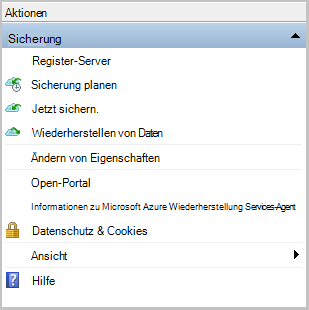

>[AZURE.NOTE] Zum **Wiederherstellen von Daten**finden Sie unter [Dateien wiederherstellen in einem WindowsServer oder Windows-Clientcomputer](backup-azure-restore-windows-server.md).

### Ändern Sie eine vorhandene Sicherung

1. Klicken Sie in der Microsoft Azure Sicherung Agent auf **Sicherung planen**.

    

2. Lassen Sie im **Assistenten Terminplan** der ausgewählten Option **nehmen Änderungen vor, um zusätzliche Elemente oder Zeitangaben** , und klicken Sie auf **Weiter**.

    

3. Wenn Sie Elemente hinzufügen oder ändern möchten, klicken Sie auf dem Bildschirm **Zu sichern Elemente auswählen** auf **Elemente hinzufügen**.

    Sie können auch die **Einstellungen Ausschluss** von dieser Seite des Assistenten festlegen. Wenn Sie Dateien ausschließen möchten, oder Dateitypen lesen Sie das Verfahren zum Hinzufügen von [Ausschlusswörterbüchern Einstellungen](#exclusion-settings).

4. Wählen Sie die Dateien und Ordner zu sichern, und klicken Sie auf **OK**.

    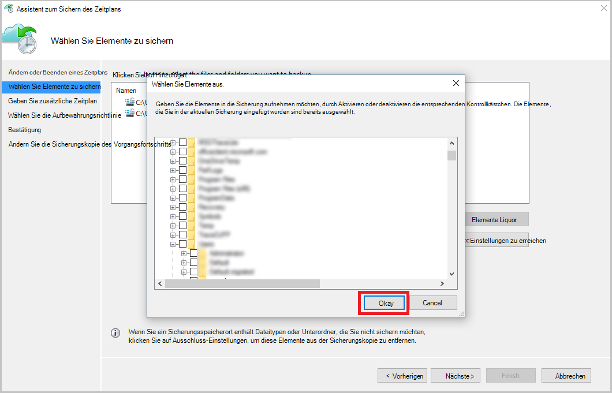

5. Geben Sie den **Zeitplan Sicherungsdatei** aus, und klicken Sie auf **Weiter**.

    Sie können (bei einem Maximum von 3 Mal pro Tag) täglich oder wöchentlich Sicherungskopien planen.

    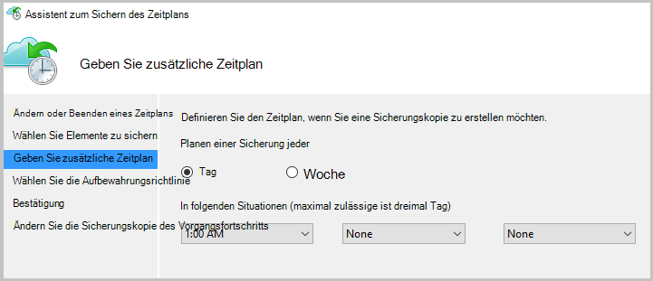

    >[AZURE.NOTE] Angeben eines Zeitplans Sicherung wird ausführlich in diesem [Artikel](backup-azure-backup-cloud-as-tape.md)erläutert.

6. Wählen Sie die **Aufbewahrungsrichtlinie** für die Sicherungskopie, und klicken Sie auf **Weiter**.

    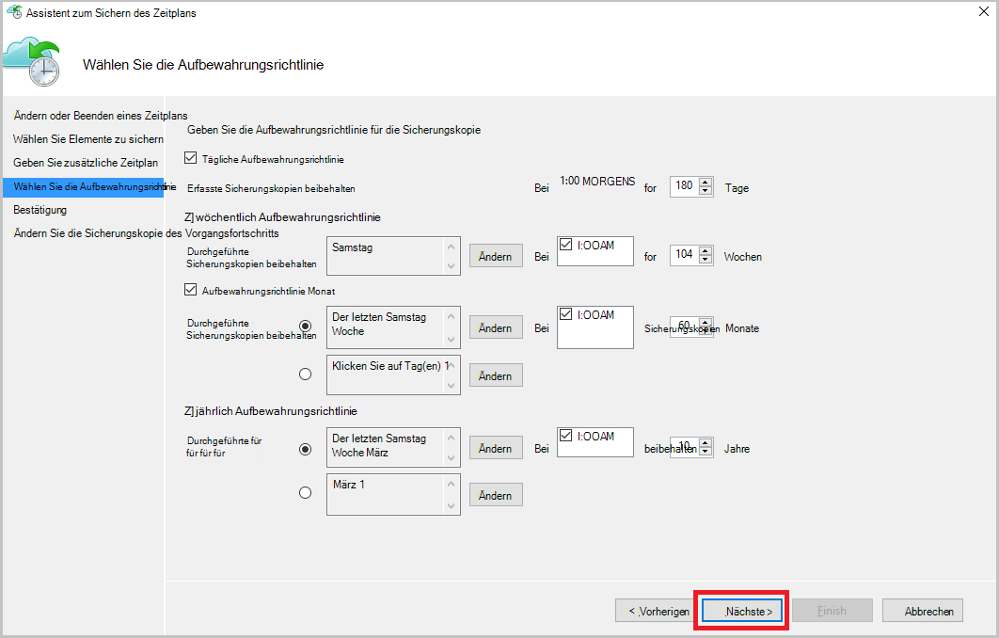

7. Klicken Sie auf dem Bildschirm **Bestätigung** überprüfen Sie die Informationen, und klicken Sie auf **Fertig stellen**.

8. Nach Beendigung des Assistenten die **Sicherung Zeitplan**erstellen, klicken Sie auf **Schließen**.

    Nach dem Ändern der Schutz, können Sie bestätigen, dass Sicherungskopien ordnungsgemäß auslösen sind, indem Sie auf der Registerkarte **Aufträge** und bestätigt, dass die Änderungen in der Sicherungsdatei Aufträge angezeigt werden.

### Netzwerk Begrenzungsebene aktivieren  
Der Sicherung von Azure-Agent bietet eine Beschränkung der Registerkarte, die können Sie steuern, wie die Bandbreite während der Datenübertragung verwendet wird. Dieses Steuerelement ist hilfreich, wenn Sie zum Sichern von Daten während der Arbeitszeiten jedoch möchten nicht, dass die Sicherung beeinträchtigen andere Datenverkehr im Internet. Beschränkung der Daten gilt durchstellen zum Sichern und Wiederherstellen von Aktivitäten.  

Um die Einschränkung zu aktivieren:

1. Klicken Sie in der **Sicherung Agent** **Ändern der Eigenschaften**auf.

2. Aktivieren Sie das Kontrollkästchen **Internet Bandbreite Verwendung für zusätzliche Vorgänge begrenzungsebene aktivieren** .

    

3. Nachdem Sie die begrenzungsebene aktiviert haben, geben Sie die zulässige Bandbreite für die Sicherungsdatei Datenübertragung während der **Arbeitszeiten** und **nicht - Arbeitszeiten**.

    Die Bandbreite Werte beginnen bei 512 KB pro Sekunde (KB/s), und wechseln Sie können bis zu 1023 MB pro Sekunde (MB/s). Können Sie auch bestimmen am Anfang und Ende für **Arbeitszeiten**und welche Tage der Woche als Arbeit Tage. Die Zeit außerhalb der vorgesehenen Arbeitszeiten gilt nicht Arbeitszeiten werden.

4. Klicken Sie auf **OK**.

## Ausschluss-Einstellungen

1. Öffnen Sie die **Microsoft Azure Sicherung-Agent** (Sie können sie nach Dateien suchen den Computer *Microsoft Azure Sicherung*).

    

2. Klicken Sie in der Microsoft Azure Sicherung Agent auf **Sicherung planen**.

    

3. Lassen Sie im Terminplan-Assistenten Sicherung der ausgewählten Option **nehmen Änderungen vor, um zusätzliche Elemente oder Zeitangaben** , und klicken Sie auf **Weiter**.

    

4. Klicken Sie auf **Ausschlüsse**.

    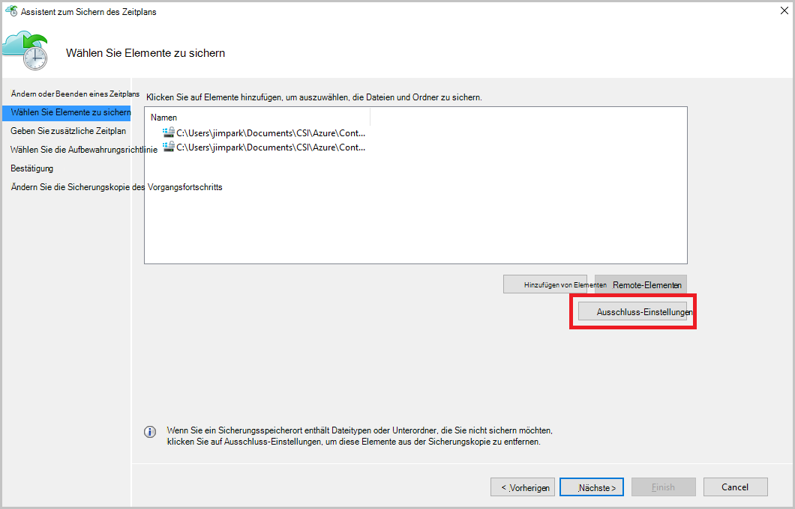

5. Klicken Sie auf **Ausschluss hinzufügen**.

    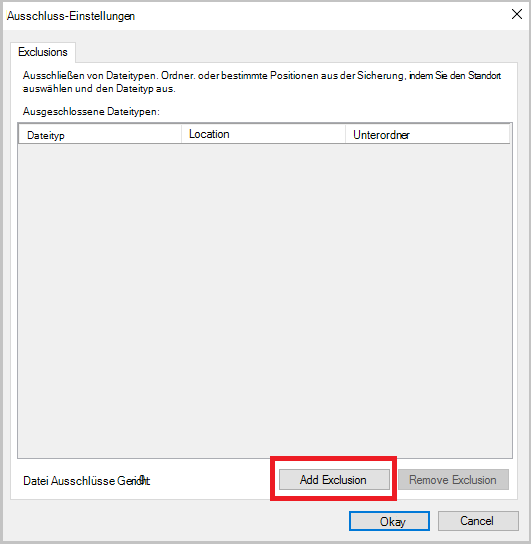

6. Wählen Sie den Standort aus, und klicken Sie dann auf **OK**.

    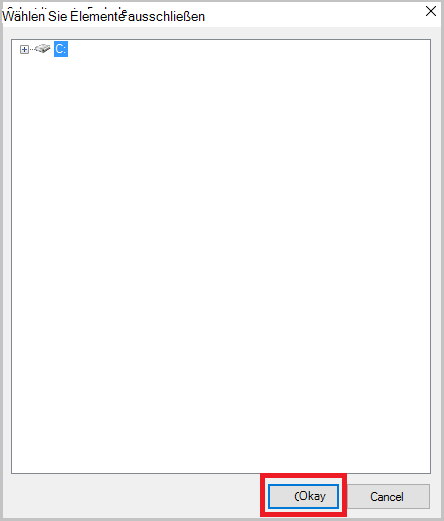

7. Fügen Sie im Feld **Dateityp** die Erweiterung hinzu.

    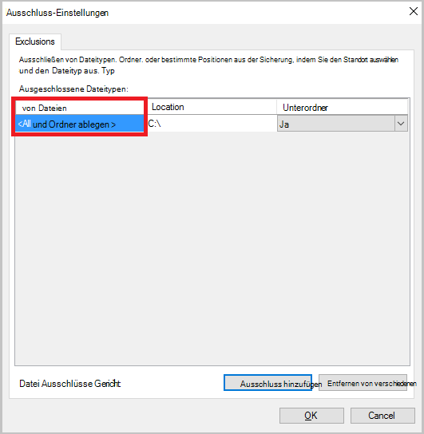

    Hinzufügen einer MP3-Erweiterung

    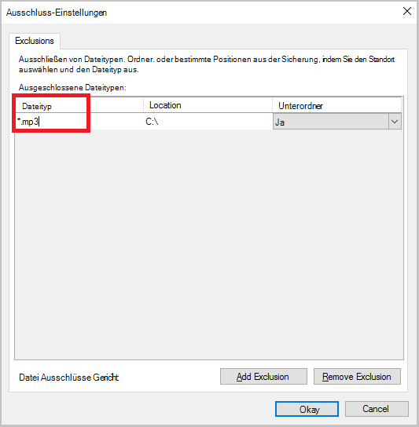

    Um eine andere Erweiterung hinzuzufügen, klicken Sie auf **Ausschluss hinzufügen** , und geben Sie einen anderen Typ Erweiterung (Hinzufügen einer JPEG-Erweiterung).

    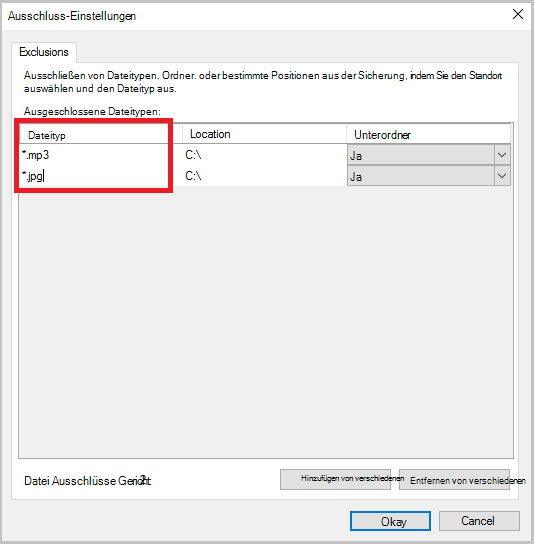

8. Wenn Sie alle die Erweiterungen hinzugefügt haben, klicken Sie auf **OK**.

9. Fahren Sie mit der Terminplan Sicherung-Assistenten, indem Sie auf **Weiter** , bis der **Bestätigungsseite**, und klicken Sie auf **Fertig stellen**.

    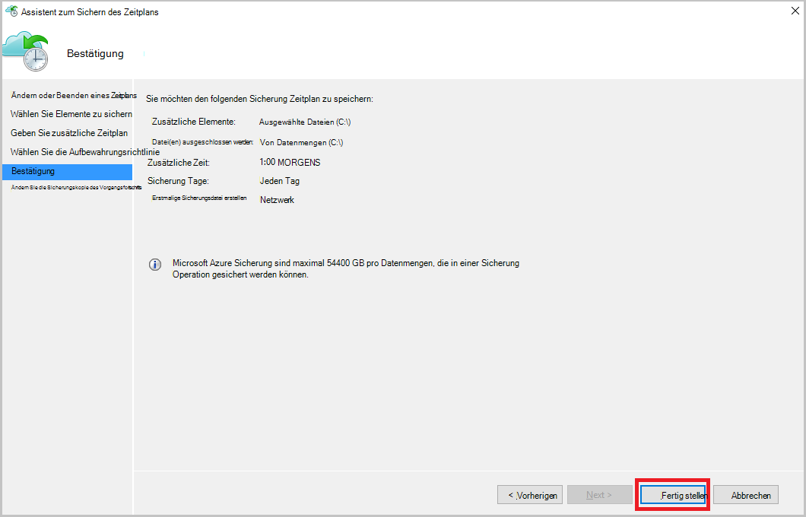

## Nächste Schritte
- [Wiederherstellen von WindowsServer oder Windows-Client aus Azure](backup-azure-restore-windows-server.md)
- Wenn Sie weitere Informationen zur Azure Sicherung finden Sie unter [Übersicht über die Sicherung Azure](backup-introduction-to-azure-backup.md)
- Besuchen Sie das [Forum für Azure Sicherung](http://go.microsoft.com/fwlink/p/?LinkId=290933)
