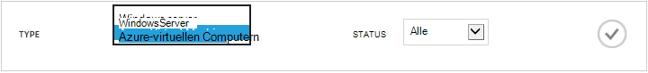

<properties
    pageTitle="Sichern von Azure-virtuellen Computern | Microsoft Azure"
    description="Ermitteln Sie, registrieren Sie, und Sichern Sie Ihrer virtuellen Computern mit folgenden Verfahren für Azure-virtuellen Computern sichern."
    services="backup"
    documentationCenter=""
    authors="markgalioto"
    manager="jwhit"
    editor=""
    keywords="Sichern von virtuellen Computern; Sichern von virtuellen Computern; Sichern und Disaster Wiederherstellung; virtueller Computer Sicherung"/>

<tags
    ms.service="backup"
    ms.workload="storage-backup-recovery"
    ms.tgt_pltfrm="na"
    ms.devlang="na"
    ms.topic="article"
    ms.date="09/28/2016"
    ms.author="trinadhk; jimpark; markgal;"/>

# Sichern von Azure-virtuellen Computern

> [AZURE.SELECTOR]
- [Sichern von virtuellen Computern zum Wiederherstellung Services Tresor](backup-azure-arm-vms.md)
- [Sichern von virtuellen Computern zum Sichern Tresor](backup-azure-vms.md)

Dieser Artikel enthält die Verfahren zum Sichern einer klassischen bereitgestellt Azure-virtuellen Computern (virtueller Computer) zu einer Sicherung Tresor. Es gibt einige Vorgänge, die, denen Sie erledigen, bevor Sie eine Azure-virtuellen Computern sichern können müssen. Wenn Sie dies noch nicht getan haben, führen Sie die [erforderlichen Komponenten](backup-azure-vms-prepare.md) zum Vorbereiten Ihrer Umgebung für Ihre virtuellen Computern sichern.

Weitere Informationen finden Sie unter Artikel [Planen der Sicherungsdatei virtueller Computer-Infrastruktur in Azure](backup-azure-vms-introduction.md) und [Azure-virtuellen Computern](https://azure.microsoft.com/documentation/services/virtual-machines/).

>[AZURE.NOTE] Azure weist zwei Bereitstellungsmodelle für das Erstellen von und Arbeiten mit Ressourcen: [Ressourcenmanager und Classic](../resource-manager-deployment-model.md). Eine Sicherung Tresor kann nur klassischen bereitgestellt virtuelle Computer schützen. Sie können keine Ressourcenmanager bereitgestellt virtueller Computer mit einer Sicherung Tresor schützen. Weitere Informationen zum Arbeiten mit Wiederherstellung Services Depots finden Sie unter [virtuelle Computer Wiederherstellung Services Tresor sichern](backup-azure-arm-vms.md) .

Sichern der Azure-virtuellen Computern umfasst drei Hauptschritte:

>[AZURE.NOTE] Sichern von virtuellen Computern umfasst eine lokale. Sie können nicht auf eine Sicherung Tresor in einem anderen Region virtuellen Computern in einer Region sichern. Müssen Sie eine Sicherungskopie Tresor in jeder Region Azure erstellen, in der befinden virtuellen Computern, die gesichert werden.

## Schritt 1 – ermitteln Azure-virtuellen Computern
Um sicherzustellen, dass das Abonnement hinzugefügt alle neuen virtuellen Computern (virtuellen Computern) vor der Registrierung identifiziert werden, führen Sie den Erkennungsvorgang. Die Prozess Abfragen Azure für die Liste der virtuellen Computern im Abonnement, zusammen mit weiteren Informationen wie den Namen der Cloud-Dienst und der Region.

1. Melden Sie sich bei der [Classic-portal](http://manage.windowsazure.com/)

2. Klicken Sie in der Liste der Dienste Azure auf **Wiederherstellung Services** , um der Liste der Sicherung und Wiederherstellung Website +++ zu öffnen.
    

3. Wählen Sie Sicherung +++ Liste den Tresor eines virtuellen Computers zu sichern.

    Ist dies eine neue Tresor wird im Portal zur Seite **Schnellstart** geöffnet.

    

    Wenn der Tresor zuvor konfiguriert wurde, wird im Portal die zuletzt verwendete Menü geöffnet.

4. Klicken Sie im Menü Tresor (am oberen Rand der Seite) auf **Registriert Elemente**.

    

5. Wählen Sie im Menü **Typ** **Azure-virtuellen Computern**.

    

6. Klicken Sie auf **Suchen** , am unteren Rand der Seite.
    

    Der Erkennungsvorgang kann einige Minuten dauern, während der virtuellen Computern tabellarisch angeordnet werden, sind. Es gibt eine Benachrichtigung am unteren Rand des Bildschirms, mit dem Sie wissen, dass der Prozess ausgeführt wird.

    

    Führen Sie die Änderungen Benachrichtigung, wenn der Vorgang ist. Wenn der Erkennungsvorgang keine den virtuellen Computern gefunden haben, zuerst stellen Sie sicher, dass der virtuelle Computer vorhanden sind. Wenn der virtuelle Computer vorhanden sind, stellen Sie sicher, dass die virtuellen Computern im gleichen Bereich als die Sicherung Tresor enthalten sind. Wenn die virtuellen Computern vorhanden sind und in der gleichen Region, stellen Sie sicher, dass die virtuellen Computern noch nicht um eine Sicherung Tresor registriert sind. Wenn ein virtueller Computer, eine Sicherung Tresor zugewiesen wurde ist nicht verfügbar, die andere Sicherung Depots zugewiesen werden soll.

    

    Wenn Sie die neue Elemente gefunden haben, fahren Sie mit Schritt2 und registrieren Sie Ihre virtuellen Computern.

##  Schritt 2: Register Azure-virtuellen Computern
Sie Registrieren einer Azure-virtuellen Computern um ihn mit dem Dienst Azure Sicherung zuzuordnen. Dies ist in der Regel eine einmalige Angelegenheit.

1. Navigieren Sie zu der Sicherungsdatei Tresor klicken Sie unter **Wiederherstellung Dienste** Azure-Portal, und klicken Sie dann auf **Elemente registriert**.

2. Wählen Sie **Azure-virtuellen Computern** aus dem Dropdownmenü aus.

    

3. Klicken Sie auf **Registrieren** , am unteren Rand der Seite.
    

4. Wählen Sie im Kontextmenü **Registrieren Elemente** den virtuellen Computern, die Sie erfassen möchten. Wenn es zwei oder mehr virtuellen Computern mit demselben Namen gibt, verwenden Sie Cloud-Dienst unterschieden.

    >[AZURE.TIP] Mehrere virtuelle Computer werden gleichzeitig erfasst.

    Ein Auftrag wird für jeden virtuellen Computer erstellt, die Sie ausgewählt haben.

5. Klicken Sie auf **Ansicht Position** in der Benachrichtigung, um die Seite **Aufträge** anzuzeigen.

    

    Des virtuellen Computers wird auch in der Liste der registrierten Elemente und außerdem den Status des Vorgangs Registrierung.

    

    Wenn der Vorgang abgeschlossen ist, der Status ändert sich in den Zustand *registriert* wiederzugeben.

    

## Schritt 3: Schützen der Azure-virtuellen Computern
Jetzt können Sie die Richtlinie für eine Sicherung und Aufbewahrung des virtuellen Computers einrichten. Mehrere virtuelle Computer geschützt werden können, indem ein einzelnes Aktion schützen.

Azure Sicherung Depots erstellt, nachdem Mai 2015 im Zusammenhang mit dem Tresor eine Standardrichtlinie integriert. Diese Standardrichtlinie verfügt über ein Standard-Archivierung von 30 Tagen und einen einmaligem – täglich Sicherung Zeitplan.

1. Navigieren Sie zu der Sicherungsdatei Tresor klicken Sie unter **Wiederherstellung Dienste** Azure-Portal, und klicken Sie dann auf **Elemente registriert**.
2. Wählen Sie **Azure-virtuellen Computern** aus dem Dropdownmenü aus.

    

3. Klicken Sie auf **schützen** am unteren Rand der Seite.

    **Schützen von Elementen-Assistent** wird angezeigt. Der Assistent Listet nur virtuellen Computern, die registriert und nicht geschützt werden. Wählen Sie den virtuellen Computern, die Sie schützen möchten.

    Wenn es gibt zwei oder mehr virtuellen Computern mit demselben Namen ein, anhand des Cloud-Diensts zwischen den virtuellen Computern unterscheiden.

    >[AZURE.TIP] Sie können mehrere virtuelle Computer gleichzeitig zu schützen.

    

4. Wählen Sie eine **Sicherung planen** , um den virtuellen Computern sichern, die Sie ausgewählt haben. Aus einem bestehenden Satz von Richtlinien auswählen können oder eine neue definieren.

    Jede zusätzliche Richtlinie kann mehrere virtuelle Computer zugeordnet haben. Des virtuellen Computers nur kann eine Richtlinie zu einem bestimmten Zeitpunkt zugeordnet Zeitpunkt jedoch.

    

    >[AZURE.NOTE] Eine Sicherung Richtlinie enthält ein Schema Aufbewahrungsrichtlinien für den geplanten Sicherungskopien. Wenn Sie eine vorhandene Sicherung Richtlinie auswählen, können Sie die Aufbewahrung Optionen im nächsten Schritt nicht ändern.

5. Wählen Sie einen **Aufbewahrungszeitraum** , mit der Sicherungskopien zugeordnet werden soll.

    

    Aufbewahrungsrichtlinie gibt die angegebene Zeitspanne für das Speichern einer Sicherungskopie an. Sie können angeben, dass unterschiedliche Aufbewahrungsrichtlinien basierend auf, wenn die Sicherungsdatei stammt. Ein Sicherung Punkt erfasste täglich (die als Wiederherstellung Point fungiert) möglicherweise beispielsweise 90 Tage lang archiviert werden. Im Vergleich möglicherweise ein Sicherung Punkt am Ende jeder Quartal (Audit Zwecken) erfasste für viele Monate oder Jahre archiviert werden müssen.

    

    In diesem Beispielbild:

    - **Tägliche Aufbewahrungsrichtlinie**: Sicherungskopien täglich erfasste 30 Tage lang gespeichert sind.
    - **Wöchentliche Aufbewahrungsrichtlinie**: jede Woche am Sonntag erfasste Sicherungskopien für 104 Wochen beibehalten werden.
    - **Monatliche Aufbewahrungsrichtlinie**: der letzten Sonntag jeden Monat durchgeführte Sicherungen für 120 Monate beibehalten werden.
    - **Der jahresbezogene Aufbewahrungsrichtlinie**: ersten Sonntag jeder Januar durchgeführte Sicherungen für 99 Jahren beibehalten werden.

    Ein Auftrag wird erstellt, um die Schutzrichtlinie konfigurieren, und ordnen Sie die virtuellen Computer auf die Richtlinie für jeden virtuellen Computer, die Sie ausgewählt haben.

6. Klicken Sie zum Anzeigen der Liste der Aufträge **Schutz konfigurieren** , wählen Sie im Menü Depots klicken Sie auf **Projekte** , und wählen Sie aus dem **Vorgang** Filter **Schutz konfigurieren** .

    

## Anfängliche Sicherung
Zeigt nachdem des virtuellen Computers mit einer Richtlinie geschützt ist, klicken Sie unter der Registerkarte **Geschützte Elemente** mit dem Status der *geschützten - (Ausstehend initial Sicherung)*nach oben. Standardmäßig ist die erste geplante Sicherung die *ursprüngliche sichern*.

Die ursprüngliche Sicherung ausgelöst unmittelbar nach Schutz konfigurieren:

1. Klicken Sie unten auf der Seite **Geschützte Elemente** klicken Sie auf **Jetzt sichern**.

    Die Sicherung Azure Service erstellt eine Sicherungskopie Position für die ursprüngliche Sicherung.

2. Klicken Sie auf der Registerkarte **Aufträge** , um die Liste der Aufträge anzuzeigen.

    

>[AZURE.NOTE] Während des Vorgangs Sicherung gibt die Sicherung Azure Service einen Befehl an die Sicherung Erweiterung auf jedem virtuellen Computer leeren alle schreiben Aufträge und eine konsistente Momentaufnahme.

Klicken Sie nach Abschluss die anfängliche Sicherung ist der Status des virtuellen Computers auf der Registerkarte **Geschützte Elemente** *geschützten*aus.

## Anzeigen von Sicherung Status und details
Nachdem geschützt ist, wird die Anzahl der virtuellen Computern auch in der **Dashboard** -Seite Zusammenfassung erhöht. Die Seite **Dashboard** zeigt auch die Anzahl der Aufträge in den letzten 24 Stunden, die *durchgeführt*werden *Fehler*und wurden *erfolgreich*an. Klicken Sie auf der Seite **Projekte** verwenden Sie den **Status**, **Vorgang**, oder **von** und **bis** Menüs auf um die Einzelvorgänge zu filtern.

Werte im Dashboard werden alle 24 Stunden einmal aktualisiert.

## Problembehandlung bei Fehlern
Wenn Sie Probleme beim Sichern auf den virtuellen Rechner auftreten, schauen Sie sich im [virtuellen Computer-Artikel zur Problembehandlung](backup-azure-vms-troubleshoot.md) für Hilfe.

## Nächste Schritte

- [Verwalten Sie und überwachen Sie Ihrer virtuellen Computern](backup-azure-manage-vms.md)
- [Wiederherstellen von virtuellen Computern](backup-azure-restore-vms.md)
