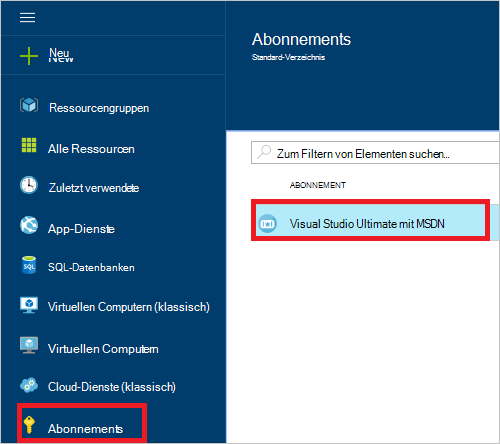
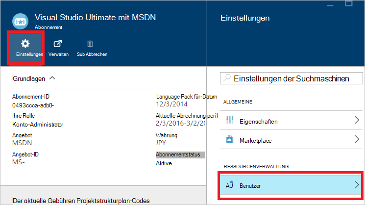
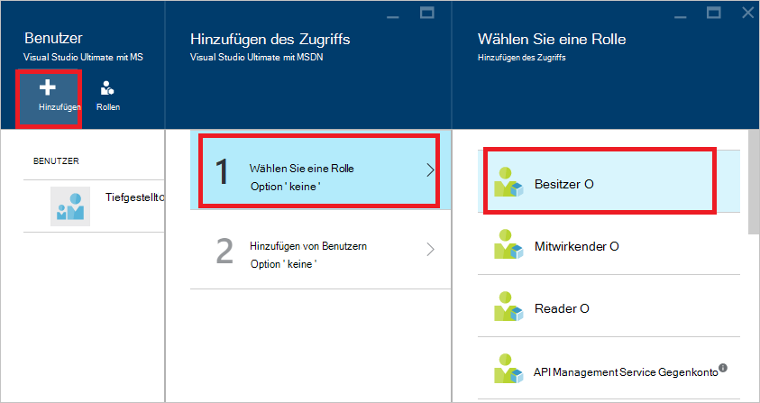
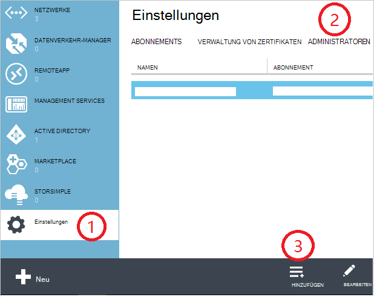
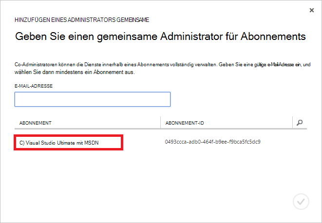
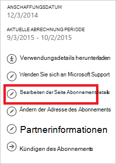
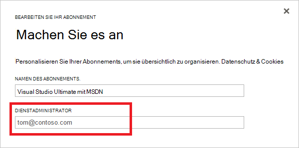

<properties
    pageTitle="Hinzufügen oder Ändern von Azure Administratorrollen | Microsoft Azure"
    description="Beschreibt, wie Sie hinzufügen oder Ändern von Azure gemeinsame Administrator, Dienstadministratoren und Konto manuell konfigurieren"
    services=""
    documentationCenter=""
    authors="genlin"
    manager="mbaldwin"
    editor=""
    tags="billing"/>

<tags
    ms.service="billing"
    ms.workload="na"
    ms.tgt_pltfrm="na"
    ms.devlang="na"
    ms.topic="article"
    ms.date="08/17/2016"
    ms.author="genli"/>

# Hinzufügen oder Ändern von Azure Administratorrollen

Es gibt drei Arten von Administratorrollen in Microsoft Azure aus:

| Administratorrollen   | Grenzwert  | Beschreibung
| ------------- | ------------- |---------------|
|Konto-Administrator (AA)  | 1 pro Azure-Konto  |Dies ist die Person, die für angemeldet oder erworben Azure-Abonnements, und ist berechtigt, das [Konto Center](https://account.windowsazure.com/Home/Index) zugreifen und verschiedene Verwaltungsaufgaben ausführen. Hierzu gehören zum Erstellen von Abonnements, kündigen des Abonnements, ändern die Rechnung für ein Abonnement und Dienstadministrator ändern.
| Dienstadministrator (SA) | 1 pro Azure-Abonnement  |Diese Rolle ist zum Verwalten von Diensten im [Portal Azure](https://portal.azure.com)autorisiert. Für ein neues Abonnement wird standardmäßig, der Administrator Konto auch Dienstadministrator.|
|Gemeinsame Administrator (CA) im [Azure klassischen-portal](https://manage.windowsazure.com)|200 pro Abonnement| Diese Rolle weist dieselben Zugriffsberechtigungen als Dienstadministrator, aber nicht die Zuordnung des Abonnements zu Azure Verzeichnisse wechseln. |

> [AZURE.NOTE] Azure Active Directory rollenbasierte Access Steuerelement (RBAC) ermöglicht Benutzern, die mehrere Rollen hinzugefügt werden. Weitere Informationen finden Sie unter [Azure Active Directory rollenbasierte Access Control](./active-directory/role-based-access-control-configure.md).

> [AZURE.NOTE] Wenn Sie an einer beliebigen Stelle in diesem Artikel weitere Hilfe benötigen, wenden Sie sich bitte [an den Support](https://portal.azure.com/?#blade/Microsoft_Azure_Support/HelpAndSupportBlade) , um das Problem erhalten schnell gelöst.

## So fügen Sie ein Administrator für ein Abonnement

**Azure-portal**

1. Melden Sie sich mit dem [Azure-Portal](https://portal.azure.com)aus.

2. Markieren Sie im Menü Hub **Abonnement** > *das Abonnement die gewünschte der Administrator für den Zugriff auf*.

    

3. Wählen Sie das Abonnement Blade **Einstellungen**> **Benutzer**.

    
4. Markieren Sie in dem Benutzer Blade **Hinzufügen**>**auswählen eine Rolle** > **Besitzer**.

    

    **Notiz**
    - Die Besitzerrolle weist dieselben Zugriffsberechtigungen als Administrator gemeinsam an. Diese Rolle besitzt keine Zugriffsberechtigung [Azure Account Center](https://account.windowsazure.com/subscriptions).
    - Services im [Azure klassischen Portal](https://manage.windowsazure.com)können nicht der Besitzer über das [Azure-Portal](https://portal.azure.com) hinzugefügte verwaltet werden.  

5. Geben Sie die e-Mail-Adresse des Benutzers, die Sie als Besitzer hinzufügen, klicken Sie auf den Benutzer, und klicken Sie auf **auswählen**möchten.

    

**Azure klassischen-portal**

1. Melden Sie sich zum [Azure klassischen Portal](https://manage.windowsazure.com/)aus.

2. Wählen Sie im Navigationsbereich **Einstellungen**> **Administratoren**> **Hinzufügen**.  

    

3. Geben Sie die e-Mail-Adresse der Person, die Sie als Administrator gemeinsame hinzufügen, und wählen Sie dann das Abonnement, das Sie für den Zugriff auf den gemeinsame Administrator möchten möchten. 

     

Die folgende e-Mail-Adresse kann als gemeinsame Administrator hinzugefügt werden:

* **Microsoft-Konto** (vormals Windows Live ID)  
 Ein Microsoft-Account können Sie melden Sie sich bei allen Microsoft-Produkten Consumer Orientierung und cloud-Dienste, wie z. B. Outlook (Hotmail), Skype (MSN), OneDrive, Windows Phone und Xbox LIVE.
* **Organisations-Konto** 
 Ein Organisations-Konto ist ein Konto aus, die unter Azure Active Directory erstellt wird. Die Organisations-Kontoadresse ähnelt die folgenden: user@ &lt;Ihrer Domäne&gt;. onmicrosoft.com

### Einschränkungen und Einschränkungen

 * Jedes Abonnement wird eine Azure AD-Verzeichnis (auch bekannt als Standard Verzeichnis) zugeordnet. Um das Standardformat Verzeichnis suchen das Abonnement zugeordnet ist, wechseln Sie zum [Azure klassischen Portal](https://manage.windowsazure.com/), wählen Sie **Einstellungen**aus > **Abonnements**. Überprüfen Sie die Abonnement-ID, um das Standardformat Verzeichnis suchen.

 * Wenn Sie sich mit einem Microsoft-Account angemeldet sind, können Sie die anderen Microsoft-Accounts oder Benutzer im Verzeichnis standardmäßig nur als gemeinsame Administrator hinzufügen.

 * Wenn Sie mit der ein Organisations-Konto angemeldet sind, können Sie andere Organisationskonten in Ihrer Organisation als gemeinsame Administrator hinzufügen. Beispielsweise abby@contoso.com hinzufügen können bob@contoso.com als Dienstadministrator oder gemeinsame Administrator, aber keine hinzufügen john@notcontoso.com es sei denn, john@noncontoso.com ist der Benutzer im Verzeichnis Standard. Mit Organisationskonten angemeldet Benutzer können weiterhin Microsoft Account Benutzer als Dienstadministrator oder gemeinsame Administrator hinzufügen.

 * Jetzt, da es bei Azure mit einem organisationskonto anmelden möglich ist, sind hier die Änderungen an Konto Dienst und Co-Administratoren:

    Login-Methode| Fügen Sie Microsoft Account oder Benutzer Datenverzeichnis Standard als Zertifizierungsstelle oder SA hinzu?  |Fügen Sie in der gleichen Organisation als Zertifizierungsstelle oder SA Organisations-Konto hinzu? |Anderen Organisation als Zertifizierungsstelle oder SA hinzufügen Organisations-Konto?
    ------------- | ------------- |---------------|---------------
    Microsoft-Konto |Ja|Nein|Nein
    Organisations-Konto|Ja|Ja|Nein

## So ändern Sie Dienstadministrator für ein Abonnement

Nur Konto-Administrator können Dienstadministrator für ein Abonnement ändern.

1. Melden Sie sich mit dem Konto Administrator in der [Mitte der Azure-Konto](https://account.windowsazure.com/subscriptions) an.

2. Wählen Sie das Abonnement, das Sie ändern möchten.

3. Klicken Sie auf der rechten Seite Details **Bearbeiten Abonnements** auf.  

    

4. Geben Sie im Feld **DIENSTADMINISTRATOR** die e-Mail-Adresse des neuen Service-Administrators.  

    

## So ändern Sie das Konto manuell konfigurieren

Zum Übertragen der Besitzrechte an der Azure-Konto an ein anderes Konto finden Sie unter [Übertragen von Besitz eines Azure-Abonnements](billing-subscription-transfer.md).

## Nächste Schritte

* Weitere Informationen, wie der Zugriff auf Ressourcen in Microsoft Azure gesteuert wird, finden Sie unter [Grundlegendes zu Ressourcen Access in Azure](./active-directory/active-directory-understanding-resource-access.md)

* Weitere Informationen zur Beziehung von Azure Active Directory zu Ihrem Abonnement Azure finden Sie unter [wie Azure-Abonnements Azure Active Directory zugeordnet sind](./active-directory/active-directory-how-subscriptions-associated-directory.md)

* Weitere Informationen zur Beziehung von Azure Active Directory zu Ihrem Abonnement Azure finden Sie unter [Zuweisen von Administratorrollen in Azure Active Directory](./active-directory/active-directory-assign-admin-roles.md)

> [AZURE.NOTE] Wenn Sie noch weitere Fragen haben, wenden Sie sich bitte [an den Support](https://portal.azure.com/?#blade/Microsoft_Azure_Support/HelpAndSupportBlade) , um das Problem erhalten schnell gelöst.
