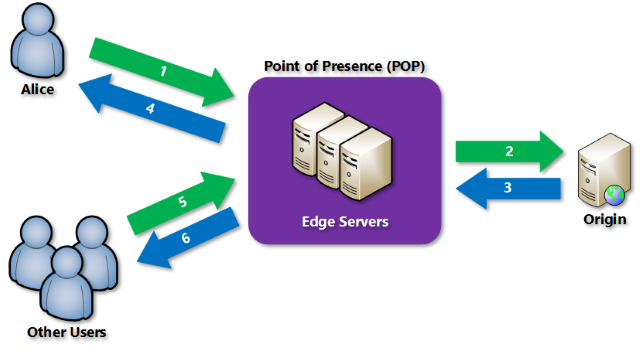

<properties
    pageTitle="Übersicht über die Azure CDN | Microsoft Azure"
    description="Erfahren Sie, was Azure Content Delivery Network (CDN) ist und wie zur gemeinsamen Nutzung von Inhalt mit hoher Bandbreite durch Zwischenspeichern vorführen blobs und statischen Inhalt."
    services="cdn"
    documentationCenter=""
    authors="camsoper"
    manager="erikre"
    editor=""/>

<tags
    ms.service="cdn"
    ms.workload="tbd"
    ms.tgt_pltfrm="na"
    ms.devlang="na"
    ms.topic="hero-article"
    ms.date="09/30/2016"
    ms.author="casoper"/>

# Übersicht über die Azure Content Delivery Network (CDN)

> [AZURE.NOTE] Dieses Dokument beschreibt, was Azure Content Delivery Network (CDN) ist, wie es funktioniert, und die Features des jeweiligen Produkts Azure CDN.  Wenn Sie überspringen diese Informationen und direkt an ein Lernprogramm zum Erstellen eines CDN-Endpunkts wechseln möchten, finden Sie unter [Verwenden von Azure CDN](cdn-create-new-endpoint.md).  Wenn Sie eine Liste der aktuellen CDN Knoten Speicherorte anzeigen möchten, finden Sie unter [Azure CDN POP-Standorten](cdn-pop-locations.md).

Azure Content Delivery Network (CDN) speichert Statische Webinhalte am strategisch ausgewählten Standorten maximalen Durchsatz zum Darstellen von Inhalten für Benutzer bereitstellen.  Das CDN bietet Entwicklern eine globale Lösung für die Bereitstellung von Inhalten hoher Bandbreite durch den Inhalt am physischen Knoten in der ganzen Welt Zwischenspeichern. 

Das CDN Cache Website Anlagen bietet folgende Vorteile:

- Eine bessere Leistung und Benutzer mit abgestimmten Endbenutzer, besonders wenn Applications verwenden, sind mehrere Schleifen erforderlich, um Inhalte zu laden.
- Groß, um eine bessere Skalierung behandeln hohen Auslastung erfolgt, wie am Anfang eines Ereignisses Launch Produkt aus.
- Verteilen von benutzeranforderungen und Inhalte aus Rand-Servern, wird weniger Datenverkehr an den Ursprung gesendet.

## So funktioniert es

1. Ein Benutzer (Alice) anfordert, eine Datei (auch ein Anlageguts bezeichnet) mithilfe einer URL mit einem speziellen Domänennamen, wie `<endpointname>.azureedge.net`.  DNS leitet die Anforderung an das beste Durchführung Point of Presence (POP) Speicherort.  In der Regel handelt es sich um die POP, die geografischen für den Benutzer am nächsten ist.

2. Wenn die Kante Server in der POP die Datei nicht in ihrem Cache verfügen, fordert der Kante-Server die Datei vom Ursprung aus.  Der Ursprung kann eine Azure Web App, Azure-Cloud-Dienst, Speicher Azure-Konto oder eine öffentlich zugängliche Webserver sein.

3. Der Ursprung gibt die Datei an den Rand Server, einschließlich der optionalen HTTP-Header zur Beschreibung der gewünschten Datei Time-to-Live (TTL).

4. Der Kante Server speichert die Datei, und gibt die Datei an den ursprünglichen Requestor (Alice).  Die Datei verbleibt auf dem Server Kante, bis die Gültigkeitsdauer läuft ab.  Wenn Sie der Ursprung einer TTL angegeben haben, ist die Standard-TTL sieben Tage an.

5. Weitere Benutzer verlangen dann derselben Datei mit der gleichen URL und möglicherweise auch an derselben POP weitergeleitet werden.

6. Wenn die Gültigkeitsdauer für die Datei abgelaufen ist, gibt der Rand-Server die Datei aus dem Cache.  Dadurch wird eine Benutzeroberfläche schneller, mehr reagiert.

## Azure CDN-Features

Es gibt drei Azure CDN Produkte: **Azure CDN Standard von Akamai**, **Azure CDN Standard von Verizon**und **Azure CDN Premium aus Verizon**.  Die folgende Tabelle listet die Features, die mit jedem Produkt verfügbar.

|       | Standard Akamai | Standard Verizon | Premium Verizon |
|-------|-----------------|------------------|-----------------|
| Einfache Integration mit Azure services, wie z. B. [Speicher](cdn-create-a-storage-account-with-cdn.md), [Cloud Services](cdn-cloud-service-with-cdn.md), [Web Apps](../app-service-web/cdn-websites-with-cdn.md)und [Media-Dienste](../media-services/media-services-portal-manage-streaming-endpoints.md) | **& #x 2713;** | **& #x 2713;** | **& #x 2713;**|
| Management über [REST-API](https://msdn.microsoft.com/library/mt634456.aspx), [.NET-](./cdn-app-dev-net.md), [Node.js](./cdn-app-dev-node.md)oder [PowerShell](./cdn-manage-powershell.md). | **& #x 2713;** | **& #x 2713;** | **& #x 2713;** |
| HTTPS-Unterstützung | **& #x 2713;** | **& #x 2713;** | **& #x 2713;** |
| Lastenausgleich | **& #x 2713;** | **& #x 2713;** | **& #x 2713;** |
| [DDOS](https://www.us-cert.gov/ncas/tips/ST04-015) Schutz | **& #x 2713;** | **& #x 2713;** | **& #x 2713;** |
| IPv4/IPv6 zwei-Stapel | **& #x 2713;** | **& #x 2713;** | **& #x 2713;** |
| [Unterstützung für benutzerdefinierte Domain name](cdn-map-content-to-custom-domain.md) | **& #x 2713;** | **& #x 2713;** | **& #x 2713;** |
| [Abfrage-Zeichenfolge Cache](cdn-query-string.md) | **& #x 2713;** | **& #x 2713;** | **& #x 2713;** |
| [Geo-Filterung](cdn-restrict-access-by-country.md) |  | **& #x 2713;** | **& #x 2713;** |
| [Schnelles bereinigen](cdn-purge-endpoint.md) | **& #x 2713;** | **& #x 2713;** | **& #x 2713;** |
| [Vor dem Laden der Anlage](cdn-preload-endpoint.md) |  | **& #x 2713;** | **& #x 2713;** |
| [Core analytics](cdn-analyze-usage-patterns.md) |  | **& #x 2713;** | **& #x 2713;** |
| [HTTP-/ 2-Unterstützung](https://msdn.microsoft.com/library/mt762901.aspx) | **& #x 2713;**  |  |  |
| [Erweiterte HTTP-Berichte](cdn-advanced-http-reports.md) | | | **& #x 2713;** |
| [In Echtzeit stats](cdn-real-time-stats.md) | | | **& #x 2713;** |
| [Hinweise in Echtzeit](cdn-real-time-alerts.md) | | | **& #x 2713;** |
| [Anpassbare, Regel-basierte Bereitstellung von Inhalten-engine](cdn-rules-engine.md) | | | **& #x 2713;** |
| Cache-Header-Einstellungen (mithilfe von [Regeln-Engine](cdn-rules-engine.md))  | | | **& #x 2713;** |
| URL umleiten/erneuten (mithilfe von [Regeln-Engine](cdn-rules-engine.md)) | | | **& #x 2713;** |
| Mobiles Geräteregeln (mithilfe von [Regeln-Engine](cdn-rules-engine.md))  | | | **& #x 2713;** |

>[AZURE.TIP] Gibt es eine Funktion, die in Azure CDN angezeigt werden soll?  [Geben Sie uns Feedback](https://feedback.azure.com/forums/169397-cdn)! 

## Nächste Schritte

Um mit CDN anzufangen, finden Sie unter [Azure CDN verwenden](./cdn-create-new-endpoint.md).

Wenn Sie eine vorhandene CDN-Kunde sind, können Sie jetzt die Endpunkte CDN über das [Microsoft Azure-Portal](https://portal.azure.com) oder mit [PowerShell](cdn-manage-powershell.md)verwalten.

Um die CDN in Aktion sehen zu können, schauen Sie sich die- [video unsere Sitzung 2016 erstellen](https://azure.microsoft.com/documentation/videos/build-2016-leveraging-the-new-azure-cdn-apis-to-build-wicked-fast-applications/).

Informationen Sie zum Automatisieren von Azure CDN mit [.NET](./cdn-app-dev-net.md) oder [Node.js](./cdn-app-dev-node.md).

Preisinformationen, finden Sie unter [CDN Preise](https://azure.microsoft.com/pricing/details/cdn/).
