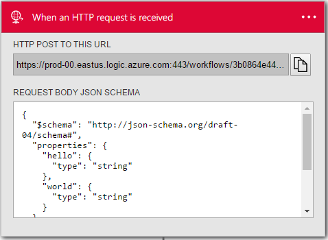

<properties
    pageTitle="Verwenden Sie die Anfrage und Antwort Aktionen | Microsoft Azure"
    description="Übersicht über die Anfrage und Antwort Trigger und die Aktion in einer app Azure Logik"
    services=""
    documentationCenter=""
    authors="jeffhollan"
    manager="erikre"
    editor=""
    tags="connectors"/>

<tags
   ms.service="logic-apps"
   ms.devlang="na"
   ms.topic="article"
   ms.tgt_pltfrm="na"
   ms.workload="na"
   ms.date="07/18/2016"
   ms.author="jehollan"/>

# Erste Schritte mit der Anfrage und Antwort-Komponenten

Mit der Anfrage und Antwort Komponenten in einer app Logik können Sie in Echtzeit auf Ereignisse reagieren.

Beispielsweise können Sie:

- Reagieren Sie auf eine HTTP-Anforderung mit Daten aus einer lokalen Datenbank über eine app Logik.
- Auslösen einer app Logik aus einem externen Webhook Ereignis.
- Rufen Sie eine app Logik mit einer Anforderung und Antwort Aktion aus innerhalb einer anderen Logik app.

Um anzufangen die Anfrage und Antwort Aktionen in einer app Logik verwenden, finden Sie unter [Erstellen einer Logik app](../app-service-logic/app-service-logic-create-a-logic-app.md).

## Verwenden des Triggers HTTP-Anforderung

Ein Trigger ist ein Ereignis, die verwendet werden kann, um den Workflow zu starten, der in einer app Logik definiert ist. [Erfahren Sie mehr über Trigger](connectors-overview.md).

Hier ist eine Beispiel-Abfolge von Informationen zum Einrichten einer HTTP-Anforderung im Logik App-Designer.

1. Fügen Sie dem Trigger **Anforderung – Wenn ein HTTP-Anforderung empfangen wird** in Ihrer app Logik hinzu. Sie können optional ein Schema JSON bereitstellen (mithilfe von Tools wie [JSONSchema.net](http://jsonschema.net)) für den Hauptteil der Anforderung. Dadurch wird den Designer Token für die Eigenschaften in der HTTP-Anforderung generiert werden.
2. Fügen Sie eine andere Aktion, damit Sie die app Logik speichern können.
3. Nach dem Speichern der app Logik, können Sie die URL der HTTP-Anforderung aus der Anfrage Karte erhalten.
4. (Sie können einem Tool wie [Postman](https://www.getpostman.com/)) HTTP POST für die URL löst die Logik app.

>[AZURE.NOTE] Wenn Sie eine Antwort Aktion definieren einer `202 ACCEPTED` Antwort wird sofort zurückgegeben, um den Anrufer. Die Antwortaktion können eine Antwort anpassen.

## Verwenden Sie die Aktion HTTP-Antwort

Die HTTP-Antwort-Aktion ist nur gültig, wenn Sie es in einem Workflow verwenden, der durch eine HTTP-Anforderung ausgelöst wird. Wenn Sie eine Antwort Aktion definieren einer `202 ACCEPTED` Antwort an den Anrufer sofort zurückgegeben.  Sie können eine Antwortaktion bei jedem Schritt innerhalb des Workflows hinzufügen. Die Logik app behält nur die eingehende Anforderung Öffnen einer Minute für eine Antwort.  Nach einer Minute, wenn keine Antwort, aus dem Workflow gesendet wurde (und eine Antwortaktion vorhanden, in der Definition ist) einer `504 GATEWAY TIMEOUT` wird zurückgegeben, um den Anrufer.

So sieht zum Hinzufügen einer HTTP-Antwort Aktion aus:

1. Wählen Sie die Schaltfläche für den **Neuen Schritt** aus.
2. Wählen Sie **eine Aktion hinzufügen**.
3. Geben Sie in das Suchfeld der Aktion **Antwort** , um die Liste der Aktion Antwort ein.

    

4. Fügen Sie alle Parameter, die für die HTTP-Antwortnachricht erforderlich sind.

    

5. Klicken Sie auf die obere linke Ecke der Symbolleiste auf Speichern, und Ihre app Logik wird sowohl speichern und veröffentlichen (aktivieren).

## Anfordern der trigger

Hier sind die Details für den Trigger, den dieser Connector unterstützt. Es gibt eine einzelne Anforderung auslösen.

|Auslösen|Beschreibung|
|---|---|
|Anfordern|Tritt auf, wenn eine HTTP-Anforderung empfangen wird|

## Antwortaktion

Hier sind die Details für die Aktion, die dieser Connector unterstützt. Es gibt eine einzelne Antwortaktion, die nur verwendet werden kann, wenn er eine Anforderung Trigger begleitet wird.

|Aktion|Beschreibung|
|---|---|
|Antwort|Gibt eine Antwort auf die korrelierte HTTP-Anforderung|

### Details zu Trigger und Aktion

Die folgenden Tabellen beschreiben die Eingabefelder für das Auslösen und die Aktion, und die entsprechenden Details ausgeben.

#### Anfordern der trigger
So sieht ein Eingabefeld für den Trigger aus einer eingehenden HTTP-Anforderung.

|Anzeigename|Eigenschaftsname|Beschreibung|
|---|---|---|
|JSON-Schema|Schema|Das JSON-Schema des HTTP-Anforderungstexts|
 

**Die Ausgabedetails**

Im folgenden sind die Ausgabedetails für die Anfrage.

|Eigenschaftsname|Datentyp|Beschreibung|
|---|---|---|
|Kopfzeilen|Objekt|Anfordern von Kopfzeilen|
|Textkörper|Objekt|Anfordern des Objekts|

#### Antwortaktion

Im folgenden werden die Eingabefelder für die Aktion HTTP-Antwort. A * bedeutet, dass es ein Feld erforderlich ist.

|Anzeigename|Eigenschaftsname|Beschreibung|
|---|---|---|
|Status Code *|statusCode|Der Status HTTP-code|
|Kopfzeilen|Kopfzeilen|Ein JSON-Objekt von einem beliebigen Antwort Kopfzeilen aufnehmen möchten|
|Textkörper|Textkörper|Den Hauptteil einer Antwort|

## Nächste Schritte

Probieren Sie die Plattform und [Erstellen Sie eine app Logik](../app-service-logic/app-service-logic-create-a-logic-app.md). Sie können der verfügbaren Connectors Logik Apps vertraut machen, indem Sie die [Liste der APIs](apis-list.md).
