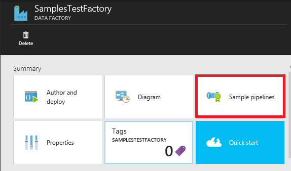
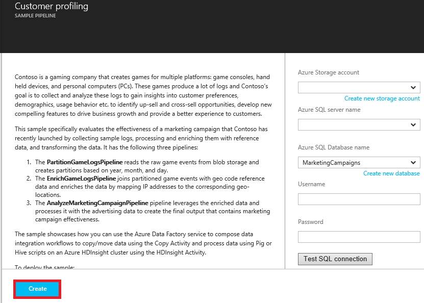

<properties     
    pageTitle="Azure-Daten Factory - Beispiele" 
    description="Finden Informationen zu Beispielen, in denen liefern mit dem Azure Data Factory-Dienst an." 
    services="data-factory" 
    documentationCenter="" 
    authors="sharonlo101" 
    manager="jhubbard" 
    editor="monicar"/>

<tags 
    ms.service="data-factory" 
    ms.workload="data-services" 
    ms.tgt_pltfrm="na" 
    ms.devlang="na" 
    ms.topic="article" 
    ms.date="10/18/2016" 
    ms.author="shlo"/>

# Azure-Daten Factory - Beispiele

## Beispiele für GitHub
[GitHub Azure-DataFactory Repository](https://github.com/azure/azure-datafactory) enthält mehrere Beispiele, mit denen Sie schnell auf dem neuesten Stand mit Azure Data Factory-Dienst (oder) ändern die Skripts und in eigenen Anwendung verwenden. Der Ordner Samples\JSON enthält JSON-Codeausschnitte für häufige Szenarien.

| Beispiel | Beschreibung |
| :----- | :---------- | 
| [ADF Exemplarische Vorgehensweise](https://github.com/Azure/Azure-DataFactory/tree/master/Samples/ADFWalkthrough) | Dieses Beispiel stellt eine End-to-End-Anleitung für die Verarbeitung von Protokolldateien Azure Data Factory verwenden, um Daten aus Protokolldateien in nach Einsichten zu drehen.   In dieser Anleitung erfahren Sie die Daten Factory Verkaufspipeline sammelt Stichprobe Protokolle, Prozesse bereichert die Daten aus Protokollen mit Bezug Daten, und transformiert die Daten, um die Effektivität einer Marketingkampagne auszuwerten, die zuletzt gestartet wurde. |
| [JSON-Beispiele](https://github.com/Azure/Azure-DataFactory/tree/master/Samples/JSON) | In diesem Beispiel stellt JSON-Beispiele für allgemeine Szenarien. | 
| [HTTP-Daten Downloader Stichprobe](https://github.com/Azure/Azure-DataFactory/tree/master/Samples/HttpDataDownloaderSample) | Dieses Beispiel stellt Herunterladen von Daten aus einem HTTP-Endpunkt auf Azure BLOB-Speicher mit benutzerdefinierter Aktivität für .NET. |
| [Cross AppDomain Punkt Netto Aktivität Stichprobe](https://github.com/Azure/Azure-DataFactory/tree/master/Samples/CrossAppDomainDotNetActivitySample) | In diesem Beispiel können Sie eine benutzerdefinierte .NET Aktivität Verfassen, die nicht zu Assemblyversionen untersuchten ADF Startprogramm für ein (beispielsweise WindowsAzure.Storage v4.3.0, Newtonsoft.Json v6.0.x, usw.) definiert ist. |
| [Führen Sie R-Skript](https://github.com/Azure/Azure-DataFactory/tree/master/Samples/RunRScriptUsingADFSample) |  In diesem Beispiel enthält die benutzerdefinierte Daten Factory-Aktivität, die verwendet werden kann, um RScript.exe aufzurufen. Dieses Beispiel funktioniert nur mit Ihrer eigenen (nicht bei Bedarf) HDInsight Cluster, der bereits R installiert enthält. |
| [Rufen Sie Spark Aufträge auf HDInsight Hadoop cluster](https://github.com/Azure/Azure-DataFactory/tree/master/Samples/Spark) | In diesem Beispiel wird gezeigt, wie MapReduce Aktivität zum Aufrufen eines Programms Spark verwendet wird. Das Programm Spark kopiert nur Daten aus einem Azure Blob-Container in einen anderen ein. |
| [Twitter-Datenanalyse mithilfe von Azure maschinellen Learning Stapel bewerten Aktivität](https://github.com/Azure/Azure-DataFactory/tree/master/Samples/TwitterAnalysisSample-AzureMLBatchScoringActivity) | In diesem Beispiel veranschaulicht, wie AzureMLBatchScoringActivity, ein Modell Azure maschinellen Learning aufzurufen, die Twitter Grüße Analysen, bewerten, Vorhersage usw. durchführt. |
| [Twitter-Datenanalyse mithilfe benutzerdefinierten Aktivität](https://github.com/Azure/Azure-DataFactory/tree/master/Samples/TwitterAnalysisSample-CustomC%23Activity) |  Dieses Beispiel zeigt, wie Sie eine benutzerdefinierte .NET Aktivität zu verwenden, um ein Modell Azure maschinellen Learning aufzurufen, die Twitter Grüße Analysen, bewerten, Vorhersage usw. durchführt. |
| [Parametrisierte Pipelines für maschinelle Azure-Schulung](https://github.com/Azure/Azure-DataFactory/tree/master/Samples/ParameterizedPipelinesForAzureML/) | Das Beispiel stellt einen End-to-End-C#-Code zum Bereitstellen von N Pipelines für die Bewertung und Umschulung, jede mit einem anderen Bereichsparameter, in die Liste der Gebiete aus einer Datei parameters.txt in Kürze ist das in diesem Beispiel enthalten ist. | 
| [Verweis Daten für Azure Stream Analytics Einzelvorgänge aktualisieren](https://github.com/Azure/Azure-DataFactory/tree/master/Samples/ReferenceDataRefreshForASAJobs) |  In diesem Beispiel veranschaulicht, wie Azure Data Factory und Azure Stream Analytics gemeinsames Verwenden von Abfragen mit Bezug Daten ausführen und die Aktualisierung für die Daten der Bezug auf einen Zeitplan für die Einrichtung. |
| [Hybrid Verkaufspipeline mit lokalen Hortonworks Hadoop](https://github.com/Azure/Azure-DataFactory/tree/master/Samples/HybridPipelineWithOnPremisesHortonworksHadoop) | Im Beispiel wird einen lokale Hadoop Cluster als Ziel berechnen für Aufträge in Data Factory ausgeführt wird, wie Sie andere Ziele berechnen hinzufügen möchten, wie eine HDInsight Hadoop Cluster in der Cloud-basierte verwendet. |
| [Tools für die Konvertierung JSON](https://github.com/Azure/Azure-DataFactory/tree/master/Samples/JSONConversionTool) | Dieses Tool können Sie JSONs von älteren Version als 2015-07-01-Vorschau neuesten oder 2015-07-01-Vorschau (Standard) konvertieren. |  
| [Eingabe U-SQL-Beispieldatei](https://github.com/Azure/Azure-DataFactory/tree/master/Samples/U-SQL%20Sample%20Input%20File) |  Diese Datei ist eine Beispieldatei durch eine U-SQL-Aktivität verwendet. | 

## Azure Ressourcenmanager Vorlagen
Sie können die folgenden Ressourcenmanager Azure-Vorlagen für Daten Factory auf Github suchen. 

| Vorlage | Beschreibung |
| -------- | ----------- | 
| [Kopieren von Azure Blob-Speicher mit SQL Azure-Datenbank](https://github.com/Azure/azure-quickstart-templates/tree/master/101-data-factory-blob-to-sql-copy) | Bereitstellen von dieser Vorlage erstellt eine Fabrik Azure-Daten mit einer Verkaufspipeline, die Daten aus dem angegebenen Azure Blob-Speicher zur Azure SQL-Datenbank kopiert |    
| [Kopieren von Vertrieb in Azure Blob-Speicher](https://github.com/Azure/azure-quickstart-templates/tree/master/101-data-factory-salesforce-to-blob-copy) | Bereitstellen von dieser Vorlage erstellt eine Fabrik Azure-Daten mit einer Verkaufspipeline, die Daten aus dem angegebenen Vertrieb Konto auf den Azure Blob-Speicher kopiert. |    
| [Transformieren Sie Daten, indem Sie ausführen Struktur Skripts auf einem Cluster Azure HDInsight](https://github.com/Azure/azure-quickstart-templates/tree/master/101-data-factory-hive-transformation) | Bereitstellen von dieser Vorlage erstellt eine Fabrik Azure-Daten mit einer Verkaufspipeline, die Daten durch Ausführen der Stichprobe Struktur Skripts auf einem Cluster Azure HDInsight Hadoop umwandelt. | 

## Beispiele Azure-Portal
Die Kachel **Stichprobe Pipelines** können auf der Homepage Ihrer Daten Factory Sie die Stichprobe Pipelines und die zugehörigen Einheiten (Datasets und verknüpften Diensten) in Ihrer Daten Factory bereitstellen. 

1. Erstellen einer Factory Daten oder öffnen Sie eine vorhandene Daten Factory. Finden Sie unter [Erste Schritte mit Azure Data Factory](data-factory-copy-data-from-azure-blob-storage-to-sql-database.md#CreateDataFactory) für Schritte, um eine Factory Daten zu erstellen.
2. Klicken Sie in den **Daten FACTORY** Blade für die Daten Factory auf die Kachel der **Stichprobe Pipelines** .

    

2. Klicken Sie in der **Stichprobe Pipelines** Blade auf der **Stichprobe** , die Sie bereitstellen möchten. 
    
    

3. Festlegen Sie Konfigurationen für die Stichprobe. Beispielsweise Ihre Azure-Speicher Konto Servername und die Kontoinformationen Schlüssel, SQL Azure-Servernamen, Datenbank, Benutzer-ID und Kennwort usw.. 

    

4. Nachdem Sie mit die Konfiguration Einstellungen angeben fertig sind, klicken Sie auf **Erstellen** , um Erstellen/der Stichprobe Pipelines und verknüpfte Pipelines untersuchten Services/Tabellen bereitstellen.
5. Der Status der Bereitstellung auf die Kachel Stichprobe, die Sie zuvor geklickt, klicken Sie auf das **Beispiel Pipelines** Blade haben angezeigt.

    

6. Wenn die Meldung **erfolgreich Bereitstellung** auf die Kachel für die Stichprobe angezeigt wird, schließen Sie das **Beispiel Pipelines** Blade.  
5. **Daten FACTORY** Blade sehen Sie, dass Ihre Daten Factory verknüpften Diensten, Datasets und Pipelines hinzugefügt werden.  

    
   
## Die Beispiele in Visual Studio

### Erforderliche Komponenten

Sie müssen Folgendes auf Ihrem Computer installiert sein: 

- Visual Studio 2013 oder Visual Studio 2015
- Herunterladen von Azure SDK für Visual Studio-2013 oder Visual Studio 2015. Navigieren Sie zur [Downloadseite Azure](https://azure.microsoft.com/downloads/) , und klicken Sie auf **im Vergleich mit einer 2013** oder **im Vergleich mit einer 2015** im Abschnitt **.NET** .
- Laden Sie die neuesten Azure Data Factory-Plug-In für Visual Studio: [im Vergleich mit einer 2013](https://visualstudiogallery.msdn.microsoft.com/754d998c-8f92-4aa7-835b-e89c8c954aa5) oder [im Vergleich mit einer 2015](https://visualstudiogallery.msdn.microsoft.com/371a4cf9-0093-40fa-b7dd-be3c74f49005). Wenn Sie Visual Studio 2013 verwenden, können Sie auch das Plug-in aktualisieren, indem Sie die folgenden Schritte ausführen: Klicken Sie im Menü **Extras**auf -> **Extensions und Updates** -> **Online** -> **Visual Studio Gallery** -> **Microsoft Azure Data Factory-Tools für Visual Studio** -> **Aktualisieren**.

### Verwenden von Data Factory-Vorlagen

1. Klicken Sie im Menü **Datei** auf, zeigen Sie auf **neu**, und klicken Sie auf **Projekt**. 
2. Führen Sie im Dialogfeld **Neues Projekt** die folgenden Schritte aus: 
    1. Wählen Sie **DataFactory** unter **Vorlagen**aus. 
    2. Wählen Sie im rechten Bereich **Daten Factory-Vorlagen** aus. 
    3. Geben Sie einen **Namen** für das Projekt ein. 
    4. Wählen Sie einen **Speicherort** für das Projekt aus. 
    5. Klicken Sie auf **OK**. 

    
6. Klicken Sie im Dialogfeld **Daten Factory Vorlagen** wählen Sie die Beispielvorlage aus dem Abschnitt **Use Case Vorlagen** aus, und klicken Sie auf **Weiter**. Die folgenden Schritte aus, die Sie mit der Vorlage **Ein Profil Kunden erstellen** durchgehen. Andere Beispiele beschriebenen Schritte. 

     
7. Klicken Sie im Dialogfeld **Daten Factory-Konfiguration** klicken Sie auf der Seite **Daten Factory Grundlagen** auf **Weiter** .
8. Führen Sie auf der Seite **"Data Factory" Konfigurieren** die folgenden Schritte aus: 
    1. Wählen Sie die **neuen Daten Factory erstellen**. Sie können auch **verwenden vorhandene Daten Factory**auswählen.
    2. Geben Sie einen **Namen** für die Daten Factory ein.
    3. Wählen Sie die **Azure-Abonnement** , in dem die Daten Factory erstellt werden soll. 
    4. Wählen Sie aus der **Ressourcengruppe** für die Daten Factory.
    5. Wählen Sie die **Westen US**, **Ostasiatischen US**oder **North Europa** für die **Region**ein.
    6. Klicken Sie auf **Weiter**. 
9. Geben Sie auf der Seite **Konfigurieren Daten gespeichert sind** eine vorhandene **SQL Azure-Datenbank** und **Azure-Speicher-Konto** (oder) erstellen Sie Datenbank-Speicherung, und klicken Sie auf Weiter. 
10. Klicken Sie auf der Seite **konfigurieren zu berechnen** wählen Sie Standardwerte aus, und klicken Sie auf **Weiter**. 
11. Klicken Sie auf der Seite **Zusammenfassung** überprüfen Sie alle Einstellungen, und klicken Sie auf **Weiter**. 
12. Klicken Sie auf der Seite **Bereitstellungsstatus** warten Sie, bis die Bereitstellung abgeschlossen ist, und klicken Sie auf **Fertig stellen**.
13. Mit der rechten Maustaste Projekt in der Lösung-Explorer, und klicken Sie auf **Veröffentlichen**. 
19. Wenn Sie im Dialogfeld **Melden Sie sich bei Ihrem Microsoft-Konto** angezeigt wird, geben Sie Ihre Anmeldeinformationen für das Konto, das Abonnement Azure hat, und klicken Sie auf **Anmelden**.
20. Das Dialogfeld sollte angezeigt werden:

    

21. Führen Sie auf der Seite **"Data Factory" Konfigurieren** die folgenden Schritte aus: 
    1. Bestätigen Sie diese Option **verwenden vorhandene Daten Factory** .
    2. Wählen Sie die **Daten Factory** Sie wählen hatten, wenn Sie die Vorlage verwenden. 
    6. Klicken Sie auf **Weiter** , wechseln Sie zur Seite **Elemente veröffentlichen** . (Drücken Sie **TAB** , um das Namensfeld zu verlassen, wenn die Schaltfläche **Weiter** deaktiviert ist.) 
23. Auf der Seite **Veröffentlichen Elemente** sicher, dass alle Daten-Factory Elemente ausgewählt sind, und klicken Sie auf **Weiter** zur Seite **Zusammenfassung** zu wechseln.     
24. Überprüfen Sie die Zusammenfassung, und klicken Sie auf **Weiter** , um zu den Bereitstellungsprozess starten, und zeigen Sie den **Status der Bereitstellung**.
25. Die **Bereitstellung** Statusseite sollten Sie den Status des Bereitstellungsprozesses angezeigt. Klicken Sie auf Fertig stellen, nachdem die Bereitstellung abgeschlossen ist. 

Details zu mit Visual Studio Daten Factory Einheiten verfassen und Veröffentlichen auf Azure finden Sie unter [Erstellen Ihrer erste Daten Factory (Visual Studio)](data-factory-build-your-first-pipeline-using-vs.md) .          