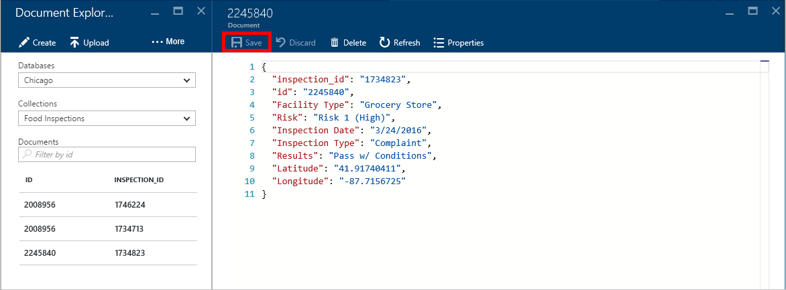
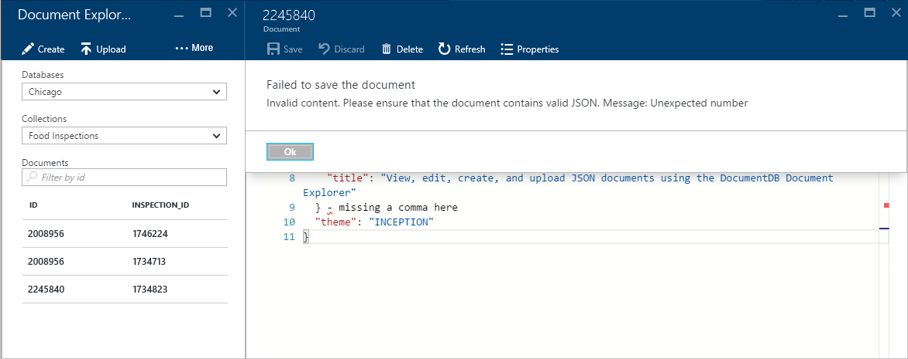
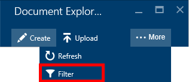
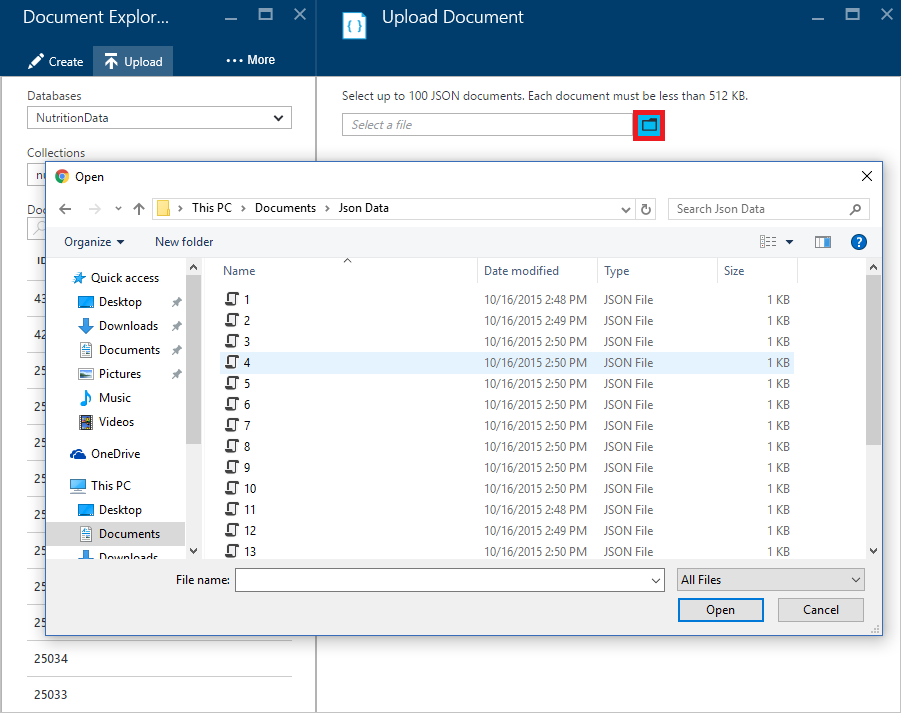

<properties
    pageTitle="Dokument-Explorer DocumentDB JSON anzeigen | Microsoft Azure"
    description="Informationen Sie zu den DocumentDB Document Explorer ein Tool Azure-Portal zu JSON anzeigen, bearbeiten, erstellen und Hochladen JSON-Dokumente mit DocumentDB, ein Dokument die NoSQL-Datenbank."
        keywords="Anzeigen von json"
    services="documentdb"
    authors="kirillg"
    manager="jhubbard"
    editor="monicar"
    documentationCenter=""/>

<tags
    ms.service="documentdb"
    ms.workload="data-services"
    ms.tgt_pltfrm="na"
    ms.devlang="na"
    ms.topic="article"
    ms.date="08/30/2016"
    ms.author="kirillg"/>

# Anzeigen, bearbeiten, erstellen und JSON-Dokumente mit DocumentDB Document Explorer hochladen

Dieser Artikel enthält eine Übersicht über die [Microsoft Azure DocumentDB](https://azure.microsoft.com/services/documentdb/) Document Explorer ein Azure Portals Tool, das ermöglicht es Ihnen, anzeigen, bearbeiten, erstellen, hochladen und JSON-Dokumente mit DocumentDB filtern. 

Beachten Sie, dass DocumentDB-Konten mit Protokoll Unterstützung für MongoDB Document Explorer nicht aktiviert ist. Diese Seite wird aktualisiert werden, wenn dieses Feature aktiviert ist.

## Dokumentexplorer starten

1. Klicken Sie im Portal Azure in der Jumpbar auf **DocumentDB (NoSQL)**. Wenn **DocumentDB (NoSQL)** nicht angezeigt wird, klicken Sie auf **Weitere Dienste** , und klicken Sie dann auf **DocumentDB (NoSQL)**.

2. Wählen Sie den Namen des Kontos aus. 

3. Klicken Sie auf **Dokument-Explorer**, klicken Sie im Menü Ressource. 
 
    

    In das **Dokument-Explorer** Blade sind die **Datenbanken** und **Websitesammlungen** Dropdown-Listen je nach Kontext automatisch ausgefüllt, in denen Sie die Dokument-Explorer gestartet. 

## Erstellen eines Dokuments

1. [Dokumentexplorer zu starten](#launch-document-explorer).

2. Klicken Sie in das **Dokument-Explorer** Blade auf **Dokument erstellen**. 

    Eine minimale JSON-Codeausschnitt wird in das **Dokument** Blade bereitgestellt.

    

2. Geben Sie oder fügen Sie den Inhalt der das JSON-Dokument, das Sie erstellen möchten, und klicken Sie dann auf **Speichern** , um Ihr Dokument auf die Datenbank in das **Dokument-Explorer** Blade angegebenen Auflistung abzuschließen, in das **Dokument** Blade.

    

    > [AZURE.NOTE] Wenn Sie eine Eigenschaft "Id" nicht zur Verfügung, dann Document Explorer automatisch Fügt eine Id-Eigenschaft und generiert eine GUID als ID-Wert.

    Wenn Sie bereits Daten aus JSON-Dateien, MongoDB, SQL Server, CSV-Dateien, Azure Tabellenspeicher Amazon DynamoDB, HBase, oder Sie können DocumentDBs [Migrationstools für die Daten](documentdb-import-data.md) aus anderen Websitesammlungen DocumentDB verwenden, um Daten zu importieren.

## Bearbeiten eines Dokuments

1. [Dokumentexplorer zu starten](#launch-document-explorer).

2. Bearbeiten eines vorhandenen Dokuments, wählen Sie ihn in das **Dokument-Explorer** Blade, bearbeiten Sie das Dokument in das **Dokument** Blade, und klicken Sie dann auf **Speichern**.

    

    Wenn Sie eines Dokuments bearbeiten sind und entscheiden, dass Sie den aktuellen Satz von Änderungen verwerfen, klicken Sie einfach **verwerfen** in das **Dokument** Blade, bestätigen die Aktion verwerfen möchten und der vorherige Zustand des Dokuments geladen werden muss.

    

## Löschen eines Dokuments

1. [Dokumentexplorer zu starten](#launch-document-explorer).

2. Wählen Sie das Dokument im **Dokument-Explorer**, klicken Sie auf **Löschen**, und bestätigen Sie das Löschen. Nach Bestätigung, wird das Dokument aus der Liste Document Explorer sofort entfernt.

    

## Arbeiten mit JSON-Dokumenten

Dokumentexplorer überprüft, ob alle neuen oder bearbeiteten Dokument gültigen JSON enthält.  Sie können auch die Ansicht JSON-Fehler an, indem Sie auf fehlerhaften Abschnitt Details zu den Überprüfungsfehler Auswahlspalte.

Darüber hinaus verhindert, dass Document Explorer Speichern eines Dokuments mit ungültigen JSON-Inhalt.

Schließlich können Document Explorer Sie einfach Systemeigenschaften des Dokuments aktuell geladen anzeigen, indem Sie auf den Befehl ' **Eigenschaften** '.

> [AZURE.NOTE] Die Eigenschaft Zeitstempel (_ts) wird als Epoche Zeit intern dargestellt, aber Document Explorer zeigt den Wert in einem lesbaren personenbezogenen GMT-Format.

## Filtern von Dokumenten
Dokumentexplorer unterstützt eine Reihe von Navigationsoptionen und erweiterte Einstellungen.

Standardmäßig lädt Document Explorer auf die ersten 100 Dokumente in der ausgewählten Auflistung, nach deren Erstellungsdatum vom frühesten zum spätesten aus.  Sie können weitere Dokumente (in Stapeln von 100) durch Auswahl der Option **mehr laden** am unteren Rand der Blade Document Explorer laden. Sie können die Dokumente, die über den Befehl **Filtern** Laden auswählen.

1. [Dokumentexplorer zu starten](#launch-document-explorer).

2. Am oberen Rand der Blade **Document Explorer** klicken Sie auf **Filter**.  

    
  
3.  Die filtereinstellungen werden unterhalb der Befehlsleiste angezeigt. Bieten Sie in den filtereinstellungen eine WHERE-Klausel und/oder der ORDER BY-Klausel, und klicken Sie dann auf **Filter**.

    

    Dokumentexplorer aktualisiert die Ergebnisse automatisch mit Dokumenten, die mit der Filterabfrage übereinstimmen. Lesen Sie mehr über die DocumentDB SQL-Grammatik in der [SQL-Abfrage und SQL-Syntax](documentdb-sql-query.md) Artikel oder Drucken eine Kopie der [SQL-Abfrage Spickzettel:](documentdb-sql-query-cheat-sheet.md)ein.

    Die **Sammlung** von **Datenbank** und Dropdown-Listenfelder können auf einfache Weise die Sammlung ändern, aus der Dokumente belegt sind ohne zu schließen und erneut starten Document Explorer, verwendet werden.  

    Dokumentexplorer unterstützt auch filtern den aktuell geladen Satz von Dokumenten von deren Id-Eigenschaft.  Geben Sie einfach die Dokumente Formularbasierter Id-Feld ein.

    

    Die Ergebnisse im Dokument-Explorer Liste gefiltert werden auf der Grundlage der angegebenen Kriterien.

    

    > [AZURE.IMPORTANT] Dokument-Explorer Filter Funktionalität nur die Filter aus der ***aktuell*** geladen Satz von Dokumenten und führt eine Abfrage für die aktuell ausgewählte Sammlung keine.

4. Um die Liste der Dokumente geladen von Dokument-Explorer zu aktualisieren, klicken Sie auf am oberen Rand der Blade **Aktualisieren** .

    

## Massenhinzufügen von Dokumenten

Dokumentexplorer unterstützt Massen Aufnahme eine oder mehrere vorhandene JSON Dokumente, bis zu 100 JSON-Dateien pro Vorgang hochladen.  

1. [Dokumentexplorer zu starten](#launch-document-explorer).

2. Wenn Sie während des Uploads beginnen möchten, klicken Sie auf **Dokumentupload**.

    

    Das **Dokument hochladen** Blade wird geöffnet. 

2. Klicken Sie auf die Schaltfläche Durchsuchen, um eine Datei-Explorer-Fenster zu öffnen, wählen Sie eine oder mehrere JSON-Dokumente hochladen, und klicken Sie dann auf **Öffnen**.

    

    > [AZURE.NOTE] Dokumentexplorer unterstützt derzeit bis zu 100 JSON-Dokumente pro Vorgang einzelne hochladen.

3. Nachdem Sie mit der Auswahl zufrieden sind, klicken Sie auf die Schaltfläche **Hochladen** .  Die Dokumente werden automatisch am Raster Document Explorer hinzugefügt, und die Ergebnisse hochladen werden angezeigt, wenn der Prozess fortschreitet. Importieren von Fehlern werden für einzelne Dateien gemeldet.

    

4. Nachdem der Vorgang abgeschlossen ist, können Sie zum Hochladen von bis zu einem anderen 100 Dokumente auswählen.

## Arbeiten Sie mit JSON-Dokumenten außerhalb des Portals

Document Explorer Azure-Portal ist nur eine Möglichkeit zum Arbeiten mit Dokumenten in DocumentDB. Sie können auch mit Dokumenten mithilfe der [REST-API](https://msdn.microsoft.com/library/azure/mt489082.aspx) oder im [Client SDKs](documentdb-sdk-dotnet.md)arbeiten. Beispielsweise Fehlercode, finden Sie unter den [Beispielen für .NET SDK Dokument](documentdb-dotnet-samples.md#document-examples) und den [Node.js SDK Dokument Beispiele](documentdb-nodejs-samples.md#document-examples).

Wenn Sie importieren oder Dateien aus einer anderen Quelle (JSON-Dateien, MongoDB, SQL Server, CSV-Dateien, Azure Tabelle Speicher, Amazon DynamoDB oder HBase) migrieren müssen, können Sie das DocumentDB [Migrationstool Daten](documentdb-import-data.md) verwenden, um Daten schnell zu DocumentDB zu importieren.

## Behandeln von Problemen mit

**Problem**: Document Explorer gibt **keine Dokumente gefunden**.

**Lösung**: Stellen Sie sicher, dass Sie ausgewählt haben, die richtige Abonnement, die Datenbank und die Websitesammlung, in denen die Dokumente eingefügt wurden. Überprüfen Sie auch, um sicherzustellen, dass Sie innerhalb der Durchsatz Kontingente ausgeführt werden. Wenn Sie bei der maximalen Durchsatz Ebene und beim Abrufen gedrosselt betreiben, reduzieren Sie die Anwendungsverwendung zu der maximalen Durchsatz Kontingent für die Websitesammlung ausgeführt werden.

**Erläuterung**: das Portal ist eine Anwendung wie jedes andere, Anrufe zu DocumentDB Datenbank und Websitesammlung. Wenn Ihre Anfragen aktuell aufgrund Anrufe in einer separaten Anwendung gedrosselt werden möglicherweise im Portal auch gedrosselt werden bewirken, dass Ressourcen nicht im Portal angezeigt werden. Um das Problem zu beheben, die Ursache für die Verwendung der hohen Durchsatz Adresse, und aktualisieren Sie dann auf das Portal Blade. Informationen zur Verwendung von messen und unteren Durchsatz Verwendung finden Sie im Abschnitt [Durchsatz](documentdb-performance-tips.md#throughput) des Artikels [Performance Tipps](documentdb-performance-tips.md) .

## Nächste Schritte

Erfahren Sie mehr über die DocumentDB SQL-Grammatik im Dokument-Explorer unterstützt, finden Sie im Artikel [SQL-Abfrage und SQL-Syntax](documentdb-sql-query.md) oder drucken Sie die [SQL-Abfrage Spickzettel aus:](documentdb-sql-query-cheat-sheet.md).

Der [Learning Path](https://azure.microsoft.com/documentation/learning-paths/documentdb/) ist auch eine nützliche Ressource zu steuern, während Sie Informationen zur DocumentDB Weitere. 
