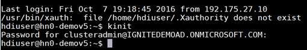

<properties
   pageTitle="Verwenden Sie SSH-Schlüssel mit Linux-basierten Hadoop Linux, Unix oder OS X | Microsoft Azure"
   description=" Sie können mithilfe von Secure Shell (SSH) Linux-basierten HDInsight zugreifen. Dieses Dokument enthält Informationen zur Verwendung von SSH mit HDInsight von Linux, Unix oder OS X-Clients."
   services="hdinsight"
   documentationCenter=""
   authors="Blackmist"
   manager="jhubbard"
   editor="cgronlun"
    tags="azure-portal"/>

<tags
   ms.service="hdinsight"
   ms.devlang="na"
   ms.topic="get-started-article"
   ms.tgt_pltfrm="na"
   ms.workload="big-data"
   ms.date="09/13/2016"
   ms.author="larryfr"/>

#<a name="use-ssh-with-linux-based-hadoop-on-hdinsight-from-linux-unix-or-os-x"></a>Verwenden Sie SSH mit Linux-basierten Hadoop auf HDInsight Linux, Unix oder OS X

> [AZURE.SELECTOR]
- [Windows](hdinsight-hadoop-linux-use-ssh-windows.md)
- [Linux, Unix, OS X](hdinsight-hadoop-linux-use-ssh-unix.md)

[Secure Shell (SSH)](https://en.wikipedia.org/wiki/Secure_Shell) können Sie Remote-Vorgänge zu HDInsight Linux-basierten Cluster über eine Befehlszeilenschnittstelle ausführen. Dieses Dokument enthält Informationen zur Verwendung von SSH mit HDInsight von Linux, Unix oder OS X-Clients.

> [AZURE.NOTE] Die Schritte in diesem Artikel wird davon ausgegangen, dass Sie einen Linux, Unix oder OS X-Client verwenden. Diese Schritte können auf einem Windows-basierter Client ausgeführt werden, wenn Sie ein Paket installiert haben, das bietet `ssh` und `ssh-keygen`, wie etwa [Bash auf Ubuntu auf Windows](https://msdn.microsoft.com/commandline/wsl/about).
>
> Wenn Sie keine SSH auf Ihrem Windows-basierter Client installiert haben, gehen Sie in [Verwenden SSH mit Linux-basierten HDInsight (Hadoop) aus Windows](hdinsight-hadoop-linux-use-ssh-windows.md) Informationen zur Installation und Verwendung von kitten.

##<a name="prerequisites"></a>Erforderliche Komponenten

* **SSH Keygen** und **ssh** für Linux, Unix und OS X-Clients. Diese Dienstprogramme werden in der Regel mit dem Betriebssystem oder über das Paket Managementsystem verfügbaren bereitgestellt.

* Eine modernen Webbrowser, der HTML5 unterstützt.

OR

* [Azure CLI](../xplat-cli-install.md).

    [AZURE.INCLUDE [use-latest-version](../../includes/hdinsight-use-latest-cli.md)] 

##<a name="what-is-ssh"></a>Was ist SSH?

SSH ist ein Dienstprogramm zum Anmelden an und Remote auf einem Remoteserver Befehle ausführen. Mit Linux-basierten HDInsight SSH richtet eine verschlüsselte Verbindung mit dem Cluster Headnode und bietet eine Befehlszeile, mit denen Sie Befehle eingeben. Befehle werden direkt auf dem Server ausgeführt.

###<a name="ssh-user-name"></a>SSH-Benutzernamen

Ein SSH Benutzername ist der Name, mit denen Sie HDInsight Cluster authentifizieren. Wenn Sie einen Benutzernamen SSH bei der Erstellung des Clusters angeben, wird dieser Benutzer auf allen Knoten im Cluster erstellt. Nachdem der Cluster erstellt wird, können Sie den Benutzernamen ein Verbindung mit dem HDInsight Cluster Headnodes verwenden. Aus der Headnodes können Sie dann auf die einzelnen Worker-Knoten verbinden.

###<a name="ssh-password-or-public-key"></a>SSH Kennwort oder öffentlichen Schlüssel

Ein SSH-Benutzer kann entweder ein Kennwort oder öffentlichen Schlüssel für die Authentifizierung verwenden. Ein Kennwort ist nur eine Textzeichenfolge, die Sie nach oben, vornehmen, während ein öffentlicher Schlüssel ein kryptografisches Schlüsselpaar generiert, um Sie eindeutig zu identifizieren gehört.

Ein Schlüssel ist sicherer als ein Kennwort, aber es zusätzliche Schritte zum Generieren des Schlüssels erfordert und müssen Sie die Dateien mit dem Schlüssel an einem sicheren Ort verwalten. Wenn alle Benutzer Zugriff auf wichtigen Dateien erhält, erhalten sie Zugriff auf Ihr Konto. Oder wenn Sie die wichtigsten Dateien verlieren, Sie werden nicht an Ihrem Konto anmelden.

Ein Schlüsselpaar besteht aus einem öffentlichen Schlüssel (der mit dem Server HDInsight gesendet wurde) und einen privaten Schlüssel (die auf dem Clientcomputer gespeichert ist.) Beim Herstellen der Verbindung zu dem HDInsight Server über SSH wird der SSH-Client des privaten Schlüssels zur Authentifizierung mit dem Server auf Ihrem Computer verwenden.

##<a name="create-an-ssh-key"></a>Erstellen Sie einen Schlüssel SSH

Verwenden Sie die folgenden Informationen ein, wenn Sie SSH-Schlüssel mit Ihrem Cluster verwenden möchten. Wenn Sie mithilfe eines Kennworts möchten, können Sie diesen Abschnitt überspringen.

1. Öffnen Sie eine Terminaldienste-Sitzung, und verwenden Sie den folgenden Befehl, um festzustellen, ob Sie alle vorhandenen SSH-Schlüssel haben:

        ls -al ~/.ssh

    Suchen Sie nach den folgenden Dateien in der Liste. Dies sind die allgemeinen Namen für Öffentliche SSH-Schlüssel.

    * ID\_dsa.pub
    * ID\_ecdsa.pub
    * ID\_ed25519.pub
    * ID\_rsa.pub

2. Keine vorhandene Datei verwenden möchten, oder Sie haben keine vorhandenen SSH-Schlüssel, verwenden Sie Folgendes, um eine neue Datei zu generieren:

        ssh-keygen -t rsa

    Sie werden aufgefordert, die folgenden Informationen:

    * Der Speicherort der Datei - der Speicherort ist standardmäßig auf ~/.ssh/id\_Rsa.
    * Eine Passphrase - werden Sie aufgefordert, diese erneut eingeben.

        > [AZURE.NOTE] Es wird dringend empfohlen, dass Sie eine sichere Passphrase für den Schlüssel verwenden. Wenn Sie die Passphrase vergessen haben, besteht jedoch keine Möglichkeit, die Datenbank wiederherzustellen.

    Nach Abschluss des Befehls müssen Sie zwei neue Dateien mit dem privaten Schlüssel (z. B. **Id\_Rsa**) und den öffentlichen Schlüssel (z. B. **Id\_rsa.pub**).

##<a name="create-a-linux-based-hdinsight-cluster"></a>Erstellen eines Clusters Linux-basierten HDInsight

Beim Erstellen eines Clusters Linux-basierten HDInsight, müssen Sie den zuvor erstellten öffentlichen Schlüssel bereitstellen. Es gibt zwei Methoden zum Erstellen eines Clusters HDInsight, von Linux, Unix oder OS X Clients:

* **Azure-Portal** – verwendet eine webbasierte Portal auf um den Cluster zu erstellen.

* **CLI für Mac, Linux und Windows Azure** - Command-Line Befehle verwendet, um den Cluster zu erstellen.

Jede dieser Methoden erfordern ein Kennwort oder einen öffentlichen Schlüssel. Ausführliche Informationen zum Erstellen eines Clusters Linux-basierten HDInsight finden Sie unter [Bereitstellung Linux-basierten HDInsight Clustern](hdinsight-hadoop-provision-linux-clusters.md).

###<a name="azure-portal"></a>Azure-Portal

Bei Verwendung der [Azure-Portal] [ preview-portal] zum Erstellen eines Clusters HDInsight Linux-basierten müssen Sie geben Sie einen **SSH Benutzernamen ein**, und wählen Sie ein **Kennwort** oder **Öffentliche SSH-Schlüssel**eingeben.

Wenn Sie **Öffentliche SSH-Schlüssel**auswählen, können Sie den öffentlichen Schlüssel (enthalten in der Datei mit der Erweiterung **pub** ) in das Feld __SSH PublicKey__ einfügen oder klicken Sie auf Durchsuchen, und wählen Sie die Datei für den öffentliche Schlüssel __eine Datei auswählen__ .


> [AZURE.NOTE] Die Schlüsseldatei ist einfach eine Textdatei. Der Inhalt sollte etwa wie folgt aussehen:
> ```
ssh-rsa AAAAB3NzaC1yc2EAAAADAQABAAABAQCelfkjrpYHYiks4TM+r1LVsTYQ4jAXXGeOAF9Vv/KGz90pgMk3VRJk4PEUSELfXKxP3NtsVwLVPN1l09utI/tKHQ6WL3qy89WVVVLiwzL7tfJ2B08Gmcw8mC/YoieT/YG+4I4oAgPEmim+6/F9S0lU2I2CuFBX9JzauX8n1Y9kWzTARST+ERx2hysyA5ObLv97Xe4C2CQvGE01LGAXkw2ffP9vI+emUM+VeYrf0q3w/b1o/COKbFVZ2IpEcJ8G2SLlNsHWXofWhOKQRi64TMxT7LLoohD61q2aWNKdaE4oQdiuo8TGnt4zWLEPjzjIYIEIZGk00HiQD+KCB5pxoVtp user@system
> ```

Dadurch wird eine Anmeldung für den angegebenen Benutzer erstellt, mithilfe der Kennwort oder öffentlichen Schlüssel, die, den Sie bereitstellen.

###<a name="azure-command-line-interface-for-mac-linux-and-windows"></a>Für Mac, Linux und Windows Azure Befehlszeilenschnittstelle

Sie können die [CLI für Mac, Linux und Windows Azure](../xplat-cli-install.md) zum Erstellen eines neuen Clusters mithilfe der `azure hdinsight cluster create` Befehl.

Weitere Informationen zur Verwendung dieses Befehls finden Sie unter [Bereitstellung Hadoop Linux-Clustern in HDInsight mit benutzerdefinierten Optionen](hdinsight-hadoop-provision-linux-clusters.md).

##<a name="connect-to-a-linux-based-hdinsight-cluster"></a>Verbinden Sie mit einem Cluster Linux-basierten HDInsight

Verwenden Sie den Befehl SSH Terminaldienste Verbindung mit dem Cluster Headnode durch die Bereitstellung der Adresse und den Benutzernamen ein:

* **SSH Adresse** - es gibt zwei Adressen, für die Verbindung zu einem Cluster verwenden SSH verwendet werden können:

    * **Verbindung mit dem Headnode herstellen**: der Clustername, gefolgt von **-ssh.azurehdinsight.net**. Beispielsweise **MeinCluster ssh.azurehdinsight.net**.
    
    * **Zum Knoten Connect**: Wenn der Cluster HDInsight R-Server ist, Cluster enthält außerdem einen Edge-Knoten, der mit **RServer.CLUSTERNAME.ssh.azurehdinsight.net**, wobei __CLUSTERNAME__ der Name des Clusters ist zugegriffen werden kann.

* **Benutzername** – der SSH Benutzernamen ein, den Sie bei der Erstellung des Clusters angegeben.

Im folgende Beispiel wird mit der primären Headnode des **MeinCluster** als Benutzer **mich**verbunden:

    ssh me@mycluster-ssh.azurehdinsight.net

Wenn Sie ein Kennwort für das Benutzerkonto verwendet, werden Sie aufgefordert, das Kennwort einzugeben.

Wenn Sie einen SSH-Schlüssel, der gesichert wird ohne eine Passphrase verwendet wird, werden Sie aufgefordert, die Passphrase einzugeben. Andernfalls versucht SSH automatisch mithilfe einer lokalen privaten Schlüssel auf Ihrem Client zu authentifizieren.

> [AZURE.NOTE] Wenn SSH mit dem richtigen privaten Schlüssel nicht automatisch authentifiziert wird, verwenden Sie den Parameter **-i** ein, und geben Sie den Pfad für den privaten Schlüssel. Im folgende Beispiel wird den privaten Schlüssel aus geladen `~/.ssh/id_rsa`:
>
> `ssh -i ~/.ssh/id_rsa me@mycluster-ssh.azurehdinsight.net`

Wenn Sie die Verbindung herstellen, verwenden die Adresse für die Headnode und kein Port angegeben ist, wird SSH auf Port 22 festgelegt, die mit der primären Headnode im Cluster HDInsight verbunden wird. Wenn Sie Port 23 verwenden, werden Sie auf der sekundären Datenbank verbunden. Weitere Informationen zu den Headnodes finden Sie unter [Verfügbarkeit und Zuverlässigkeit von Hadoop in HDInsight Cluster](hdinsight-high-availability-linux.md).

###<a name="connect-to-worker-nodes"></a>Verbinden mit Worker-Knoten

Die Worker-Knoten nicht direkt außerhalb der Azure-Rechenzentrum zugegriffen werden, aber sie aus der Cluster Headnode über SSH zugegriffen werden können.

Wenn Sie einen Schlüssel SSH verwenden, um Ihr Benutzerkonto zu authentifizieren, müssen Sie auf dem Client die folgenden Schritte ausführen:

1. Öffnen Sie mithilfe eines Texteditors `~/.ssh/config`. Wenn diese Datei nicht vorhanden ist, können Sie es durch Eingabe erstellen `touch ~/.ssh/config` in das Terminal.

2. Fügen Sie die folgenden an der Datei. Ersetzen Sie *CLUSTERNAME* durch den Namen des Clusters HDInsight.

        Host CLUSTERNAME-ssh.azurehdinsight.net
          ForwardAgent yes

    Dadurch wird für den Cluster HDInsight weiterleiten SSH-Agent konfiguriert.

3. SSH Agent weitergeleitet, indem Sie mithilfe des folgenden Befehls aus der Terminaldienste zu testen:

        echo "$SSH_AUTH_SOCK"

    Dies sollte Informationen ähnlich der folgenden zurückgegeben:

        /tmp/ssh-rfSUL1ldCldQ/agent.1792

    Wenn keine Rückgabe wird, bedeutet dies, dass diese **ssh-Agent** nicht ausgeführt wird. Wenden Sie sich an der Betriebssystem-Dokumentation für die einzelnen Schritte zur Installation und Konfiguration von **ssh-Agent**oder finden Sie unter [ssh-Agent mit ssh verwenden](http://mah.everybody.org/docs/ssh).

4. Nachdem Sie überprüft haben, dass diese **ssh-Agent** ausgeführt wird, verwenden Sie Folgendes Ihres privaten Schlüssels SSH an den Agent hinzufügen:

        ssh-add ~/.ssh/id_rsa

    Wenn Ihre private Schlüssel in einer anderen Datei gespeichert ist, ersetzen `~/.ssh/id_rsa` durch den Pfad zu der Datei.

Gehen Sie folgendermaßen vor, für die Verbindung zu den Worker-Knoten im Cluster.

> [AZURE.IMPORTANT] Wenn Sie einen Schlüssel SSH verwenden, um Ihr Konto zu authentifizieren, müssen Sie die vorherigen Schritte, um sicherzustellen, dass der Agent Weiterleiten funktioniert.

1. Mit dem HDInsight Cluster mit der her SSH wie oben beschrieben.

2. Sobald Sie verbunden sind, verwenden Sie Folgendes, um eine Liste der Knoten im Cluster abzurufen. Das Kennwort für Ihr Administratorkonto Cluster ersetzen Sie *ADMINPASSWORD* . Ersetzen Sie *CLUSTERNAME* durch den Namen des Clusters.

        curl --user admin:ADMINPASSWORD https://CLUSTERNAME.azurehdinsight.net/api/v1/hosts

    Dadurch werden Informationen zurückgegeben, im JSON-Format für die Knoten im Cluster, einschließlich `host_name`, den vollqualifizierten Domänennamen (FQDN) für jeden Knoten enthält. Im folgenden ist ein Beispiel für eine `host_name` Eintrag mit dem Befehl **Aufrollen** zurückgegeben:

        "host_name" : "workernode0.workernode-0-e2f35e63355b4f15a31c460b6d4e1230.j1.internal.cloudapp.net"

3. Sobald Sie eine Liste der Knoten Worker, den, denen Sie haben mit verbinden möchten, verwenden Sie den folgenden Befehl aus der SSH-Sitzung auf dem Server zum Öffnen einer Verbindung zu einem Worker-Knoten:

        ssh USERNAME@FQDN

    Ersetzen Sie *USERNAME* mit Ihrem Benutzernamen SSH und *FQDN* mit dem vollqualifizierten Domänennamen des Knotens Worker. Beispielsweise `workernode0.workernode-0-e2f35e63355b4f15a31c460b6d4e1230.j1.internal.cloudapp.net`.

    > [AZURE.NOTE] Wenn Sie ein Kennwort für die Authentifizierung verwenden der SSH-Sitzung, werden Sie aufgefordert, das Kennwort erneut eingeben. Wenn Sie einen Schlüssel SSH verwenden, sollte die Verbindung ohne Aufforderung abgeschlossen sein.

4. Nach der Einrichtung der Sitzung ändern die Terminaldienste Aufforderung von `username@hn#-clustername` auf `username@wk#-clustername` um anzugeben, dass Sie auf den Knoten Worker verbunden sind. Alle Befehle, wenn, die Sie zu diesem Zeitpunkt ausführen, werden auf den Arbeitsprozessknoten ausgeführt.

4. Nachdem Sie das Ausführen von Aktionen für den Arbeitsprozessknoten abgeschlossen haben, verwenden Sie die `exit` Befehl aus, um die Sitzung auf den Knoten Worker zu schließen. Erhalten Sie die `username@hn#-clustername` Aufforderung.

## <a name="connect-to-a-domain-joined-hdinsight-cluster"></a>Verbinden Sie mit einer Domäne gehörenden HDInsight cluster

[Domäne HDInsight](hdinsight-domain-joined-introduction.md) integriert Hadoop in HDInsight Kerberos. Da der Benutzer SSH nicht Benutzer eine Active Directory-Domäne ist, kann nicht dieses Benutzerkonto Hadoop Befehle von SSH Shell in einem Cluster Domäne direkt ausgeführt werden. Sie müssen zuerst *Kinit* ausführen. 

**Führt eine Abfrage ausführen Struktur in einem Domänenverbund HDInsight Cluster mithilfe von SSH**

1. Verbinden Sie mit einer Domäne gehörenden HDInsight Cluster über SSH.  Instrocutions finden Sie unter [Verbindung mit einem Cluster Linux-basierten HDInsight herstellen](#connect-to-a-linux-based-hdinsight-cluster).
2. Führen Sie Kinit aus. Für eine Domänen-und Benutzername und Domäne-Benutzerkennwort werden sie aufgefordert. Weitere Informationen zum Konfigurieren Domänenbenutzer für Domänenverbund HDInsight Cluster finden Sie [HDInisight konfigurieren Domänenverbund Cluster](hdinsight-domain-joined-configure.md).

    
3. Öffnen Sie die Struktur Konsole durch eingeben:

        hive

    Anschließend können Sie die Struktur Befehle ausführen.

##<a name="add-more-accounts"></a>Weitere Konten hinzufügen

1. Generieren Sie eine neue öffentlichen und privaten Schlüssel für das neue Benutzerkonto ein, wie im Abschnitt [Erstellen eines Schlüssels SSH](#create-an-ssh-key-optional) beschrieben.

    > [AZURE.NOTE] Der private Schlüssel soll entweder auf einem Client generiert werden, das der Benutzer Verbindung zum Cluster verwendet wird, oder sicher nach der Erstellung solcher Client übertragen.

1. Fügen Sie aus einer SSH-Sitzung auf den Cluster den neuen Benutzer mit dem folgenden Befehl ein:

        sudo adduser --disabled-password <username>

    Dadurch wird ein neues Benutzerkonto erstellen, aber Kennwortauthentifizierung wird deaktiviert.

2. Erstellen Sie das Verzeichnis und die Dateien auf die Taste gedrückt halten, mithilfe der folgenden Befehle ein:

        sudo mkdir -p /home/<username>/.ssh
        sudo touch /home/<username>/.ssh/authorized_keys
        sudo nano /home/<username>/.ssh/authorized_keys

3. Wenn der Nano-Editor wird geöffnet, kopieren Sie und fügen Sie in den Inhalt des öffentlichen Schlüssels für das neue Benutzerkonto ein. Verwenden Sie **STRG + X** die Datei zu speichern und beenden Sie den Editor.

    

4. Verwenden Sie den folgenden Befehl, um die Besitzrechte für die .ssh Ordner und den Inhalt in das neue Benutzerkonto zu ändern:

        sudo chown -hR <username>:<username> /home/<username>/.ssh

5. Jetzt werden auf den Server mit dem neuen Benutzerkontos und privaten Schlüssel authentifiziert.

##<a id="tunnel"></a>SSH-tunneling

SSH kann lokale Anfragen, z. B. Webanfragen zum Cluster HDInsight getunnelt verwendet werden. Die Anforderung wird dann auf die angeforderte Ressource weitergeleitet werden, als wäre es auf den Cluster-Headnode HDInsight stammen.

> [AZURE.IMPORTANT] Ein SSH Tunnel ist eine Voraussetzung für den Zugriff auf die Webbenutzeroberfläche für einige Hadoop Dienste. Beispielsweise kann der Auftrag Verlauf Benutzeroberfläche oder die Ressourcen-Manager Benutzeroberfläche nur zugegriffen werden mithilfe eines SSH Tunnels.

Weitere Informationen zum Erstellen und Verwenden eines SSH Tunnels finden Sie unter [Verwenden SSH Tunneling zu Ambari Webbenutzeroberfläche, Ressourcen-Manager, JobHistory, NameNode, Oozie, und andere Webbenutzeroberfläche zugreifen](hdinsight-linux-ambari-ssh-tunnel.md).

##<a name="next-steps"></a>Nächste Schritte

Nun wissen, wie die Authentifizierung mithilfe eines Schlüssels SSH erfahren Sie, wie mit Hadoop auf HDInsight MapReduce verwenden.

* [Verwenden Sie die Struktur mit HDInsight](hdinsight-use-hive.md)

* [Verwenden Sie Schwein mit HDInsight](hdinsight-use-pig.md)

* [Verwenden Sie MapReduce Aufträge mit HDInsight](hdinsight-use-mapreduce.md)

[preview-portal]: https://portal.azure.com/
