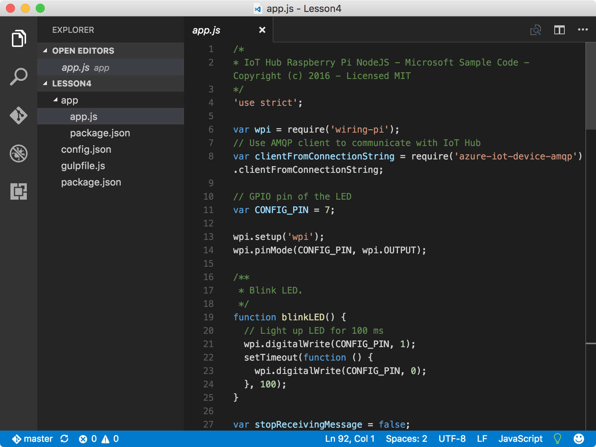

<properties
 pageTitle="Führen Sie die Anwendung Stichprobe Cloud-zu-Gerät Nachrichten empfangen | Microsoft Azure"
 description="Die Anwendung Stichprobe in Lektion 4 auf Ihre Pi ausgeführt wird und überwacht eingehende Nachrichten von Ihrem IoT Hub. Eine neue schlucken Aufgabe sendet Nachrichten in Ihrem Pi aus Ihrer IoT Hub die LED blinkt."
 services="iot-hub"
 documentationCenter=""
 authors="shizn"
 manager="timlt"
 tags=""
 keywords=""/>

<tags
 ms.service="iot-hub"
 ms.devlang="multiple"
 ms.topic="article"
 ms.tgt_pltfrm="na"
 ms.workload="na"
 ms.date="10/21/2016"
 ms.author="xshi"/>

# <a name="41-run-the-sample-application-to-receive-cloud-to-device-messages"></a>4.1 Führen Sie 4.1 die Stichprobe Anwendung Cloud-zu-Gerät Nachrichten empfangen werden sollen.

In diesem Abschnitt stellen Sie eine Beispiel-Anwendung auf Ihre Brombeere Pi 3 aus. Die Anwendung Stichprobe überwacht eingehende Nachrichten von Ihrem IoT-Hub an. Sie können auch auf Ihrem Computer Senden von Nachrichten an Ihre Pi aus Ihrem Hub IoT ausführen ein Vorgangs schlucken. Eingeht, die Nachrichten, blinkt die Beispiel Anwendung die LED an. Wenn Sie Probleme mit dem entsprechen, Zielwertsuche Lösungen in die [Seite zu behandeln](iot-hub-raspberry-pi-kit-node-troubleshooting.md).

## <a name="411-what-you-will-do"></a>4.1.1 mögliche Aktionen werden

- Verbinden der Stichprobe Anwendungs an Ihre IoT-Hub an.
- Bereitstellen Sie, und führen Sie die Anwendung Stichprobe.
- Senden Sie Nachrichten von Ihrem IoT-Hub an Ihre Pi die LED blinkt.

## <a name="412-what-you-will-learn"></a>4.1.2 Gelernte wird

- Wie Sie eingehende Nachrichten von Ihrem IoT Hub zu überwachen.
- Informationen zum Senden von Nachrichten Cloud-zu-Gerät aus Ihrer IoT-Hub an Ihre Pi. 

## <a name="413-what-do-you-need"></a>4.1.3 Was benötigen Sie

- Eine Brombeere Pi 3, die für die Verwendung eingerichtet wurde. Informationen zum Einrichten Ihrer Pi finden Sie unter [Lektion 1: Erste Schritte mit Ihrem Gerät Himbeeren Pi 3](iot-hub-raspberry-pi-kit-node-get-started.md)
- Eine IoT-Hub, der in Ihrem Abonnement Azure erstellt wird. So erstellen Sie Ihre Azure IoT Hub finden Sie unter [Lektion 2: Erstellen Ihrer Azure IoT Hub](iot-hub-raspberry-pi-kit-node-get-started.md)

## <a name="414-connect-the-sample-application-to-your-iot-hub"></a>4.1.4 Verbinden der Stichprobe Anwendungs an Ihre IoT Verteiler

1. Vergewissern Sie sich im Ordner Repo werden `iot-hub-node-raspberrypi-getting-started`. Öffnen Sie die Anwendung Beispiel in Visual Studio-Code, durch Ausführen der folgenden Befehle:

    ```bash
    cd Lesson4
    code .
    ```

    Hinweis Die `app.js` Datei wird die `app` Unterordner. Die `app.js` ist die Quelle für Schlüssel-Datei, die den Code zum Überwachen der eingehender Nachrichten von IoT Hub enthält. Die `blinkLED` Funktion blinkt die LED.

    

2. Initialisierung der Konfigurationsdatei mit der folgenden Befehle:

    ```bash
    npm install
    gulp init
    ```

    Wenn Sie auf diesem Computer Lektion 3 abgeschlossen haben, werden alle Konfigurationen vererbt, sodass können Sie mit Schritt 4.1.5 überspringen. Wenn Sie auf einem anderen Computer Lektion 3 abgeschlossen haben, müssen Sie die Platzhalter in ersetzen die `config-raspberrypi.json` Datei. Die `config-raspberrypi.json` Datei wird im Unterordner des Ordners "Privat".

    

- Ersetzen Sie **[Gerät Hostname oder IP-Adresse]** durch Ihre Pi die IP-Adresse oder Hostname, die Sie erhalten, indem Sie den Befehl ausführen`devdisco list --eth`
- Ersetzen Sie **[IoT Gerät Verbindungszeichenfolge]** durch die Verbindungszeichenfolge Gerät, das Sie abrufen, indem Sie den Befehl ausführen `az iot hub show-connection-string --name {my hub name} --resource-group {resource group name}`.
- Ersetzen Sie **[IoT Hub Verbindungszeichenfolge]** durch die Verbindungszeichenfolge IoT Hub, die Sie erhalten, indem Sie den Befehl ausführen `az iot device show-connection-string --hub {my hub name} --device-id {device id} --resource-group {resource group name}`.

## <a name="415-deploy-and-run-the-sample-application"></a>4.1.5 bereitstellen Sie, und führen Sie die Anwendung Stichprobe

Bereitstellen Sie, und führen Sie die Beispiel-Anwendung auf Ihre Pi durch Ausführen der folgenden Befehle:
  
```
gulp
```

Der Befehl schlucken den Installation-Tools Vorgang zuerst ausgeführt wird. Dann wird es die Stichprobe-Anwendung, um Ihre Pi bereitgestellt. Schließlich wird die Anwendung auf Ihre Pi und einen eigenen Vorgang auf Ihrem Hostcomputer 20 blinken zu Ihrem Pi über Ihre IoT-Hub kontaktieren ausgeführt.

Sobald die Stichprobe Anwendung ausgeführt wird, ihn Abhören von Nachrichten von Ihrem Hub IoT gestartet. In der Zwischenzeit sendet die schlucken Aufgabe unterschiedliche "blinken" Nachrichten über Ihre IoT-Hub an Ihre Pi zurück. Für jede Nachricht die blinken Ruft die Stichprobe Anwendung die BlinkLED-Funktion, um die LED blinken.

Finden Sie unter der BLINKT alle zwei Sekunden, wie die Aufgabe schlucken 20 Nachrichten aus Ihrer IoT-Hub an Ihrer Pi sendet. Die letzte ist eine "stop" angezeigt, die die Anwendung nicht mehr ausgeführt wird.


## <a name="416-summary"></a>4.1.6 Zusammenfassung

Sie haben erfolgreich Nachrichten über Ihre IoT-Hub an Ihre Pi die LED blinkt gesendet. Im nächsten Abschnitt ist Optionaler Abschnitt, der Sie zum Ändern der ein- und auszuschalten Verhalten der LED anzeigt.

## <a name="next-steps"></a>Nächste Schritte

[Optionaler Abschnitt: Ändern der ein- und auszuschalten Verhalten der LED](iot-hub-raspberry-pi-kit-node-lesson4-change-led-behavior.md)