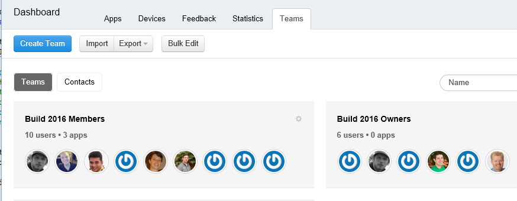
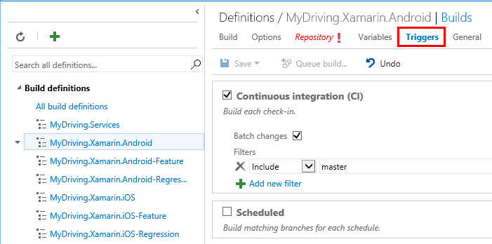
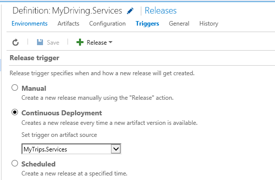
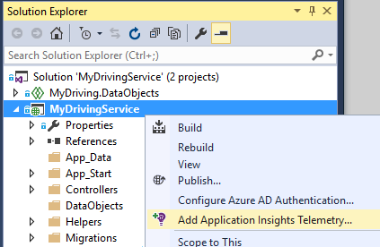

<properties
    pageTitle="MyDriving Azure IoT-Beispiel: Erstellen sie | Microsoft Azure"
    description="Erstellen Sie eine app, die eine umfassende Demo wie ein System IoT Entwerfen mit Microsoft Azure, einschließlich Stream Analytics, Computer Lern- und Hubs Ereignis ist."
    services=""
    documentationCenter=".net"
    suite=""
    authors="harikmenon"
    manager="douge"/>

<tags
    ms.service="multiple"
    ms.workload="tbd"
    ms.tgt_pltfrm="ibiza"
    ms.devlang="dotnet"
    ms.topic="article"
    ms.date="03/25/2016"
    ms.author="harikm"/>


# <a name="build-and-deploy-the-mydriving-solution-to-your-environment"></a>Erstellen und Bereitstellen der Lösung MyDriving Ihrer Umgebung

MyDriving ist die Lösung Internet der Dinge (IoT), die sammelt Daten aus Ihrem Auto, es mithilfe der maschinellen Learning verarbeitet und zeigt ihn auf Ihrem Mobiltelefon. Die Back-End besteht aus einer Vielzahl von Dienste von Microsoft Azure. Die Clients können Mobiltelefone mit Android, iOS oder Windows 10 sein.

Wir erstellt haben, die Lösung MyDriving, damit Sie sich ein Jumpstart in Ihrem eigenen System IoT erstellen können. Aus dem [MyDriving Repository auf GitHub](https://github.com/Azure-Samples/MyDriving)erhalten Sie Azure Ressourcenmanager Skripts die Back-End-Architektur in Ihrer eigenen Azure-Konto bereitstellen. An dieser Stelle können Sie die verschiedenen Dienste neu zu konfigurieren, ändern die Abfragen, um Ihre eigenen Daten entsprechend usw.. Sie können diese Skripts – Code für mobile-app, das Projekt Azure App Service-API und vieles mehr – im MyDriving Repository suchen.

Wenn Sie die app noch nicht ausprobiert haben, prüfen Sie die [Erste Schritte](iot-solution-get-started.md).

Es gibt eine detaillierte Aufstellung der Architektur der [Referenzhandbuchs MyDriving](http://aka.ms/mydrivingdocs)aus. In der Zusammenfassung erstellen es gibt mehrere Textstellen, die wir eingerichtet und bis zu festlegen ähnlich wie Projekt:

* Eine **app Client** bei Windows 10, iOS und Android-Telefone ausgeführt wird. Wir verwenden die Xamarin-Plattform großer Teil des Codes, freigeben, die sich unter GitHub befindet `src/MobileApp`. Die app führt tatsächlich aus zwei unterschiedliche Funktionen:
 * Es leitet werden vom Gerät integrierte Diagnose (OBD) und aus einem eigenen Standortsuchdienst an des Systems Cloud Back-End.
 * Es ist eine Benutzeroberfläche, in dem Benutzer zu ihrer aufgezeichneten Straßen-Schleifen Abfragen können.
* Einen **Cloud-Dienst** ingests Reise Daten in Echtzeit und diesen verarbeitet werden. Die wichtigsten Aufgaben zur Erstellung von diesen Dienst ist auswählen, parametrisieren und einer Vielzahl von Azure Services verbinden. Einige der Webparts erfordern Skripts zu filtern und die eingehenden Daten nicht verarbeiten. Wir verwenden eine Vorlage Azure Ressourcenmanager, um alle Teile konfigurieren.
* Eine **app für mobile Service** ist der Webdienst hinter den Benutzer Benutzeroberflächen-Teil der app Gerät. Seine Hauptfenster Aufgabe besteht darin, die Datenbank gespeicherten und verarbeiteten Daten Abfragen. Der Code befindet sich in GitHub unter `src/MobileAppService`.
* **Visual Studio mit Xamarin** ist unsere Entwicklungsumgebung. Xamarin, die als eine Komponente der Visual Studio sowohl als eigenständige integrierte Entwicklungsumgebung (IDE) vorhanden ist, wird zum Erstellen des Codes Plattform-Gerät verwendet. Um den iOS-Code zu erstellen, ist es erforderlich, vor eine Instanz von Xamarin auf einem Computer OS X ausgeführt haben. Falls erforderlich, können sie als Agent verwalteten von Visual Studio ausgeführt werden.
* **Einheit testen** der apps Gerät wird in Xamarin Test Cloud ausgeführt.
* **GitHub** ist das Repository, in dem wir den Code, Skripts und Vorlagen speichern.
* **Visual Studio Team Services** ist ein Clouddienst, der verwendet wird, um die kontinuierliche erstellen und Testen der Web-Dienst und andere apps verwalten.
* **HockeyApp** wird verwendet, um die Versionen des Codes Gerät verteilen. Außerdem sammelt Absturz und Verwendungsberichte und Feedback von Benutzern.
* **Visual Studio-Anwendung Einsichten** überwacht den mobilen Webdienst.

Also finden Sie unter wie wir diese einrichten. Beachten Sie, dass viele der Schritte optional sind.

## <a name="sign-up-for-accounts"></a>Melden Sie sich bei Konten

-   [Visual Studio Entwickler Essentials](https://www.visualstudio.com/products/visual-studio-dev-essentials-vs.aspx). Dieses kostenlose Programm bietet einfachen Zugriff auf viele Entwicklertools und Dienste, einschließlich Visual Studio, Visual Studio Team Services und Azure. Es gibt Ihnen eine Gutschrift $25/ Monat auf Azure für 12 Monate. Darüber hinaus Abonnements für Pluralsight Schulung und Xamarin University. Sie können auch anmelden separat für kostenlosen Ebenen von [Azure](https://azure.com) und [Visual Studio Team Services](https://www.visualstudio.com/products/visual-studio-team-services-vs.aspx), aber diese bieten keine Azure Gutschriften.

-   [HockeyApp](https://rink.hockeyapp.net/) (optional) für die Verwaltung von Test Verteilung der mobilen apps und sammeln werden.

-   [Xamarin](https://xamarin.com/) (erforderlich), für die mobile-app erstellen und Ausführen von Debuggen ausgeführt und Tests auf [Xamarin Test Cloud](https://xamarin.com/test-cloud).

-   [GitHub](https://github.com/Azure-Samples/MyDriving/) (optional), kostenlosen öffentlichen Repositorys für Ihren eigenen Code erstellen (private Repositorys gezahlt werden). Alternativ können Sie den grundlegenden Plan in Visual Studio Team Services für private Repositorys verwenden.

-   [Power BI](https://powerbi.microsoft.com/) (optional), um im gesamten System Darstellungen von Daten zu erstellen.

> [AZURE.NOTE] Sie benötigen kein GitHub-Konto, um den Code MyDriving im [GitHub MyDriving Repository](https://github.com/Azure-Samples/MyDriving)zugreifen.

## <a name="install-development-tools"></a>Installieren Sie die von Entwicklungstools

Die folgende Einrichtung ist für die Entwicklung von der vollständigen Lösung: ein iOS, Android und 10 unter Windows Mobile Plattform-app mit einer Azure back-End.

Als Alternative können Xamarin Studio auf Mac- oder Windows mobile-apps entwickeln möchte, wenn Sie nicht arbeiten auf die Azure back-End.

Eine [umfassende Beschreibung dieses Setup](https://msdn.microsoft.com/library/mt613162.aspx)vorliegt.

### <a name="windows-development-machine"></a>Windows-Entwicklung-Computer

Das zentrale Tool unter Windows ist Visual Studio für die Arbeit mit der MyDriving-app für Android und Windows, App-Service-API Projekt- und Microservice Erweiterungen an.

Xamarin, Git, Emulatoren und andere nützlichen Komponenten sind alle in Visual Studio integriert.

Installieren Sie:

-   [Visual Studio 2015 mit Xamarin](https://www.visualstudio.com/products/visual-studio-community-vs) (unabhängig von der Edition – ist Community kostenlos).

-   [SQLite für Universal Windows-Plattform](https://visualstudiogallery.msdn.microsoft.com/4913e7d5-96c9-4dde-a1a1-69820d615936). Zum Erstellen des Codes 10 unter Windows Mobile erforderlich.

-   [Azure SDK für Visual Studio 2015](https://go.microsoft.com/fwlink/?linkid=518003&clcid=0x409). Bietet Ihnen das SDK für die Ausführung von apps in Azure, zusammen mit Befehlszeile Tools für die Verwaltung von Azure.

-   [Azure Service Fabric SDK](http://www.microsoft.com/web/handlers/webpi.ashx?command=getinstallerredirect&appid=MicrosoftAzure-ServiceFabric). Erforderlich, um die Erweiterung [Microservice](../service-fabric/service-fabric-get-started.md) erstellen.

Stellen Sie außerdem sicher, dass Sie die richtigen Visual Studio-Erweiterung haben. Überprüfen Sie, klicken Sie unter **Tools** **Android, iOS, Xamarin...**angezeigt. Andernfalls Systemsteuerung öffnen, und wählen Sie dann auf **Programme und Funktionen** > **Microsoft** > **Visual Studio 2015** > **Ändern**. Wählen Sie unter **Plattform - Entwicklung**, **C\#/.Net (Xamarin)**. Während Sie vorhanden sind, überprüfen Sie, dass **Git für Windows** installiert ist.

### <a name="mac-development-machine"></a>Mac Entwicklungscomputer

Die Mac (Yosemite oder höher) ist erforderlich, wenn Sie für iOS entwickeln möchten. Obwohl wir verwenden Sie Visual Studio mit Xamarin unter Windows zu entwickeln und Verwalten der gesamte Code, verwendet Xamarin auf einem Mac müssen, um zu erstellen, und melden Sie sich den iOS-Code einen Agent installiert.


(Als Alternative Xamarin Studio direkt auf dem Mac können Sie zum Entwickeln von apps Plattformen.)

Sie benötigen keine den Mac, wenn Sie nicht als Zielplattform iOS einschließen möchten.

Installieren Sie:

-   [Xamarin Studio für iOS](https://developer.xamarin.com/guides/ios/getting_started/installation/mac/). Sie können auch festlegen von Visual Studio und Xamarin auf einem Mac, die einen Windows-Computer ausgeführt wird. Auf MSDN finden Sie unter [einrichten, installieren, und Überprüfungen für Mac-Benutzer](https://msdn.microsoft.com/library/mt488770.aspx) .

-   [Azure-Entwicklungstools](https://azure.microsoft.com/downloads/) (optional).

Aktivieren des remote Login auf dem Mac. Öffnen Sie **Systemeinstellungen** > **Freigeben**, und wählen Sie dann **Remote Login**.

Wenn Sie ein iOS-Projekt in Visual Studio unter Windows öffnen, fordert das plug-in Xamarin Sie zur die ID des Mac.

## <a name="fetch-the-github-repository"></a>Abrufen des GitHub Repositorys

Rufen Sie mithilfe der Schaltfläche **Herunterladen eines ZIP** in GitHub, Visual Studio oder einem anderen Git Client eine lokale Kopie des [GitHub MyDriving Repositorys](https://github.com/Azure-Samples/MyDriving) ab.

Extrahieren Sie die Datei in einen Ordner mit einem kurzen Pfadnamen, z. B. C:\\Code.

Sie können auch wenn Sie mit dem neuesten Stand halten oder unserem Code mitwirken möchten, zu klonen Repository wie folgt:

**Git datenbeschriftungsreihe https://github.com/Azure-Samples/MyDriving.git**

## <a name="get-a-bing-maps-api-key"></a>Abrufen einer Bing Maps-API Schlüssel

[Registrieren Sie sich für eine Bing Maps-API-Taste](https://msdn.microsoft.com/library/ff428642.aspx).

Sie müssen diese Zeile 22 ersetzen `src/MobileApps/MyDriving/MyDriving.Utils/Logger.cs`.


## <a name="build-the-demo-app"></a>Erstellen der demoApp

Öffnen Sie in Visual Studio folgenden Lösungsvorschlägen:

-   src\MobileApps\MyDriving.sln

-   src\MobileAppService\MyDrivingService.sln

-   src\Extensions\ServiceFabric\VINLookUpApplication\VINLookUpApplication.sln

Erhalten Sie Anweisungen, um ein:

-   Einige potenziell nicht vertrauenswürdig Projekte zu vertrauen. Wählen Sie, sie zu öffnen, wenn im Voraus übernommen werden sollen.

-   Legen Sie Entwicklermodus, wenn Sie auf einem frisch 10 Windows-Computer arbeiten.

-   Geben Sie Ihre Anmeldeinformationen Xamarin.

-   Verbinden Sie mit Xamarin Mac. Wenn Sie mit einen Mac besitzen, mit der rechten Maustaste in des iOS-Projekts in Visual Studio, und wählen Sie dann auf **Projekt entfernen**.

Erstellen Sie die Lösung neu.

Wenn Sie Probleme erstellt haben, versuchen Sie die Lösungen für Quirks, die wir gefunden haben:

-   *VINLookupApplication Projekt wird nicht geladen*: Stellen Sie sicher, dass Sie das [Azure SDK für Visual Studio 2015](https://go.microsoft.com/fwlink/?linkid=518003&clcid=0x409)installiert.

-   *Dienst Fabric Project nicht erstellen*: zuerst die Benutzeroberfläche Projekte zu erstellen, und stellen Sie sicher, dass Sie den Dienst Fabric SDK installiert haben.

-   *Android-app nicht erstellen*:

    -   Öffnen des **Tools** > **Android** > **Android SDK-Manager**, und vergewissern Sie sich diese Android 6 (API 23) / SDK-Plattform installiert ist.

    -   Löschen Sie dieses Verzeichnis, und klicken Sie dann neu zu erstellen:<br/>
        `%LocalAppData%\Xamarin\zips`

## <a name="get-to-know-the-code"></a>Einführung in den code

In der Lösung finden Sie:

-   Azure Erweiterungen: Dienst Fabric.

-   Azure HDInsight: Skripts für die Verarbeitung von Geschäftsreise Daten in Azure.

-   Mobile-Apps: Das Gerät apps.

-   MobileAppsService/MyDrivingService: Im Web wieder beenden.

-   Power BI: Die Definition des Berichts.

-   Skripts:

    -   Ressourcenmanager: Vorlagen, um den Azure Ressourcen zu erstellen.

    -   PowerShell: Skripts zu Vorlagen Ressourcenmanager ausführen.

    -   Azure SQL-Datenbanken: Debuggen Datenbanken.

-   SQL­Datenbank: CreateTables: Schemadefinitionen.

-   Azure Stream Analytics: Abfragen, die den eingehenden Datenstream transformieren.

## <a name="run-the-apps-in-development-mode"></a>Führen Sie die apps im Entwicklungsmodus

Führen Sie die Aktion ausführen der apps, basierend auf dem Gerät, das Sie verwenden:

-  Back-End: Festlegen von MyDrivingService als die Startprojekt, und drücken Sie F5, um die Back-End-Webdienst auszuführen. Es wird eine Browseransicht der Auflistung API geöffnet.

-  Mobile Clients: am [mobilen apps sind in Xamarin entwickelt wurden](https://developer.xamarin.com/guides/cross-platform/deployment,_testing,_and_metrics/debugging_with_xamarin/).
 -  Android: Details finden Sie unter [Debuggen von Android in Xamarin](http://developer.xamarin.com/guides/android/deployment,_testing,_and_metrics/debugging_with_xamarin_android/).

 -  iOS: Weitere Informationen finden Sie unter [Debuggen in iOS](http://developer.xamarin.com/guides/ios/deployment,_testing,_and_metrics/debugging_in_xamarin_ios/).

 -  Windows Phone: Details finden Sie unter [Xamarin + Windows Phone](https://developer.xamarin.com/guides/cross-platform/windows/phone/).

## <a name="upload-the-mobile-app-to-hockeyapp"></a>Hochladen der mobilen app in HockeyApp

HockeyApp verwaltet die Verteilung der app Android, iOS oder Windows-Benutzer testen Benachrichtigungsoption für neuer Versionen. Außerdem sammelt hilfreiche Absturz Berichte, Feedback von Benutzern mit Screenshots und Verwendung Kennzahlen.

[Zunächst hochladen](http://support.hockeyapp.net/kb/app-management-2/how-to-create-a-new-app) Ihrer app erstellen. Klicken Sie dann melden Sie sich bei [HockeyApp](https://rink.hockeyapp.net) von Ihrem Entwicklungscomputer. Klicken Sie auf **Neue App**auf dem Dashboard Entwicklertools, und ziehen Sie dann die erstellten Dateien in das Fenster. (Später, können Sie Ihrem Dienst erstellen dazu automatisieren.)

Jetzt können Sie in Ihrem app-Dashboard.


Wiederholen Sie den Vorgang für jede Plattform, die Ihre app ausgeführt wird, klicken Sie auf ein. Dann können Sie Folgendes:

-  Verwenden Sie die [app-ID](http://support.hockeyapp.net/kb/app-management-2/how-to-find-the-app-id) aus dem Dashboard, um aus der app Absturzdaten und Feedback zu senden. Aktualisieren Sie in MyDriving die IDs in src/MobileApps/MyDriving/MyDriving.Utils/Logger.cs.

-  [Testbenutzer einladen](http://support.hockeyapp.net/kb/app-management-2/how-to-invite-beta-testers). Sie können eine URL zu Tester Benutzer Branchen. Sie zwar können für Ihr Team registrieren, Herunterladen der app, und senden Sie Ihr Feedback.

-  Wenn Sie eine größere Anzahl von geöffneten Betaversion lieber, legen Sie die Verteilung auf Öffentliche. Klicken Sie auf **Verwalten App** > **Verteilung** > **herunterladen = öffentlichen**. Nun jeder Ihre app herunterladen und senden Sie Ihr Feedback kann, und sie sehen eine Benachrichtigung, wenn Sie eine neue Version bereitstellen. Sie möglicherweise einige Berichte Absturz von ihnen zu erhalten.

    

-  [Link Absturz Berichte zu Visual Studio Team Services](http://support.hockeyapp.net/kb/third-party-bug-trackers-services-and-webhooks/how-to-use-hockeyapp-with-visual-studio-team-services-vsts-or-team-foundation-server-tfs). Klicken Sie auf **Verwalten App** > **Visual Studio Team Services**. HockeyApp kann automatisch Arbeit Elemente im Team Services erstellen, Vorliegens Absturz Berichte oder wenn Feedback empfangen wird.

Erfahren Sie mehr auf der [Website HockeyApp](https://hockeyapp.net).

## <a name="test-the-mobile-app-on-xamarin-test-cloud"></a>Testen der mobilen-app auf Xamarin Test Cloud

[Xamarin Test Cloud](https://developer.xamarin.com/guides/testcloud/introduction-to-test-cloud/) Automatisierung Testen der Benutzeroberfläche auf reale Geräte in der Cloud. Mithilfe von NUnit Framework, Schreiben Sie Tests, die Ihre app über die Benutzeroberfläche ausgeführt werden.

Um Xamarin verwenden zu können, einbinden Sie [Xamarin.UITests](https://developer.xamarin.com/guides/testcloud/uitest/intro-to-uitest/) SDK, in der app, die als ein NuGet-Paket stammt. Finden sie in der demoApp, und es hat beim Erstellen von neuen Testprojekte mit Xamarin Vorlagen enthalten.


Ein Beispiel-Test-Projekt ist in der app im Repository enthalten. Suchen Sie in [MyDriving](https://github.com/Azure-Samples/MyDriving/tree/master/src/MobileAppService)klicken Sie unter [Src](https://github.com/Azure-Samples/MyDriving/tree/master/src)/MobileApps/[MyDriving](https://github.com/Azure-Samples/MyDriving/tree/master/src/MobileApps/MyDriving)/MyDriving.UITests/.

Wenn Sie eine eigene Visual Studio Team Services verwenden, ist es einfach schreiben Xamarin UI Einheit überprüft und diese als Teil Ihres Build ausführen.

## <a name="deploy-azure-services"></a>Bereitstellen von Azure services

Zum Ausführen einer automatischen bereitstellungs von Azure Services und Team Services Build Services finden Sie in den detaillierten Anweisungen in **scripts/README.md**.

Microsoft Azure bietet eine Vielzahl von anderen Diensten, die Sie zum Erstellen von Applications Cloud verwenden können. Obwohl viele einzeln (beispielsweise App Service/Web Apps) verwendet werden können, sind sie mit vollem, wenn diese miteinander verbunden sind, in Form ein integriertes Systems zufrieden sind, dass wir in MyDriving verwenden.

Es ist möglich, erstellen und Azure Services manuell zu verbinden, aber es ist viel schneller und die Zuverlässigkeit Ressourcenmanager Azure verwenden Vorlagen. [Ressourcenmanager](../azure-resource-manager/resource-group-overview.md) Automatisierung die Bereitstellung von Ressourcen und Bereitstellen von der Verbindungselementen dazwischen einer Lösung.

Die Vorlage Elementname für das System MyDriving im GitHub Repository unter [Skripts/Cloud](https://github.com/Azure-Samples/MyDriving/tree/master/scripts/ARM). Es stellt eine umfassende und präzise Ansicht wie die anderen Dienste unserer Architektur miteinander verbunden sind. Erläutert, dass alle diese im Detail die [MyDriving Referenzhandbuchs](http://aka.ms/mydrivingdocs), aber viele erfahren Sie, indem Sie einfach über die Vorlage selbst lesen.

> [AZURE.NOTE] Am häufigsten Azure Services werden Kosten verbunden ist, je nach der Preisgestaltung Ebene. Wenn Sie mit Azure vertraut sind, können Sie [Probieren Sie es einfach kostenlos](https://azure.microsoft.com/free/). Wenn Sie nicht im MyDriving System bestimmte Komponenten verwenden möchten, müssen Sie jedoch Sie zur Vermeidung von Kosten anfallen zu entfernen. Im Abschnitt "Betrieb Kosten schätzen" weiter unten in diesem Artikel bietet einen Überblick über die normalen Service Ausgaben.

### <a name="edit-the-template"></a>Bearbeiten Sie die Vorlage

Zum Anpassen Ihrer Bereitstellung, vielleicht nicht benötigte Komponenten entfernen oder anderen Personen hinzufügen erstellen Sie zuerst eine Kopien der Szenario\_complete.params.json und Szenario\_complete.json, in dem Sie Änderungen vornehmen.

Sie können das Szenario\_complete.params.json-Datei zum Außerkraftsetzen von verschiedenen Standardwerte, z. B. der Dienst SKU oder der Speicher Replikation Datentyp, wie in der folgenden Tabelle beschrieben. Wählen die Standardwerte günstigsten Optionen aus.

| **Parameter**         | **Beschreibung**                | **Standardwert** |
|--------|---------|-------|
| IoT Hub SKU           | Ebene für Azure IoT Hub-Dienst | F1                |
| Kontotyp Speicher  | Die Replikationstyp Speicher       | Standard-LRS      |
| Ziel der SQL-Dienst | Parallelität Slot Verbrauch   | DW100             |
| Hostinganbieter Plan SKU      | Serviceplan für App-Dienst   | F1                |

In Szenario\_complete.json:

-   Suchen Sie nach "BaseName", und ändern Sie ihn in einen Namen, in der Sie arbeiten.

-   Suchen Sie nach "Erstellen". Jeder dieser Abschnitte erstellt eine Ressource aus.

-   Legen Sie SqlServerAdminLogin und SqlServerAdminPassword geeignete Werte ein.

-   Bevor Sie einen Abschnitt, der eine Ressource erstellt wird löschen, überprüfen Sie, ob es zum Nachfolger verfügt, durch für dessen Namen an anderer Stelle in der Datei zu suchen. Beachten Sie, dass jeden Textabschnitt durch, die einen Dienst erstellt einen Abschnitt *DependsOn* enthält, der zugehörigen Abhängigkeiten Listen.

Hier sind, was die Vorlage konfiguriert. Details finden Sie im des [Referenzhandbuchs](http://aka.ms/mydrivingdocs).

| **Dienst**                 | **Beschreibung und details**  
|---|----
| Speicherkonten            | Die Vorlage erstellt drei Konten:                                                                                                                                                                       
|| -Einer SQL-Datenbank, die aggregierte werden vom Stream Analytics empfängt und dient als den Datenträger zur Speicherung für App-Verwaltungsdienst Azure-Tabellen, die diese Daten über API Endpunkte verfügbar machen.                      
|| -Blob Speicher, die Daten aus einem anderen Stream Analytics-Auftrag vom HDInsight zu verarbeitenden sammelt.                                                                                         
|| -Einer SQL-Datenbank, die Ergebnisse verarbeiteten HDInsight zur Verwendung mit Power BI empfängt.                                                                                                                 
| Azure IoT-Hub                     | Stellt eine bidirektionale Verbindung mit jedem verbundenen Gerät her. Wird in die Lösung MyDriving mobile-app als Feld Gateway zum Senden von Daten an Azure IoT Verteiler ein. Azure IoT Hub fungiert als Eingabe für Stream Analytics. |
| Azure Ereignis Hubs                   | Die Ausgabe für ein Stream Analytics-Projekt, das die Ausgabe an Erweiterungen reiht, die mit Azure Service Fabric erstellt werden.                                                                                               
| SQL Azure Datawarehouse          |                                                                                                                                                                                                            
| Stream Analytics Aufträge | Verbinden Sie Eingaben und Ausgaben mit einer Abfrage, die sowohl in Echtzeit sowie als Daten für die App-Service-APIs, Azure maschinellen Schulung, Erweiterungen und Power BI aggregieren verwendet wird.                               
| Computer-Learning-Arbeitsbereich  | Beinhaltet Versuche, R Code und API-Diensts.                                                                                                                                                              
| Factory Azure-Daten                | Geplante maschinellen Learning Umschulung.                                                                                                                                                                     
| Dienst Fabric Hostinganbieter plan | Für Erweiterungen.                                                                                                                                                                                            
| App-Verwaltungsdienst ("Mobile-App")  | Hostet Projekt-API Mobile-Apps, das Endpunkte für mobile-app enthält. Der API Code muss in Visual Studio App-Dienst bereitgestellt werden.                                                         
| Warnungsregeln                 | Sendet, dass Sie per e-Mail senden, wenn die app Antworten Fehlern angeben.                                                                                                                                            
| Anwendung Einsichten        | Zum Überwachen der Leistung APIs im App-Dienst. Sie müssen die Verbindung in Visual Studio zu konfigurieren.                                                                                          
| Azure Key Tresor                   | Zum Speichern des Web-Dienst Cluster Zertifikats.                                                                                                                                                                

### <a name="run-the-template"></a>Führen Sie die Vorlage

In **scripts/README.md**gibt es detaillierte Informationen zum Ausführen der Vorlage.

Führen Sie eine der folgenden Aktionen aus, um alle diese Dienste in Ihrem eigenen Azure-Konto mithilfe des Skripts bereitzustellen:

-   Verwenden von PowerShell:

    ```

    cd scripts/PowerShell;
    deploy.ps1 *location* *resourceGroupName*
    ```

 -   *Speicherort* ist [Azure Speicherort](https://azure.microsoft.com/regions/), wie z. B. `North Europe` oder `West US`. Verwenden Sie `Get-AzureLocation` finden Sie eine Liste der verfügbaren Speicherorte aus.

 -   *ResourceGroupName* ist der Name, der in der Gruppe zu erhalten, die alle Ressourcen angehören sollen. Wenn Sie mit den Ressourcen abgeschlossen haben, können Sie diese überhaupt durch Löschen dieser Gruppe löschen.

-   DeploymentScripts/Bash/deploy.sh mit Bash ausführen.

-   Öffnen und die Visual Studio-Lösung DeploymentScripts/VS/DeployARM.sln erstellen.

Beachten Sie, dass jedes Mal die Vorlage wird ausgeführt, wird einen neuen Satz von Ressourcen unter einem anderen Namen erstellt. Um die Ressourcen zu löschen, wechseln Sie zu dem Portal, und löschen Sie die Ressourcengruppe aus.

Wenn Sie das Skript aus irgendeinem Grund fehlschlägt, können Sie es erneut ausführen.

Das Skript bietet Ihnen die Möglichkeit, fortlaufenden Integration in Visual Studio Team Services konfigurieren. Wenn Sie ein Team Services-Projekt eingerichtet haben, müssen Sie eine URL: https://yourAccountName.visualstudio.com. Geben Sie die vollständige URL, wenn Sie gefragt werden. Sie können sie einen neuen oder vorhandenen Namen für ein Team Services-Projekt verleihen.

## <a name="set-up-build-and-test-definitions-in-visual-studio-team-services"></a>Einrichten von erstellen und Testen der Definitionen in Visual Studio Team Services

Wir verwenden Team Services für dieses Projekt hauptsächlich für seine erstellen und Testen der Funktionen. Aber es auch unterstützt hervorragende Zusammenarbeit, wie etwa aufgabenverwaltung mit Kanban-Übersichten, Überprüfung des Codes mit Aufgaben und Datenquellen-Steuerelement integriert, und gated erstellt. Arbeitet gut mit anderen Tools wie GitHub, Xamarin, HockeyApp und natürlich Visual Studio. Sie können darauf zugreifen, über die Web-Oberfläche oder Visual Studio, je nachdem, was komfortabler zu einem beliebigen Zeitpunkt.

Die Schritte in den Definitionen erstellen und Release verwenden eine Vielzahl von Plug-in-Diensten, die in dem Team Services [Marketplace](https://marketplace.visualstudio.com/VSTS)verfügbar sind. Zusätzlich zu den grundlegenden Dienstprogramme Befehl Zeilen ausführen, oder kopieren Sie die Dateien werden Dienste, die von Xamarin, Android und anderen Anbietern Builds aufzurufen, und die mit HockeyApp verbunden.


### <a name="build-definitions"></a>Erstellen von Definitionen

Wir haben Builddefinitionen für jeden die Hauptziele. Wir haben auch Variationen für Feature und Testen der Regression. Erhalten:

-   MyDriving.Services (die Back-End-Web app für die mobile-app)

-   MyDriving.Xamarin.Android

    -   MyDriving.Xamarin.Android-Funktion

    -   MyDriving.Xamarin.Android-Regression

-   MyDriving.Xamarin.iOS

    -   MyDriving.Xamarin.iOS-Funktion

    -   MyDriving.Xamarin.iOS-Regression

-   MyDriving.Xamarin.UWP

    -   MyDriving.Xamarin.UWP-Funktion

    -   MyDriving.Xamarin.UWP-Regression

Wenn Sie die vollständigen Details unserer Konfiguration anzeigen möchten, finden Sie unter Abschnitt 4.7 des [MyDriving Referenzhandbuchs](http://aka.ms/mydrivingdocs), "Erstellen und Release-Konfiguration". Sie folgen allgemeine Muster aus. Das Skript:

1.  Stellt das NuGet-Paket. Wir lassen nicht kompilierten Code im Repository, damit die ersten Schritte für jeden Build die erforderlichen NuGet Pakete wiederherstellen.

2.  Aktiviert die Lizenz. Der Build ausgeführt wird in der Cloud, also wobei eine Lizenz benötigt – vor allem für den Dienst Xamarin erstellen – wir haben unsere Lizenz auf dem aktuellen Buildcomputer aktivieren. Klicken Sie dann deaktivieren wir es unmittelbar danach, damit er auf einem anderen Computer verwendet werden können.

3.  Erstellt mit den entsprechenden Dienst. Wir verwenden Xamarin Builds für mobile-apps und Visual Studio für die Back-End-Webdienst erstellt.

4.  Überprüft wird erstellt.

5.  Tests ausgeführt. Wir führen Sie die Tests mobile-app in Xamarin Test Cloud.

6.  Veröffentlicht das Ergebnis erstellen zu dem Speicherort ablegen.

Der Trigger für die wichtigsten Builds wird die fortlaufende Integration festgelegt. D. h., wird der Build jedes Mal ausführen Code in den master Zweig eingecheckt ist.



### <a name="release-definitions"></a>Lassen Sie wieder los Definitionen

Release Definitionen sind im Wesentlichen die gleiche Weise wie einrichten.

Für den Webdienst einrichten wir Bereitstellung als einer Azure Web app:


Und wir den veröffentlichte Version Trigger mit fortlaufender Bereitstellung festlegen. D. h., jeder Einchecken gefolgt von einer erfolgreichen Buildergebnisse in ein Update zu Web app.



Für mobile-apps bringen Sie wir auf HockeyApp aus:


## <a name="explore-telemetry-by-using-application-insights"></a>Untersuchen Sie mithilfe der Anwendung Einsichten werden

[Anwendung Einsichten](../application-insights/app-insights-overview.md) erfasst werden, über die Leistung und die Verwendung von Webdiensten. Die Anwendung Einsichten SDK sendet werden vom Dienst, die der Ressource Anwendung Einsichten in Azure.

Navigieren Sie zu der Anwendung Einsichten Ressource, die die Vorlage haben eingerichtet. Untersuchen Sie es, Diagramme, die die Leistung des [Mobile-App-Verwaltungsdienst-Projekt](https://github.com/Azure-Samples/MyDriving/tree/master/src/MobileAppService). Diese Server Besprechungsanfragen und Reaktionszeiten, Fehlern, anzeigen und Ausnahme ermittelt. Es gibt auch Diagramme der Abhängigkeit Reaktionszeiten – d. h., Anrufe in der Datenbank und REST-APIs, wie z. B. Computer Schulung. Wenn alle Leistungsprobleme aufgetreten sind, werden Sie möglicherweise finden Sie unter welche Inhaltselement Ihrem System diese verursacht.


Wenn Sie einen Webdienst, den Sie von hand eingerichtet verfügen, ganz einfach die gleichen Diagramme abrufen. Klicken Sie auf der Web Service-Karte vorausgesetzt, klicken Sie auf **Extras** > **Erweiterungen** > **Hinzufügen**. Wählen Sie die **Anwendung Einsichten**aus.


Das Feature funktioniert, wenn Sie Instrumentieren der Anwendung mit der Anwendung Einsichten SDK.

Sie können benutzerdefinierte werden (oder Urkunde eine Anwendung, die an einer beliebigen Stelle außerhalb der Azure ausgeführt wird) durch [Hinzufügen der Anwendung Einsichten SDK](../application-insights/app-insights-asp-net.md) hinzufügen, zum Zeitpunkt der Entwicklung. Dies ist sinnvoll, Log Kennzahlen, die der Anwendung, wie Benutzer Mittelwert Geschäftsreise Länge oder total mit abhängig sind. In Visual Studio Maustaste auf das Projekt, und wählen Sie dann auf **Anwendung Einsichten hinzufügen**.



Anwendung Einsichten werden benachrichtigen e-Mails senden, wenn es ungewöhnliche Nummern der Fehler Antworten erkennt. Sie können auch eigene Benachrichtigungen auf verschiedenen Kriterien, wie z. B. Reaktionszeiten einrichten.

Um sicherzustellen, dass Ihr Webdienst ist immer Stand und ausgeführt wird, können Sie Einrichten von [Verfügbarkeit Tests](../application-insights/app-insights-monitor-web-app-availability.md)nur. Diese Tests Pingen Ihrer Website an unterschiedlichen Standorten auf der ganzen Welt alle 15 Minuten. Erneut, erhalten Sie eine e-Mail-Nachricht, wenn es ein Problem zu sein scheint.

## <a name="estimate-operational-costs"></a>Schätzung Betrieb Kosten

Es ist extrem preisgünstige eine app aus, wie diese in geringem Umfang auf ausführen. Viele der Dienste haben kostenlose Einstiegsklasse Ebenen, sodass diese Entwicklung und kleine Vorgang sehr kleinen Kosten. Und natürlich Ihrer eigenen apps nicht alle Features, die im MyDriving verwenden müssen.

Hier ist eine Schätzung der unsere Kosten in die Entwicklungskonfiguration für MyDriving einrichten. Wir Beachten Sie auch einige Alternativen, die wir konnten *nicht* verwenden. Diese Informationen möglicherweise hilfreich sein, wie Sie Ihre eigenen Kosten schätzen.

Wir nehmen Sie an:

-   Ein Team von nicht mehr als fünf (plus beobachten Projektbeteiligte).

-   Ausführen von für über einen Monat.

-   100 Benutzer mit vier Schleifen pro Tag.

>[AZURE.NOTE] Wenn Sie mit Azure vertraut sind, ist es ein [kostenloses Konto](https://azure.microsoft.com/free/)ein.

| **Dienst-Komponente**  | **Notizen** | **Kosten pro Monat** |
|--------|--------|----------------|
| [Visual Studio 2015 Community](https://www.visualstudio.com/products/visual-studio-community-vs) mit [Xamarin](https://visualstudiogallery.msdn.microsoft.com/dcd5b7bd-48f0-4245-80b6-002d22ea6eee) <br/>Plattform-Entwickler-Umgebung| Visual Studio-Community. ( [Visual Studio Professional](https://www.visualstudio.com/vs-2015-product-editions) für [Xamarin.Forms](https://xamarin.com/forms)Plattformen aus einer einzelnen Codebasis Entwurf wird erforderlich.)  | $0   |
| [Azure IoT-Hub](https://azure.microsoft.com/pricing/details/iot-hub/) <br/>Bidirektionale Datenverbindung für Geräte | 8.000 Nachrichten + 0,5 KB/Nachricht frei. | $0             |
| [Stream Analytics](https://azure.microsoft.com/pricing/details/stream-analytics/)  <br/>   Umfangreicher Streams Datenverarbeitung                                                                                                                                                              | Gebühr von $0.031 pro Einheit pro Stunde, streaming, solange aktiviert. Sie wählen Sie die Anzahl der gewünschten streaming Einheiten; Weitere skalieren. | $23            |
| [Computer-Schulung](https://azure.microsoft.com/documentation/services/machine-learning/)<br/> Adaptive Antworten                                                                                                                                                                              |  $10/Arbeitsplatz/Monat. <br/>                                                                                                                                                                                 + 3 Stunden experimentieren \* $1 / experimentieren Stunde. <br/>                                                                                                                                                           + 3.5-Stunden-API CPU \* $2 / Herstellung CPU Stunde. <br/>                                                                                                                                                          API CPU-Zeit 5 min/Tag Umschulung, wird davon ausgegangen, obwohl dies mit mehr Eingabedaten steigen würden.                   <br/>                                                                                                                                                                     + 2 min/Tag zum Verarbeiten von 400 Schleifen/Tag bewerten.  | 20 Euro            |
| [App-Dienst](https://azure.microsoft.com/pricing/details/app-service/)  <br/> Host für mobile Back-end                                                                                                                                                                              | Stufen Sie B1 – Herstellung Web apps. | $56            |
| [Visual Studio Team Services](https://azure.microsoft.com/pricing/details/visual-studio-team-services/)  <br/> Erstellen Sie, Testen Einheit und Release Management; aufgabenverwaltung | Private Agents fünf Benutzer.| $0             |
| [Anwendung Einsichten](https://azure.microsoft.com/pricing/details/application-insights/) <br/>Überwachung der Leistung und die Verwendung der Webdienste und Websites| Kostenlose Ebene.  | $0             |
| [HockeyApp](http://hockeyapp.net/pricing/) <br/> Verteilung der Beta-apps sowie Sammlung von Feedback, Verwendung und von Absturzdaten                                                                                                                                      | Zwei kostenlose apps für neue Benutzer.<br/> 30 Euro beträgt/Monat danach.  | $0    |
| [Xamarin](https://store.xamarin.com/)<br/> Fehlercode in einer einheitlichen Plattform für mehrere Geräte | Kostenlose Testversion. <br/>$25/ Monat danach.| $0    |
| [SQL-Datenbank](https://azure.microsoft.com/pricing/details/sql-database/) für Azure App-Verwaltungsdienst| Grundlegende Ebene; einzelne datenbankmodellvorlage. | $5             |
| [Dienst Fabric](https://azure.microsoft.com/pricing/details/service-fabric/) (optional)  | Ausführen eines lokalen Clusters an. | $0             |
| [Power BI](https://powerbi.microsoft.com/pricing/)<br/> Vielseitige Computer- und Untersuchung Streaming und statische Daten| Kostenlose Ebene: 1 GB, 10.000 Zeilen/Stunde, tägliche aktualisieren. <br/> $10/Benutzer/Monat für [höhere Grenzwerte](https://powerbi.microsoft.com/documentation/powerbi-power-bi-pro-content-what-is-it/), weitere Verbindungsoptionen, für die Zusammenarbeit.    | $0             |
| [Speicher](https://azure.microsoft.com/pricing/details/storage/)   | L (lokal redundant) &lt; 100 G 0.024 $/ GB.  | $3             |
| [Daten Factory](https://azure.microsoft.com/pricing/details/data-factory/)                                                                                                                       | $0,60 pro Aktivität \* (FOC 8-5).| $2             |
| [HDInsight](https://azure.microsoft.com/pricing/details/hdinsight/) <br/>  Bei Bedarf Cluster für tägliche Umschulung   | Drei A3 Knoten am $ 0,32/Stunde für 1 Stunde täglich * 31 Tage. | 30 Euro beträgt            |
| [Ereignis Hubs](https://azure.microsoft.com/pricing/details/event-hubs/)  | Grundlegende mit $11/ Monat Durchsatz Einheit + $0.028 eingehende. | $11            |
| OBD dongle  || $12            |
| **Summe**|    | **$157**       |

Weitere Informationen finden Sie unter:

-   Zusammenfassung der [Azure Service Kontingente und Grenzwerte](../azure-subscription-service-limits.md#iot-hub-limits)

-   Azure- [Preise Taschenrechner](https://azure.microsoft.com/pricing/calculator/)

## <a name="send-us-your-feedback"></a>Senden Sie uns feedback

Da wir Ihre eigenen Systeme IoT MyDriving um Hilfe Jumpstart erstellt haben, möchten wir natürlich gerne von Ihnen wissen, wie es funktioniert. Lassen Sie uns wissen Sie, wenn:

-  Sie führen in Ansprechpartner oder Probleme.

-  Es gibt ein Erweiterungspunkt, der es besser geeignet zu Ihrem Szenario vornehmen möchten.

-  Sie suchen nach einer effizienteren von bestimmter Anforderungen zu erreichen.

-  Sie verfügen über eine beliebige andere Vorschläge zum Verbessern der MyDriving oder dieser Dokumentation.

Um Feedback anzuzeigen, eine [Problem auf GitHub] Datei oder einen Kommentar ein, der unten (En-us Edition).

Wir suchen nach vorne zu hören von Ihnen!

## <a name="next-steps"></a>Nächste Schritte

Wir empfehlen die [MyDriving Referenzhandbuchs](http://aka.ms/mydrivingdocs), eine umfassende Beschreibung des Entwurfs des Systems und seine Komponenten.
