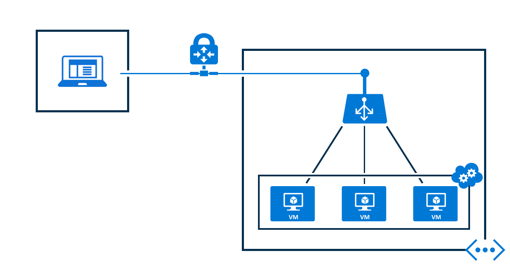

<properties
   pageTitle="Interner Lastenausgleich Übersicht | Microsoft Azure"
   description="Übersicht über das interne Lastenausgleich und der zugehörigen Funktionen. Funktionsweise des ein Lastenausgleich für Azure und mögliche Szenarien, die interne Endpunkte konfigurieren"
   services="load-balancer"
   documentationCenter="na"
   authors="sdwheeler"
   manager="carmonm"
   editor="tysonn" />
<tags
   ms.service="load-balancer"
   ms.devlang="na"
   ms.topic="article"
   ms.tgt_pltfrm="na"
   ms.workload="infrastructure-services"
   ms.date="10/24/2016"
   ms.author="sewhee" />

# Interner laden Lastenausgleich (Übersicht)

Im Gegensatz zu dann Internet zugänglichen Lastenausgleich wird der interne Lastenausgleich (ILB) Netzwerkverkehr nur für Ressourcen in der Cloud-Dienst oder mithilfe von VPN auf die Azure-Infrastruktur zugreifen. Die Infrastruktur beschränkt den Zugriff auf den Lastenausgleich virtuellen IP-Adressen (VIPs) einen Cloud-Dienst oder einem virtuellen Netzwerk, dass sie nie direkt an den Endpunkt Internet zugänglich gemacht werden können. Dies ermöglicht internen Textzeile branchenspezifische eine Anwendung in Azure ausführen und in der Cloud oder von Ressourcen lokal aus zugegriffen werden.

## Warum kann ein interner Lastenausgleich erforderlich

Azure internen laden Lastenausgleich (ILB) bietet einen Lastenausgleich zwischen virtuellen Computern, die sich in einen Clouddienst oder ein virtuelles Netzwerk mit einem Landes-/ Bereich befinden. Informationen zur Verwendung und Konfiguration von virtuellen Netzwerken mit einem Landes-/ Bereich finden Sie unter [Landes-/ virtuelle Netzwerke](https://azure.microsoft.com/blog/2014/05/14/regional-virtual-networks/) im Azure-Blog. ILB können keine vorhandenen virtuelle Netzwerke, die für eine Gruppe für die Zugehörigkeit konfiguriert wurden.

ILB ermöglicht die folgenden Arten von Lastenausgleich:

- In einen Cloud-Dienst aus virtuellen Computern eine Reihe von virtuellen Computern, die innerhalb der gleichen Cloud-Dienst befinden (siehe Abbildung 1).
- In einem virtuellen Netzwerk von virtuellen Computern in der virtuellen Netzwerk eine Reihe von virtuellen Computern, die innerhalb der gleichen Cloud-Dienst, der virtuellen befinden network (siehe Abbildung 2).
- Bei einem Cross lokale virtuelle Netzwerk aus dem lokalen Computer auf einen Satz von virtuellen Computern, die innerhalb der gleichen Cloud-Dienst, der virtuellen befinden network (siehe Abbildung 3).
- Internet zugängliche, mit mehreren Ebenen Applications, in denen die Back-End-Ebenen sind nicht Internet zugänglichen aber erforderlich, Lastenausgleich für den Datenverkehr aus dem Internet zugänglichen Ebene.
- Lastenausgleich für LOB Applikationen in Azure gehostet werden, ohne zusätzliche Last Lastenausgleich Hardware oder Software. Server lokal in der Gruppe von Computern, deren Datenverkehr laden wird, einschließlich verteilt.

## Internet gegenüberliegende Applikationen mit mehreren Ebene

Der Webebene weist Internet zugänglichen Endpunkte für Internet-Clients und ist in einer Reihe mit Lastenausgleich. Lastenausgleich verteilt eingehenden Datenverkehr von Web-Clients für TCP-Port 443 (HTTPS) für den Webserver.

Die Datenbankserver sind hinter einen ILB Endpunkt die Webserver für Speicher verwenden. Diese Datenbank-Dienst Lastenausgleich Endpunkt, welcher Datenverkehr Lastenausgleich auf die Datenbankserver ILB festlegen ist.

Die folgende Abbildung zeigt das Internet gegenüberliegende Anwendung mit mehreren Ebenen innerhalb derselben Cloud-Dienst an.

Abbildung 1: Internet gegenüberliegende Anwendung mit mehreren Ebenen

Eine andere besteht Möglichkeit für eine Anwendung mit mehreren Ebenen, wenn der ILB in einem anderen Cloud-Dienst als die Nutzung des Diensts für den ILB bereitgestellt.

Cloud-Diensten mit den gleichen virtuellen Netzwerk haben Zugriff auf den Endpunkt ILB.

Abbildung 2 zeigt die Front-End-Web, die Server in einem anderen Cloud-Dienst in die Back-End-Datenbank und verwenden den ILB Endpunkt innerhalb der gleichen virtuellen Netzwerk befinden.

Abbildung 2: Front-End-Webservern in einem anderen Clouddienst

## Intranet Linie branchenanwendungen

Datenverkehr von Clients im lokalen Netzwerk aussagekräftige Lastenausgleich von LOB-Servern VPN-Verbindung zu Azure Netzwerk verwenden.

Der Clientcomputer haben Zugriff auf eine IP-Adresse aus Azure VPN-Dienst Punkt auf VPN-Website verwenden. Es ermöglicht die Verwendung die LOB-Anwendung, die hinter den Endpunkt ILB gehostet.

Abbildung 3: LOB Applikationen hinter den Endpunkt Pfd gehostet

Ein anderes Szenario BRANCHENSYSTEM ist ein VPN auf Website mit dem virtuellen Netzwerk haben, in der Endpunkt ILB konfiguriert ist. Dadurch wird die lokale Netzwerkdatenverkehr an den Endpunkt ILB weitergeleitet werden.

Abbildung 4: lokale Netzwerkdatenverkehr an den Endpunkt ILB weitergeleitet

## Nächste Schritte

[Azure Ressourcenmanager-Unterstützung für Lastenausgleich Azure](load-balancer-arm.md)

[Erste Schritte zum Konfigurieren einer Internet gegenüberliegende Lastenausgleich](load-balancer-get-started-internet-arm-ps.md)

[Erste Schritte zum Konfigurieren einer internen Lastenausgleich](load-balancer-get-started-ilb-arm-ps.md)

[Konfigurieren eines laden Lastenausgleich Verteilung Modus](load-balancer-distribution-mode.md)

[Konfigurieren von Einstellungen zur im Leerlauf TCP Timeout für Ihre Lastenausgleich](load-balancer-tcp-idle-timeout.md)

