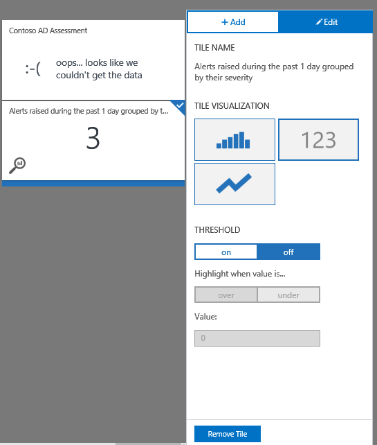

<properties
    pageTitle="Erstellen Sie ein benutzerdefiniertes Dashboard in Log Analytics | Microsoft Azure"
    description="Dieses Handbuch hilft Ihnen zu verstehen, wie Log Analytics Dashboards alle Ihre Suchvorgänge gespeichertes Protokoll visualisieren können Sie eine einzelne Lens zum Anzeigen Ihrer Umgebung zugewiesen."
    services="log-analytics"
    documentationCenter=""
    authors="bandersmsft"
    manager="jwhit"
    editor=""/>

<tags
    ms.service="log-analytics"
    ms.workload="na"
    ms.tgt_pltfrm="na"
    ms.devlang="na"
    ms.topic="article"
    ms.date="10/10/2016"
    ms.author="banders"/>

# Erstellen Sie ein benutzerdefiniertes Dashboard in Log Analytics

Dieses Handbuch hilft Ihnen zu verstehen, wie Log Analytics Dashboards alle Ihre Suchvorgänge gespeichertes Protokoll visualisieren können Sie eine einzelne Lens zum Anzeigen Ihrer Umgebung zugewiesen.

Die benutzerdefinierten Dashboards, die Sie im Portal OMS erstellen stehen auch in der OMS Mobile-App. Finden Sie unter den folgenden Seiten für Weitere Informationen zu den apps.

- [OMS mobile-app aus dem Microsoft Store](http://www.windowsphone.com/store/app/operational-insights/4823b935-83ce-466c-82bb-bd0a3f58d865)
- [OMS mobile-app in Apple iTunes](https://itunes.apple.com/app/microsoft-operations-management/id1042424859?mt=8)

## Wie erstelle ich mein Dashboard?

Um zu beginnen, wechseln Sie zu der Seite Übersicht OMS. Die Kachel **Mein Dashboard** wird auf der linken Seite angezeigt. Klicken Sie auf ihn Drilldown in Ihr Dashboard.

## Hinzufügen einer Kachel

In Dashboards werden Kacheln über Ihre gespeicherten Log Suchvorgänge ausgeführt. Im Lieferumfang von OMS sind viele vorgefertigte gespeichertes Protokoll Suchbegriffe, damit Sie sofort beginnen können. Gehen Sie folgendermaßen vor, die zu den ersten Schritten gliedern.

In der Mein Dashboard befinden, klicken Sie einfach auf **Anpassen** eingeben anpassen Modus.

 Der Bereich auf der rechten Seite der Seite geöffnet werden alle des Arbeitsbereichs gespeichertes Protokoll sucht. Um eine gespeicherte Log-Suche als Kachel zu visualisieren, zeigen Sie auf eine gespeicherte Suche, und klicken Sie dann auf das Symbol **plus** .

Wenn Sie das **plus** -Symbol klicken, wird eine neue Kachel in der Ansicht My Dashboard angezeigt.

## Bearbeiten einer Kachel

In der Mein Dashboard befinden, klicken Sie einfach auf **Anpassen** eingeben anpassen Modus. Klicken Sie auf die Kachel, die Sie bearbeiten möchten. Im rechten Bereich Änderungen zu bearbeiten, und Sie erhalten eine Auswahl der Optionen:

### Kachel-Visualisierungen#
Es gibt drei Arten von Kachel-Visualisierungen zur Auswahl:

|Diagrammtyp|Was bedeutet|
|---|---|
||Zeigt eine Zeitachse der Suchergebnisse Ihrer gespeicherten Log als ein Balkendiagramm oder eine Liste der Ergebnisse anhand eines Felds, je nachdem, welcher an, wenn Sie Ihre Suche Log Ergebnisse anhand eines Felds oder nicht aggregiert.
||Zeigt Ihre gesamte Log Suche Ergebnis Treffer als Zahl in einer Kachel. Metrische Kacheln ermöglichen es Ihnen, einen Schwellenwert festzulegen, der die Kachel hervorgehoben wird, wenn der Schwellenwert erreicht wird.|
||Zeigt eine Zeitachse mit Ihrer gespeicherten Log Suche Ergebnis Treffer mit Werten als Liniendiagramm.|

### Schwellenwert
Sie können einen Schwellenwert auf einer Kachel mithilfe der metrischen Visualisierung erstellen. Wählen Sie auf ein gegebener auf die Kachel zu erstellen. Wählen Sie aus, ob Sie die Kachel hervorgehoben, wenn der Wert über oder unter dem ausgewählten Grenzwert wird, und dann den folgenden Schwellenwert festlegen.

## Organisieren von dem dashboard
Klicken Sie zum Organisieren des Dashboards, navigieren Sie zu der Mein Dashboard-Ansicht, und klicken Sie auf **Anpassen** klicken, geben Sie Modus anpassen. Klicken Sie auf, und ziehen Sie die Kachel, die Sie verschieben, und verschieben Sie es an die gewünschte Position der Kachel werden möchten.

## Entfernen einer Kachel
Klicken Sie zum Entfernen einer Kachel, navigieren Sie zu der Mein Dashboard-Ansicht, und klicken Sie auf **Anpassen** klicken, geben Sie Modus anpassen. Wählen Sie die Kachel, die Sie entfernen möchten, klicken Sie auf den rechten Bereich und wählen Sie dann **Kachel entfernen**.

## Nächste Schritte

- Erstellen Sie [Benachrichtigungen](log-analytics-alerts.md) in Log Analytics Benachrichtigungen generiert und die Probleme zu beheben.
