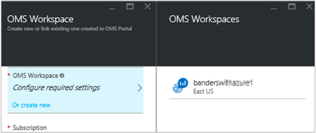
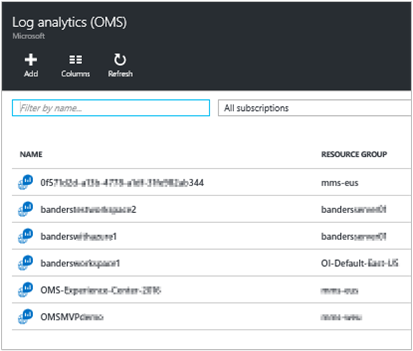
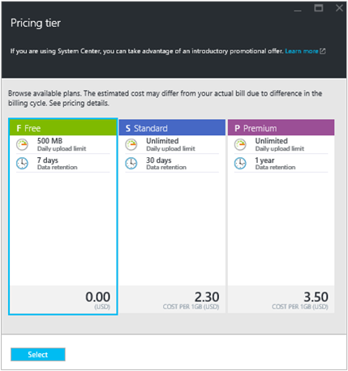
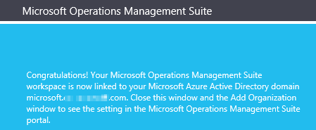

<properties
    pageTitle="Verwalten des Zugriffs auf Log Analytics | Microsoft Azure"
    description="Verwalten des Zugriffs auf Log Analytics mithilfe einer Vielzahl von Verwaltungsaufgaben auf Benutzer, Konten, OMS Arbeitsbereiche und Azure-Konten."
    services="log-analytics"
    documentationCenter=""
    authors="bandersmsft"
    manager="jwhit"
    editor=""/>

<tags
    ms.service="log-analytics"
    ms.workload="na"
    ms.tgt_pltfrm="na"
    ms.devlang="na"
    ms.topic="get-started-article"
    ms.date="08/16/2016"
    ms.author="banders"/>

# Verwalten des Zugriffs auf Log Analytics

Zum Verwalten des Zugriffs auf Log Analytics, verwenden Sie eine Vielzahl von administrativen Aufgaben auf Benutzer, Firmen, OMS Arbeitsbereiche und Azure-Konten. Zum Erstellen eines neuen Arbeitsbereichs in Vorgänge Management Suite (OMS), wählen Sie einen Arbeitsbereichsnamen verbinden Sie es mit Ihrem Konto, und wählen Sie eine geografische Position. Ein Arbeitsbereich ist im Wesentlichen ein Container, der Kontoinformationen und einfache Konfigurationsinformationen für das Konto enthält. Sie oder andere Mitglieder Ihrer Organisation möglicherweise mehrere OMS Arbeitsbereiche verwenden, um verschiedene Datenmengen, die von allen gesammelt oder Teile der IT-Infrastruktur verwalten zu können.

[Erste Schritte mit Log Analytics](log-analytics-get-started.md) Artikel wird gezeigt, wie schnellen Einstieg und Ausführung und den Rest der in diesem Artikel beschrieben ausführlicher einige Aktionen Sie Zugriff auf OMS verwalten müssen.

Obwohl möglicherweise Sie nicht jede zuerst ausführen müssen, werden alle gängige Aufgaben Fragestellungen, die Sie in den folgenden Abschnitten verwenden können:

- Ermitteln Sie die Anzahl der Arbeitsbereiche, die Sie benötigen
- Verwalten von Konten und Benutzern
- Hinzufügen einer Gruppe zu einem vorhandenen Arbeitsbereich
- Verknüpfen eines vorhandenen Arbeitsbereichs zu einem Azure-Abonnement
- Aktualisieren eines Arbeitsbereichs in ein kostenpflichtiges Datentarif
- Ändern Sie einen Plan-Datentyp
- Hinzufügen einer Azure Active Directory Organisation zu einem vorhandenen Arbeitsbereich
- Schließen Sie den OMS-Arbeitsbereich

## Ermitteln Sie die Anzahl der Arbeitsbereiche, die Sie benötigen

Ein Arbeitsbereich ist eine Ressource Azure und eines Containers, wobei Daten gesammelt, zusammengefasster, analysiert und im Portal OMS präsentiert.

Es ist möglich, mehrere OMS Log Analytics Arbeitsbereiche erstellen und für Benutzer zum Zugriff auf eine oder mehrere Arbeitsbereiche haben. Im Allgemeinen möchten Sie die Anzahl von Arbeitsbereichen minimieren, wie diese können Sie Abfragen und über die meisten Daten zu koordinieren. In diesem Abschnitt werden, wenn es mehr als einen Arbeitsbereich erstellen hilfreich sein kann.

Heute bietet ein Arbeitsbereich Log Analytics aus:

- Einem geografischen Ort zum Speichern von Daten
- Genauigkeit für Abrechnung
- Grad der Datenisolation

Basierend auf den oben angegebenen Merkmalen, sollten Sie mehrere Arbeitsbereiche erstellen, wenn:

- Sie sind ein globales Unternehmen und benötigten Daten, die in bestimmten Regionen Data Hoheit oder Compliance Gründen gespeichert.
- Verwenden Sie die Azure und ausgehende Daten durchstellen Gebühren vermeiden, indem Sie Probleme eines Arbeitsbereichs Analytics Log in der gleichen Region wie die Azure Ressourcen, die es verwaltet werden soll.
- Gebühren zu anderen Abteilungen oder basierend auf der Verwendung von Business Gruppen zugewiesen werden soll. Bei der Erstellung eines Arbeitsbereichs für jede Abteilung oder Gruppe Büro zeigt Ihre Azure-Anweisung Rechnung und die Verwendung die Gebühren für jede Arbeitsbereich separat an.
- Einen verwalteten Dienstanbieter werden und müssen die Protokoll Analytics-Daten für jeden Kunden bleiben Sie Verwalten von anderen Kunden Daten isoliert.
- Sie mehrere Kunden verwalten, und jedes Kunden oder Abteilung oder Gruppe Büro ihre eigenen Daten, aber nicht die Daten für andere Kunden oder Abteilungen oder Gruppen Business angezeigt werden soll.

Wenn Sie Agents zum Sammeln von Daten verwenden, können Sie jeden Agent, der erforderliche Arbeitsbereich zu melden konfigurieren.

Wenn Sie System Center Operations Manager verwenden, kann jede Management Group unter Operations Manager mit nur einem Arbeitsbereich verbunden werden. Sie können Installieren des Microsoft-Agents Überwachung auf Computern mit Operations Manager verwaltet werden und Agent Bericht sowohl Operations Manager auf einen anderen Log Analytics-Arbeitsbereich auf.

### Arbeitsbereichsinformationen

Im Portal OMS können Sie Arbeitsbereichsinformationen zu Ihrer anzeigen und auswählen, ob Sie Informationen von Microsoft erhalten möchten.

#### Anzeigen von Arbeitsbereichsinformationen

1. OMS klicken Sie auf die Kachel " **Einstellungen** ".
2. Klicken Sie auf die Registerkarte **Konten** .
3. Klicken Sie auf der Registerkarte **Arbeitsbereichsinformationen** .  
  

## Verwalten von Konten und Benutzern

Jeder Arbeitsbereich kann mehrere Benutzerkonten zugeordnet haben, und jedes Benutzerkonto (Microsoft-Konto oder organisationskonto) kann Zugriff auf mehrere OMS Arbeitsbereiche haben.

Standardmäßig wird der Microsoft-Konto oder organisationskonto verwendet, um den Arbeitsbereich erstellen der Administrator des Arbeitsbereichs aus. Der Administrator kann dann einladen Weitere Microsoft-Konten, oder wählen Benutzer aus Azure Active Directory.

Personen Zugriff auf den Arbeitsbereich OMS ermöglicht wird in 2 Stellen gesteuert werden:

- Rollenbasierte Access-Steuerelement können Sie in Azure Zugriff auf Azure-Abonnement und die zugehörigen Azure Ressourcen bieten. Dies dient auch für PowerShell und REST-API-Zugriff.
- Im Portal OMS nur OMS-Portal - nicht zugeordnete Azure Abonnement zugreifen.

Wenn Sie Personen Zugriff gewähren OMS-Portal an, aber nicht mit dem Azure-Abonnement, dem sie verknüpft ist, klicken Sie dann die Kacheln der Lösung Automatisierung, Sicherung und Wiederherstellung der Website nicht mehr anzeigen Daten für Benutzer Wenn sie das Portal OMS Anmeldung.

An, damit alle Benutzer finden Sie unter der Daten in den folgenden Lösungsvorschlägen, stellen Sie sicher, dass sie mindestens haben Zugriff auf **Reader** für die Tresor Automatisierung Konto, Tresor Sicherung und Wiederherstellung der Website, der in den Arbeitsbereich OMS verknüpft ist.   

### Verwalten des Zugriffs auf Log Analytics über das Azure-portal

Wenn Sie Personen Zugriff auf den Log Analytics-Arbeitsbereich mit Azure Berechtigungen erteilen, können Azure-Portal beispielsweise dann dieselben Benutzer Log Analytics-Portal zugreifen. Wenn Benutzer im Portal Azure sind, können sie durch Klicken auf den Vorgang **OMS Portal** beim Anzeigen der Log Analytics Arbeitsbereich Ressource OMS-Portal navigieren.

Einige Punkte beachten müssen zur Azure-Portal:

- Dies ist keine *rollenbasierte Access Control*. Wenn Sie die Azure-Portal für den Arbeitsbereich Log Analytics *Reader* Zugriffsberechtigungen verfügen, können Sie mit dem Portal OMS Änderungen vornehmen. Im Portal OMS verfügt über ein Konzept von Administrator-, Mitwirkender, und schreibgeschützt. Ist das Konto ein, dem Sie mit angemeldet sind in Azure Active Directory zu dem Arbeitsbereich verknüpft werden, ein Administrator im Portal OMS, andernfalls werden Sie einen Mitwirkenden.

- Wenn Sie mit http://mms.microsoft.com, dann wird standardmäßig OMS-Portal Anmeldung wird die Liste **Wählen Sie einen Arbeitsbereich aus** . Sie enthält nur Arbeitsbereiche, die mit dem Portal OMS hinzugefügt wurden. Zum Anzeigen der Arbeitsbereiche, die Sie haben Zugriff auf mit Azure-Abonnements, und klicken Sie dann müssen Sie einen Mandanten als Teil der URL angeben. Zum Beispiel:

  `mms.microsoft.com/?tenant=contoso.com`Der Mandant Bezeichner ist häufig die letzte Teil der e-Mail-Adresse, der Sie mit Anmeldung.

- Ist das Konto, dem Sie mit Anmeldung, ein Konto in den Mandanten Azure Active Directory, was in der Regel der Fall ist, es sei denn, Sie als einen CSP anmelden sind, werden Sie ein *Administrator* im Portal OMS sein. Wenn Ihr Konto nicht in den Mandanten Azure Active Directory ist, werden Sie einem *Benutzer* im Portal OMS sein.

- Wenn Sie direkt mit einem Portal navigieren, dass Sie bei der Verwendung von Azure Berechtigungen zugreifen möchten, müssen Sie die Ressource als Teil der URL angeben. Es ist möglich, diese URL mithilfe der PowerShell zu erhalten.

  Beispielsweise `(Get-AzureRmOperationalInsightsWorkspace).PortalUrl`.

  Wie wird die URL aus:`https://eus.mms.microsoft.com/?tenant=contoso.com&resource=%2fsubscriptions%2faaa5159e-dcf6-890a-a702-2d2fee51c102%2fresourcegroups%2fdb-resgroup%2fproviders%2fmicrosoft.operationalinsights%2fworkspaces%2fmydemo12`

### Verwalten von Benutzern im Portal OMS

Verwalten von Benutzern und Gruppe auf der Registerkarte **Benutzer verwalten** unter der Registerkarte **Firmen** auf der Seite. Es ist, können Sie die Aufgaben in den folgenden Abschnitten ausführen.  

#### Hinzufügen eines Benutzers zu einem vorhandenen Arbeitsbereich

Gehen Sie folgendermaßen vor, einen Benutzer oder eine Gruppe zu einem Arbeitsbereich OMS hinzufügen. Der Benutzer oder der Gruppe werden sehen und wirken sich auf alle Benachrichtigungen, die diesem Arbeitsbereich zugeordnet sind.

>[AZURE.NOTE] Wenn Sie einen Benutzer oder eine Gruppe von Ihrem organisationsinterne Azure Active Directory-Konto hinzufügen möchten, müssen Sie zuerst sicherstellen, dass Sie Ihre Domäne Active Directory Ihres Kontos OMS zugeordnet haben. Finden Sie unter [Hinzufügen einer Organisation Azure Active Directory zu einem vorhandenen Arbeitsbereich](#add-an-azure-active-directory-organization-to-an-existing-workspace).

1. Klicken Sie in OMS auf die Kachel " **Einstellungen** ".
2. Klicken Sie auf der Registerkarte **Konten** , und klicken Sie dann auf die Registerkarte **Benutzer verwalten** .
3. Wählen Sie im Abschnitt **Benutzer veralten** Kontotyp hinzufügen: **Organisations-Konto**, **Microsoft-Konto**, **Microsoft-Support**.
    - Wenn Sie Microsoft Account auswählen, geben Sie die e-Mail-Adresse des Benutzers der Microsoft-Account zugeordnet.
    - Wenn Sie die Organisations-Konto auswählen, können Sie Teil der Benutzer oder der Gruppe Namen oder e-Mail-Alias eingeben und eine Liste der Benutzer und Gruppen angezeigt werden. Wählen Sie einen Benutzer oder eine Gruppe aus.
    - Verwenden Sie Microsoft Support, um eine Microsoft-Support verleihen Engineering temporären Zugriff auf den Arbeitsbereich, bei der Problembehandlung helfen.

    >[AZURE.NOTE] Die besten Ergebnisse erzielen Sie Leistung, die Anzahl der Active Directory-Gruppen, die ein einzelnes OMS Benutzerkonto drei zugeordnet – eine für Administratoren, Mitwirkenden und schreibgeschützt Benutzer. Weitere Gruppen verwenden, kann die Leistung von Log Analytics auswirken.

5. Wählen Sie den Typ des hinzuzufügenden Benutzer oder eine Gruppe: **Administrator**, **Mitwirkender**oder **Schreibgeschützt** .  
6. Klicken Sie auf **Hinzufügen**.

  Wenn Sie ein Microsoft-Konto hinzufügen, wird keine Einladung für den Arbeitsbereich an die e-Mail gesendet, die Sie zur Verfügung gestellt. Nachdem der Benutzer die Anweisungen in der Einladung zur Teilnahme OMS folgt, der Benutzer kann die Benachrichtigungen und Kontoinformationen für dieses Konto OMS anzeigen, und Sie werden die Benutzerinformationen auf der Registerkarte **Konten** der Seite **Einstellungen** anzeigen.
  Wenn Sie ein Organisations-Konto hinzufügen, werden der Benutzer auf Log Analytics sofort zugreifen.  
  

#### Bearbeiten einer vorhandenen Benutzertyp

Sie können die Rolle der für einen Benutzer mit Ihrem Konto OMS verbundene Konten ändern. Sie haben die folgenden Rollenoptionen aus:

 - *Administrator*: können Benutzer verwalten, anzeigen und wirken sich auf alle Benachrichtigungen, und Server hinzufügen und entfernen

 - *Mitwirkender*: kann anzeigen und wirken sich auf alle Benachrichtigungen, und Server hinzufügen und entfernen

 - *Schreibgeschützte Benutzer*: Benutzer als schreibgeschützt markiert werden nicht mehr:
   1. Hinzufügen/Entfernen von Lösungen. Der Lösungskatalog wird ausgeblendet.
   2. Hinzufügen/Ändern/Entfernen Kacheln auf **Mein Dashboard**.
   3. Anzeigen **der Einstellungsseiten** an. Die Seiten werden ausgeblendet.
   4. Im Suchfeld anzeigen, PowerBI Konfiguration, gespeicherte Suchen und Benachrichtigungen werden Vorgänge ausgeblendet.

#### So bearbeiten Sie ein Konto

1. OMS klicken Sie auf die Kachel " **Einstellungen** ".
2. Klicken Sie auf der Registerkarte **Konten** , und klicken Sie dann auf die Registerkarte **Benutzer verwalten** .
3. Wählen Sie die Rolle für den Benutzer, den Sie ändern möchten.
2. Klicken Sie im Bestätigungsdialogfeld auf **Ja**.

### Entfernen eines Benutzers aus einem OMS-Arbeitsbereich

Gehen Sie folgendermaßen vor, um einen Benutzer aus einem OMS-Arbeitsbereich zu entfernen. Beachten Sie, dass dies Arbeitsbereich des Benutzers nicht geschlossen wird. In diesem Fall wird die Zuordnung zwischen diesen Benutzer und der Arbeitsbereich entfernt. Wenn ein Benutzer mehrere Arbeitsbereiche zugeordnet ist, wird dieser Benutzer werden weiterhin melden Sie sich bei OMS und den anderen Arbeitsbereichen finden Sie unter.

1. Klicken Sie in OMS auf die Kachel " **Einstellungen** ".
2. Klicken Sie auf der Registerkarte **Konten** , und klicken Sie dann auf die Registerkarte **Benutzer verwalten** .
3. Klicken Sie neben dem Benutzernamen, den Sie entfernen möchten, auf **Entfernen** .
4. Klicken Sie im Bestätigungsdialogfeld auf **Ja**.

### Hinzufügen einer Gruppe zu einem vorhandenen Arbeitsbereich

1.  Führen Sie die Schritte 1-4 in "Zum Hinzufügen eines Benutzers zu einem vorhandenen Arbeitsbereich verwenden", oben.
2.  Wählen Sie unter **Benutzergruppe auswählen**die **Gruppe**ein.
    
3.  Geben Sie den Anzeigenamen oder die e-Mail-Adresse für die Gruppe aus, die Sie hinzufügen möchten.
4.  Wählen Sie in der Liste führt die Gruppe aus, und klicken Sie dann auf **Hinzufügen**.

## Verknüpfen eines vorhandenen Arbeitsbereichs zu einem Azure-Abonnement

Es ist möglich, die von der Website [microsoft.com/oms](https://microsoft.com/oms) einen Arbeitsbereich zu erstellen.  Es gibt jedoch bestimmte Grenzwerte für diese Arbeitsbereiche, die wichtigsten zu maximal 500MB pro Tag des Datenuploads aus, wenn Sie ein kostenloses Konto verwenden. Um diesen Arbeitsbereich ändern müssen Sie *den vorhandenen Arbeitsbereich zu einem Azure-Abonnement*verknüpft.

>[AZURE.IMPORTANT] Akzeptieren, um einen Arbeitsbereich zu verknüpfen, muss Ihr Konto Azure bereits Zugriff auf den Arbeitsbereich haben aus, die Sie verknüpfen möchten.  **Kurzum, muss das Konto, mit denen Sie den Zugriff auf das Portal Azure als das Konto übereinstimmen, die Sie zum Zugriff auf Ihre OMS-Arbeitsbereich verwenden.** Wenn dies nicht der Fall ist, finden Sie unter [Hinzufügen eines Benutzers zu einem vorhandenen Arbeitsbereich](#add-a-user-to-an-existing-workspace).

### Zum Verknüpfen von eines Arbeitsbereichs zu einem Azure Abonnement OMS-Portal

Um einen Arbeitsbereich zu einem Azure Abonnement im Portal OMS verknüpfen, müssen der Benutzer angemeldet bereits ein kostenpflichtiges Azure-Konto. Der Arbeitsbereich, den Sie aktiv verwenden, wird mit dem Azure-Konto verknüpft.

1. Klicken Sie in OMS auf die Kachel " **Einstellungen** ".
2. Klicken Sie auf der Registerkarte **Konten** , und klicken Sie dann auf die Registerkarte **Azure-Abonnement und Daten zu planen** .
3. Klicken Sie auf die Datentarif, das Sie verwenden möchten.
4. Klicken Sie auf **Speichern**.  
  

Ihre neue Datentarif wird im Portal OMS-Menüband am oberen Rand der Webseite angezeigt.

### Zum Verknüpfen von eines Arbeitsbereichs zu einem Azure Abonnement Azure-Portal

1.  Melden Sie sich bei der [Azure-Portal](http://portal.azure.com)werden soll.
2.  Suchen Sie nach **Log Analytics (OMS)** , und wählen Sie ihn aus.
3.  Sehen Sie die Liste der vorhandenen Arbeitsbereiche ein. Klicken Sie auf **Hinzufügen**.  
    
4.  Klicken Sie unter **OMS-Arbeitsbereich**auf **oder vorhandene verknüpfen**.  
    
5.  Klicken Sie auf **konfigurieren: Einstellungen erforderlich**.  
    
6.  Sie sehen die Liste der Arbeitsbereiche, die noch nicht mit Ihrem Azure-Konto verknüpft sind. Wählen Sie einen Arbeitsbereich aus.  
    
7.  Bei Bedarf können Sie die Werte für die folgenden Elemente ändern:
    - Abonnement
    - Ressourcengruppe
    - Speicherort
    - Preise Ebene  
        
8.  Klicken Sie auf **Erstellen**. Der Arbeitsbereich ist jetzt bei Ihrem Azure-Konto verknüpft.

>[AZURE.NOTE] Wenn Sie den Arbeitsbereich aus, die, den Sie verknüpfen möchten, nicht angezeigt werden, kann dann Ihr Abonnement Azure nicht in den Arbeitsbereich OMS zugreifen, dass Sie mit der OMS-Website erstellt haben.  Sie müssen den Zugriff auf dieses Konto aus, in dem OMS Arbeitsbereich mithilfe der OMS-Website gewähren. Hierzu finden Sie unter [Hinzufügen eines Benutzers zu einem vorhandenen Arbeitsbereich](#add-a-user-to-an-existing-workspace).

## Aktualisieren eines Arbeitsbereichs in ein kostenpflichtiges Datentarif

Es gibt drei Arbeitsbereichsdaten Typen OMS planen: **frei**, **Standard-**und **Premium**.  Wenn Sie einen Plan *frei* sind, haben Sie Ihre Daten Linienende von 500 MB getroffen.  Sie müssen den Arbeitsbereich zu einem ***Plan je nach Bedarf berechnet*** zu aktualisieren, um diese Beschränkung Datensammlung. Zu einem beliebigen Zeitpunkt können Sie Ihren Plantyp konvertieren.  Weitere Informationen zum OMS Preise finden Sie unter [Preise Details](https://www.microsoft.com/en-us/server-cloud/operations-management-suite/pricing.aspx).

>[AZURE.IMPORTANT] Arbeitsbereich Pläne können nur geändert werden, wenn sie *verknüpfte* zu einem Abonnement Azure sind.  Wenn Sie den Arbeitsbereich in Azure erstellt oder Sie haben *bereits* mit den Arbeitsbereich verknüpft, können Sie diese Meldung ignorieren.  Wenn Sie den Arbeitsbereich mit der [OMS-Website](http://www.microsoft.com/oms)erstellt haben, müssen Sie die Schritte unter [Link zu einem Abonnement Azure einen vorhandenen Arbeitsbereich](#link-an-existing-workspace-to-an-azure-subscription).

### Mithilfe von Ansprüche aus dem Add-On OMS für System Center

Das Add-On OMS für System Center bietet einen Anspruch, der für den Plan Premium von OMS Log Analytics, zu einem [Preis OMS](https://www.microsoft.com/en-us/server-cloud/operations-management-suite/pricing.aspx)beschrieben.

Wenn Sie das Add-on OMS für System Center erworben haben, wird das Add-on OMS als ein Anspruch, der auf Ihrem System Center Vertrag hinzugefügt. Alle Azure-Abonnement, die diesem Vertrag erstellt wird umso die Ansprüche wiederzuverwenden. Diese Weise können Sie beispielsweise mehrere OMS Arbeitsbereiche enthalten, die die Ansprüche aus dem Add-on OMS zu verwenden.

Um sicherzustellen, dass die Verwendung eines OMS Workspace auf Ihre Ansprüche aus dem Add-on OMS angewendet wird, müssen Sie:

1. Ein Teil der Enterprise Agreement ist, die die OMS-Add-On erwerben und die Abonnementverwendung der Azure-umfasst Azure-Abonnement verknüpfen Sie OMS Arbeitsbereich
2. Wählen Sie den Plan Premium für den Arbeitsbereich

Wenn Sie Ihre Verwendung im Portal Azure oder OMS überprüfen, wird die OMS Add-on Ansprüche nicht angezeigt. Sie können jedoch Ansprüche in Enterprise Portal sehen.  

Wenn Sie müssen das Abonnement Azure ändern, dem mit der Arbeitsbereich OMS verknüpft ist, können Sie das Cmdlet Azure PowerShell [AzureRmResource verschieben](https://msdn.microsoft.com/library/mt652516.aspx) .

### Verwenden von Azure Zusicherung aus einem Enterprise Agreement

Wenn Sie mit der eigenständigen Preise für OMS Komponenten auswählen, Sie Zahlen für jede Komponente der OMS separat, und die Verwendung auf Ihre Azure Rechnung angezeigt.

Wenn Sie einen Azure monetären Commit auf das Enterprise-Registrierung haben, mit denen Azure-Abonnements verknüpft sind, werden alle Verwendung der Log Analytics automatisch für alle verbleibenden monetäre Commit belasten.

Wenn Sie ändern müssen können das Azure-Abonnement, dass Sie der Arbeitsbereich OMS verknüpft ist das Cmdlet Azure PowerShell [AzureRmResource verschieben](https://msdn.microsoft.com/library/mt652516.aspx) .  

### So ändern Sie einen Arbeitsbereich in ein kostenpflichtiges Datentarif

1.  Melden Sie sich bei der [Azure-Portal](http://portal.azure.com)werden soll.
2.  Suchen Sie nach **Log Analytics (OMS)** , und wählen Sie ihn aus.
3.  Sehen Sie die Liste der vorhandenen Arbeitsbereiche ein. Wählen Sie einen Arbeitsbereich aus.  
    
4.  Klicken Sie unter **Einstellungen**auf **Preise Ebene**.  
    
5.  Klicken Sie unter **Preise Ebene**wählen Sie einen Datentarif aus, und klicken Sie auf **auswählen**.  
    
6.  Wenn Sie Ihre Ansicht im Portal Azure aktualisieren, sehen Sie die **Preise Ebene** aktualisiert für den Plan aus, den Sie ausgewählt haben.  
    

Jetzt können Sie die Daten, die außerhalb der Linienende "frei" Daten sammeln.

## Hinzufügen einer Azure Active Directory-Organisation zu einem vorhandenen Arbeitsbereich

Sie können den Arbeitsbereich Log Analytics (OMS) Azure-Active Directory-Domäne zuordnen. So können Sie Benutzer aus Active Directory direkt an Ihren OMS Arbeitsbereich hinzufügen, ohne ein separates Microsoft-Konto.

Beim Erstellen des Arbeitsbereichs aus dem Azure-Portal oder Ihren Arbeitsbereich zu einem Abonnement Azure verknüpfen wird der Azure-Active Directory als Organisations-Konto verknüpft werden.

Beim Erstellen des Arbeitsbereichs aus dem Portal OMS werden Sie aufgefordert, eine Verknüpfung zu einem Azure-Abonnement und ein Organisations-Konto.

### Hinzufügen einer Azure Active Directory-Organisation zu einer vorhandenen Arbeitsbereich

1. Klicken Sie auf der Einstellungsseite im OMS auf **Konten** , und klicken Sie dann auf die Registerkarte **Arbeitsbereichsinformationen** .  
2. Überprüfen Sie die Informationen zu Organisationskonten, und klicken Sie dann auf **Organisation hinzufügen**.  
    
3. Geben Sie die Identitätsinformationen für den Administrator Ihrer Azure Active Directory-Domäne aus. Danach sehen Sie, eine Bestätigung, die besagt, dass der Arbeitsbereich an Ihre Azure Active Directory-Domäne verknüpft ist.
    

>[AZURE.NOTE] Nachdem Sie Ihr Konto mit einem Organisationskonto verknüpft ist, kann nicht verknüpfen entfernt oder geändert werden.

## Schließen Sie den OMS-Arbeitsbereich

Wenn Sie einen Arbeitsbereich OMS schließen, alle Daten im Zusammenhang mit dem Arbeitsbereich wird gelöscht aus dem Dienst OMS 30 Tage nach dem Schließen des Arbeitsbereichs.

Wenn Sie ein Administrator sind, und es mehrere Benutzer mit dem Arbeitsbereich verbunden ist gibt, ist die Zuordnung zwischen diesen Benutzern und dem Arbeitsbereich unterbrochen. Wenn die Benutzer anderen Arbeitsbereichen zugeordnet sind, können sie weiterhin OMS mit diesen anderen Arbeitsbereichen verwenden. Jedoch, wenn sie nicht mit anderen Arbeitsbereichen verknüpft sind sie müssen zum Erstellen eines neuen Arbeitsbereichs Verwendung von OMS.

### Um ein OMS Arbeitsbereich zu schließen.

1. OMS klicken Sie auf die Kachel " **Einstellungen** ".
2. Klicken Sie auf der Registerkarte **Konten** , und klicken Sie dann auf die Registerkarte **Arbeitsbereichsinformationen** .
3. Klicken Sie auf **Schließen Arbeitsbereich**.
4. Wählen Sie einen der Gründe für den Arbeitsbereich zu schließen, oder geben Sie einen anderen Grund in das Textfeld ein.
5. Klicken Sie auf **Schließen Arbeitsbereich**.

## Nächste Schritte

- Finden Sie unter [Verbinden von Windows-Computern Log Analytics](log-analytics-windows-agents.md) Agents hinzufügen und Daten zu sammeln.
- [Hinzufügen von Log Analytics Lösungen aus dem Lösungskatalog](log-analytics-add-solutions.md) zum Hinzufügen von Funktionen und Daten zu sammeln.
- [Konfigurieren von Proxy und Firewall-Einstellungen in Log Analytics](log-analytics-proxy-firewall.md) Wenn Ihre Organisation einen Proxyserver oder eine Firewall verwendet, damit Agents mit der Log Analytics-Dienst kommunizieren können.
