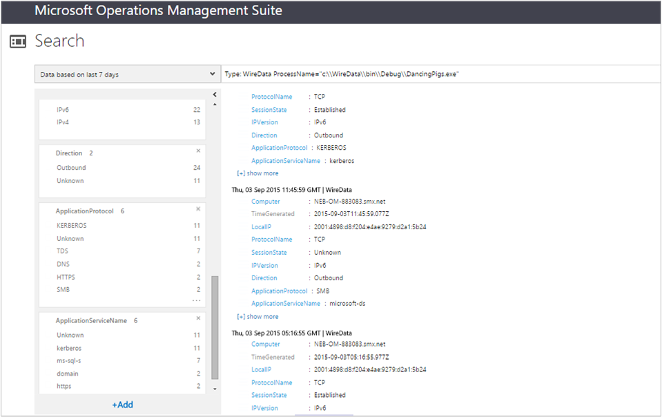
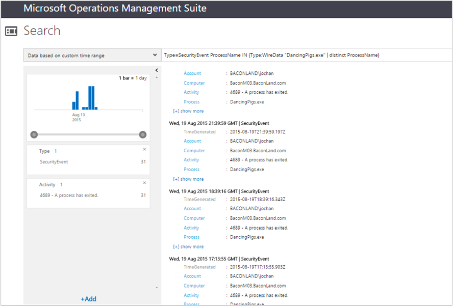

<properties
    pageTitle="Verbinden der Daten-Lösung in Log Analytics | Microsoft Azure"
    description="Über das Netzwerk Daten sind konsolidierte Netzwerk- und Leistung von Computern mit OMS Agents, einschließlich Operations Manager und Agents Windows verbunden. Netzwerkdaten werden mit Ihren Daten Log, damit Sie die Daten zu koordinieren können kombiniert werden."
    services="log-analytics"
    documentationCenter=""
    authors="bandersmsft"
    manager="jwhit"
    editor=""/>

<tags
    ms.service="log-analytics"
    ms.workload="na"
    ms.tgt_pltfrm="na"
    ms.devlang="na"
    ms.topic="article"
    ms.date="08/11/2016"
    ms.author="banders"/>

# <a name="wire-data-solution-in-log-analytics"></a>Verbinden der Daten-Lösung in Log Analytics

Über das Netzwerk Daten sind konsolidierte Netzwerk- und Leistung von Computern mit OMS-Agents, einschließlich Operations Manager und Agents Windows verbunden. Netzwerkdaten werden mit Ihren Daten Log, damit Sie die Daten zu koordinieren können kombiniert werden. OMS-Agents auf Computern in Ihre IT-Infrastruktur Monitor Netzwerk gesendeten Daten an und von diesen Computern für Netzwerk Ebenen 2 und 3 im [OSI-Modell](https://en.wikipedia.org/wiki/OSI_model) einschließlich verschiedene verwendeten Ports und Protokolle installiert.

>[AZURE.NOTE] Die Daten über das Netzwerk-Lösung ist nicht derzeit verfügbar Arbeitsbereiche hinzugefügt werden. Kunden, die bereits die Daten über das Netzwerk-Lösung aktiviert können weiterhin die Lösung über das Netzwerk Daten verwenden.

Standardmäßig OMS protokollierte Daten erfasst für CPU, Speicher, Datenträger und Daten im Netzwerk Leistung Zähler in Windows integriert. Netzwerk- und andere Datensammlung erfolgt Echtzeit für jeden Agent, einschließlich Subnetze und Anwendung Ebene verwendeten Protokolle, vom Computer. Sie können andere Leistungsindikatoren auf der Seite Einstellungen, klicken Sie auf der Registerkarte "Protokolle" hinzufügen.

Wenn Sie mit [Ciscos NetFlow Protokoll](http://www.cisco.com/c/en/us/products/collateral/ios-nx-os-software/ios-netflow/prod_white_paper0900aecd80406232.html) [sFlow](http://www.sflow.org/) oder andere Software verwendet haben, werden die Statistiken und die Daten, die Sie aus Daten über das Netzwerk sehen Sie vertraut sein.

Einige Arten von integrierten Log Suchabfragen einbeziehen möchten:

- Agents, die über das Netzwerk Daten enthalten
- IP-Adresse des Agents Bereitstellen von Daten über das Netzwerk
- Ausgehende Kommunikation durch IP-Adressen
- Anzahl von Bytes, die durch die Anwendungsprotokolle gesendet werden
- Anzahl von Bytes, die durch ein Anwendungsdienst gesendet werden
- Von anderen Protokollen empfangenen Bytes
- Gesamtzahl der Bytes von IP gesendet und empfangen
- IP-Adressen, die mit Agents im Subnetz 10.0.0.0/8 kommuniziert haben
- Durchschnittliche Wartezeit für Verbindungen, bei die zuverlässig gemessen wurden
- Computerprozesse, die initiiert oder Netzwerkdatenverkehr empfangen
- Netzwerkdatenverkehr für einen Prozess

Wenn Sie die Verwendung von Daten über das Netzwerk suchen, können Sie filtern und Gruppieren von Daten, Informationen zu den Top-Agents und Top-Protokolle anzuzeigen. Oder Sie können nähere wann bestimmte Computer (IP-Adressen/MAC-Adressen) angekündigt mit einer anderen, wie lange und wie viele Daten gesendet wurde Sie Metadaten über den Netzwerkverkehr, suchbasierte also anzeigen – im Grunde.

Da Sie Metadaten angezeigt werden, ist es jedoch nicht unbedingt für eine ausführliche Problembehandlung hilfreich. Über das Netzwerk Daten in OMS ist keine vollständige Erfassung von Daten im Netzwerk. Daher ist es nicht für die Problembehandlung in tiefem Paket Ebene vorgesehen.
Der Vorteil der Verwendung des Agents, der im Vergleich zu anderen Methoden Websitesammlung ist, dass Ihnen keine Einheiten installieren, konfigurieren Sie Ihr Netzwerk Schalter oder komplizierte Konfigurationen durchführen. Über das Netzwerk Daten ist einfach Agent-basierten – installieren Sie den Agent auf einem Computer, und es wird eine eigene Netzwerkverkehr überwachen. Ein weiterer Vorteil ist, wenn überwachen Auslastung in Cloud-Anbieter oder Service-Hostinganbieter oder Microsoft Azure, in dem der Benutzer den Layer Fabric besitzen nicht ausgeführt werden soll.

Sie müssen hingegen nicht, was im Netzwerk geschieht, wenn Sie Agents auf allen Computern in Ihrem Netzwerkinfrastruktur installieren nicht vollständig anzeigen.

## <a name="installing-and-configuring-the-solution"></a>Installieren und konfigurieren die Lösung
Verwenden Sie die folgende Informationen zum Installieren und konfigurieren die Lösung.

- Die Lösung über das Netzwerk Daten erhält Daten aus Computern unter Windows Server 2012 R2, Windows 8.1 und höher Betriebssysteme.
- Microsoft .NET Framework 4.0 oder höher ist auf Computern erforderlich, wo Sie erfassen Kabel Daten aus möchten.
- Fügen Sie die Daten über das Netzwerk-Lösung in Ihren OMS Arbeitsbereich mithilfe des Prozesses [Hinzufügen Log Analytics Lösungen aus dem Lösungskatalog](log-analytics-add-solutions.md)beschrieben.  Es ist keine weitere Konfiguration erforderlich.
- Wenn Sie über das Netzwerk Daten für eine bestimmte Lösung anzeigen möchten, müssen Sie die Lösung, die dem Arbeitsbereich OMS bereits hinzugefügt haben.

## <a name="wire-data-data-collection-details"></a>Verbinden der Daten Einzelheiten zur Datensammlung

Über das Netzwerk Daten sammelt Metadaten zu Netzwerkdatenverkehr mithilfe der Agents, die Sie aktiviert haben.

Die folgende Tabelle zeigt Datensammlungsmethoden und andere Details, wie Daten für Daten über das Netzwerk erfasst werden.


| Plattform | Direkte Agent | SCOM agent | Azure-Speicher | SCOM erforderlich? | SCOM Agentdaten per Management Group unter gesendeten | Häufigkeit Collection |
|---|---|---|---|---|---|---|
|Windows (2012 R2 / 8.1 oder höher)||||            || Jede minute|


## <a name="combining-wire-data-with-other-solution-data"></a>Kombinieren von über das Netzwerk Daten mit anderen Lösungsdaten

Aus den oben gezeigten integrierten Abfragen zurückgegebene Daten möglicherweise allein interessant. Jedoch die Nützlichkeit von Daten über das Netzwerk tritt auf, wenn Sie ihn mit den Informationen aus anderen OMS Lösungen kombinieren. Beispielsweise können durch die Lösung Sicherheit und Audit erfassten Daten werden Sicherheit Ereignis verwenden und über das Netzwerk Daten für ungewöhnliche Netzwerk Anmeldung Versuche für benannte Prozesse aussehen zu kombinieren.  In diesem Beispiel verwenden Sie die Operatoren IN und DISTINCT für die Datenpunkte in Ihrer Suchabfrage Teilnahme an.

Anforderungen: Im folgende Beispiel verwenden möchten, müssen Sie die Sicherheit und Audit-Lösung installiert haben. Allerdings können Sie Daten aus anderen Lösungen zum Kombinieren von Daten über das Netzwerk ähnliche Ergebnisse zu erzielen.

### <a name="to-combine-wire-data-with-security-events"></a>Zum Kombinieren von Daten über das Netzwerk mit Sicherheitsereignisse

1. Klicken Sie auf der Seite Übersicht auf die Kachel **WireData** .
2. Klicken Sie in der Liste der **Allgemeinen WireData Abfragen**auf **Menge der Netzwerkdatenverkehr (in Byte) von Prozess** zum finden in der Liste der zurückgegebenen Prozesse.
    
3. Wenn die Liste der Prozesse auf einfache Weise anzeigen zu lang ist, können Sie die Suchabfrage wie aussehen ändern.

    ```
    Type WireData | measure count() by ProcessName | where AggregatedValue <40
    ```
    Im folgenden Beispiel gezeigt ein Prozesses DancingPigs.exe, heißt die verdächtige angezeigt werden kann.
    

4. Verwenden in der Liste zurückgegebene Daten ein, und klicken Sie auf einen benannten Prozess. In diesem Beispiel wurde DancingPigs.exe geklickt. Die nachfolgend aufgeführten Ergebnisse werden die Art der Netzwerkdatenverkehr wie z. B. ausgehende Kommunikation über verschiedene Protokolle beschreiben.
    

5. Da die Sicherheit und Audit Lösung installiert ist, können Sie in die Sicherheitsereignisse Prüfpunkt, die den gleichen ProcessName Feldwert verfügen, indem Sie Ihre Suchabfrage mithilfe der Operatoren IN und DISTINCT Suche Abfrage ändern. Sie können die, die dann tun, wenn sowohl die Daten über das Netzwerk und andere Protokolle Lösung Werte in demselben Format wurden. Ändern Sie Ihre Suchabfrage, die den ähnelt:

    ```
    Type=SecurityEvent ProcessName IN {Type:WireData "DancingPigs.exe" | distinct ProcessName}
    ```    

    
6. In den Ergebnissen sehen Sie sich, dass die Kontoinformationen angezeigt wird. Jetzt können Sie Ihre Suchabfrage ermitteln, wie oft das Konto, Sicherheit und Audit-Daten mit von den Prozess mit einer Abfrage ähnlich verwendet wurde, optimieren:        

    ```
    Type=SecurityEvent ProcessName IN {Type:WireData "DancingPigs.exe" | distinct ProcessName} | measure count() by Account
    ```

    


## <a name="next-steps"></a>Nächste Schritte

- [Suchen von Protokollen](log-analytics-log-searches.md) detaillierte Kabel Suche Datensätze anzeigen.
- Finden Sie unter hat Peters [Posten verwenden über das Netzwerk Daten im Blog-Vorgänge Management Suite Log Suche](http://blogs.msdn.com/b/dmuscett/archive/2015/09/09/using-wire-data-in-operations-management-suite.aspx) zusätzliche Informationen darüber, wie häufig Daten gesammelt und wie Sie die Eigenschaften der Websitesammlung für Operations Manager-Agents ändern können.
