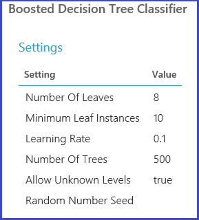

<properties
    pageTitle="Wählen Sie Parameter zur Optimierung Ihrer Algorithmen in Azure-Computer lernen | Microsoft Azure"
    description="Wählen Sie die optimale Parametersatz für einen Algorithmus in Azure-Computer lernen erläutert."
    services="machine-learning"
    documentationCenter=""
    authors="bradsev"
    manager="jhubbard"
    editor="cgronlun"/>

<tags
    ms.service="machine-learning"
    ms.workload="data-services"
    ms.tgt_pltfrm="na"
    ms.devlang="na"
    ms.topic="article"
    ms.date="09/12/2016"
    ms.author="bradsev" />

# Wählen Sie Parameter zur Optimierung Ihrer Algorithmen in Azure-Computer lernen

In diesem Thema wird beschrieben, wie Auswählen der richtigen Hyperparameter für einen Algorithmus in Azure-Computer lernen festgelegt. Die meisten Computer Learning Algorithmen haben Parameter festlegen. Wenn Sie ein Modell Schulen, müssen Sie Werte für diesen Parameter bereitstellen. Die Wirksamkeit geschult Modell hängt von der Parameter, die Sie auswählen. Suchen von die optimale Gruppe von Parametern wird als *Modell Auswahl*bezeichnet.

[AZURE.INCLUDE [machine-learning-free-trial](../../includes/machine-learning-free-trial.md)]

Es gibt verschiedene Methoden für die Auswahl Modell. In Computer lernen, Cross-Validierung ist eine der am häufigsten verwendeten Methoden für die Auswahl des Modells, und es ist der Standard-Modell Auswahlmechanismus beim Erlernen der Azure-Computer. Da Azure-Computer Learning R und Python unterstützt, können Sie ihre eigenen Modell Auswahlmechanismen immer mithilfe von R oder Python implementieren.

Es gibt vier Schritte beim Suchen der bewährte Parameter festgelegt:

1.  **Definieren der Parameter Speicherplatz**: für den Algorithmus, die genaue Parameterwerte empfiehlt es sich zuerst entscheiden.
2.  **Definieren die Cross-Überprüfung Einstellungen**: Festlegen der Verwaltungsmethode Cross-Validierung Falten für das Dataset auswählen.
3.  **Definieren der Metrik**: entscheiden, welche Metrik verwenden Sie zum Bestimmen des besten Satz von Parametern, wie Genauigkeit, Stamm Mittelwert-Quadrat-Fehler, Precision, Rückruf oder f-Wert.
4.  **Schulen, evaluieren möchten, und den Vergleich**: Cross-Überprüfung ist für jede eindeutige Kombination Parameterwerte vom ausgeführten und basierend auf die Metrik "Fehler", das Sie definieren. Nach der Auswertung und Vergleich können Sie das besten Leistung Modell auswählen.

Die folgende Abbildung zeigt die zeigt, wie dies in Azure-Computer lernen erzielt werden kann.

## Definieren Sie den Parameter Speicherplatz
Sie können die Parametersatz Modell Initialisierung Schritt definieren. Der Parameter Bereich aller Computer Learning Algorithmen besteht aus zwei Kursleiter Modi: *Einzelnen Parameter* und *Parameter Bereich*. Wählen Sie im Bereich Modus. Im Bereich Parameter ist können Sie mehrere Werte für jeden Parameter eingeben. Sie können durch Kommas getrennten Werten in das Textfeld eingeben.

 Alternativ können Sie die maximal- und Minimalwerte Punkte im Raster und die Gesamtzahl der Punkt mit der **Range-Generator für verwenden**definieren. Standardmäßig werden die Parameterwerte auf eine lineare Skalierung generiert. Aber wenn **Logarithmische Skalierung** aktiviert ist, werden die Werte in der logarithmische Skalierung generiert (d. h., ist das Verhältnis zwischen benachbarten Punkten Konstanten anstelle von ihrer Differenz). Für ganzzahlige-Parameter können Sie einen Bereich mit einem Bindestrich definieren. Beispielsweise "1-10" bedeutet, dass alle ganzen Zahlen zwischen 1 und 10 (beide einschließlich) den Parametersatz bilden. Ein Gemischter Modus wird ebenfalls unterstützt. Legen Sie der Parameter beispielsweise "1-10, 20, 50" zählen ganzen Zahlen 1 bis 10, 20, und 50.

## Cross-Validierung Falten definieren
Das [Beispiel und Partition] [ partition-and-sample] Modul kann verwendet werden, um die Daten nach dem Zufallsprinzip Falten zuweisen. In der folgenden Beispielkonfiguration für das Modul wir fünf Falten definieren und die Beispielinstanzen nach dem Zufallsprinzip eine Fold-Nummer zugewiesen.

## Definieren der Metrik
Das [Modell Hyperparameters optimieren] [ tune-model-hyperparameters] Modul bietet Unterstützung für empirisch Auswahl der besten Parameter für einen bestimmten Algorithmus und Dataset. Zusätzlich zu anderen Informationen enthält Bezug Schulung des Objektmodells, der in diesem Modul im Bereich **Eigenschaften** die Metrik für die Bestimmung des am besten Parametersatz. Es verfügt über zwei verschiedene Dropdown-Listenfelder für Klassifizierung und Regressionsformel Algorithmen. Ist der Algorithmus zu berücksichtigenden Klassifizierung-Algorithmus, wird die Metrik Regressionsformel ignoriert und umgekehrt. In diesem Beispiel wird die Metrik **Genauigkeit**.   

## Schulen, bewerten und vergleichen  
Die gleichen [Optimieren Modell Hyperparameters] [ tune-model-hyperparameters] Modul Schulung Alle Modelle, die der Parametersatz entsprechen, wertet der verschiedenen Metriken und erstellt dann eignen geschulte Modell basierend auf die Metrik, die Sie auswählen. In diesem Modul hat zwei obligatorische Eingaben:

* Den Teilnehmern ungeschulten
* Das dataset

Das Modul gibt es auch eine Eingabe optional Dataset. Verbinden Sie das Dataset mit Informationen zur Eingabe obligatorisch Dataset Faltung. Wenn das Dataset keine Informationen Fold zugewiesen ist, wird eine 10-fold Cross-Validierung standardmäßig automatisch ausgeführt. Wenn die Fold Zuweisung nicht erfolgt und ein Dataset Validierung am optional Dataset Port angegeben ist, wird ein Training-Test-Modus ausgewählt, und das erste Dataset wird verwendet, um das Modell für die einzelnen Parameter Kombinationen Schulen.

Das Modell wird für die Validierung Dataset ausgewertet. Der linken Ausgangs-Port des Moduls zeigt andere Metriken als Funktionen der Parameterwerte. Der richtigen Ausgangs-Port erteilt das geschulte Modell, das entspricht der besten Leistung Modell entsprechend der gewählten Metrik (in diesem Fall**Genauigkeit** ).  

Sie können sehen, dass die genauen Parameter von Visualisieren von rechten Ausgangs-Port ausgewählt. Dieses Modell kann nach dem Speichern als geschult Modell in eine Reihe von Tests bewerten oder in einem operationalized-Webdienst verwendet werden.

<!-- Module References -->
[partition-and-sample]: https://msdn.microsoft.com/library/azure/a8726e34-1b3e-4515-b59a-3e4a475654b8/
[tune-model-hyperparameters]: https://msdn.microsoft.com/library/azure/038d91b6-c2f2-42a1-9215-1f2c20ed1b40/
