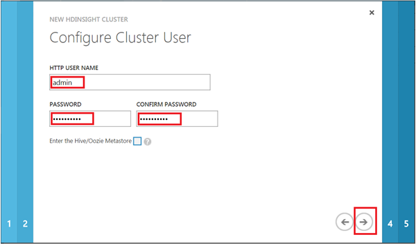

<properties 
    pageTitle="Hadoop Cluster für das Team Daten Wissenschaft Prozess anpassen | Microsoft Azure" 
    description="Beliebte Python Module in benutzerdefinierten Azure HDInsight Hadoop Cluster zur Verfügung gestellt."
    services="machine-learning" 
    documentationCenter="" 
    authors="bradsev" 
    manager="jhubbard" 
    editor="cgronlun"  />

<tags 
    ms.service="machine-learning" 
    ms.workload="data-services" 
    ms.tgt_pltfrm="na" 
    ms.devlang="na" 
    ms.topic="article" 
    ms.date="09/19/2016" 
    ms.author="hangzh;bradsev" />

# Anpassen von Azure HDInsight Hadoop Zuordnungseinheiten für das Team Daten Wissenschaft Prozess 

In diesem Artikel beschrieben, wie einen HDInsight Hadoop Cluster anpassen, nach der Installation von 64-Bit-Anaconda (Python 2.7) auf den einzelnen Knoten Wenn Cluster als HDInsight-Dienst bereitgestellt wird. Es wird gezeigt, wie die Headnode um benutzerdefinierte Aufträge zum Cluster übermitteln zugreifen. Diese Anpassung macht viele beliebter Python Module, die in Anaconda bequem verfügbar zur Verwendung in benutzerdefinierten Funktionen (Functions, UDFs) enthalten sind, die Struktur Datensätze im Cluster verarbeitet vorgesehen sind. Die Verfahren in diesem Szenario verwendeten Anweisungen finden Sie unter [Struktur Abfragen zu übermitteln](machine-learning-data-science-move-hive-tables.md#submit).

Klicken Sie im Menü unten Links zu Themen zum Einrichten der verschiedenen Wissenschaft-Umgebungen durch das [Team Daten Wissenschaft Prozess (TDSP)](data-science-process-overview.md)verwendet werden.

[AZURE.INCLUDE [data-science-environment-setup](../../includes/cap-setup-environments.md)]

## Anpassen von Azure HDInsight Hadoop Cluster

Zum Erstellen eines angepassten HDInsight Hadoop Clusters müssen Benutzer melden Sie sich bei [**Klassischen Azure-Portal**](https://manage.windowsazure.com/), klicken Sie in der unteren linken Ecke auf **neu** und dann auswählen DATA SERVICES-HDINSIGHT > -> **Benutzerdefinierte erstellen** , um das Fenster **Cluster Details** anzuzeigen. 

Geben Sie den Namen der Cluster auf Seite 1 der Konfiguration erstellt werden, und nehmen Sie Standardwerte für andere Felder. Klicken Sie auf den Pfeil, um zur nächsten Konfigurationsseite zu wechseln. 

Eingabemethoden Sie auf Seite 2-Konfiguration die Anzahl der **DATENKNOTEN**, wählen Sie das **REGION/virtuellen Netzwerk**, und wählen Sie die Größe des **Kopf Knoten** und den **Knoten Daten**aus. Klicken Sie auf den Pfeil, um zur nächsten Konfigurationsseite zu wechseln.

>[AZURE.NOTE] Die **REGION/virtuellen Netzwerk** verfügt in der Region des Speicherkontos identisch sein, der für den HDInsight Hadoop Cluster verwendet werden. Andernfalls wird im vierten Konfigurationsseite Speicher-Konto, das der Benutzer verwenden möchten nicht in der Dropdownliste mit den **Kontonamen**angezeigt.

Geben Sie auf Seite 3-Konfiguration für den Cluster HDInsight Hadoop einen Benutzernamen und ein Kennwort. Wählen Sie die _EINGABETASTE, die Struktur/Oozie Metastore_ **keine** . Klicken Sie dann auf den Pfeil, um zur nächsten Konfigurationsseite zu wechseln. 

Geben Sie auf Seite 4 Konfiguration Speicher den Namen des Kontos, der standardmäßige Container der HDInsight Hadoop Cluster aus. Wenn Benutzer _standardmäßige Container erstellen_ in der Dropdownliste **STANDARDMÄßIGE CONTAINER** auswählen, wird ein Container mit demselben Namen wie dem Cluster erstellt. Klicken Sie auf den Pfeil, um zur letzten Konfigurationsseite wechseln.

Klicken Sie auf der letzten Seite der **Skript-Aktionen** -Konfiguration auf die Schaltfläche **Skriptaktion hinzufügen** , und füllen Sie die Textfelder mit den folgenden Werten.
 
* **NAME** - eine beliebige Zeichenfolge als Namen für diese Skriptaktion. 
* **Knotentyp** - auswählen **alle Knoten**. 
* **Skript-URI** - *http://getgoing.blob.core.windows.net/publicscripts/Azure_HDI_Setup_Windows.ps1* 
    * *Publicscripts* ist ein öffentlichen Container im Speicher-Konto 
    * *Getgoing* , die wir verwenden, um das Freigeben von PowerShell-Skript-Dateien, um Benutzer Arbeit in Azure zu erleichtern. 
* **Parameter** - (leer lassen)

Klicken Sie abschließend auf das Häkchen, um das Erstellen von angepassten HDInsight Hadoop Cluster zu starten. 

## Greifen Sie auf den Kopf Knoten Hadoop Cluster

Benutzer müssen Remotezugriff auf Hadoop Cluster in Azure aktivieren, bevor sie den am Knoten im Cluster Hadoop bis RDP zugreifen können. 

1. Melden Sie sich der [**Klassischen Azure-Portal**](https://manage.windowsazure.com/), wählen Sie auf der linken Seite **HDInsight** aus, wählen Sie Ihren Cluster Hadoop aus der Liste der Cluster, klicken Sie auf die Registerkarte **Konfiguration** , und klicken Sie dann auf das **Aktivieren der REMOTE** -Symbol am unteren Rand der Seite.
    
    

2. Klicken Sie im Fenster **Remotedesktop konfigurieren** Geben Sie die Felder Benutzername und Kennwort ein, und wählen Sie das Ablaufdatum für den Remotezugriff. Klicken Sie dann auf das Häkchen, um den Remotezugriff auf den am Knoten des Hadoop Cluster zu aktivieren.

    
    
>[AZURE.NOTE] Benutzername und Kennwort für den Remotezugriff sind nicht den Benutzernamen und das Kennwort, das Sie verwenden, wenn Sie den Hadoop Cluster erstellt haben. Hierbei handelt es sich um einen separaten Satz von Anmeldeinformationen. Darüber hinaus muss das Ablaufdatum des remote-Zugriffs innerhalb von 7 Tagen ab dem aktuellen Datum sein.

Nachdem Remotezugriff aktiviert ist, klicken Sie auf **Verbinden** am unteren Rand der Seite, um remote in den am Knoten. Sie melden Sie sich bei der am Knoten im Cluster Hadoop durch Eingabe der Anmeldeinformationen für den Remotezugriff auf Benutzer, den Sie zuvor angegeben haben.

Die nächsten Schritte im erweiterten Analytics Prozess in der [Teamwebsite Daten Wissenschaft Prozess (TDSP)](https://azure.microsoft.com/documentation/learning-paths/cortana-analytics-process/) zugeordnet sind und Schritte, die Verschieben von Daten in HDInsight, verarbeiten und dort Vorbereitung Learning aus den Daten mit den Azure Computer vertraut machen (Beispiel) einschließen.

Informationen Sie, [wie Abfragen Struktur und übermitteln Sie](machine-learning-data-science-move-hive-tables.md#submit) Anweisungen zum Module Python zugreifen, die in Anaconda am Knoten der Cluster in benutzerdefinierten Funktionen (Functions, UDFs) enthalten sind, die zum Verarbeiten von Struktur Datensätzen gespeichert, die im Cluster verwendet werden.

 
