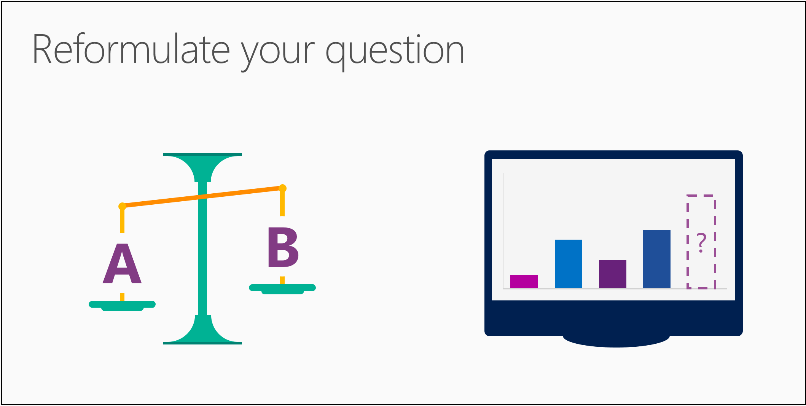

<properties
   pageTitle="Stellen Sie eine Frage beantworten können Sie Sie mit Daten - Formulierung Fragen | Microsoft Azure"
   description="Erfahren Sie, wie Daten Wissenschaft Frage in Daten Wissenschaft für Anfänger video 3 zu erstellen. Enthält einen Vergleich der Klassifizierung und Regression Fragen."
   keywords="Daten Wissenschaft Fragen, Fragen, Regression Fragen, Fragen zur Formulierung, scharfen Frage"
   services="machine-learning"
   documentationCenter="na"
   authors="cjgronlund"
   manager="jhubbard"
   editor="cjgronlund"/>

<tags
   ms.service="machine-learning"
   ms.devlang="na"
   ms.topic="article"
   ms.tgt_pltfrm="na"
   ms.workload="na"
   ms.date="10/20/2016"
   ms.author="cgronlun;garye"/>

# Stellen Sie eine Frage, die Sie mit Daten beantworten können

## Video 3: Daten Wissenschaft Anfänger Investition ohne Finanzierungskosten

Erfahren Sie, wie Daten für Wissenschaft Frage in Daten Wissenschaft für Anfänger video 3 zu erstellen. Dieses Video enthält einen Vergleich der Fragen für Klassifizierung und Regression Algorithmen.

Wenn Sie die Reihe optimal nutzen, schauen Sie sich alle. [Wechseln Sie zu der Liste von videos](#other-videos-in-this-series)

> [AZURE.VIDEO data-science-for-beginners-ask-a-question-you-can-answer-with-data]

## Weitere Videos in dieser Reihe

*Daten Wissenschaft für Anfänger* ist eine schnelle Einführung Daten Wissenschaft in fünf kurzen Videos an.

  * Video 1: [5 Fragen Daten Wissenschaft Antworten](machine-learning-data-science-for-beginners-the-5-questions-data-science-answers.md) *(5 min 14 Sekunden)*
  * Video 2: [sind die Daten für Wissenschaft Daten bereit?](machine-learning-data-science-for-beginners-is-your-data-ready-for-data-science.md) *(4 min 56 Sekunden)*
  * Video 3: Stellen Sie eine Frage, die Sie mit Daten beantworten können
  * Video 4: [Eine Antwort mit einem einfachen Modell Vorhersagen](machine-learning-data-science-for-beginners-predict-an-answer-with-a-simple-model.md) *(7 min 42 sec)*
  * Video 5: [Gesprächspartner Arbeit zum Ausführen von Wissenschaft Daten kopieren](machine-learning-data-science-for-beginners-copy-other-peoples-work-to-do-data-science.md) *(3 min 18 Sekunden)*

## Transkript: Stellen Sie eine Frage, die Sie mit Daten beantworten können

Willkommen Sie bei der dritten Video in der Reihe "Daten Wissenschaft für Anfänger".  

In diesen Termin erhalten Sie einige Tipps für die Formulierung einer Frage, die Sie mit Daten beantworten können.

Möglicherweise erhalten Sie weitere außerhalb dieses Video an, wenn Sie sich zuerst in dieser Reihe in den beiden früheren Videos ansehen: "können Sie die Daten für Wissenschaft 5 Fragen beantworten," und "Ist Ihre Daten sind für Wissenschaft Daten bereit?"

## Stellen Sie eine Frage scharfe

Wir haben bereits wie Wissenschaft Daten (sogenannte Kategorien oder Etiketten) Namen und Zahlen einsetzen, um eine Antwort auf eine Frage Vorhersagen wurde. Jedoch nicht nur eine Frage; Es werden muss eine *scharfen Frage.*

Eine unklare Frage muss nicht mit einem Namen oder einer Zahl beantwortet werden. Eine Frage scharfe muss.

Stellen Sie sich, dass Sie eine magische nach dazu mit einer Steinzeit gefunden haben, wer wahrheitsgemäß eine Frage beantwortet wird, die bitten Sie Sie. Aber es eine Makrosprachen Steinzeit ist, und er wird versuchen, seine Antwort als unklare und verwirrend zu machen, wie er mit abwesend erzielen lässt. Möchten Sie ihn mit einer Frage also nahtlose anheften ab, dass er kann nicht unterstützen, aber Ihnen mitteilen, was Sie wissen möchten.

Wenn Sie eine Frage unklare, wie "Was geht mit meinem Stock auftritt?", die Steinzeit möglicherweise annehmen, "der Preis ändert sich" wollten. Dies ist eine Antwort Nachrichten, aber es ist nicht sehr hilfreich.

Aber wenn Sie eine Frage scharfen, wie "Was Meine Aktie Verkaufspreis nächste Woche werden?", die Steinzeit kann nicht helfen Ihnen aber sehr eine bestimmten wollten beantworten und einem Verkaufspreis Vorhersagen.

## Beispiele für Ihre Antwort: Adressieren von Daten

Nachdem Sie Ihre Frage aufstellen, überprüfen Sie feststellen, ob Sie Beispiele für die Antwort in den Daten ist.

Ist unsere Frage "Was Meine Aktie Verkaufspreis nächste Woche sein?" Klicken Sie dann müssen wir sicherstellen, dass unsere Daten den Verlauf Aktienkursen enthält.

Ist unsere Frage "welche Auto in meinem Flotte aufgewendet wird zum ersten Mal fehlschlagen?" Klicken Sie dann müssen wir sicherstellen, dass unsere Daten Informationen zu vorherigen Fehlern enthält.

Diese Beispiele Antworten werden als ein Ziel bezeichnet. Ein Ziel ist, was wir versuchen, zu zukünftigen Datenpunkte, Vorhersagen, ob es sich um eine Kategorie oder eine Zahl ist.

Wenn Sie alle Zieldaten haben, müssen Sie einige abrufen. Sie können keine zu Ihrer Frage ohne das werden.

## Ihre Frage reformulate

Manchmal können Sie Ihre Frage um ein hilfreicher Antwort erhalten formulieren.

Die Frage "Ist dieser Daten Punkt A oder B?" Schätzt die Kategorie (oder Name oder Bezeichnung) von einem Element. Wenn sie annehmen möchten, verwenden wir eine *Einstufung Algorithmus*.

Die Frage "Wie viel?" oder "Wie viele?" Vorhersagen ein Betrags. Wenn sie annehmen möchten verwenden wir eine *Regression-Algorithmus*.

Um anzuzeigen, wie wir diese transformieren können, sehen wir uns die Frage "welche News Geschichte ist auf diesen Reader am interessantesten?" Sie gefragt werden, der eine einzelne Auswahl aus vielen Wahlmöglichkeiten - Vorhersage Zählung ausnehmen "Diese A oder B oder C oder D ist?" - und einen Einstufung Algorithmus verwenden.

Aber diese Frage ist möglicherweise leichter zu antworten, wenn Sie es als umformulieren "wie interessante jeden Textabschnitt in dieser Liste auf diesen Reader ist?" Jetzt können Sie geben jeder Artikel einen numerischen Wert, und es ist dann einfach zu identifizieren den höchsten Punktzahl Artikel. Dies ist eine der Klassifizierung Frage in einer Regressionsanalyse Frage umformulieren oder wie viel?

Wie aufgefordert werden, dass eine Frage ein Hinweis auf welcher Algorithmus ist, können Sie eine Antwort erhalten.

Elementname, dass bestimmte Familien Algorithmen – wie in News Geschichte Beispiel - eng miteinander verwandt sind. Sie können Ihre Frage stellen, um den Algorithmus verwenden, der Ihnen die besonders hilfreiche Antwort bietet reformulate.

Aber, besonders wichtig ist müssen Sie diese scharfen Frage - Frage beantworten, die Sie mit Daten beantworten können. Ein, und achten Sie darauf, dass Sie die richtigen Daten, die sie beantwortet haben.

Wir haben bereits über einige Grundlagen für eine Frage, dass Sie mit Daten beantworten können.

Achten Sie darauf, dass die anderen Videos in "Daten Wissenschaft für Anfänger" von Microsoft Azure maschinellen Learning Auschecken.

## Nächste Schritte

  * [Versuchen Sie eine erste Daten Wissenschaft dies mit maschinellen Learning Studio](machine-learning-create-experiment.md)
  * [Einführung in Computer Schulung auf Microsoft Azure](machine-learning-what-is-machine-learning.md)
