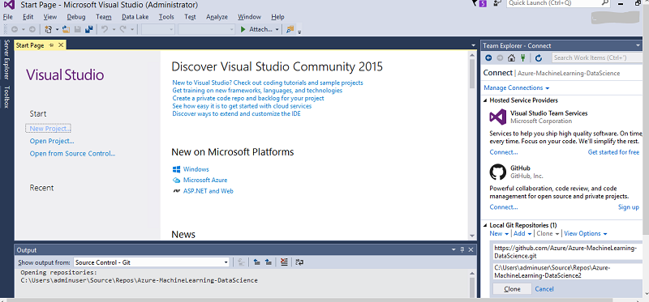
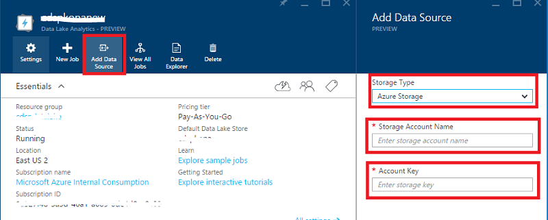
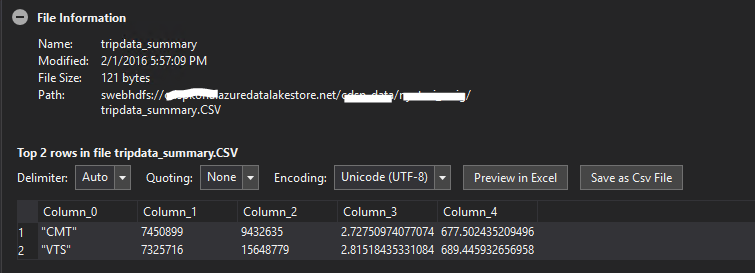
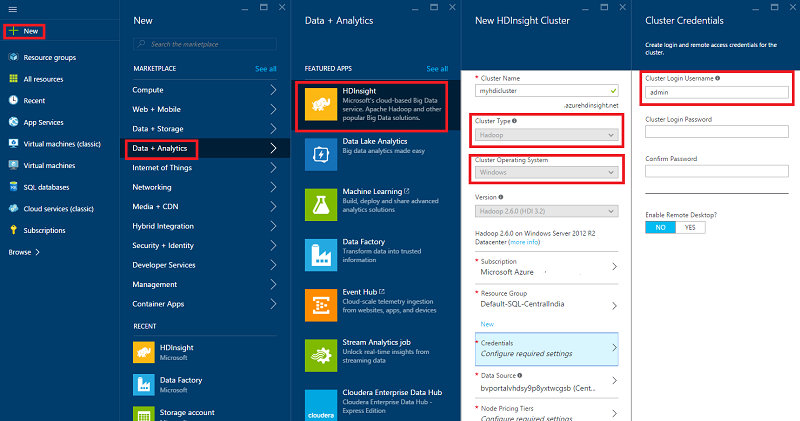
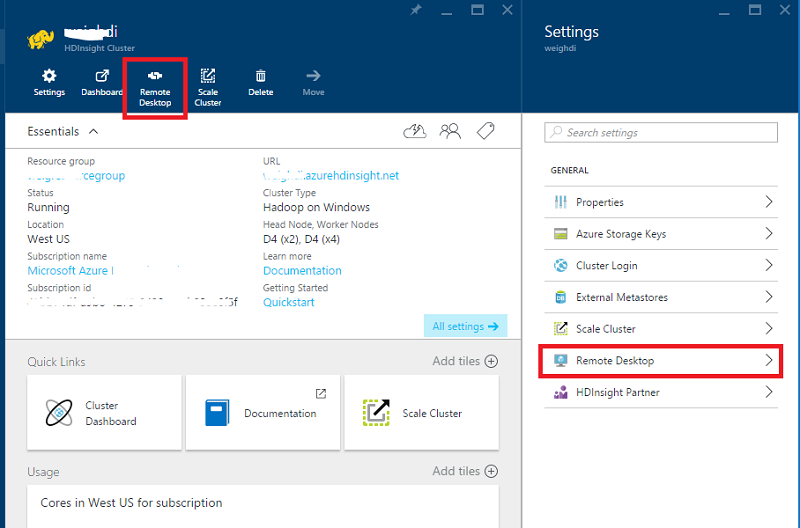
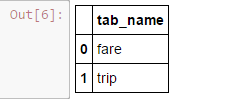
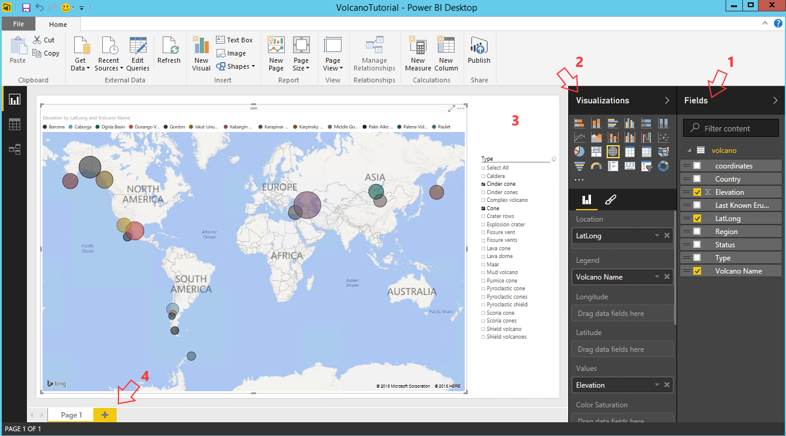

<properties
    pageTitle="Zehn Punkte können Sie über die Daten Wissenschaft virtuellen Computern ausführen | Microsoft Azure"
    description="Führen Sie verschiedene Durchsuchen von Daten und Modellierung Vorgang auf die Daten für Wissenschaft virtuellen Computern an."
    services="machine-learning"
    documentationCenter=""
    authors="bradsev"
    manager="jhubbard"
    editor="cgronlun"  />

<tags
    ms.service="machine-learning"
    ms.workload="data-services"
    ms.tgt_pltfrm="na"
    ms.devlang="na"
    ms.topic="article"
    ms.date="08/29/2016"
    ms.author="gokuma;weig;bradsev" />

# <a name="ten-things-you-can-do-on-the-data-science-virtual-machine"></a>Zehn Punkte, die Sie über die Daten Wissenschaft virtuellen Computern ausführen können

Der Microsoft Daten Wissenschaft virtuellen Computern (DSVM) ist eine leistungsfähige Daten Wissenschaft Entwicklung-Umgebung, die Sie verschiedene Daten durchsuchen und Modellierung Aufgaben ausführen kann. Die Umgebung enthält bereits erstellt und mit mehreren beliebte Analytics Datentools, die mit Ihrer Analyse für lokal schnellen Einstieg erleichtern gebündelten Cloud oder Hybrid Bereitstellungen. Der DSVM arbeitet eng mit vielen Azure-Diensten und kann zu lesen ist und Verarbeiten von Daten, die bereits auf Azure in Azure SQL-Data Warehouse, Azure Daten Lake, Azure-Speicher oder in DocumentDB gespeichert ist. Sie können auch andere Analytics-Tools, wie etwa Azure maschinellen Lern- und Azure Data Factory nutzen.


In diesem Artikel führen wir Sie durch Verwendung von Ihrer DSVM zum Ausführen von verschiedenen Datentasks Wissenschaft und interagieren mit anderen Diensten Azure. Hier einige der Dinge, die Sie auf der DSVM erledigen können:

1. Durchsuchen von Daten und entwickeln Modelle lokal auf die mithilfe von Microsoft R Server Python DSVM
2. Verwenden Sie ein Notizbuch Jupyter so experimentieren Sie mit Ihrer Daten in einem Browser Python 2, 3 Python, Microsoft R mithilfe eine bereit Enterprise-Version von R richtet sich Skalierbarkeit und Leistung
3. Prozessen umsetzen Sie Modelle erstellt R und Python auf Azure maschinellen Learning verwenden, damit Clientanwendungen Ihrer Modelle verwenden eine einfache Webdienstschnittstelle zugreifen können
4. Verwalten Sie Ihrer Azure Ressourcen mithilfe von Azure-Portal oder Powershell
5. Erweitern Sie Speicherplatz verschwendet und Freigeben von umfangreichen Datasets / Fehlercode über Ihr gesamtes Team durch Erstellen einer Azure Dateispeicher als Laufwerk auf Ihre DSVM bereitgestellt werden können
6. Freigeben von Code mit Ihrem Team mit Github und Zugriff auf Ihre Repository mithilfe der integrierten Git Clients - Git Bash, Git Benutzeroberfläche.
7. Zugriff auf verschiedenen Azure Daten und Analytics Dienste wie Azure Blob-Speicher Azure Daten Lake, Azure HDInsight (Hadoop), Azure DocumentDB, Azure SQL-Data Warehouse und Datenbanken
8. Erstellen von Berichten und Dashboards mithilfe der Power BI-Desktop auf die DSVM vorinstalliert und Bereitstellen von sie in der cloud
9. Dynamisch skalieren Sie Ihrer DSVM an Ihre Anforderungen Projekt
10. Installieren Sie zusätzliche Tools auf Ihre virtuellen Computern   


>[AZURE.NOTE] Weitere Verwendung wird für viele die zusätzlichen Speicher und Analytics Datendienste in diesem Artikel beschriebenen anfallen. Lizenzinformationen finden Sie die [Preise Azure](https://azure.microsoft.com/pricing/) Seite Details.


**Erforderliche Komponenten**

- Sie benötigen ein Azure-Abonnement. Sie können für eine kostenlose Testversion [hier](https://azure.microsoft.com/free/)registrieren.

- Anweisungen für die Bereitstellung eines Daten Wissenschaft virtuellen Computers auf dem Portal Azure sind unter [Erstellen eines virtuellen Computers](https://portal.azure.com/#create/microsoft-ads.standard-data-science-vmstandard-data-science-vm)verfügbar.

## <a name="1-explore-data-and-develop-models-using-microsoft-r-server-or-python"></a>1 Untersuchen von Daten und entwickeln Modelle mithilfe von Microsoft R Server oder Python

Sprachen wie R und Python können Sie Ihre Daten Analytics direkt auf die DSVM führen.

Für R können Sie eine IDE "Revolution R Enterprise 8.0" aufgerufen, der auf das Startmenü oder den Desktop gefunden werden kann. Microsoft hat zusätzliche Bibliotheken auf der geöffneten Quelle/CRAN-R skalierbare Analytics und die Möglichkeit zum Analysieren von Daten, die größer als die zulässige Aktionen parallel aufgeteilter Analyse Arbeitsspeichergröße aktivieren bereitgestellt. Sie können auch eine R IDE Ihrer Wahl wie [RStudio](https://www.rstudio.com/products/rstudio-desktop/)installieren.

Python können eine IDE wie Visual Studio Community Edition Sie die die Python-Tools für Visual Studio (PTVS) Erweiterung vorinstalliert wurde. Standardmäßig ist nur eine einfache Python 2.7 PTVS (ohne einen Analytics Formularbibliothek wie SciKit, Pandas) konfiguriert. Um Anaconda Python 2.7 und 3.5 aktivieren möchten, müssen Sie die folgenden Aktionen ausführen:

* Erstellen von benutzerdefinierten Umgebungen für jede Version durch Navigieren auf **Tools** -> **Python Tools** -> **Python-Umgebungen** , und klicken Sie dann auf "**+ benutzerdefinierte**" in Visual Studio 2015 Community Edition
* Geben Sie eine Beschreibung ein, und richten Sie die Umgebung Präfix Pfade als *c:\anaconda* für Anaconda Python 2.7 oder *c:\anaconda\envs\py35* Anaconda Python 3.5
* Klicken Sie auf **Automatische Erkennung** und dann **Übernehmen** zum Speichern der Umgebung.

Hier sind, wie die Installation der benutzerdefinierten Umgebung in Visual Studio aussieht.


Finden Sie in der [Dokumentation PTVS](https://github.com/Microsoft/PTVS/wiki/Selecting-and-Installing-Python-Interpreters#hey-i-already-have-an-interpreter-on-my-machine-but-ptvs-doesnt-seem-to-know-about-it) Weitere Details zum Erstellen von Python Umgebungen.

Nun werden Sie zum Erstellen eines neuen Projekts von Python ausgerichtet. Navigieren Sie zu der **Datei** -> **neu** -> **Project** -> **Python** , und wählen Sie den Typ des zu erstellenden Python-Anwendung. Die Python-Umgebung, die für das aktuelle Projekt können Sie auf die gewünschte Version (Anaconda 2.7 oder 3.5) festlegen: der **Python-Umgebung**Maustaste **Hinzufügen/Entfernen Python Umgebungen**auswählen, und wählen Sie dann auf die gewünschte-Umgebung, mit dem Projekt zugeordnet werden soll. Sie können weitere Informationen zum Arbeiten mit PTVS auf der Seite der [Dokumentation](https://github.com/Microsoft/PTVS/wiki) Produkt suchen.

## <a name="2-using-a-jupyter-notebook-to-explore-and-model-your-data-with-python-or-r"></a>2. mithilfe eines Notizbuchs Jupyter untersuchen und Modellieren von Daten mit Python oder R

Das Notizbuch Jupyter ist eine leistungsfähige Umgebung, die eine browserbasierte "" für das Durchsuchen von Daten und Modellierung die enthält. Sie können in einem Notizbuch Jupyter Python 2, 3 Python oder R (Open Source und dem Microsoft-Server R) verwenden.

So starten Sie das Symbol für das Menü Start auf Jupyter Notizbuch / Desktopsymbol mit dem Titel **Jupyter Notizbuch**. Klicken Sie auf der DSVM können Sie auch zu durchsuchen "Https://localhost:9999 /" auf das Notizbuch Jupiter zugreifen. Wenn sie zur Eingabe eines Kennworts aufgefordert werden, verwenden Sie Anweisungen im Abschnitt ***So erstellen Sie ein sicheres Kennwort serverseitig Notizbuch Jupyter*** des Themas [Bereitstellen von der Microsoft Data Wissenschaft virtuellen Computern](machine-learning-data-science-provision-vm.md) Zugriff auf das Notizbuch Jupyter ein sicheres Kennwort erstellen. 

Nachdem Sie das Notizbuch geöffnet haben, sehen Sie ein Verzeichnis mit wenigen Beispiel Notizbücher, die vorkonfigurierten in der DSVM sind. Jetzt können Sie:

- Klicken Sie auf das Notizbuch, um den Code anzuzeigen.
- Führen Sie jede Zelle, indem Sie **UMSCHALT + EINGABETASTE**drücken.
- Führen Sie das gesamte Notizbuch, indem Sie auf die **Zelle** -> **Ausführen**
- Erstellen eines neuen Notizbuchs auf das Symbol Jupyter (linker oberer Ecke), und klicken Sie dann indem **neu** auf die Schaltfläche rechts und wählen Sie dann auf die Sprache Notizbuch (auch bekannt als Kernels).   


>[AZURE.NOTE] Zurzeit unterstützt wir Python 2.7, Python 3.5 und R. R Kernel unterstützt das Programmieren in sowohl Open Source R als auch das Unternehmen skalierbare Microsoft R Server.   


Nachdem Sie das Notizbuch, das Sie auswerten können sind werden Ihre Daten erstellen des Modells, testen Sie das Modell mit den gewünschten Bibliotheken.


## <a name="3-build-models-using-r-or-python-and-operationalize-them-using-azure-machine-learning"></a>3. erstellen Sie mithilfe von R oder Python Modelle und Prozessen umsetzen mit Azure maschinellen Schulung

Nachdem Sie erstellt haben, und Ihr Modell überprüft besteht der nächste Schritt in der Regel in Betrieb bereitzustellen. Dies ermöglicht Ihrer Clientanwendungen, die Vorhersagen Modell auf ein Echtzeit oder auf Basis einer Stapel-Modus aufzurufen. Azure maschinellen Learning stellt ein Verfahren, um ein Modell erstellt entweder R oder Python Prozessen umsetzen.

Wenn Sie Ihr Modell Azure Computer interessante Prozessen umsetzen, wird ein Webdienst verfügbar gemacht, durch die Clients, die in Eingabeparameter übergeben und Empfangen von Vorhersagen aus dem Modell als Ausgaben REST anrufen.   


>[AZURE.NOTE] Wenn Sie noch nicht angemeldet haben, für die AzureML, erhalten Sie einen kostenlosen Arbeitsbereich oder einem standard-Arbeitsbereich, besuchen die Homepage [AzureML Studio](https://studio.azureml.net/) und durch Klicken auf "Erste Schritte".   


### <a name="build-and-operationalize-python-models"></a>Erstellen und Prozessen umsetzen Python Datenmodellen

Hier ist ein Codeausschnitt entwickelt in einem Python Jupyter Notizbuch, bei dem ein einfaches Modell mithilfe der Bibliothek SciKit Informationen erstellt.

    #IRIS classification
    from sklearn import datasets
    from sklearn import svm
    clf = svm.SVC()
    iris = datasets.load_iris()
    X, y = iris.data, iris.target
    clf.fit(X, y)

Die Methode zum Bereitstellen von Ihrer Python-Modelle auf Azure maschinellen Learning verwendet umgebrochen wird die Vorhersage des Modells in einer Funktion und durch wird es mit Attributen, die von der integrierten Azure maschinellen Learning Python Bibliothek bereitgestellt, die Ihre Azure maschinellen Learning Workspace-ID, API-Taste und die Eingabe zu kennzeichnen und Parameter zurückkehren.  

    from azureml import services
    @services.publish(workspaceid, auth_token)
    @services.types(sep_l = float, sep_w = float, pet_l=float, pet_w=float)
    @services.returns(int) #0, or 1, or 2
    def predictIris(sep_l, sep_w, pet_l, pet_w):
    inputArray = [sep_l, sep_w, pet_l, pet_w]
    return clf.predict(inputArray)

Ein Client kann nun den Webdienst anrufen. Es gibt Komfort Wrapper, die bereit, die die REST-API Anfragen zu erstellen. Hier ist ein Beispielcode in den Webdienst nutzen ein.

    # Consume through web service URL and keys
    from azureml import services
    @services.service(url, api_key)
    @services.types(sep_l = float, sep_w = float, pet_l=float, pet_w=float)
    @services.returns(float)
    def IrisPredictor(sep_l, sep_w, pet_l, pet_w):
    pass

    IrisPredictor(3,2,3,4)


>[AZURE.NOTE] Die Bibliothek Azure maschinellen Learning wird derzeit nur auf Python 2.7 unterstützt.   


### <a name="build-and-operationalize-r-models"></a>Erstellen und Prozessen umsetzen R Datenmodelle

Sie können R Modelle auf Daten Wissenschaft virtuellen Computers oder an anderer Stelle, auf Azure maschinellen Learning in einer Weise, die ähnelt dem Vorgehensweise für Python erstellt bereitstellen. Ihre Schritte aus:

- Erstellen Sie eine Datei settings.json als unten, um Ihren Arbeitsbereich-ID und das autorisierende angeben token.
- Erstellen eines Wrappers aus, für des Modells der Funktion Vorhersagen.
- Rufen Sie ```publishWebService``` in der Bibliothek Azure maschinellen Schulung, in der Funktion Wrapper zu übergeben.  

Hier sind die Verfahren und Codeausschnitte, die zum Einrichten, erstellen, veröffentlichen und Nutzen eines Modells als Webdienst Azure Computer interessante verwendet werden können.

#### <a name="setup"></a>Setup

1.  Installieren Sie das Paket AzureML R durch Eingeben der ```install.packages("AzureML")``` in Revolution R Enterprise 8.0 IDE- oder Ihre IDE R.
2.  Laden Sie RTools von [hier](https://cran.r-project.org/bin/windows/Rtools/)aus. Sie benötigen das Zip-Programm, in dem Pfad (und benannte zip.exe) zu Ihrem Paket R in AzureML Prozessen umsetzen.
3.  Erstellen einer settings.json Datei unter einem Verzeichnis namens ```.azureml``` unter Ihrem home-Verzeichnis, und geben Sie die Parameter aus dem Arbeitsbereich Azure ML:

Settings.JSON Dateistruktur:

    {"workspace":{
    "id"                  : "ENTER YOUR AZUREML WORKSPACE ID",
    "authorization_token" : "ENTER YOUR AZUREML AUTH TOKEN"
    }}


#### <a name="build-a-model-in-r-and-publish-it-in-azure-ml"></a>Erstellen eines Modells in R und veröffentlichen Sie ihn in Azure ML

    library(AzureML)
    ws <- workspace(config="~/.azureml/settings.json")

    if(!require("lme4")) install.packages("lme4")
    library(lme4)
    set.seed(1)
    train <- sleepstudy[sample(nrow(sleepstudy), 120),]
    m <- lm(Reaction ~ Days + Subject, data = train)

    # Define a prediction function to publish based on the model:
    sleepyPredict <- function(newdata){
        predict(m, newdata=newdata)
    }

    ep <- publishWebService(ws, fun = sleepyPredict, name="sleepy lm", inputSchema = sleepstudy, data.frame=TRUE)

#### <a name="consume-the-model-deployed-in-azure-ml"></a>Nutzen Sie das Modell in Azure ML bereitgestellt

Wenn Sie das Modell aus einer Clientanwendung nutzen zu können, wir Azure maschinellen Learning Bibliothek zum Nachschlagen von Namen mithilfe des veröffentlichten Webdiensts verwenden die `services` API anrufen, um den Endpunkt zu bestimmen. Sie einfach Aufrufen der `consume` -Funktion und in den Datenrahmen zu regressionsgleichung werden übergeben.
Im folgende Code wird verwendet, um das Modell als Webdienst Azure maschinellen Learning veröffentlicht nutzen.


    library(AzureML)
    library(lme4)
    ws <- workspace(config="~/.azureml/settings.json")

    s <-  services(ws, name = "sleepy lm")
    s <- tail(s, 1) # use the last published function, in case of duplicate function names

    ep <- endpoints(ws, s)

    # OK, try this out, and compare with raw data
    ans = consume(ep, sleepstudy)$ans

Weitere Informationen zu der Bibliothek Azure maschinellen Learning R finden Sie [hier](https://cran.r-project.org/web/packages/AzureML/AzureML.pdf).


## <a name="4-administer-your-azure-resources-using-azure-portal-or-powershell"></a>4. verwalten Sie Azure Ressourcen mithilfe von Azure-Portal oder Powershell

Die DSVM nicht nur ermöglicht es Ihnen, Ihre Lösung Analytics lokal des virtuellen Computers zu erstellen, sondern auch ermöglicht Ihnen den Zugriff auf Microsoft Azure Cloud Services auf. Azure bietet mehrere berechnen, Speicher, Analytics Datendienste und andere Dienste, die Sie verwalten und aus Ihrer DSVM zugreifen können.

Zum Verwalten Ihrer Azure-Abonnement und Cloud-Ressourcen können Sie Ihren Browser verwenden und zeigen Sie auf das [Portal Azure](https://portal.azure.com). Sie können auch Azure Powershell zum Verwalten Ihrer Azure-Abonnement und Ressourcen über ein Skript verwenden.
Sie können Azure Powershell verwenden Sie eine Verknüpfung auf dem Desktop oder über das Startmenü mit dem Titel "Microsoft Azure Powershell" ausführen. Lesen Sie [Microsoft Azure Powershell-Dokumentation](../powershell-azure-resource-manager.md) Weitere Informationen wie Sie Ihre Azure-Abonnement und Ressourcen mithilfe von Windows Powershell-Skripts verwalten können.


## <a name="5-extend-your-storage-space-with-a-shared-file-system"></a>5. Speicherplatz verschwendet mit einem freigegebenen Dateisystem zu erweitern

Daten Wissenschaftler können große Datasets, Code oder andere Ressourcen innerhalb des Teams freigeben. Der DSVM selbst verfügt über 70GB verfügbarer Speicherplatz Um Ihre Speicherplatz zu erweitern, können Sie die Datei Azure Service und entweder auf die DSVM bereitstellen oder darauf über eine REST-API zugreifen.   


>[AZURE.NOTE] Der maximale Speicher der Freigabe Azure File Service ist 5TB und einzelne maximale Dateigröße beträgt 1TB.   


Azure Powershell können zum Erstellen einer Azure File Service freigeben. So sieht das Skript für die Ausführung unter Azure PowerShell Azure Service Dateifreigabe erstellen aus.

    # Authenticate to Azure.
    Login-AzureRmAccount
    # Select your subscription
    Get-AzureRmSubscription –SubscriptionName "<your subscription name>" | Select-AzureRmSubscription
    # Create a new resource group.
    New-AzureRmResourceGroup -Name <dsvmdatarg>
    # Create a new storage account. You can reuse existing storage account if you wish.
    New-AzureRmStorageAccount -Name <mydatadisk> -ResourceGroupName <dsvmdatarg> -Location "<Azure Data Center Name For eg. South Central US>" -Type "Standard_LRS"
    # Set your current working storage account
    Set-AzureRmCurrentStorageAccount –ResourceGroupName "<dsvmdatarg>" –StorageAccountName <mydatadisk>

    # Create a Azure File Service Share
    $s = New-AzureStorageShare <<teamsharename>>
    # Create a directory under the FIle share. You can give it any name
    New-AzureStorageDirectory -Share $s -Path <directory name>
    # List the share to confirm that everything worked
    Get-AzureStorageFile -Share $s


Jetzt, da Sie eine Dateifreigabe Azure erstellt haben, können Sie es auf einem beliebigen virtuellen Computern in Azure bereitstellen. Es wird dringend empfohlen, dass der virtuellen Computer derselben Azure Data Center als das Speicherkonto Wartezeit und Daten durchstellen Gebühren zu vermeiden ist. Hier sind die Befehle, um das Laufwerk klicken Sie auf die DSVM bereitstellen, die auf Azure Powershell ausgeführt werden können.


    # Get storage key of the storage account that has the Azure file share from Azure portal. Store it securely on the VM to avoid prompted in next command.
    cmdkey /add:<<mydatadisk>>.file.core.windows.net /user:<<mydatadisk>> /pass:<storage key>

    # Mount the Azure file share as Z: drive on the VM. You can chose another drive letter if you wish
    net use z:  \\<mydatadisk>.file.core.windows.net\<<teamsharename>>


Jetzt können Sie dieses Laufwerk zugreifen, wie Sie ein normales Laufwerk des virtuellen Computers verwenden.

## <a name="6-share-code-with-your-team-using-github"></a>6. freigeben Sie Code mit Ihrem Team mit Github

Github ist ein Code Repository finden Sie auf eine Menge von Beispiel-Code und Quellen für verschiedene Tools Verwenden verschiedener Technologien, die von der Entwicklercommunity gemeinsam verwendet werden. Git verwendet als die Technologie zum Nachverfolgen und Speichern von Versionen der Codedateien. Github ist auch eine Plattform, können Sie Ihre eigenen Repository Code gemeinsam und in der Dokumentation Ihres Teams zu speichern, Versionskontrolle implementieren und auch steuern, wer Zugang zu anzeigen und eigene Notizen hinzufügen Code erstellen. Besuchen Sie der [Github Hilfe Seiten](https://help.github.com/) für Weitere Informationen zur Verwendung von Git. Sie können Github als eine der Methoden zur Zusammenarbeit mit Ihrem Team, entwickelt von der Community Code verwenden und mitwirken Code zurück, der Community.

Die DSVM wird bereits mit Clienttools auf beide Befehlszeile wie gut Benutzeroberfläche zum Zugriff auf Repositorys Github. Das Befehlszeile-Tool für die Arbeit mit Git und Github heißt Git Bash. Visual Studio installiert haben, klicken Sie auf der DSVM weist die Git Erweiterungen. Sie können für diese Tools auf das Startmenü und den Desktop Start Symbole suchen.

Zum Herunterladen von Code aus einem Github Repository Sie verwenden die ```git clone``` Befehl. Beispielsweise Daten Wissenschaft Repository in das aktuelle Verzeichnis von Microsoft veröffentlichten herunterladen können Sie den folgenden Befehl ausführen, nachdem Sie sich befinden ```git-bash```.

    git clone https://github.com/Azure/Azure-MachineLearning-DataScience.git

Führen Sie in Visual Studio den gleichen datenbeschriftungsreihe Vorgang. Der Screenshot unten wird gezeigt, wie Git und Github Tools in Visual Studio zugreifen.




Sie können weitere Informationen zur Verwendung von Git Arbeitens mit Ihrem Github Repository aus mehreren verfügbaren Ressourcen auf github.com suchen. Die [Spickzettel:](https://training.github.com/kit/downloads/github-git-cheat-sheet.pdf) ist eine hilfreiche Referenz.


## <a name="7-access-various-azure-data-and-analytics-services"></a>7. Zugriff auf die verschiedenen Azure Daten und Analytics-Dienste

### <a name="azure-blob"></a>Azure Blob

Azure Blob ist einer zuverlässigen, preisgünstige Cloud-Speicher für große und kleine Daten. Lassen Sie uns prüfen Sie, wie Azure Blob und Access-Daten in einer Azure Blob gespeicherten Daten verschoben werden können.

**Voraussetzung**

- **Erstellen Sie Ihre Azure Blob-Speicher-Konto aus [Azure-Portal](https://portal.azure.com)an.**


- Bestätigen, dass das vorinstalliert Befehlszeile AzCopy Tool an gefunden wird ```C:\Program Files (x86)\Microsoft SDKs\Azure\AzCopy\azcopy.exe```. Sie können das Verzeichnis mit den azcopy.exe der Pfad Umgebung Variablen vermeiden Sie den vollständigen Befehlspfad beim Ausführen dieser Tools hinzufügen. Weitere Informationen zu AzCopy Tool finden Sie in [AzCopy Dokumentation](../storage/storage-use-azcopy.md)

- Starten Sie das Tool Azure-Speicher-Explorer. Sie können aus [Microsoft Azure-Speicher-Explorer](http://storageexplorer.com/)heruntergeladen werden. 


**Verschieben von Daten aus virtueller Computer in Azure Blob: AzCopy**

Zum Verschieben von Daten zwischen Ihrem lokalen Dateien und Blob-Speicher können Sie AzCopy in Befehlszeile oder PowerShell verwenden:

    AzCopy /Source:C:\myfolder /Dest:https://<mystorageaccount>.blob.core.windows.net/<mycontainer> /DestKey:<storage account key> /Pattern:abc.txt

Ersetzen Sie **C:\myfolder** auf den Pfad die Datei gespeichert ist, **Mystorageaccount** auf den BLOB-Speicher-Kontonamen, **Mycontainer** auf den Containernamen, **kontoschlüssel Speicher** , um Ihre BLOB-Speicher Zugriffstaste ein. Sie können Ihre Anmeldeinformationen ein Konto Speicher [Azure](https://portal.azure.com)-Portal suchen.


Führen Sie AzCopy Befehl aus, in der PowerShell oder von einer Befehlszeile aus. So sieht einige Beispiel Verwendung von AzCopy Befehl aus:


    # Copy *.sql from local machine to a Azure Blob
    "C:\Program Files (x86)\Microsoft SDKs\Azure\AzCopy\azcopy" /Source:"c:\Aaqs\Data Science Scripts" /Dest:https://[ENTER STORAGE ACCOUNT].blob.core.windows.net/[ENTER CONTAINER] /DestKey:[ENTER STORAGE KEY] /S /Pattern:*.sql

    # Copy back all files from Azure Blob container to Local machine

    "C:\Program Files (x86)\Microsoft SDKs\Azure\AzCopy\azcopy" /Dest:"c:\Aaqs\Data Science Scripts\temp" /Source:https://[ENTER STORAGE ACCOUNT].blob.core.windows.net/[ENTER CONTAINER] /SourceKey:[ENTER STORAGE KEY] /S


Nachdem Sie Ihre AzCopy Befehl in einer Azure Blob kopieren ausführen, um sehen Sie Ihre Datei angezeigt wird, im Speicher-Explorer Azure in Kürze.


**Verschieben von Daten aus virtueller Computer in Azure Blob: Azure-Speicher-Explorer**

Sie können auch Daten aus der lokalen Datei auf Ihre virtuellen Computer mit dem Azure-Speicher-Explorer hochladen:

- Zum Hochladen von Daten zu einem Container, wählen Sie die Zielcontainer aus, und klicken Sie auf die Schaltfläche **Hochladen** .
- Klicken Sie auf die **...** rechts neben dem Feld **Dateien** , wählen Sie eine oder mehrere Dateien aus dem Dateisystem hochladen, und klicken Sie auf **Hochladen** , um die Dateien hochladen beginnen aus.


**Lesen von Daten aus Azure Blob: AML Reader-Modul**

Ein **Modul Daten importieren** können Sie in Azure maschinellen Learning Studio Daten aus Ihrem Blob gelesen.


**Lesen von Daten aus Azure Blob: Python ODBC**

**BlobService** Bibliothek können Sie Daten direkt aus Blob in einem Programm Jupyter Notizbuch oder einen neuen Python lesen.

Importieren Sie zunächst erforderliche Pakete:

    import pandas as pd
    from pandas import Series, DataFrame
    import numpy as np
    import matplotlib.pyplot as plt
    from time import time
    import pyodbc
    import os
    from azure.storage.blob import BlobService
    import tables
    import time
    import zipfile
    import random

Klicken Sie dann schließen Sie Ihre Anmeldeinformationen ein Azure Blob-Konto aus, und Lesen von Daten aus Blob:

    CONTAINERNAME = 'xxx'
    STORAGEACCOUNTNAME = 'xxxx'
    STORAGEACCOUNTKEY = 'xxxxxxxxxxxxxxxx'
    BLOBNAME = 'nyctaxidataset/nyctaxitrip/trip_data_1.csv'
    localfilename = 'trip_data_1.csv'
    LOCALDIRECTORY = os.getcwd()
    LOCALFILE =  os.path.join(LOCALDIRECTORY, localfilename)

    #download from blob
    t1 = time.time()
    blob_service = BlobService(account_name=STORAGEACCOUNTNAME,account_key=STORAGEACCOUNTKEY)
    blob_service.get_blob_to_path(CONTAINERNAME,BLOBNAME,LOCALFILE)
    t2 = time.time()
    print(("It takes %s seconds to download "+BLOBNAME) % (t2 - t1))

    #unzipping downloaded files if needed
    #with zipfile.ZipFile(ZIPPEDLOCALFILE, "r") as z:
    #    z.extractall(LOCALDIRECTORY)

    df1 = pd.read_csv(LOCALFILE, header=0)
    df1.columns = ['medallion','hack_license','vendor_id','rate_code','store_and_fwd_flag','pickup_datetime','dropoff_datetime','passenger_count','trip_time_in_secs','trip_distance','pickup_longitude','pickup_latitude','dropoff_longitude','dropoff_latitude']
    print 'the size of the data is: %d rows and  %d columns' % df1.shape

Als Datenrahmen Lesen der Daten in:


### <a name="azure-data-lake"></a>Azure Daten Lake

Azure Daten dem Speicher ist ein Repository hyper-Skala für big Data Analytics Auslastung und kompatible mit Hadoop Distributed Datei System (HDFS). In Kombination mit der Hadoop-Netz, und der Azure Daten dem Analytics. Wir zeigen, wie Sie Verschieben von Daten in den Azure Lake Datenspeicher und Azure Daten dem Analytics mit Analytics ausführen können.

**Voraussetzung**

- Erstellen Sie Ihre Azure Daten dem Analytics [Azure](https://portal.azure.com)-Portal an.


- Die **Azure dem Datentools** in **Visual Studio** finden Sie unter diesen [Link](https://www.microsoft.com/download/details.aspx?id=49504) ist auf der Visual Studio-Community Edition des virtuellen Computers ist bereits installiert. Nach dem Starten von Visual Studio und Ihr Abonnement Azure anmelden, wird Ihr Azure Daten Analytics-Konto und Speicher im linken Bereich von Visual Studio angezeigt.


**Verschieben von Daten aus virtueller Computer in Daten Lake: Azure Daten dem Explorer**

**Azure Daten dem Explorer** können Sie Daten aus lokalen Dateien in Ihrem virtuellen Computers Daten Lake Speicher hochladen.


Sie können auch eine Verkaufspipeline Daten, um Ihre Verschieben von Daten in den oder aus Azure Daten Lake productionize erstellen, mit der [Azure-Daten Factory(ADF)](https://azure.microsoft.com/services/data-factory/). Wir verweisen Sie in diesem [Artikel](https://azure.microsoft.com/blog/creating-big-data-pipelines-using-azure-data-lake-and-azure-data-factory/) , um Sie schrittweise durch die Schritte zum Erstellen der Datenpipelines.

**Lesen von Daten aus Azure Blob zu Daten Lake: U-SQL**

Wenn Ihre Daten in Azure Blob-Speicher befinden, können Sie direkt Daten aus Azure-Speicher Blob in U-SQL-Abfrage lesen. Verfassen Ihre U-SQL-Abfrage ein, bevor sicherzustellen Sie, dass Ihr Konto der Blob-Speicher mit Lake Ihrer Azure-Daten verknüpft ist. Wechseln Sie zur **Azure-Portal**, finden Sie des Azure Daten dem Analytics Dashboards, klicken Sie auf die **Datenquelle hinzufügen**, wählen Sie Speicherplatz zu **Azure-Speicher** aus und schließen Sie Ihre Azure-Speicher Kontonamen und Schlüssel. Klicken Sie dann werden Sie kann in Bezug auf die Daten im Speicherkonto gespeichert.




In Visual Studio können Sie Lesen von Daten aus Blob-Speicher, führen Sie die Bearbeitung von Daten, technisch bereitstellen und die resultierende Ausgabedaten entweder Azure Daten Sees oder Azure BLOB-Speicher. Wenn Sie die Daten im BLOB-Speicher verweisen möchten, verwenden Sie **Wasb: / /**; Wenn Sie die Daten in Azure Daten Lake verweisen möchten, verwenden Sie **Swbhdfs: / /**


Sie können die folgenden U-SQL-Abfragen in Visual Studio verwenden:

    @a =
        EXTRACT medallion string,
                hack_license string,
                vendor_id string,
                rate_code string,
                store_and_fwd_flag string,
                pickup_datetime string,
                dropoff_datetime string,
                passenger_count int,
                trip_time_in_secs double,
                trip_distance double,
                pickup_longitude string,
                pickup_latitude string,
                dropoff_longitude string,
                dropoff_latitude string

        FROM "wasb://<Container name>@<Azure Blob Storage Account Name>.blob.core.windows.net/<Input Data File Name>"
        USING Extractors.Csv();

    @b =
        SELECT vendor_id,
        COUNT(medallion) AS cnt_medallion,
        SUM(passenger_count) AS cnt_passenger,
        AVG(trip_distance) AS avg_trip_dist,
        MIN(trip_distance) AS min_trip_dist,
        MAX(trip_distance) AS max_trip_dist,
        AVG(trip_time_in_secs) AS avg_trip_time
        FROM @a
        GROUP BY vendor_id;

    OUTPUT @b   
    TO "swebhdfs://<Azure Data Lake Storage Account Name>.azuredatalakestore.net/<Folder Name>/<Output Data File Name>"
    USING Outputters.Csv();

    OUTPUT @b   
    TO "wasb://<Container name>@<Azure Blob Storage Account Name>.blob.core.windows.net/<Output Data File Name>"
    USING Outputters.Csv();


Nachdem Sie Ihre Abfrage an den Server übermittelt wird, wird ein Diagramm, in dem den Status Ihrer Aufgaben angezeigt.


**Abfragen von Daten aus Daten Lake: U-SQL**

Nachdem das Dataset in Azure Daten Lake erfasst, können Sie [U-SQL-Sprache](../data-lake-analytics/data-lake-analytics-u-sql-get-started.md) zu Abfragen und Untersuchen von Daten verwenden. U-SQL-Sprache T-SQL ähnelt, aber einige Features von c# kombiniert, sodass Benutzer angepasste Module, User Defined Functions und usw. schreiben können. Sie können die Skripts im vorherigen Schritt.

Nach die Abfrage wird an den Server, Tripdata_summary übermittelt. CSV in Kürze in **Azure Daten dem Explorer**gefunden werden kann, die Sie möglicherweise eine Vorschau der Daten nach Rechtsklick die Datei.


Um die Dateiinformationen finden Sie unter:




### <a name="hdinsight-hadoop-clusters"></a>HDInsight Hadoop Cluster

Azure HDInsight ist eine verwaltete Apache Hadoop, Spark, HBase und Storm-Dienst in der Cloud. Sie können ganz einfach mit Azure HDInsight Cluster aus den Daten Wissenschaft virtuellen Computern arbeiten.

**Voraussetzung**

- Erstellen Sie Ihre Azure Blob-Speicher-Konto aus [Azure-Portal](https://portal.azure.com)an. Dieses Speicherkonto wird verwendet, um die Daten für HDInsight Cluster zu speichern.


- Anpassen von Azure HDInsight Hadoop Cluster aus [Azure-portal](machine-learning-data-science-customize-hadoop-cluster.md)

  - Verknüpfen Sie das Speicher-Konto mit Ihren Cluster HDInsight erstellt werden, wenn er erstellt wird. Dieses Speicherkonto wird verwendet, für den Zugriff auf Daten, die im Cluster verarbeitet werden können.



  - Sie müssen **RAS** auf den am Knoten des Cluster aktivieren, nachdem sie erstellt wurde. Beachten Sie die hier (weichen von den für den Cluster bei seiner Erstellung) angegebenen Anmeldeinformationen für den remote Zugriff: Sprachmodule benötigen sie unten.



  - Erstellen Sie einen Azure ML Arbeitsbereich ein. Ihr Computer Learning Versuche werden in diesem Arbeitsbereich ML gespeichert. Wählen Sie die hervorgehobenen Optionen im Portal wie im folgenden Screenshot dargestellt.


  - Geben Sie dann die Parameter für den Arbeitsbereich Azure ML


  - Hochladen von Daten mithilfe von IPython Notizbuch. Importieren Sie erforderliche Pakete zuerst, stecken Sie Anmeldeinformationen, erstellen Sie eine Db in Ihr Speicherkonto und dann laden Sie Daten HDI Cluster zu.


        #Import required Packages
        import pyodbc
        import time as time
        import json
        import os
        import urllib
        import urllib2
        import warnings
        import re
        import pandas as pd
        import matplotlib.pyplot as plt
        from azure.storage.blob import BlobService
        warnings.filterwarnings("ignore", category=UserWarning, module='urllib2')


        #Create the connection to Hive using ODBC
        SERVER_NAME='xxx.azurehdinsight.net'
        DATABASE_NAME='nyctaxidb'
        USERID='xxx'
        PASSWORD='xxxx'
        DB_DRIVER='Microsoft Hive ODBC Driver'
        driver = 'DRIVER={' + DB_DRIVER + '}'
        server = 'Host=' + SERVER_NAME + ';Port=443'
        database = 'Schema=' + DATABASE_NAME
        hiveserv = 'HiveServerType=2'
        auth = 'AuthMech=6'
        uid = 'UID=' + USERID
        pwd = 'PWD=' + PASSWORD
        CONNECTION_STRING = ';'.join([driver,server,database,hiveserv,auth,uid,pwd])
        connection = pyodbc.connect(CONNECTION_STRING, autocommit=True)
        cursor=connection.cursor()


        #Create Hive database and tables
        queryString = "create database if not exists nyctaxidb;"
        cursor.execute(queryString)

        queryString = """
                        create external table if not exists nyctaxidb.trip
                        (
                            medallion string,
                            hack_license string,
                            vendor_id string,
                            rate_code string,
                            store_and_fwd_flag string,
                            pickup_datetime string,
                            dropoff_datetime string,
                            passenger_count int,
                            trip_time_in_secs double,
                            trip_distance double,
                            pickup_longitude double,
                            pickup_latitude double,
                            dropoff_longitude double,
                            dropoff_latitude double)  
                        PARTITIONED BY (month int)
                        ROW FORMAT DELIMITED FIELDS TERMINATED BY ',' lines terminated by '\\n'
                        STORED AS TEXTFILE LOCATION 'wasb:///nyctaxidbdata/trip' TBLPROPERTIES('skip.header.line.count'='1');
                    """
        cursor.execute(queryString)

        queryString = """
                        create external table if not exists nyctaxidb.fare
                        (
                            medallion string,
                            hack_license string,
                            vendor_id string,
                            pickup_datetime string,
                            payment_type string,
                            fare_amount double,
                            surcharge double,
                            mta_tax double,
                            tip_amount double,
                            tolls_amount double,
                            total_amount double)
                        PARTITIONED BY (month int)
                        ROW FORMAT DELIMITED FIELDS TERMINATED BY ',' lines terminated by '\\n'
                        STORED AS TEXTFILE LOCATION 'wasb:///nyctaxidbdata/fare' TBLPROPERTIES('skip.header.line.count'='1');
                    """
        cursor.execute(queryString)


        #Upload data from blob storage to HDI cluster
        for i in range(1,13):
            queryString = "LOAD DATA INPATH 'wasb:///nyctaxitripraw2/trip_data_%d.csv' INTO TABLE nyctaxidb2.trip PARTITION (month=%d);"%(i,i)
            cursor.execute(queryString)
            queryString = "LOAD DATA INPATH 'wasb:///nyctaxifareraw2/trip_fare_%d.csv' INTO TABLE nyctaxidb2.fare PARTITION (month=%d);"%(i,i)  
            cursor.execute(queryString)


- Alternativ können Sie diese [Exemplarische Vorgehensweise](machine-learning-data-science-process-hive-walkthrough.md) zum Hochladen von NYC Taxi Daten zu HDI Cluster folgen. Wichtige Schritte umfassen:

    - AzCopy: Herunterladen von komprimierten CSV aus öffentlichen Blob mit Ihrem lokalen Ordner
    - AzCopy: Hochladen Sie entpackt CSV des aus lokalen Ordner zu HDI cluster
    - Melden Sie sich bei der am Knoten Hadoop Cluster und Vorbereiten für explorativen Datenanalyse

Nachdem die Daten zu HDI Cluster geladen werden, können Sie Ihre Daten in Azure-Speicher-Explorer überprüfen. Und Sie eine Datenbank Nyctaxidb in HDI Cluster erstellt haben.


**Durchsuchen von Daten: Struktur Abfragen in Python**

Da die Daten in Hadoop Cluster ist, können Sie das Paket Pyodbc mit Hadoop Cluster und Abfrage-Datenbank, die mit der Struktur zu tun damit arbeiten und technisch empfehlen verbinden verwenden. Sie können die vorhandenen Tabellen anzeigen, den, die wir im vorbereitende Schritt erstellt haben.

    queryString = """
        show tables in nyctaxidb2;
        """
    pd.read_sql(queryString,connection)




Sehen wir uns die Anzahl der Datensätze in jeden Monat und die Häufigkeit von Geneigter oder nicht in der Tabelle Geschäftsreise:

    queryString = """
        select month, count(*) from nyctaxidb.trip group by month;
        """
    results = pd.read_sql(queryString,connection)

    %matplotlib inline

    results.columns = ['month', 'trip_count']
    df = results.copy()
    df.index = df['month']
    df['trip_count'].plot(kind='bar')


    queryString = """
        SELECT tipped, COUNT(*) AS tip_freq
        FROM
        (
            SELECT if(tip_amount > 0, 1, 0) as tipped, tip_amount
            FROM nyctaxidb.fare
        )tc
        GROUP BY tipped;
        """
    results = pd.read_sql(queryString,connection)

    results.columns = ['tipped', 'trip_count']
    df = results.copy()
    df.index = df['tipped']
    df['trip_count'].plot(kind='bar')


Wir können Sie auch den Abstand zwischen Entnahmelagerplatz und Dropoff Speicherort zu berechnen und vergleichen Sie ihn dann mit den Abstand Geschäftsreise.

    queryString = """
                    select pickup_longitude, pickup_latitude, dropoff_longitude, dropoff_latitude, trip_distance, trip_time_in_secs,
                        3959*2*2*atan((1-sqrt(1-pow(sin((dropoff_latitude-pickup_latitude)
                        *radians(180)/180/2),2)-cos(pickup_latitude*radians(180)/180)
                        *cos(dropoff_latitude*radians(180)/180)*pow(sin((dropoff_longitude-pickup_longitude)*radians(180)/180/2),2)))
                        /sqrt(pow(sin((dropoff_latitude-pickup_latitude)*radians(180)/180/2),2)
                        +cos(pickup_latitude*radians(180)/180)*cos(dropoff_latitude*radians(180)/180)*
                        pow(sin((dropoff_longitude-pickup_longitude)*radians(180)/180/2),2))) as direct_distance
                        from nyctaxidb.trip
                        where month=1
                            and pickup_longitude between -90 and -30
                            and pickup_latitude between 30 and 90
                            and dropoff_longitude between -90 and -30
                            and dropoff_latitude between 30 and 90;
                """
    results = pd.read_sql(queryString,connection)
    results.head(5)


    results.columns = ['pickup_longitude', 'pickup_latitude', 'dropoff_longitude',
                       'dropoff_latitude', 'trip_distance', 'trip_time_in_secs', 'direct_distance']
    df = results.loc[results['trip_distance']<=100] #remove outliers
    df = df.loc[df['direct_distance']<=100] #remove outliers
    plt.scatter(df['direct_distance'], df['trip_distance'])


Nun lassen Sie uns einen unten Stichprobe (1 %) Satz von Daten für die Modellierung vorbereiten. Wir können diese Daten in AML Reader Modul verwenden.


        queryString = """
        create  table if not exists nyctaxi_downsampled_dataset_testNEW (
        medallion string,
        hack_license string,
        vendor_id string,
        rate_code string,
        store_and_fwd_flag string,
        pickup_datetime string,
        dropoff_datetime string,
        pickup_hour string,
        pickup_week string,
        weekday string,
        passenger_count int,
        trip_time_in_secs double,
        trip_distance double,
        pickup_longitude double,
        pickup_latitude double,
        dropoff_longitude double,
        dropoff_latitude double,
        direct_distance double,
        payment_type string,
        fare_amount double,
        surcharge double,
        mta_tax double,
        tip_amount double,
        tolls_amount double,
        total_amount double,
        tipped string,
        tip_class string
        )
        row format delimited fields terminated by ','
        lines terminated by '\\n'
        stored as textfile;
        """
        cursor.execute(queryString)

        --- now insert contents of the join into the above internal table

        queryString = """
        insert overwrite table nyctaxi_downsampled_dataset_testNEW
        select
        t.medallion,
        t.hack_license,
        t.vendor_id,
        t.rate_code,
        t.store_and_fwd_flag,
        t.pickup_datetime,
        t.dropoff_datetime,
        hour(t.pickup_datetime) as pickup_hour,
        weekofyear(t.pickup_datetime) as pickup_week,
        from_unixtime(unix_timestamp(t.pickup_datetime, 'yyyy-MM-dd HH:mm:ss'),'u') as weekday,
        t.passenger_count,
        t.trip_time_in_secs,
        t.trip_distance,
        t.pickup_longitude,
        t.pickup_latitude,
        t.dropoff_longitude,
        t.dropoff_latitude,
        t.direct_distance,
        f.payment_type,
        f.fare_amount,
        f.surcharge,
        f.mta_tax,
        f.tip_amount,
        f.tolls_amount,
        f.total_amount,
        if(tip_amount>0,1,0) as tipped,
        if(tip_amount=0,0,
        if(tip_amount>0 and tip_amount<=5,1,
        if(tip_amount>5 and tip_amount<=10,2,
        if(tip_amount>10 and tip_amount<=20,3,4)))) as tip_class
        from
        (
        select
        medallion,
        hack_license,
        vendor_id,
        rate_code,
        store_and_fwd_flag,
        pickup_datetime,
        dropoff_datetime,
        passenger_count,
        trip_time_in_secs,
        trip_distance,
        pickup_longitude,
        pickup_latitude,
        dropoff_longitude,
        dropoff_latitude,
        3959*2*2*atan((1-sqrt(1-pow(sin((dropoff_latitude-pickup_latitude)
        radians(180)/180/2),2)-cos(pickup_latitude*radians(180)/180)
        *cos(dropoff_latitude*radians(180)/180)*pow(sin((dropoff_longitude-pickup_longitude)*radians(180)/180/2),2)))
        /sqrt(pow(sin((dropoff_latitude-pickup_latitude)*radians(180)/180/2),2)
        +cos(pickup_latitude*radians(180)/180)*cos(dropoff_latitude*radians(180)/180)*pow(sin((dropoff_longitude-pickup_longitude)*radians(180)/180/2),2))) as direct_distance,
        rand() as sample_key

        from trip
        where pickup_latitude between 30 and 90
            and pickup_longitude between -90 and -30
            and dropoff_latitude between 30 and 90
            and dropoff_longitude between -90 and -30
        )t
        join
        (
        select
        medallion,
        hack_license,
        vendor_id,
        pickup_datetime,
        payment_type,
        fare_amount,
        surcharge,
        mta_tax,
        tip_amount,
        tolls_amount,
        total_amount
        from fare
        )f
        on t.medallion=f.medallion and t.hack_license=f.hack_license and t.pickup_datetime=f.pickup_datetime
        where t.sample_key<=0.01
        """
        cursor.execute(queryString)

Nach einer Weile können Sie sehen, dass die Daten in Hadoop Cluster geladen wurde:

    queryString = """
        select * from nyctaxi_downsampled_dataset limit 10;
        """
    cursor.execute(queryString)
    pd.read_sql(queryString,connection)


**Lesen von Daten aus HDI mithilfe von AML: Reader-Modul**

Sie können auch das Modul **Reader** in AML Studio verwenden, den Zugriff auf die Datenbank in Hadoop Cluster. Schließen Sie die Anmeldeinformationen HDI Cluster und Azure-Speicher-Konto und Computer Learning Modelle mithilfe der Datenbank in HDI Cluster erstellen können.


Bewertete Dataset kann dann angezeigt werden:


### <a name="azure-sql-data-warehouse--databases"></a>Azure SQL-Data Warehouse und Datenbanken

Azure SQL-Data Warehouse wird eine flexible Warehouse als Dienst mit SQL Server-Benutzeroberfläche für Enterprise-Klasse.

Sie können Ihre Azure SQL-Data Warehouse bereitstellen, anhand der Anweisungen in diesem [Artikel](../sql-data-warehouse/sql-data-warehouse-get-started-provision.md)bereitgestellt. Nachdem Sie Ihre Azure SQL-Data Warehouse bereitstellen, können Sie diese [Exemplarische Vorgehensweise](machine-learning-data-science-process-sqldw-walkthrough.md) , Daten hochladen, damit arbeiten und Modellierung mithilfe von Daten in SQL Data Warehouse ausführen.

#### <a name="azure-documentdb"></a>Azure DocumentDB

Azure DocumentDB ist eine Datenbank NoSQL in der Cloud. Sie können Sie für die Arbeit mit Dokumenten wie JSON und ermöglicht Ihnen, speichern und die Dokumente Abfragen.

Sie müssen die folgenden Schritte pro Komponenten für aus, um die DSVM DocumentDB zugreifen.

1. Installieren Sie DocumentDB Python SDK (ausführen ```pip install pydocumentdb``` aus der Eingabeaufforderung)
1. Erstellen von DocumentDB-Konto und das Dokument DB-Datenbank aus [Azure-portal](https://portal.azure.com)
1. "DocumentDB Migrationstools" von [hier](http://www.microsoft.com/downloads/details.aspx?FamilyID=cda7703a-2774-4c07-adcc-ad02ddc1a44d) herunterladen und in ein Verzeichnis Ihrer Wahl zu extrahieren
1. Importieren Sie JSON-Daten (Volcano Daten) mit den folgenden Befehlsparameter auf das Migrationstool (dtui.exe aus dem Verzeichnis, in dem Sie das Migrationstool DocumentDB installiert haben) auf einer [öffentlichen Blob](https://cahandson.blob.core.windows.net/samples/volcano.json) in DocumentDB gespeichert. Geben Sie die Quelle und Adressieren Sie Speicherort Parameter von unten.

    /s:JsonFile /s.Files:https://cahandson.blob.core.windows.net/samples/volcano.json /t:DocumentDBBulk /t.ConnectionString:AccountEndpoint=https://[DocDBAccountName].documents.azure.com:443/; AccountKey = [[wichtiger]; Datenbank = Volcano /t.Collection:volcano1

Nachdem Sie die Daten importieren, können Sie zur Jupyter wechseln und öffnen Sie das Notizbuch mit dem Titel *DocumentDBSample* die Python-Code zum DocumentDB zugreifen, und führen Sie einige grundlegende Abfragen enthält. Sie können weitere Informationen zur DocumentDB besuchen Sie die [Dokumentationsseite](https://azure.microsoft.com/documentation/learning-paths/documentdb/)


## <a name="8-build-reports-and-dashboard-using-the-power-bi-desktop"></a>8. Erstellen von Berichten und Dashboards mithilfe der Power BI-Desktop

Lassen Sie uns Visualisieren der Volcano JSON-Datei, die wir im Beispiel oben DocumentDB in Power BI gesehen haben, um visual Einblicke in die Daten zu erhalten. Detaillierten Schritte sind in der [Power BI-Artikel](../documentdb/documentdb-powerbi-visualize.md)zur Verfügung. Die auf hoher Ebene Schritte sind unter:

1. Öffnen Sie Power BI-Desktop, und führen Sie "Daten importieren". Geben Sie die URL als: https://cahandson.blob.core.windows.net/samples/volcano.json
2. Die JSON-Datensätze, die als Liste importiert sollte angezeigt werden.
3. Konvertieren der Liste in eine Tabelle, sodass PowerBI mit denselben arbeiten können
4. Erweitern Sie die Spalten, indem Sie auf das Erweiterungssymbol (diejenige mit dem Symbol "Pfeil nach links oder Pfeil nach rechts" auf der rechten Seite der Spalte)
5. Beachten Sie, dass die Position eines Felds "Datensatz" ist. Erweitern Sie den Eintrag, und wählen Sie nur die Koordinaten aus. Koordinate ist einer Listenspalte
6. Hinzufügen einer neuen Spalte zum Koordinieren Listenspalte in einer durch Trennzeichen getrennten LatLong Spalte Verkettung der zwei Elemente im Listenfeld mit der Formel koordinieren konvertieren ```Text.From([coordinates]{1})&","&Text.From([coordinates]{0})```.
7. Konvertieren Sie schließlich die ```Elevation``` Spalte Dezimal- und wählen Sie **Schließen** und **anwenden**.

Anstelle der oben genannten Schritte können Sie den folgenden Code einzufügen, dass Skripts die obigen Schritte in der Erweiterter Editor in PowerBI out, die die Datentransformationen in einer Abfragesprache schreiben ermöglicht.


    let
        Source = Json.Document(Web.Contents("https://cahandson.blob.core.windows.net/samples/volcano.json")),
        #"Converted to Table" = Table.FromList(Source, Splitter.SplitByNothing(), null, null, ExtraValues.Error),
        #"Expanded Column1" = Table.ExpandRecordColumn(#"Converted to Table", "Column1", {"Volcano Name", "Country", "Region", "Location", "Elevation", "Type", "Status", "Last Known Eruption", "id"}, {"Volcano Name", "Country", "Region", "Location", "Elevation", "Type", "Status", "Last Known Eruption", "id"}),
        #"Expanded Location" = Table.ExpandRecordColumn(#"Expanded Column1", "Location", {"coordinates"}, {"coordinates"}),
        #"Added Custom" = Table.AddColumn(#"Expanded Location", "LatLong", each Text.From([coordinates]{1})&","&Text.From([coordinates]{0})),
        #"Changed Type" = Table.TransformColumnTypes(#"Added Custom",{{"Elevation", type number}})
    in
        #"Changed Type"


Sie verfügen nun über die Daten in Ihr Datenmodell für Power BI. Ihre Power BI-Desktop sollte aussehen, wie unten dargestellt.


Sie können das Erstellen von Berichten und Visualisierungen mit dem Datenmodell starten. Führen Sie die Schritte in diesem [Artikel Power BI](../documentdb/documentdb-powerbi-visualize.md#build-the-reports) , um einen Bericht zu erstellen. Ende werden eines Berichts Ergebnis, das wie folgt aussieht.



## <a name="9-dynamically-scale-your-dsvm-to-meet-your-project-needs"></a>9. dynamisch skalieren Sie Ihrer DSVM an Ihre Anforderungen Projekt

Sie können nach oben und unten die DSVM je nach Bedarf Project skalieren. Wenn Sie nicht den virtuellen Computer in der Abend oder der Wochenenden verwenden müssen, können Sie nur den virtuellen Computer aus dem [Azure-Portal](https://portal.azure.com)ausschalten.

>[AZURE.NOTE]  Berechnen von Gebühren können entstehen, wenn Sie nur die war(en) Schaltfläche Betriebssystem des virtuellen Computers verwenden.  

Wenn Sie müssen einige Analysen großer Maßstab verarbeitet und benötigen weitere CPU und/oder Arbeitsspeicher und/oder Datenträger Kapazität finden Sie eine große Auswahl an virtueller Computer Größen in Bezug auf die CPU-Kerne, Speicherkapazität und Datenträgertypen (einschließlich einfarbige State-Laufwerke), die Ihre berechnen und im Anforderungen entsprechen. Die vollständige Liste der virtuellen Computern sowie deren stündlich zu berechnen, dass die Preise auf der Seite [Azure virtuellen Computern Preise](https://azure.microsoft.com/pricing/details/virtual-machines/) verfügbar ist.

Auf ähnliche Weise, wenn Ihre Notwendigkeit virtueller Computer Verarbeitungskapazität reduziert (beispielsweise: Sie eine Haupt-Arbeitsbelastung auf einer Hadoop oder einem Cluster Spark verschoben), können Sie den Cluster aus dem [Azure-Portal](https://portal.azure.com) und übergeht an den Einstellungen von Ihrer Instanz virtueller Computer verkleinern. Hier ist ein Screenshot.


## <a name="10-install-additional-tools-on-your-virtual-machine"></a>10 installieren Sie 10 zusätzliche Tools auf Ihre virtuellen Computern

Wir haben verschiedene Tools, die wir sind in der Lage glauben, viele der gleichen Daten Adresse Analytics muss verpackt und dass Sie Zeit sparen sollte durch die Vermeidung installieren und Konfigurieren der Umgebungen nacheinander sparen Sie Geld bezahlen nur für Ressourcen, die Sie verwenden müssen.

Sie können andere Azure Daten und Analytics Dienste, die in diesem Artikel zum Optimieren Ihrer Umgebung Analytics Profil nutzen. Wir wissen, dass in einigen Fällen Indexeigenschaften zusätzliche Tools, einschließlich einige eigene Drittanbieter-Tools erfordern möglicherweise ein. Sie haben vollständigen Administratorzugriff des virtuellen Computers neue Tools installieren, die Sie benötigen. Sie können auch zusätzliche Pakete installieren, Python und R, die vorab nicht installiert werden. Für Python können entweder ```conda``` oder ```pip```. Für R können Sie die ```install.packages()``` in den Feldern R console oder mithilfe der IDE und wählen Sie "**Pakete** -> **Pakete installieren**".

## <a name="summary"></a>Zusammenfassung
Dies sind nur einige der Dinge, die Sie auf der Microsoft Data Wissenschaft virtuellen Computern ausführen können. Es gibt viele weitere Aktionen, die Sie ausreicht eine effektiven Analytics-Umgebung ausführen können.
