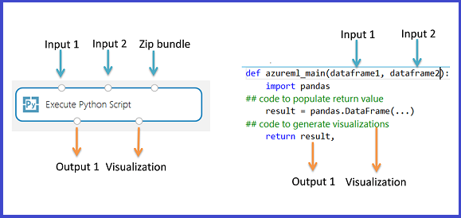
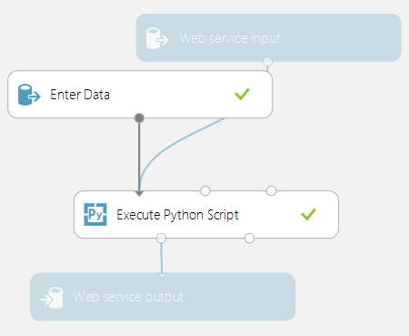
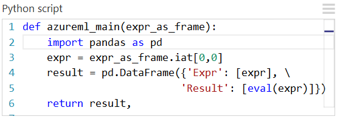

<properties 
    pageTitle="Ausführen von Python maschinellen Learning Skripts | Microsoft Azure" 
    description="Gliederungen entwerfen Prinzipien zugrunde liegenden Unterstützung für Python Skripts in Azure maschinellen Lern- und einfache Verwendungsszenarien, Stärken und Schwächen." 
    keywords="Python maschinellen learning, Pandas, Python Pandas, Python Skripts, Python Skripts ausführen"
    services="machine-learning"
    documentationCenter="" 
    authors="bradsev" 
    manager="jhubbard" 
    editor="cgronlun"/>

<tags 
    ms.service="machine-learning" 
    ms.workload="data-services" 
    ms.tgt_pltfrm="na" 
    ms.devlang="na" 
    ms.topic="article" 
    ms.date="09/12/2016" 
    ms.author="bradsev" />

# Ausführen von Python maschinellen Learning Skripts in Azure maschinellen Learning Studio

In diesem Thema werden die zugrunde liegenden des aktuellen Support für Python Skripts Azure Computer interessante Entwurfsprinzipien. Die wichtigsten Funktionen, einschließlich Support für den Import von vorhandenem Code, Visualisierungen exportieren, auch gegliederter und schließlich werden einige Einschränkungen und laufende Arbeit erläutert.

[Python](https://www.python.org/) ist unverzichtbar in das Tool entdecken viele Daten Wissenschaftler an. Sie hat:

-  eine elegante und kurz syntax 
-  Plattform-support 
-  eine umfangreiche Sammlung von leistungsfähige Bibliotheken und 
-  Reifen Development Tools. 

Python wird in allen Phasen des Workflows in der Regel in den Computer Learning Modellierung verwendet verwendet, Aufnahme von Daten und Verarbeitung, Feature Bauweise und Modell Schulung, und klicken Sie dann Überprüfung und Bereitstellung der Modelle. 

Azure maschinellen Learning Studio unterstützt Einbetten von Python Skripts in verschiedene Teile eines Computers experimentieren lernen und sie auch nahtlos als skalierbare, operationalized Webdienste auf Microsoft Azure veröffentlichen.

[AZURE.INCLUDE [machine-learning-free-trial](../../includes/machine-learning-free-trial.md)]

## Entwerfen von Prinzipien der Python Skripts Computer interessante
Die primäre Schnittstelle zu Python in Azure maschinellen Learning Studio wird über die [Python-Skript ausführen] [ execute-python-script] Modul in Abbildung 1 dargestellt.

Abbildung 1. Das Modul **Python-Skript ausführen** .

Das [Ausführen von Python-Skript] [ execute-python-script] Modul bis zu drei Eingaben akzeptiert und bis zu zwei Ausgaben (siehe unten), wie seine R Analog, das [Ausführen R Skript] erzeugt[ execute-r-script] Modul. Python-Code auszuführende wird eingegeben in das Parameterfeld als speziell benannte Einstiegspunkt-Funktion mit dem Namen `azureml_main`. Hier sind die wichtigsten Entwurfsgrundsätze verwendet, um dieses Modul implementieren:

1.  *Muss für Benutzer Python idiomatische.* Die meisten Benutzer von Python Faktor ihren Code als Funktionen innerhalb von Modulen, so viele ausführbare Anweisungen in der obersten Ebene mit relativ selten ist. Daher hat das Skript auch eine speziell benannte Python-Funktion und nicht nur eine Abfolge von Anweisungen. Die Objekte in der Funktion verfügbar gemacht werden standard Python Bibliothekstypen wie [Pandas](http://pandas.pydata.org/) Daten Frames und [NumPy](http://www.numpy.org/) Matrizen.
2.  *Müssen hoher Auflösung an zwischen lokalen und cloud Ausführungen.* Die Back-End-verwendet, um die Python-Code ausführen basiert auf [Anaconda](https://store.continuum.io/cshop/anaconda/) 2.1, einer häufig verwendeten Plattformen wissenschaftlichen Python Verteilung zurück. Es geht mit in der Nähe der am häufigsten verwendeten Python Pakete 200. Daher können Daten Wissenschaftler Debuggen und deren Code auf ihrer lokalen Computer Azure Learning-kompatiblen Anaconda Umgebung qualifizieren. Verwenden Sie dann vorhandene Entwicklung Umgebungen wie [IPython](http://ipython.org/) Notizbuch oder einen neuen [Python-Tools für Visual Studio](http://aka.ms/ptvs) , um es als Teil einer Azure maschinellen Learning Experimentieren mit hoher KONFIDENZ ausführen. Weiter an, die `azureml_main` Einstiegspunkt ist eine herkömmlichen Python-Funktion und verfasst worden sein kann, ohne bestimmte Azure maschinellen Learning-Code oder das SDK installiert.
3.  *Muss nahtlos mit anderen Azure maschinellen Learning-Module zusammensetzbare.* Das [Ausführen von Python-Skript] [ execute-python-script] Modul akzeptiert als ein- und Ausgaben, standard Azure maschinellen Learning Datasets. Das zugrunde liegende Framework schließt transparent und effizient aus die Azure maschinellen Lern- und Python Laufzeiten (unterstützt Features wie fehlende Werte). Python können daher in Verbindung mit vorhandenen Azure maschinellen Learning Workflows, einschließlich der Empfänger, die R und SQLite Aufrufen verwendet werden. Eine kann daher Markttendenz Workflows, die:
  * Verwenden von Python und Pandas für Daten Vorbereitung und bereinigen, 
  * die Daten in eine SQL-Transformation, teilnehmen an mehrere Datasets zum Formular Features Feed 
  * Schulen von Datenmodellen mithilfe der umfangreichen Sammlung von Algorithmen Azure Computer interessante, und 
  * Auswerten und nach der Verarbeitung die Ergebnisse mit R.

## Grundlegende Verwendungsszenarien Computer interessante Python Skripts
In diesem Abschnitt Umfrage einige grundlegenden Anwendungsmöglichkeiten für das [Ausführen von Python-Skript] [ execute-python-script] Modul.
Wie zuvor schon erwähnt, sind alle Eingaben für das Modul Python als Pandas Daten Frames verfügbar gemacht werden. Weitere Informationen zum Python Pandas und wie sie genutzt werden kann, zum Bearbeiten von Daten effizient *Python für die Datenanalyse* (Reilly, 2012) durch West McKinney finden Sie im. Die Funktion zurück Pandas Daten Rahmenlinien verpackt innerhalb einer Python [Sequenz](https://docs.python.org/2/c-api/sequence.html) wie Tupel, Listen oder NumPy Matrix. Das erste Element in dieser Sequenz wird in der ersten Ausgang des Moduls zurückgegeben. Dieses Schema ist in Abbildung 2 dargestellt.

Abbildung 2. Zuordnung von Eingabemethoden Ports Parametern und Rückgabewert-Ausgang.

Ausführlichere Semantik der Parameter wie die Eingabewerte Ports zugeordnet Abrufen der `azureml_main` Funktion in Tabelle 1 dargestellt werden:

Tabelle 1. Zuordnung von Ports zur Funktionsparameter.

Die Zuordnung zwischen Eingabe-Ports und Funktionsparameter ist mit Feldern fester Breite. Der erste verbundenen Eingang erster Parameter der Funktion zugeordnet ist, und der zweite Parameter der Funktion die zweite Eingabe (wenn besteht) zugeordnet ist.

## Typen von Eingabe- und Übersetzung
Wie zuvor beschrieben, werden von Datasets Azure Computer interessante mit Daten konvertiert, die Bilder in Pandas und Ausgabe Daten Frames zurück zur Azure maschinellen Learning Datasets konvertiert werden. Die folgenden Konvertierungen werden ausgeführt:

1.  Zeichenfolgen und numerische Spalten werden als konvertiert – ist und fehlende Werte in einem Dataset "NV" Werte in Pandas konvertiert werden. Dieselbe Konvertierung geschieht unterwegs zurück (fehlende Werte in Azure maschinellen Learning in NV Werte in Pandas konvertiert).
2.  Index Vektoren in Pandas werden in Azure maschinellen Learning nicht unterstützt. Alle Eingabedaten Frames in der Funktion Python müssen immer einen numerischen 64-Bit-Index von 0 bis zur Anzahl der Zeilen minus 1. 
3.  Doppelte Spalte und Spaltennamen, die keine Zeichenfolgen sind, kann keine Azure maschinellen Learning Datasets unterscheiden. Wenn ein Ausgabe Datenrahmen nicht numerischen Spalten enthält, das Framework ruft `str` auf den Spaltennamen. Ebenso werden alle doppelten Spaltennamen automatisch geändert, um sicherzustellen, dass die Namen eindeutig sind. Das Suffix (2) wird dem ersten doppelten (3) in der zweiten doppelten, usw. hinzugefügt.

## Operationalizing Python Skripts
Alle [Python-Skript ausführen] [ execute-python-script] in einer Punktzahl Versuch verwendeten Module werden aufgerufen, wenn als Webdienst veröffentlicht. Abbildung 3 zeigt beispielsweise eine Punktzahl experimentieren, enthält den Code, um einen einzelnen Python Ausdruck ausgewertet werden soll. 

Abbildung 3. Webdienst für die Auswertung eines Ausdrucks Python.

Ein Webdienst erstellt aus diesem Versuch nimmt als Eingabe ein Ausdrucks Python (als Zeichenfolge), wird dem Interpreter Python gesendet und gibt eine Tabelle, die sowohl den Ausdruck in das ausgewertete Ergebnis.

## Importieren von vorhandenen Python Skriptmodule
Eine allgemeine Anwendungsfall-für viele Daten Wissenschaftler ist mit der vorhandenen Python Skripts in Azure maschinellen Learning Versuche integrieren. Anstelle von verketten und alle den Code in ein einzelnes Skript-Feld, das [Python-Skript ausführen] einfügen[ execute-python-script] Modul akzeptiert einen dritten Eingabewerte Port mit dem eine Zip-Datei, die die Python Module enthält verbunden werden kann. Die Datei wird dann durch die Datenausführungsverhinderung Framework zur Laufzeit entpackt haben und den Inhalt auf den Bibliothekspfad von der Python Interpreter hinzugefügt werden. Die `azureml_main` Einstiegspunkt Funktion können Sie dann importieren diese Module direkt.

Ein Beispiel sollten Sie die Datei Hello.py mit einem einfachen "Hallo, Welt" (Funktion).

Abbildung 4. Benutzerdefinierte Funktion.

Als Nächstes erstellen wir eine Datei Hello.zip, die Hello.py enthält:

Abbildung 5. ZIP-Datei, die benutzerdefinierte Python Code enthält.

Laden Sie diese als Dataset in Azure maschinellen Learning Studio. Erstellen Sie und führen Sie einer einfachen experimentieren aus, die Python-Code in der Datei Hello.zip wird verwendet, indem Sie sie in der dritten Eingang des Skripts Python ausführen anfügen wie in dieser Abbildung gezeigt.

Abbildung 6. Beispiel experimentieren mit benutzerdefinierter Python Code hochgeladen als Zip-Datei.

Das Modul ausgegeben wird, dass die Zip-Datei entpackt wurde und die Funktion `print_hello` tatsächlich um ausgeführt wurde.
 

 
Abbildung 7. Benutzerdefinierte Funktion verwendet, die innerhalb der [Python-Skript ausführen] [ execute-python-script] Modul.

## Arbeiten mit Visualisierungen
Flächen erstellt MatplotLib, das visualisiert werden soll, können Sie auf im Browser können zurückgegeben werden, indem der [Python-Skript ausführen][execute-python-script]. Aber die Flächen werden nicht automatisch auf umgeleitet Bilder wie bei Verwendung von R. Daher muss der Benutzer explizit alle Flächen auf PNG-Dateien speichern, wenn sie zurück zur Azure maschinellen Learning zurückzugebenden sind. 

Um Bilder aus MatplotLib erstellen zu können, müssen Sie das folgende Verfahren abzuschließen:

* Wechseln Sie die Back-End-von der Standardrenderer-basierten unbedingt zu "%{AGG/}-AGGREGATION" 
* Erstellen eines neuen Abbildung-Objekts 
* Abrufen der Achse und alle Flächen darin generieren 
* Speichern Sie in der Abbildung in einer PNG-Datei. 

Dieses Verfahren wird in der folgenden Abbildung 8 dargestellt, die eine Punkt (XY) Zeichnungsfläche Matrix mithilfe der Funktion Scatter_matrix in Pandas erstellt wird.
 

Abbildung 8. Speichern von MatplotLib Zahlen auf Bilder.

Abbildung 9 zeigt, dass es sich bei einem Versuch, die zuvor zurückzugebenden dargestellten Skripts verwendet über den zweiten Ausgabe Port gezeichnet hat.

 
     
 

Abbildung 9. Visualisieren Flächen aus Python-Code generiert.

Es ist möglich, mehrere Zahlen zurückgeben, indem Sie sie in anderen Bildern speichern, die Laufzeit Azure maschinellen Learning nimmt alle Bilder und für Visualisierung, verknüpfen.

## Erweiterte Beispiele
Die Anaconda-Umgebung, die in Azure maschinellen Learning installiert enthält häufige Pakete aus, wie NumPy, SciPy, und Scikits erfahren und diese für verschiedene Datenverarbeitung Aufgaben in einer normalen maschinellen Learning Verkaufspipeline effektiv verwendet werden können. Als Beispiel veranschaulicht die folgenden experimentieren und das Skript die Verwendung von Ensemble Teilnehmern in Scikits Informationen zum Feature Wichtigkeit Ergebnisse für ein Dataset zu berechnen. Die Ergebnisse können dann ausführen, bevor Sie in einem anderen Computer Learning Modell eingezogen Kontrolle Featureauswahl herangezogen werden.

Die Python-Funktion, um die Wichtigkeit Bewertungen der Lesbarkeit und die Reihenfolge der Features, auf deren Grundlage berechnen sieht folgendermaßen aus:

Abbildung 10. Funktion Rang Features von Bewertungen der Lesbarkeit.
 Die folgenden experimentieren anschließend berechnet und die Wichtigkeit Bewertungen der Lesbarkeit von Funktionen im Dataset "Pima indischen Diabetes" Azure Computer interessante gibt:

    
    
Abbildung 11. An den Rang Features im Dataset Pima indischen Diabetes experimentieren.

## Einschränkungen 
Das [Ausführen von Python Skript] [ execute-python-script] derzeit weist die folgenden Einschränkungen:

1.  *Sandkasten Datenausführungsverhinderung.* Die Laufzeit Python ist aktuell Sandkasten und daher dauerhaft nicht Zugriff auf das Netzwerk oder auf dem lokalen Dateisystem erlauben. Alle Dateien, die lokal gespeichert werden isoliert und gelöscht werden, nachdem das Modul endet. Python-Code kann nicht auf dem Computer die meisten Verzeichnisse zugreifen, die Ausnahme wird das aktuelle Verzeichnis und die zugehörigen Unterverzeichnisse ausgeführt, werden soll.
2.  *Fehlende anspruchsvolle Entwicklung und unterstützt das Debuggen.* Das Modul Python wird IDE-Features wie Intellisense und für das Debuggen zurzeit nicht unterstützt. Auch wenn das Modul zur Laufzeit fehlschlägt, die vollständige Python Stapel Spur steht, aber muss in der Ausgabelog für das Modul angezeigt werden. Wir empfehlen aktuell entwickeln und Debuggen von deren Python Skripts in einer Umgebung wie IPython und dann den Code in das Modul importieren.
3.  *Einzelne Daten Rahmen Ausgabe.* Einstiegspunkt Python darf nur einen einzelnen Daten Frame als Ausgabe zurückzugeben. Es ist nicht aktuell möglich, beliebige Python Objekte wie ausgebildeten Modelle direkt an die Laufzeit Azure maschinellen Learning zurückzugeben. Wie [Ausführen R Skript][execute-r-script], die dieselbe Einschränkung hat, es ist jedoch möglich in vielen auf Engpass Objekte in ein Byte-Array, und klicken Sie dann Eingabe dieser innerhalb eines Rahmens Daten Fälle.
4.  *Unfähigkeit Python Installation anzupassen*. Aktuell, besteht die einzige Möglichkeit zum Hinzufügen von benutzerdefinierten Python Module über das Zip-Datei Verfahren, die zuvor beschriebenen ein. Während dies für kleine Module möglich ist, ist es für große Module (besonders von Dateien mit einer systemeigenen DLL-Dateien) oder eine große Anzahl von Module schwerfällig. 

##Schlussfolgerungen
Das [Ausführen von Python Skript] [ execute-python-script] Modul ermöglicht eine Scientist Daten Integrieren von vorhandenen Python Code in Cloud gehosteten maschinellen Learning Workflows in Azure Computer lernen und nahtlos als Bestandteil eines Webdiensts Prozessen umsetzen. Das Skript-Modul Python natürlich mit anderen Modulen Azure Computer interessante interagiert und für einen Zellbereich Aufgaben aus Durchsuchen von Daten vorab verarbeiten, um Extraktion von Features, Auswertung und nach der Verarbeitung der Ergebnisse verwendet werden kann. Back-End-Laufzeit verwendet, die für die Ausführung basiert auf Anaconda, einer gut getestet und häufig verwendeten Python-Verteilung zurück. Dies ganz einfach für Sie zu integrierten vorhandener Code-Ressourcen in der Cloud.

Wir erwarten eine zusätzliche Funktionalität zum [Ausführen von Python-Skript] [ execute-python-script] Modul, wie etwa die Möglichkeit zum Schulen und Prozessen umsetzen Modelle in Python und eine bessere Unterstützung für die Entwicklung und Debuggen von Code in Azure maschinellen Learning Studio hinzuzufügen.

## Nächste Schritte

Weitere Informationen finden Sie unter der [Python Developer Center](/develop/python/).

<!-- Module References -->
[execute-python-script]: https://msdn.microsoft.com/library/azure/cdb56f95-7f4c-404d-bde7-5bb972e6f232/
[execute-r-script]: https://msdn.microsoft.com/library/azure/30806023-392b-42e0-94d6-6b775a6e0fd5/
