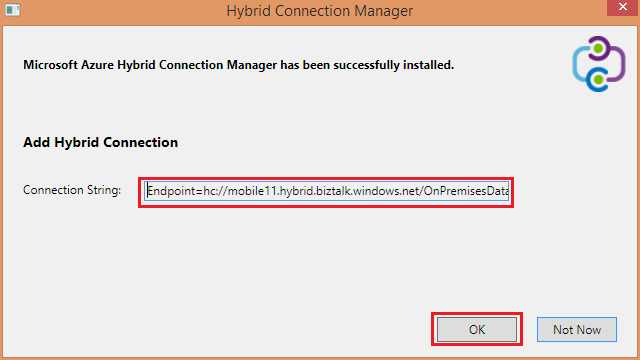

1. Klicken Sie in das Blade **Hybrid Verbindungen** klicken Sie auf die soeben erstellte Hybrid-Verbindung und dann auf **Zuhörer einrichten**.
    
    
    
4. Das **Hybrid Verbindungseigenschaften** Blade wird geöffnet. Wählen Sie unter **Lokale Hybrid Verbindungs-Managers** **herunterladen und manuell konfigurieren**, speichern Sie der heruntergeladenen HybridConnectionManager.msi Pakets und kopieren Sie die Verbindungszeichenfolge Gateway.
    
    
    
5. Geben Sie in einer Befehlszeile ein Administrator zum Starten des Installationsprogramms für den folgenden Befehl aus:

        start HybridConnectionManager.msi
 
7. Nachdem das Installationsprogramm ausgeführt wird, klicken Sie auf **jetzt nicht**, und klicken Sie dann wechseln Sie zum Ordner %ProgramFiles%\Microsoft\HybridConnectionManager, führen Sie HCMConfigWizard.exe aus und klicken Sie auf **Ja** , klicken Sie im Dialogfeld **Benutzerkontensteuerung** .
        
7. Fügen Sie die Verbindungszeichenfolge Hybrid, die Sie zuvor kopiert haben, und klicken Sie auf **OK**. 
    
    
    
8. Klicken Sie auf **Schließen**, klicken Sie nach Abschluss die Installation.
    
    
    
    Klicken Sie auf das Blade **Hybrid Verbindungen** zeigt **die Statusspalte** jetzt **verbunden**. 
    
    