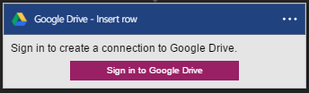
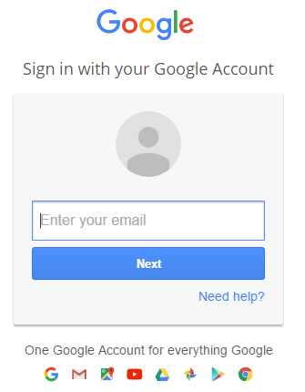

### Erforderliche Komponenten

- Ein [GoogleDrive](https://www.google.com/drive/) -Konto  

Bevor Sie Ihr Konto GoogleDrive in einer app Logik verwenden können, müssen Sie die Verbindung mit Ihrem Konto GoogleDrive Logik app autorisieren. Glücklicherweise können Sie ganz einfach aus innerhalb der app Logik im Portal Azure ausführen.  

Hier sind die Schritte aus, um Ihre app Logik eine Verbindung mit Ihrem Konto GoogleDrive autorisieren ein:  
1. Zum Erstellen einer Verbindungs mit GoogleDrive, in der app-Designer Logik wählen Sie in der Dropdown-Liste aus **Microsoft anzeigen verwaltete APIs** dann geben Sie *GoogleDrive* in das Suchfeld ein. Wählen Sie den oder die Aktion, die Sie verwenden möchten, werden:  
  
2. Wenn Sie alle Verbindungen mit GoogleDrive, bevor Sie erstellt haben, werden angezeigt wird, geben Sie Ihre Anmeldeinformationen GoogleDrive. Diese Anmeldeinformationen werden verwendet werden, um Ihre app Logik Verbindung zu autorisieren, und Zugriff auf Ihr Konto GoogleDrive Daten:  
  
3. Geben Sie Ihre e-Mail-Adresse von GoogleDrive:  
   
4. Geben Sie Ihr Kennwort GoogleDrive, um Ihre Logik app zu autorisieren:  

5. Die Verbindung zu GoogleDrive zulassen  
  
6. Beachten Sie die Verbindung eingerichtet wurde, und Sie können jetzt mit den anderen Schritten in der app Logik fortfahren:  
  

