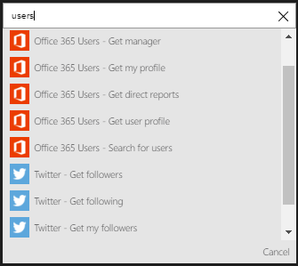

### Erforderliche Komponenten

- Ein [Benutzer von Office 365](https://office365.com) -Konto  

Bevor Sie Ihr Konto Office 365-Benutzer in einer app Logik verwenden können, müssen Sie die Logik app bei Ihrem Konto Office 365-Benutzer eine Verbindung zu autorisieren. Glücklicherweise können Sie ganz einfach aus innerhalb der app Logik im Portal Azure ausführen.  

Hier sind die Schritte zum Autorisieren Ihre app Logik zu Ihrem Office 365-Benutzer-Konto herzustellen:  
1. Zum Erstellen einer Verbindungs mit Office 365-Benutzer in der app-Designer Logik wählen Sie in der Dropdown-Liste aus **Microsoft anzeigen verwaltete APIs** und geben Sie *Office 365-Benutzer* in das Suchfeld ein. Wählen Sie den oder die Aktion, die Sie verwenden möchten, werden:  
  
2. Wenn Sie alle Verbindungen mit Office 365-Benutzer, bevor Sie erstellt haben, werden angezeigt wird, geben Sie Ihre Anmeldeinformationen für Benutzer von Office 365. Diese Anmeldeinformationen verwendet werden, Ihre app Logik Verbindung zu autorisieren, und Zugriff auf Ihre Office 365-Benutzer-Konto-Daten:  
  
3. Bieten Sie Ihren Office 365-Benutzer-Benutzernamen und Ihr Kennwort ein, um Ihre app Logik zu autorisieren:  
   
4. Beachten Sie die Verbindung eingerichtet wurde, und Sie können jetzt mit den anderen Schritten in der app Logik fortfahren:  
  
  