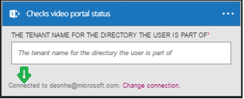

### Erforderliche Komponenten

- Ein [Office-365-Video](https://support.office.com/article/Meet-Office-365-Video-ca1cc1a9-a615-46e1-b6a3-40dbd99939a6) -Konto  

Bevor Sie Ihr Video für Office 365-Konto in einer app Logik verwenden können, müssen Sie die Verbindung mit Ihrem Office 365-Video-Konto Logik app autorisieren. Glücklicherweise können Sie ganz einfach aus innerhalb der app Logik im Portal Azure ausführen.  

Hier sind die Schritte zum Autorisieren Ihre app Logik zu Ihrem Office 365-Video-Konto herzustellen:  
1. Um eine Verbindung zu Office 365-Video, in der app-Designer Logik zu erstellen, wählen Sie in der Dropdown-Liste aus **Microsoft anzeigen verwaltete APIs** dann geben Sie *Office 365-Video* in das Suchfeld ein. Wählen Sie den oder die Aktion, die Sie verwenden möchten, werden:  
  
2. Wenn Sie alle Verbindungen mit Office 365-Video vor dem erstellt haben, werden angezeigt wird, geben Sie Ihre Anmeldeinformationen für Office 365-Video. Diese Anmeldeinformationen verwendet werden, um Ihre Logik app Verbindung zu autorisieren, und Zugriff auf Ihre Office 365-Video-Konto-Daten:  
  
3. Geben Sie Ihre Anmeldeinformationen für die Verbindung zu Office 365-Video an:  
   
4. Beachten Sie die Verbindung eingerichtet wurde, und Sie können jetzt mit den anderen Schritten in der app Logik fortfahren:  
  
