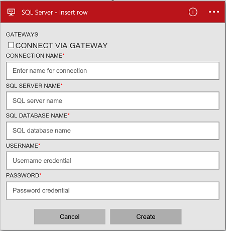
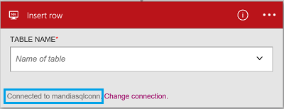

### Erforderliche Komponenten
- Ein Azure-Konto; Sie können ein [kostenloses Konto](https://azure.microsoft.com/free) erstellen.
- Einer [SQL Azure-Datenbank](../articles/sql-database/sql-database-get-started.md) mit den zugehörigen Verbindungsinformationen, einschließlich Servernamen, Datenbanknamen und Benutzername und Kennwort. Diese Informationen sind in der Verbindungszeichenfolge SQL-Datenbank enthalten:
  
    Server = Tcp:*Yoursqlservername*. database.windows.net,1433;Initial Katalog =*Yourqldbname*; Beibehalten der Security Info = False; Benutzer-ID = {Ihr_Benutzername}; Kennwort = {Your_password}; MultipleActiveResultSets = False; Verschlüsseln = WAHR; TrustServerCertificate = False; Connection Timeout = 30;

    Weitere Informationen zum [Azure SQL-Datenbanken](https://azure.microsoft.com/services/sql-database).

> [AZURE.NOTE] Wenn Sie eine SQL Azure-Datenbank erstellen, können Sie auch im Lieferumfang von SQL Stichprobe Datenbanken erstellen. 

Verbinden Sie vor der SQL Azure-Datenbank in einer app Logik verwenden, mit der SQL-Datenbank. Sie können ganz einfach in der app Logik im Azure-Portal ausführen.  

Verbinden Sie mit Ihrer Azure SQL-Datenbank mithilfe der folgenden Schritte:  

1. Erstellen einer app Logik. Hinzufügen eines Triggers im Logik Apps-Designer, und fügen Sie eine Aktion. Wählen Sie in der Dropdownliste aus **Microsoft anzeigen verwaltete APIs** , und geben Sie "Sql" in das Suchfeld ein. Wählen Sie eine der Aktionen aus:  

    

2. Wenn Sie alle Verbindungen mit SQL-Datenbank zuvor erstellt haben, werden Sie aufgefordert, die Verbindungsdetails:  

     

3. Geben Sie die Details der SQL-Datenbank. Eigenschaften mit einem Sternchen sind erforderlich.

    | Eigenschaft | Details |
|---|---|
| Verbinden über Gateway | Lassen Sie dieses nicht aktiviert. Hiermit wird bei der Verbindung mit einer lokalen SQL Server. |
| Verbindungsnamen * | Geben Sie einen beliebigen Namen für die Verbindung aus. | 
| SQL Server-Name * | Geben Sie den Servernamen ein. Welche ungefähr wie folgt *servername.database.windows.net*ist. Der Servernamen wird im Eigenschaften im Portal Azure SQL-Datenbank angezeigt, und auch in der Verbindungszeichenfolge angezeigt. | 
| Name der SQL-Datenbank * | Geben Sie den Namen, der Sie die SQL-Datenbank gegeben hat. Dies wird in der SQL-Datenbank-Eigenschaften in der Verbindungszeichenfolge aufgeführt: Anfangskatalogs =*Yoursqldbname*. | 
| Benutzername * | Geben Sie den Benutzernamen, die, den Sie erstellt haben, wenn der SQL-Datenbank erstellt wurde. Dies ist die Datenbankeigenschaften SQL Azure-Portal aufgeführt. | 
| Kennwort * | Geben Sie das Kennwort ein, die, das Sie erstellt haben, wenn der SQL-Datenbank erstellt wurde. | 

    Diese Anmeldeinformationen werden verwendet, um Ihre app Logik verbinden sowie der Zugriff auf Ihre SQL-Daten zu autorisieren. Sobald Sie fertig sind, suchen Sie die Verbindungsdetails ähnlich wie der folgende:  

     

4. Wählen Sie auf **Erstellen**. 

5. Beachten Sie, dass die Verbindung erstellt wurde. Jetzt, fahren Sie mit den Schritten in Ihrer app Logik: 

    